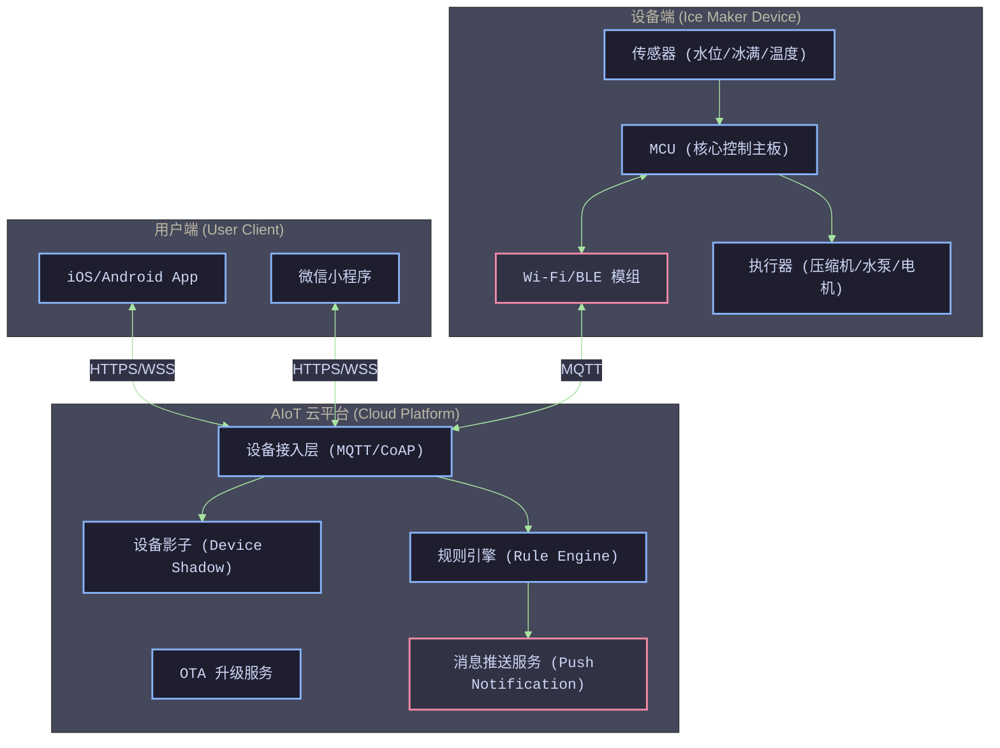
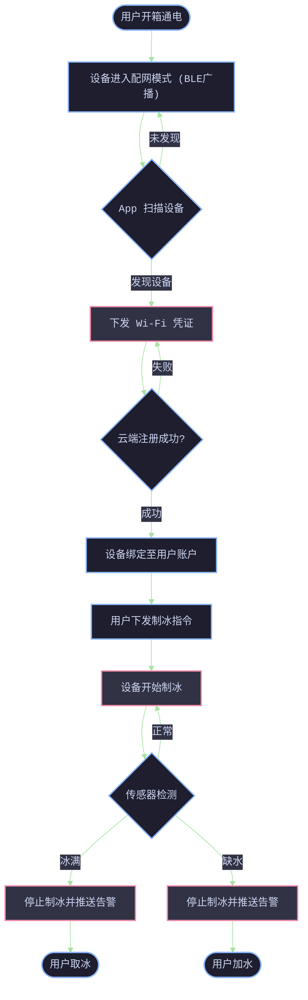
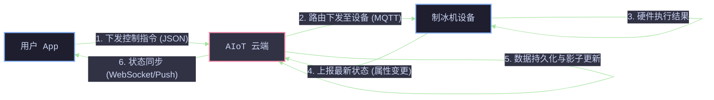
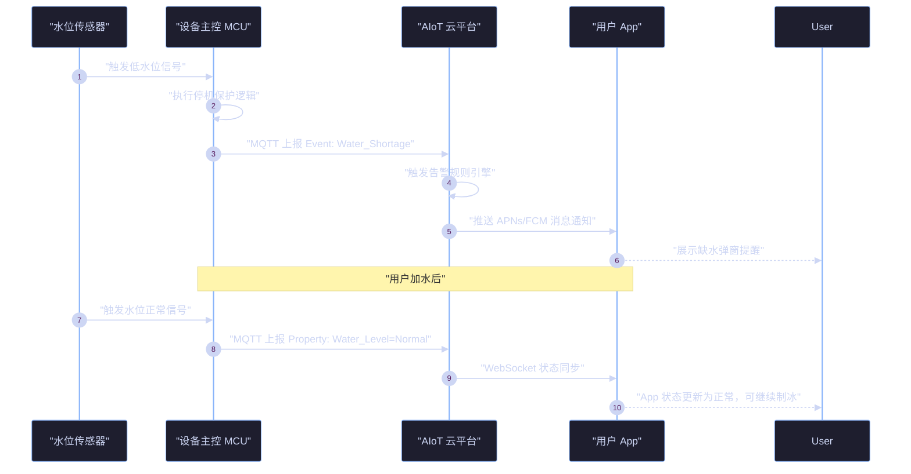

# 智能制冰机 AIoT 产品定义与规划文档 (0-1阶段)

## 1. 架构定义与战略方向

### 1.1 前提 (Premise)
* **市场需求**：随着消费者对生活品质要求提升，家用及商用小型制冰机需求增加。传统制冰机缺乏智能化管理，用户无法远程控制、无法及时获取缺水或冰满提醒。
* **技术可行性**：当前主流 AIoT 平台（如涂鸦、阿里云 IoT、小米 IoT）已提供成熟的 PaaS/SaaS 解决方案，支持 Wi-Fi/BLE 模组快速接入，具备 0-1 阶段快速落地的技术基础。
* **业务定位**：本项目定位为“智能生活家电”，主打便捷、实时监控和自动化制冰体验。

### 1.2 约束 (Constraints)
* **成本约束**：作为 0-1 的硬件项目，BOM 成本需严格控制。智能化模组成本需低于整体成本的 10%。
* **研发周期**：产品上市周期需控制在 3-4 个月内，要求采用成熟的公版 App 或低代码面板进行快速开发。
* **网络依赖**：设备强依赖 2.4G Wi-Fi 网络，弱网环境下需保证本地核心制冰功能不受影响。

### 1.3 边界 (Boundaries)
* **系统边界**：本项目聚焦于设备端接入、云端基础数据转发以及用户端（App/小程序）的基础控制。
* **服务边界**：0-1 阶段不涉及复杂的 AI 大模型智能预测、不包含电商耗材一键复购（如滤芯）、不接入海外复杂的第三方语音助手生态（留待后续阶段）。

### 1.4 终局 (Endgame)
* **终局目标**：打造全场景智能冷链/饮品生态核心入口，通过用户数据积累，实现机器故障的 AI 预测性维护、耗材智能订阅以及与其他厨房家电的无缝场景联动，最终成为市场占有率前三的智能制冰机品牌。

---

## 2. 主流 AIoT 平台调研

为实现 0-1 快速落地，对当前主流 AIoT 平台进行对比调研：

| 平台名称 | 优势 | 劣势 | 适用场景 | 调研结论 |
| :--- | :--- | :--- | :--- | :--- |
| **涂鸦智能 (Tuya)** | 全球化部署，提供极速“零代码/低代码”开发方案；支持丰富的公版 App 和模组生态；生态兼容性好。 | 深度定制化成本较高；平台抽成及服务费模式需评估。 | 快速出海、消费类智能家电 0-1 阶段。 | **推荐作为首选**。能够极大缩短研发周期，降低 0-1 阶段的试错成本。 |
| **阿里云 IoT** | 基础设施强大，安全性高；适合复杂工业/商用级设备接入；数据分析与流转能力极强。 | 偏向底层 PaaS，上层 App 需自研或寻找 ISV，研发周期长、成本高。 | 具有自研 App 团队，偏商用、工业场景。 | 备选。若后续公司有构建自主生态池的需求，可考虑切换。 |
| **小米 IoT** | 拥有庞大的 C 端用户基础，自带流量和销售渠道；米家 App 体验优秀。 | 接入审核极为严格；对产品定义和定价有强干预；排他性较强。 | 明确加入小米生态链，获取米家渠道红利。 | 暂不考虑。0-1 阶段需保持独立品牌调性。 |

---

## 3. 核心功能边界划分 (MVP 规划)

在 0-1 阶段，我们遵循 MVP（最小可行性产品）原则，明确**做哪些**与**不做哪些**，确保资源聚焦于核心用户价值。

### 3.1 核心功能 (0-1 阶段 MUST HAVE - 我们要做什么)
1. **设备配网与绑定**：支持 Wi-Fi + BLE 双模配网，确保高成功率的设备绑定。
2. **远程状态监控**：实时查看设备状态，包括："待机"、"制冰中"、"冰满"、"缺水"、"清洗中"、"设备故障"。
3. **远程控制**：
   * "开关机控制"
   * "冰块大小选择"（大冰、小冰）
   * "一键自清洁"功能启动
4. **消息推送与告警**：
   * "冰满提醒"（防止冰块融化）
   * "缺水告警"（提醒加水）
   * "硬件故障告警"（如压缩机异常、冰堵）
5. **基础定时功能**：设置预约制冰时间（如早晨 7 点自动制冰）。
6. **OTA 升级**：支持设备端固件的在线升级，为后续功能迭代提供基础。

### 3.2 暂缓功能 (0-1 阶段 OUT OF SCOPE - 我们暂不做哪些)
1. **智能语音控制**：暂不接入 Alexa、Google Assistant、Siri 等（研发调试成本高，留待 1-10 阶段出海或拓展生态时做）。
2. **耗材商城与一键购买**：暂不支持滤芯、清洗剂的自动检测和 App 内购买闭环。
3. **AI 用冰习惯学习**：暂不开发基于用户历史数据的自动预测制冰功能（缺乏数据积累）。
4. **多设备复杂场景联动**：暂不支持与其他家电（如咖啡机）的深度自定义场景联动。
5. **社交分享与社区互动**：暂不开发 App 内的用户社区。

---

## 4. 架构设计与可视化

为保证各团队（硬件、固件、云端、前端）对系统的统一认知，提供以下架构与流程图。

### 4.1 产品架构图
描述了从设备端、云端到用户端的整体产品逻辑分层。

**说明**：设备端 MCU 负责制冰核心逻辑及传感器数据采集，通过通信模组与 AIoT 云平台交互。云平台维护“设备影子”以确保弱网状态同步，并通过规则引擎触发“消息推送服务”到达用户 App。

### 4.2 业务流程图
描述用户从设备开箱、配网绑定到日常使用的核心业务流程。

**说明**：业务流程涵盖了 BLE 辅助配网机制，大幅提升配网成功率。制冰循环中强依赖传感器（冰满、缺水）进行自动化停机保护及用户通知。

### 4.3 数据流向图
描述核心指令和状态数据在各节点之间的流转关系。

**说明**：数据流采用标准的物模型（Property, Event, Service）体系。用户的下行控制和设备的上行状态汇报异步解耦，云端通过设备影子机制保障状态的最终一致性。

### 4.4 核心交互时序图
展示“缺水告警”这一核心场景的时序交互细节。

**说明**：此时序图详细展示了从传感器触发、硬件保护、云端路由到移动端推送的完整闭环，确保告警的实时性与安全性。

---

## 5. 具体产品规划路线图 (Roadmap)

*   **Phase 1: MVP 阶段 (第 1-3 个月)**
    *   **核心目标**：完成硬件结构定型、MCU 逻辑验证。
    *   **智能化任务**：接入涂鸦 AIoT 平台，完成 Wi-Fi/BLE 模组集成；开发公版 App/小程序控制面板面板；实现远程开关机、冰满/缺水告警、定时制冰。
    *   **交付物**：可量产的智能制冰机 1.0 版本。
*   **Phase 2: 体验升级与生态拓展 (第 4-6 个月)**
    *   **核心目标**：提升用户体验，进入主流语音生态。
    *   **智能化任务**：接入 Amazon Alexa、Google Assistant 语音控制；优化 App UI/UX；增加设备自学习能耗分析报表；上线耗材购买引流入口。
*   **Phase 3: 数据驱动与商业闭环 (未来规划)**
    *   **核心目标**：基于设备运行数据实现 AI 增值服务。
    *   **智能化任务**：引入设备预测性维护（通过压缩机电流数据预测故障）；实现基于天气的自动制冰推荐；建立用户社区。
