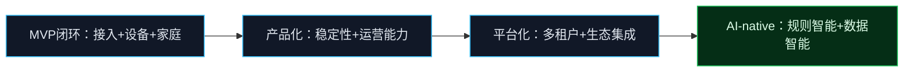

# AIoT Cloud Platform (AIOT-java)


AIOT-java 是一个基于 Java 17、Spring Boot 3、Maven 多模块的 AIoT 微服务后端。当前仓库已落地网关、认证、设备、家庭等核心能力，并可通过 Docker Compose 以单节点方式快速部署。

## CTO 深度总结

- `Premise`：项目目标是构建可持续演进的 AIoT 平台底座，先完成“设备接入 + 家庭场景 + 基础运营”闭环，再向智能化规则与 AI-native 体验升级。
- `Constraints`：当前主要约束是单节点部署、团队规模有限、部分模块仍处骨架期、对上线稳定性和交付速度要求同时较高。
- `Boundaries`：当前版本聚焦后端核心能力（网关、认证、设备、家庭、事件链路与基础观测），不追求一次性完成全量智能能力。
- `Endgame`：形成“可复制交付的行业 AIoT PaaS”，具备多租户、规则智能、数据智能与生态集成能力，支撑规模化商业化。
- `阶段判断`：项目已进入 `MVP 可交付` 阶段，具备核心业务能力与工程化基础；下一阶段重点是产品化稳定运营与 AI 增强能力落地。

%%{init: {"theme":"base","themeVariables":{"primaryColor":"#0f172a","primaryTextColor":"#e2e8f0","primaryBorderColor":"#334155","lineColor":"#38bdf8","secondaryColor":"#111827","tertiaryColor":"#1f2937","fontFamily":"JetBrains Mono, Menlo, monospace","background":"#020617"}}}%%


## 项目状态

- 已落地：`aiot-gateway`、`aiot-auth-service`、`aiot-device-service`、`aiot-home-service`
- 骨架阶段：`aiot-shadow-service`、`aiot-rule-engine`、`aiot-mqtt-adapter`、`aiot-data-parser`
- 统一公共模块：`aiot-common`

## 产品路线图

- `M0（已完成）`：设备接入与家庭域 MVP
- `M1（进行中）`：运营与安全基线加固
- `M2（规划中）`：规则引擎产品化与自动化运营
- `M3（规划中）`：AI-native 体验与行业模板化交付

| 阶段 | 产品目标 | 核心能力 | 验收口径 |
|---|---|---|---|
| M0 | 完成最小商业闭环 | 设备接入、认证、家庭、设备管理 | 核心链路端到端可跑通 |
| M1 | 提升可运营性 | 管理后台、权限模型、审计与告警 | 可稳定迭代、可快速回滚 |
| M2 | 形成规则化运营能力 | 规则编排、事件触发、自动工单闭环 | 运维效率显著提升 |
| M3 | 打造差异化智能能力 | AI 规则建议、异常识别、行业模板 | 交付效率与客户价值提升 |

## 技术路线图

| 维度 | 当前状态 | 目标状态 | 关键动作 |
|---|---|---|---|
| 架构 | 多模块微服务 + Compose 单节点 | 可横向扩展的服务网格化治理 | 服务边界稳定、依赖治理、灰度发布 |
| 安全 | 已有内部鉴权与签名机制 | 生产级零弱默认值与统一入口防护 | 密钥托管、网关统一鉴权、最小暴露面 |
| 可靠性 | 具备基础事件流与DLQ能力 | 完整事件恢复与可观测闭环 | Pending 回收、重试策略、告警联动 |
| 可观测 | Actuator + Prometheus 基线 | SLO 驱动运维体系 | 指标分层、告警分级、运营看板 |
| 工程效能 | 增量构建与部署已上线 | 规范驱动的平台化研发 | 模板化脚手架、质量门禁自动化 |
| 智能化 | 规则/影子/解析模块骨架化 | AI-native 规则与数据智能平台 | 规则引擎产品化 + AI 助手能力 |

## 版本迭代计划

| 版本 | 时间窗口 | 主题 | 主要交付 | 发布策略 |
|---|---|---|---|---|
| v0.9.x | 当前-近期 | MVP 稳定化 | 安全基线、可观测、门禁、回滚体系 | 小步快跑，按周发布 |
| v1.0.0 | 下一个里程碑 | 首个生产版 | 核心链路稳定、规则能力可用、运维SOP | 冻结窗口 + 灰度发布 |
| v1.1.x | v1.0 后 | 运营增强版 | 管理后台增强、告警与报表体系 | 双周迭代，月度汇总 |
| v1.2.x | v1.1 后 | 智能增强版 | AI 辅助规则、异常检测、模板交付 | 模块灰度 + A/B 验证 |
| v2.0.0 | 中长期 | 平台化版本 | 多租户、生态开放、行业解决方案 | 分阶段迁移与兼容发布 |

## 文档与 Wiki

- 文档总览（本地 Wiki）：[`docs/wiki/README.md`](docs/wiki/README.md)
- 现有设计与规范文档：[`docs/`](docs)
- 变更记录：[`CHANGELOG.md`](CHANGELOG.md)

## 核心模块

- `aiot-gateway`：统一网关，负责路由与统一入口。
- `aiot-auth-service`：设备认证（EMQX `/auth`）、Webhook 事件接收、在线状态更新。
- `aiot-device-service`：产品管理、设备管理、设备影子、配网令牌。
- `aiot-home-service`：用户注册登录、家庭与房间管理、家庭成员角色校验。
- `aiot-common`：统一响应、异常、常量和公共工具。

## 技术栈

- 语言与构建：Java 17、Maven
- 核心框架：Spring Boot 3.2.x、Spring Cloud 2023、Spring Cloud Alibaba
- 数据与缓存：MySQL 8、Redis
- 设备接入：EMQX 5.x
- 服务注册：Nacos
- 部署与交付：Docker Compose、GitHub Actions、GHCR

## 快速开始

### 环境依赖

- JDK 17+
- Maven 3.8+
- Docker + Docker Compose

### 方式 A：容器一键部署（推荐）

```bash
./start_services.sh
```

说明：该脚本会从 GHCR 拉取镜像并启动中间件 + 网关/设备/认证服务（默认 `IMAGE_TAG=main`）。

### 方式 B：本地开发（中间件容器 + IDE 启动服务）

1. 启动中间件与容器化服务：

```bash
docker compose up -d
```

2. 本地构建：

```bash
mvn clean install -DskipTests
```

3. 按需在 IDE 启动 `*Application.java`（例如设备/家庭服务）。

## API 文档

- `aiot-gateway`：`http://localhost:8080`
- `aiot-device-service`：`http://localhost:8081/swagger-ui.html`
- `aiot-auth-service`：`http://localhost:8082/swagger-ui.html`
- `aiot-home-service`：本地运行后默认 `http://localhost:8083/swagger-ui.html`

OpenAPI JSON：

- `aiot-device-service`：`http://localhost:8081/v3/api-docs`
- `aiot-auth-service`：`http://localhost:8082/v3/api-docs`
- `aiot-home-service`：`http://localhost:8083/v3/api-docs`

## 服务间通信安全配置

- `AIOT_INTERNAL_TOKEN`：服务间内部调用令牌（`home/auth -> device` 的 `/api/v1/internal/**` 必填）。
- `AIOT_EMQX_WEBHOOK_SECRET`：EMQX webhook 签名密钥（用于防伪造与防重放）。

## 集成测试脚本

- 配网并发 + webhook 重放测试：
  - [`scripts/test_provision_and_webhook.sh`](scripts/test_provision_and_webhook.sh)
- 服务通信契约 + 内部接口鉴权测试：
  - [`scripts/test_service_communication.sh`](scripts/test_service_communication.sh)

## CI/CD

GitHub Actions 工作流位于 [`.github/workflows/ci-cd.yml`](.github/workflows/ci-cd.yml)，包含：

1. Pull Request 构建校验（编译、测试、镜像试构建）
2. 主分支镜像构建并推送到 GHCR
3. 远程环境拉取镜像并执行增量部署

## 贡献指南

1. 遵循 [`docs/development_standards.md`](docs/development_standards.md)。
2. 从 `main` 拉取 `feature/*` 分支开发。
3. 提交前确保本地构建通过。
4. 通过 Pull Request 发起评审。
