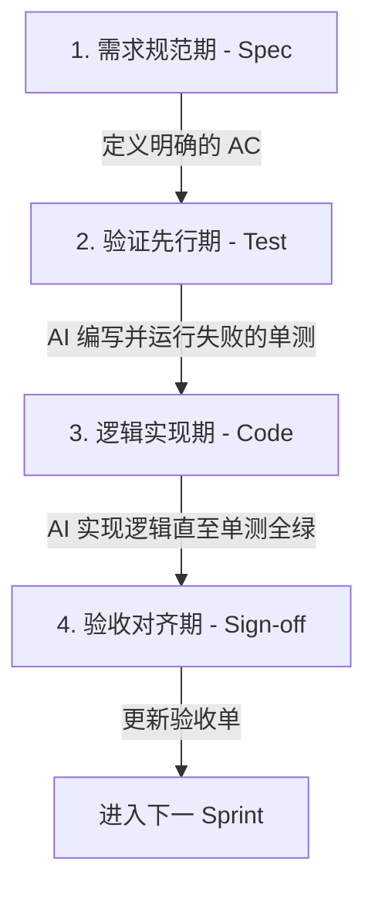

# AI 驱动开发需求验证机制 (RDV)

## 1. 核心痛点与目的
在完全依赖 AI 生成代码（VibeCoding）的模式下，最大的风险是**“需求漂移”与“黑盒实现”**。AI 可能会写出跑得通但偏离业务初衷的代码。
本机制（Requirement-Driven Verification）旨在通过**强制性的验收标准 (Acceptance Criteria, AC)** 和 **测试先行 (Test-First)** 流程，确保每一行 AI 生成的代码都与产品设计 100% 严密对齐。

## 2. 强制性四步工作流

### 阶段 1: 需求规范期 (Spec)
*   **动作**：在开发任何新 Sprint 之前，必须在 `docs/sprints/` 目录下创建对应的需求验收单。
*   **要求**：必须使用 Gherkin 风格（Given/When/Then）或明确的边界条件列出 `[AC-1]`, `[AC-2]` 等验收条款。

### 阶段 2: 验证先行期 (Test-First)
*   **动作**：AI 接收到需求后，**禁止直接编写 Controller 或 Service 逻辑代码**。
*   **要求**：AI 必须首先在对应的 `src/test/java` 目录下，根据所有的 `[AC]` 编写 JUnit 5 / Mockito 测试用例。此时运行测试必然失败。

### 阶段 3: 逻辑实现期 (Code)
*   **动作**：AI 开始编写核心业务逻辑。
*   **要求**：代码生成后，必须运行前一步编写的单元测试。只有当测试覆盖了所有 AC 且全部标记为绿色（通过）时，该任务才算完成。

### 阶段 4: 验收对齐期 (Sign-off)
*   **动作**：AI 或开发者回到 `docs/sprints/` 下的需求文档中，在对应的 `[AC]` 后勾选 `[x]`，并注明测试类路径，完成闭环验收。

## 3. 对 AI Agent 的约束指令
在与 AI 交互时，如果发现 AI 试图跳过需求验证直接写代码，请立刻发送：
> “请遵守 RDV 机制，先出具 Sprint 的 AC 验收单，并编写对应的单测后再进行业务逻辑开发。”
