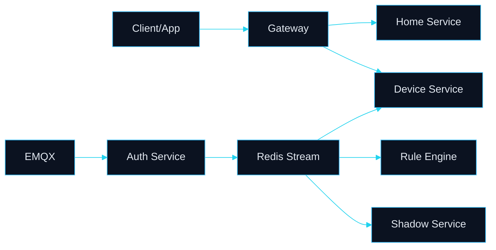

# A02 As-Is 图册

## 文档元信息

- 文档状态：`current`
- 维护人：`<待填写>`
- 最后更新：`2026-05-04`

## 当前业务主链路（简化）

## 当前组件视图（按职责）

- 入口层：`aiot-gateway`
- 认证接入层：`aiot-auth-service` + `EMQX`
- 业务域层：`aiot-home-service`、`aiot-device-service`
- 规则与影子层：`aiot-rule-engine`、`aiot-shadow-service`
- 骨架预留层：`aiot-mqtt-adapter`、`aiot-data-parser`

## 当前数据与事件流

- 同步调用：`Gateway -> 各服务`，服务间通过 `WebClient` 内部调用。
- 异步调用：设备上下线等事件经 `Redis Stream` 分发给多个消费组。
- 持久化：`MySQL` 为主存储，`Redis` 兼顾缓存和事件流载体。

## 当前问题清单（架构视角）

- 目标态与现状存在落差：目标文档偏云原生，运行面仍以单节点 Compose 为主。
- 观测闭环有缺口：指标导出已接入，平台级看板和告警联动仍待强化。
- 骨架模块业务化不足：`mqtt-adapter/data-parser/shadow` 深化程度不一致。

## 证据来源

- `docs/wiki/current-architecture.md`
- `docker-compose.yml`
- 各模块 `application.yml` 与服务代码
