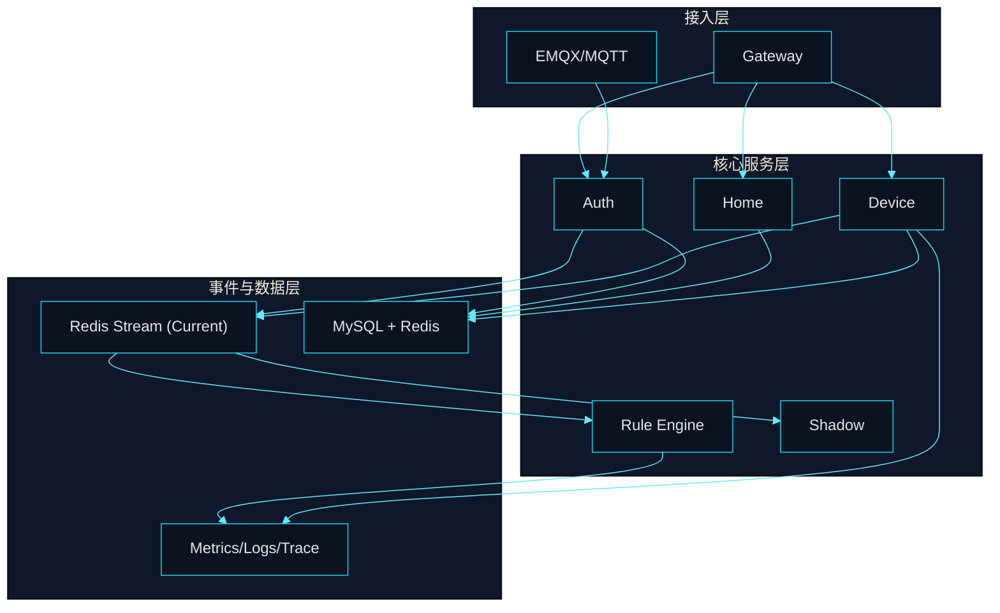

# A03 To-Be 蓝图

## 文档元信息

- 文档状态：`in-progress`
- 架构 Owner：`<待填写>`
- 目标版本：`v1.2.0 ~ v1.3.0`

## 目标原则

- 以“稳定性交付门禁”为先，再扩展高级能力。
- 以“增量迁移”替代“全量替换”。
- 以“事实可观测”驱动架构决策。

## 目标架构（分层）

## 关键能力演进项

- 服务边界治理：统一领域主权，减少重复建模与跨域写入。
- 调用治理：内外接口分层鉴权、超时重试和熔断降级统一策略。
- 事件治理：消费组责任清晰化、DLQ治理和回收流程标准化。
- 观测治理：核心链路实现指标、日志、追踪三件套闭环。

## 关键架构决策入口

- 事件中枢中期是否从 `Redis Stream` 增量演进到 `Kafka`。
- 服务部署何时从 Compose 转向 K8s，迁移门槛与收益边界。
- 数据读写分层策略何时引入（按流量阈值触发）。

## 变更影响清单（每次评审必填）

- 影响服务：`<待填写>`
- 影响接口：`<待填写>`
- 影响数据模型：`<待填写>`
- 回滚策略：`<待填写>`
