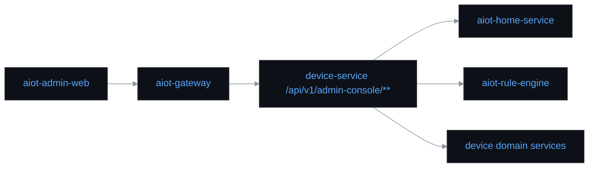

# AIOT Admin Web 落地方案

## 1. Premise

- 当前后台能力已沉淀在 `aiot-device-service` 的 `admin-console` 聚合层。
- 现状问题：管理界面仍是内嵌静态页，难以支撑专业中后台的模块化演进。
- 目标：落地独立后台前端模块，保持前后端低耦合，为后续拆分 `aiot-ops-service` 预留边界。

## 2. Constraints

- 不改动现有领域服务边界。
- 前端只消费聚合 API，不下沉业务编排。
- 优先复用当前本地联调入口：`./aiotctl admin up`。

## 3. Boundaries

- In Scope：
  - 独立前端模块 `aiot-admin-web`
  - 工作台、设备、OTA、AI 治理四个核心页面
  - Token 鉴权与 `homeId` 视角切换
- Out of Scope：
  - 独立 SSO
  - 细粒度前端 RBAC 菜单服务
  - Nginx/K8s 生产发布编排

## 4. Endgame

- 前端控制台独立部署
- 后端控制面统一收口到 `admin-console` / `aiot-ops-service`
- 业务域服务保持只暴露领域接口，不承载后台页面逻辑

## 5. 方案选型

- 选型：`SoybeanAdmin` 架构方案
- 当前仓库落地实现：`Vue 3 + TypeScript + Vite + Pinia + Vue Router`

选择结论：

- 适合专业中后台的模块化组织方式
- 对 Java 微服务仓库侵入最低
- 便于后续独立建仓或拆服务

## 6. 组件边界

## 7. 当前落地点

- 新增模块：`aiot-admin-web`
- 页面：
  - `/dashboard`
  - `/devices`
  - `/ota`
  - `/ai-governance`
- 运行入口：
  - 后端：`./aiotctl admin up`
  - 前端：`./scripts/start_admin_web.sh`

## 8. API 契约

- `GET /api/v1/admin-console/workbench`
- `GET /api/v1/admin-console/devices/page`
- `GET /api/v1/admin-console/ota/tasks/page`
- `GET /api/v1/admin-console/ai/evals/regression-gate`
- `GET /api/v1/admin-console/ai/persistence/business-live-flow`
- `GET /api/v1/admin-console/ai/persistence/query`

## 9. 后续演进

1. 将 Token 登录替换为统一网关登录态
2. 将 `homeId` 选择升级为后端返回的组织/家庭树
3. 新增工单、告警、审计模块
4. 将 `admin-console` 聚合层独立拆分为 `aiot-ops-service`
