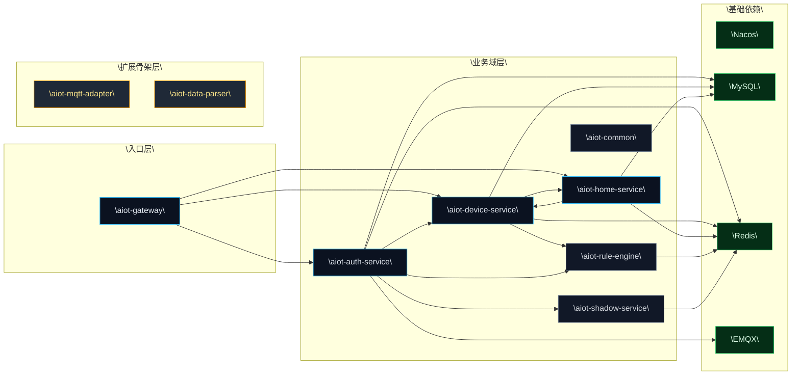
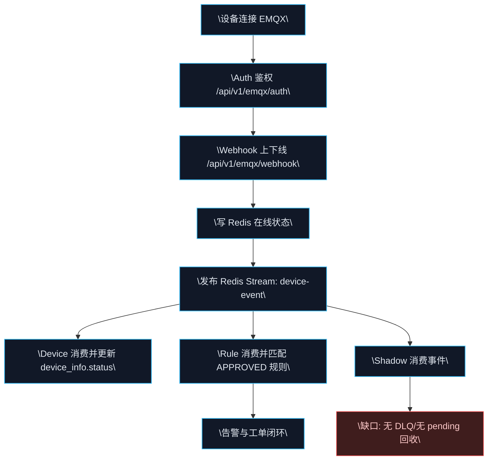
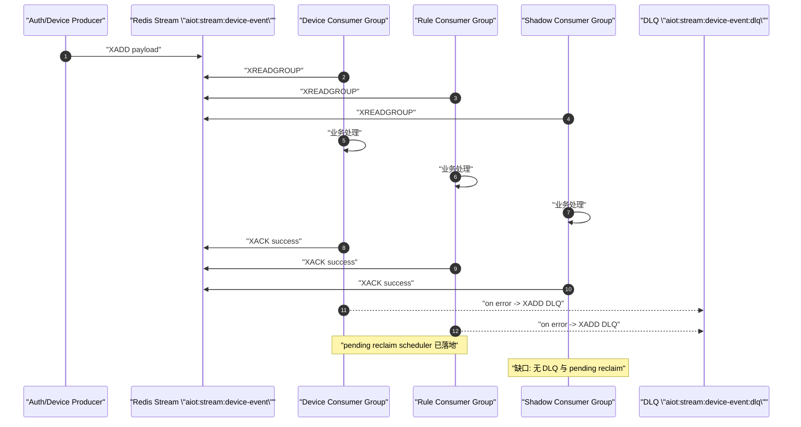

# AIOT-java 数据与业务建模完整总览（As-Is + To-Be）

## 0. 文档定义

- `文档目标`：基于当前代码与配置，完整展示 AIOT-java 的业务模型、数据模型、事件模型与指标模型，并给出完整性缺口与演进优先级。
- `适用范围`：`aiot-gateway`、`aiot-auth-service`、`aiot-device-service`、`aiot-home-service`、`aiot-rule-engine`、`aiot-shadow-service`、`aiot-common`，以及骨架模块 `aiot-mqtt-adapter`、`aiot-data-parser`。
- `证据基线`：源码（Controller/Service/Listener/Schema/Application 配置）+ 现有文档（README、current-architecture、database_table_relations）。

## 1. 架构前提（Premise / Constraints / Boundaries / Endgame）

- `Premise`：当前系统已形成“设备接入 + 家庭场景 + 设备管理 + 规则闭环（基础版）”的可运行底座，核心价值是支撑 AIoT 场景的稳定交付。
- `Constraints`：
  - 以 Docker Compose 单节点部署为主，资源与运维复杂度受限。
  - 模块成熟度不一致，`mqtt-adapter` 与 `data-parser` 尚处骨架阶段。
  - 多服务共享同一业务数据域（如设备凭证），一致性更多依赖应用层约束。
- `Boundaries`：
  - 本文以“当前已实现能力”为主，不将规划态能力当作已落地事实。
  - 聚焦后端业务建模，不展开前端实现细节。
- `Endgame`：沉淀“模型先行”的 AIoT 平台能力，使新增场景通过扩展模型而非推翻重做，最终形成可复制的行业化交付能力。

## 2. 系统全景与模块成熟度

| 模块 | 主要职责 | 当前状态 | 建模角色 |
|---|---|---|---|
| `aiot-gateway` | 网关路由与入口治理 | 已落地 | 入口边界与统一鉴权边界 |
| `aiot-auth-service` | EMQX 鉴权、Webhook 校验、上下线事件发布 | 已落地 | 接入域与事件生产者 |
| `aiot-device-service` | 产品/设备/配网/影子/OTA/后台聚合 | 已落地 | 核心业务域与主数据域 |
| `aiot-home-service` | 用户/家庭/房间/成员角色 | 已落地 | 家庭域与权限约束域 |
| `aiot-rule-engine` | 规则草拟审批、事件消费、告警工单闭环 | 已落地（轻量） | 规则域与运营闭环域 |
| `aiot-shadow-service` | 事件订阅骨架 | 部分落地 | 影子域候选承载体 |
| `aiot-common` | Result/异常/Redis/事件模型 | 已落地 | 跨域模型契约 |
| `aiot-mqtt-adapter` | 协议适配 | 骨架 | 接入域扩展位 |
| `aiot-data-parser` | 数据解析 | 骨架 | 解析域扩展位 |

%%{init: {"theme":"base","themeVariables":{"primaryColor":"#0f172a","primaryTextColor":"#e2e8f0","primaryBorderColor":"#334155","lineColor":"#38bdf8","secondaryColor":"#111827","tertiaryColor":"#1f2937","fontFamily":"JetBrains Mono, Menlo, monospace","background":"#020617"}}}%%


## 3. 业务模型（Business Model）

### 3.1 限界上下文（Bounded Context）

| 上下文 | 核心能力 | 核心对象 | 入口接口（示例） | 出口接口（示例） |
|---|---|---|---|---|
| 接入与认证域 | 设备鉴权、Webhook 验签、防重放 | 设备凭证、接入事件 | `/api/v1/emqx/auth`、`/api/v1/emqx/webhook` | 发布 `device-event` |
| 设备域 | 产品/设备/配网/影子/OTA | Product、Device、Credential、OTA | `/api/v1/products/**`、`/api/v1/devices/**` | 调家庭权限、调用规则概览 |
| 家庭域 | 用户、家庭、成员、房间、角色 | User、Home、Room、HomeMember | `/api/v1/users/**`、`/api/v1/homes/**`、`/api/v1/rooms/**` | 调设备内部解绑补偿 |
| 规则运营域 | 规则草拟审批、执行、告警工单闭环 | Rule、Alarm、WorkOrder、Audit | `/api/v1/rules/**`、`/api/v1/ops/**` | Webhook 回调、运营概览输出 |
| 影子域（候选） | 设备影子消费与演进位 | ShadowEvent | 事件订阅（当前无独立 API） | 状态投影（待增强） |

### 3.2 核心业务链路

%%{init: {"theme":"base","themeVariables":{"primaryColor":"#0f172a","primaryTextColor":"#e2e8f0","primaryBorderColor":"#334155","lineColor":"#38bdf8","secondaryColor":"#111827","tertiaryColor":"#1f2937","fontFamily":"JetBrains Mono, Menlo, monospace","background":"#020617"}}}%%


### 3.3 跨服务业务协同

- `Device -> Home`：设备域执行敏感操作前调用家庭权限校验接口。
- `Home -> Device`：删除家庭/房间时调用内部解绑补偿接口，避免悬挂关联。
- `Device -> Rule`：管理台总览聚合规则域运营数据。
- `Auth -> Device/Rule/Shadow`：通过统一事件流驱动三方异步处理。

## 4. 数据模型（Data Model）

### 4.1 主数据对象与归属

| 主数据对象 | 物理存储 | 主责服务（写） | 主要读方 | 一致性类型 |
|---|---|---|---|---|
| `product_info` | MySQL | Device | Device | 单服务强一致 |
| `device_info` | MySQL | Device | Device/Rule(间接) | 单服务强一致 + 异步投影 |
| `device_credential` | MySQL | Device | Auth | 跨服务共享（约定一致） |
| `firmware_package` | MySQL | Device | Device | 单服务强一致 |
| `ota_upgrade_task` | MySQL | Device | Device | 单服务强一致 |
| `ota_upgrade_record` | MySQL | Device | Device | 单服务强一致 |
| `user_info` | MySQL | Home | Home | 单服务强一致 |
| `home_info` | MySQL | Home | Home/Device(校验) | 跨服务引用 |
| `room_info` | MySQL | Home | Home/Device(校验) | 跨服务引用 |
| `home_member` | MySQL | Home | Home/Device(权限) | 跨服务引用 |

### 4.2 逻辑关系图（As-Is）

%%{init: {"theme":"base","themeVariables":{"primaryColor":"#0f172a","primaryTextColor":"#e2e8f0","primaryBorderColor":"#334155","lineColor":"#94a3b8","secondaryColor":"#111827","tertiaryColor":"#1f2937","fontFamily":"JetBrains Mono, Menlo, monospace","background":"#020617"}}}%%
```mermaid
erDiagram
  "user_info" ||--o{ "home_member" : "\"user_id\""
  "home_info" ||--o{ "home_member" : "\"home_id\""
  "home_info" ||--o{ "room_info" : "\"home_id\""
  "home_info" ||--o{ "device_info" : "\"home_id\""
  "room_info" ||--o{ "device_info" : "\"room_id\""
  "product_info" ||--o{ "device_info" : "\"product_key\""
  "device_info" ||--|| "device_credential" : "\"device_id\""
  "device_info" ||--o{ "ota_upgrade_record" : "\"device_id\""
  "ota_upgrade_task" ||--o{ "ota_upgrade_record" : "\"task_id\""
```

### 4.3 数据约束与风险

- `已具备`：
  - 全域统一逻辑删除口径（`is_deleted` + MyBatis Plus 逻辑删配置）。
  - 关键唯一索引覆盖（如 `uk_product_key`、`uk_device_id`、`uk_home_user`、`uk_task_device`）。
- `风险点`：
  - DDL 未显式声明外键，引用完整性依赖应用层校验与补偿。
  - `device_credential` 被 Device 写、Auth 读，跨服务共享表存在口径漂移风险。
  - 设备状态存在多写路径（普通更新 + 批量 flush），缺少版本字段会带来并发覆盖风险。
  - Home 默认数据库与 Device/Auth 默认数据库配置不同，环境初始化不一致时可能导致口径分裂。

### 4.4 状态建模（关键实体）

| 实体 | 状态 | 合法迁移 | 当前实现 |
|---|---|---|---|
| Device | `INACTIVE(0)` `ONLINE(1)` `OFFLINE(2)` | `INACTIVE->ONLINE`、`ONLINE->OFFLINE`、`OFFLINE->ONLINE` | 已有枚举与迁移约束 |
| OTA Task | `进行中` `完成` `已暂停` | 按任务推进 | 已有字段，缺显式状态机治理 |
| OTA Record | `待升级` `成功` `失败` | 设备上报驱动 | 已有字段，缺重试策略模型 |
| Alarm | `NEW` `ACKED` | 处理人确认驱动 | 已落地 |
| WorkOrder | `OPEN` `IN_PROGRESS` `RESOLVED` `SLA_BREACHED` | 人工处理 + SLA巡检 | 已落地 |

## 5. 事件模型（Event Model）

### 5.1 事件目录（As-Is）

| 事件类型 | 生产方 | 载荷要点 | 消费方 |
|---|---|---|---|
| `DEVICE_ONLINE` | Auth | `eventId/deviceId/timestamp` | Device、Rule、Shadow |
| `DEVICE_OFFLINE` | Auth | `eventId/deviceId/timestamp` | Device、Rule、Shadow |
| `SHADOW_DESIRED_UPDATED` | Device | 影子期望态变更信息 | Device、Rule、Shadow |
| `SHADOW_REPORTED_UPDATED` | Device | 影子上报态变更信息 | Device、Rule、Shadow |

### 5.2 事件生命周期与可靠性

%%{init: {"theme":"base","themeVariables":{"primaryColor":"#0f172a","primaryTextColor":"#e2e8f0","primaryBorderColor":"#334155","lineColor":"#38bdf8","secondaryColor":"#111827","tertiaryColor":"#1f2937","fontFamily":"JetBrains Mono, Menlo, monospace","background":"#020617"}}}%%


### 5.3 可靠性模型结论

- `已落地`：
  - Device/Rule 侧具备 `ACK + DLQ + pending 回收 + 指标暴露` 的可靠消费链路。
  - Rule 执行具备按 `ruleId + eventId` 的幂等键防重。
- `缺口`：
  - Shadow 侧只有成功 ACK 路径，失败恢复能力不足。
  - 事件版本、Schema 演进与契约注册中心尚未形成统一机制。

## 6. 指标模型（Metric Model）

### 6.1 业务指标（建议统一到周报/看板）

| 维度 | 指标 | 口径说明 |
|---|---|---|
| 设备在线性 | 在线设备数、离线设备数、在线率 | 来自设备状态汇总 |
| 事件可靠性 | 消费成功率、pending 恢复成功率、DLQ 写入率 | 来自 stream 消费指标 |
| 运维闭环 | 当日告警数、待处理工单数、一次解决率、SLA 超时率 | 来自 rule ops 数据 |
| 交付效率 | 变更服务数、增量构建耗时、发布成功率 | 来自 CI/CD 与部署日志 |

### 6.2 技术 SLI/SLO（建议）

| SLI | 目标 SLO | 说明 |
|---|---|---|
| Webhook 验签成功率 | `>= 99.9%` | 含防重放校验 |
| 设备状态更新延迟 | `P95 <= 3s` | 事件入流到状态可见 |
| 事件消费失败率 | `<= 0.5%` | 失败进入 DLQ 后可追踪 |
| 工单 SLA 违约率 | `<= 2%` | 以规则域工单统计为准 |

## 7. 完整性检查（Completeness Checklist）

### 7.1 已完整覆盖

- 业务主链路：认证、设备、家庭、规则闭环已可串联。
- 主数据对象：设备域与家庭域核心表、索引与基本约束齐全。
- 事件链路：统一 Redis Stream 事件总线已形成。
- 观测基线：Actuator + Prometheus 在核心服务已启用。

### 7.2 尚未完整覆盖

- 模块完整性：`aiot-mqtt-adapter`、`aiot-data-parser` 仍为骨架，接入与解析域未产品化。
- 影子域完整性：`aiot-shadow-service` 缺少独立 API 与完整故障恢复链路。
- 数据治理完整性：无外键 + 跨服务共享表需要更强的数据契约治理。
- 事件治理完整性：事件版本化、Schema 管理与回放运营工具不足。
- 配置一致性：`aiot-home-service` 与 `aiot-shadow-service` 默认端口/库配置与其他服务存在潜在冲突与偏差风险。

## 8. To-Be 建模升级优先级（按收益排序）

1. `P0`：补齐 Shadow 侧 `DLQ + pending reclaim + 指标`，统一事件消费可靠性。
2. `P0`：建立跨服务数据契约（尤其 `device_credential`）与变更评审机制，降低口径漂移。
3. `P1`：为 OTA、告警工单补齐显式状态机与非法迁移防护。
4. `P1`：落地事件 Schema 版本化（字段兼容策略 + 生产消费契约校验）。
5. `P2`：将 `mqtt-adapter` 与 `data-parser` 从骨架推进为独立可运维服务，形成真正的接入与解析边界。

## 9. 建模资产清单（建议纳入仓库长期维护）

- `业务资产`：领域词汇表、上下文图、关键业务时序图。
- `数据资产`：主数据字典、关系模型、状态机、数据质量规则。
- `事件资产`：事件目录、版本策略、重放与排障 SOP。
- `指标资产`：业务口径字典、SLI/SLO、告警分级与运营看板。

---

## 附：本次整理涉及的关键文件

- `README.md`
- `docs/wiki/current-architecture.md`
- `docs/database_table_relations.md`
- `aiot-device-service/src/main/resources/schema.sql`
- `aiot-home-service/src/main/resources/schema.sql`
- `aiot-auth-service/src/main/java/.../AuthServiceImpl.java`
- `aiot-device-service/src/main/java/.../DeviceStatusStreamSubscriber.java`
- `aiot-rule-engine/src/main/java/.../DeviceEventSubscriber.java`
- `aiot-shadow-service/src/main/java/.../DeviceEventSubscriber.java`
- `aiot-device-service/src/main/java/.../DeviceStatusBufferService.java`
- `aiot-rule-engine/src/main/java/.../RuleLifecycleService.java`

## 10. 如何看懂“四层模型”（给非建模背景）

### 10.1 一句话解释

- `业务模型`：先定义“我们要解决什么业务问题，谁负责，规则是什么”。
- `数据模型`：把业务对象落成“表/字段/关系/状态”，保证可存可查可演进。
- `事件模型`：定义“状态变化后谁要被通知、怎么保证不丢不重”。
- `指标模型`：定义“如何量化结果是否达成，是否值得持续投入”。

### 10.2 为什么必须按这个顺序

1. 先有业务边界，才知道数据归谁管。
2. 先有数据结构，才知道哪些变化要发事件。
3. 先有事件协同，才知道要监控哪些链路质量。
4. 先有可度量指标，才能做经营与技术决策。

### 10.3 用本项目“设备离线”做四层对照

| 层 | 在本项目里具体是什么 | 对应现状 |
|---|---|---|
| 业务模型 | 设备离线要被识别并触发运维闭环（告警/工单） | 已落地主流程 |
| 数据模型 | `device_info.status`、`AlarmRecord`、`WorkOrderRecord` 等对象与状态 | 已落地，部分状态机待强化 |
| 事件模型 | `DEVICE_OFFLINE` 写入 `aiot:stream:device-event`，由 Device/Rule/Shadow 消费 | 已落地，Shadow 恢复机制待补齐 |
| 指标模型 | 离线率、消费成功率、SLA 违约率、一次解决率 | 已有基础，建议统一看板口径 |

### 10.4 常见误区（避免“看起来很忙”）

- 只画接口不定边界：会导致跨服务扯皮，数据归属不清。
- 只建表不建状态机：会导致状态随意跳转，后续治理困难。
- 只发事件不做恢复：会导致异常时消息积压或业务丢失。
- 只采技术指标不采业务指标：系统看似健康，但业务价值不可证。

### 10.5 最小落地模板（可复用）

- `业务模型模板`：参与角色、用例、规则、边界、异常场景。
- `数据模型模板`：实体、关系、主键/唯一约束、状态机、口径定义。
- `事件模型模板`：事件名、版本、幂等键、重试/DLQ/回收策略。
- `指标模型模板`：北极星指标、链路指标、SLO、告警阈值、归因维度。

### 10.6 评审时的 5 个必答问题

1. 这个能力的“业务边界”到底在哪里？
2. 哪些数据由哪个服务“唯一写入”负责？
3. 状态变化是否都能被事件准确表达并可靠消费？
4. 异常场景（超时、重复、乱序、失败）如何被治理？
5. 哪个指标能证明这次改动真的产生价值？

## 11. 二次更新确认（2026-04-27）

- 本节为“重新更新”可见标记，确认以下内容已写入本文件：
  - `10. 如何看懂“四层模型”（给非建模背景）`
  - `10.1` 到 `10.6` 六个子章节
- 若 IDE 未即时显示，请刷新文件标签页或重新打开该文件路径。
