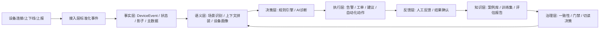
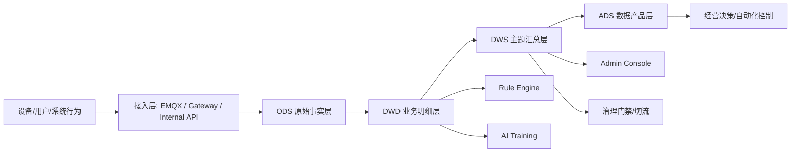

# AIOT 数据中台建设蓝图

## 0. 文档定义

- `文档目标`：基于当前项目现状，定义 AIOT-java 的数据中台建设方向，明确起点、终点、核心因果链、分层模型、主题域、分阶段落地路径与硬门禁。
- `适用范围`：`aiot-auth-service`、`aiot-device-service`、`aiot-home-service`、`aiot-rule-engine`、`training/`、Admin 控制台，以及后续可剥离的数据控制面服务。
- `问题背景`：当前项目已具备“设备事件流 + AI 诊断闭环 + 持久化治理”的雏形，但数据资产仍散落在业务服务、治理脚本和控制台聚合逻辑中，缺少统一的事实层、指标层和标准供数出口。
- `终局目标`：形成一个以设备运营和 AI 治理为双核心的数据中台，统一承接事实沉淀、指标供给、训练导出、治理门禁和控制面决策。

## 1. 一句话定义

- `数据中台` = 把“事件、状态、诊断、反馈、案例、治理证据”沉淀为统一事实层和指标层，再稳定供给业务、AI、治理和控制面消费。

## 2. 顶层判断

- 当前项目不是从零开始建设数据中台，而是要把已经存在的三条链路平台化：
  - 设备事件链
  - AI 诊断闭环链
  - 持久化治理链
- 当前已经具备中台种子能力：
  - 统一设备事件信封：`aiot-common/src/main/java/com/aiot/common/event/DeviceEvent.java`
  - 统一运行时上下文拼装：`aiot-device-service/.../AiContextFacadeImpl.java`
  - AI 记录沉淀表：`aiot-db-migrator/.../V1_1_0__ai_minimal_loop.sql`
  - 持久化门禁与切读决策：`aiot-rule-engine/.../AiPersistenceReadModeResolver.java`
- 当前真正缺的不是数据量，而是四件事：
  - 统一口径
  - 统一主键
  - 统一分层
  - 统一消费出口

## 3. 起点与终点

### 3.1 起点定义

- 起点不是 `MySQL`，也不是 `Redis`。
- 起点是“业务世界第一次被系统感知的事实”。
- 在本项目中，起点包括：
  - 设备接入、鉴权、上下线事件
  - 设备属性、影子、状态变化
  - 设备、产品、家庭、房间等主数据变化
  - AI 诊断请求与诊断结果
  - 人工反馈、工单处理结果、案例沉淀行为

### 3.2 项目中的具体起点

- `设备侧起点`：EMQX 调用 `auth-service` 的认证与 webhook 接口，把设备连接和上下线行为转成系统事实。
- `事件标准化起点`：`DeviceEvent` 统一携带 `eventId / eventType / deviceId / timestamp / source / traceId / version / payload`。
- `主数据起点`：设备、产品、家庭、房间、成员关系分别由 `device-service` 与 `home-service` 提供。
- `AI 语义起点`：`AiContextFacadeImpl` 将设备身份、家庭归属、在线状态、影子、物模型拼装成 AI 可消费的上下文。

### 3.3 终点定义

- 终点不是报表页面本身。
- 终点是“可以直接驱动经营与自动化的稳定数据产品”。
- 在本项目中，终点包括：
  - Admin 控制台指标与历史追溯
  - AI 训练数据集与评估报告
  - 一致性报告、迁移门禁、切流 readiness
  - 规则优化、案例复用、自动化治理动作

### 3.4 项目中的具体终点

- `运营终点`：Admin 总览、设备页、OTA 页、AI 评估与治理页。
- `AI 终点`：诊断记录、反馈记录、案例库三类标准业务资产。
- `治理终点`：`consistency report`、`constraints report`、`migration gate report`，直接驱动持久化切读策略。
- `自动化终点`：规则生成、案例回放、补偿重试、控制面 drain、切流决策。

## 4. 核心因果链

- 建议将本项目的数据中台定义为如下闭环：
- `设备行为 -> 事件事实 -> 状态变化 -> 场景识别 -> AI诊断 -> 人工反馈 -> 案例沉淀 -> 规则/模型优化 -> 新一轮自动化处置`

## 5. To-Be 总架构

- 不建议先做一个泛化 BI 中台。
- 更适合先做“设备运营 + AI 治理”双核数据中台。
- 中台要统一支撑：
  - `device-service`
  - `rule-engine`
  - `training/`
  - Admin 控制台
  - 后续独立的数据控制面服务

## 6. 分层模型

### 6.1 ODS 原始事实层

- 保留原始业务语义，只做标准化和主键统一。
- 不做重业务加工，不在这一层混入控制台口径。
- 当前来源包括：
  - 设备事件流
  - 设备主数据
  - 家庭主数据
  - 影子快照
  - AI 原始记录
  - 治理报告原始结果

### 6.2 DWD 业务明细层

- 把原始事件收敛为稳定、可计算、可追溯的业务事实。
- 这是从“代码对象”迈向“经营对象”的关键一层。
- 原则：一条事实只表达一个稳定业务含义，不混合控制层临时口径。

### 6.3 DWS 主题汇总层

- 按主题域汇总形成对运营、治理、AI 直接可消费的宽表。
- 主要供 Admin、训练流程、治理门禁与控制面使用。

### 6.4 ADS 数据产品层

- 面向最终消费者输出稳定数据产品：
  - Admin 快照
  - AI 活体验证快照
  - 门禁快照
  - 切流 readiness
  - TopN 异常设备与诊断追溯

## 7. 主题域划分

### 7.1 设备健康域

- 在线率
- 离线抖动率
- 心跳异常率
- 影子偏差率
- 固件异常率

### 7.2 家庭运营域

- 家庭设备数
- 活跃设备数
- 房间分布
- 家庭异常密度

### 7.3 AI 效能域

- 诊断次数
- fallback 占比
- 案例命中率
- 反馈采纳率
- 一次解决率
- 案例沉淀率

### 7.4 持久化治理域

- 双写成功率
- 补偿积压量
- mirror 一致性
- 门禁通过率
- 切流状态

### 7.5 审计追溯域

- 按 `traceId / eventId / diagnosisId / feedbackId / caseId` 回溯全链路
- 支撑定位、审计、治理和模型复盘

## 8. 统一主键体系

- 数据中台必须统一 8 个一级字段：
  - `eventId`
  - `traceId`
  - `deviceId`
  - `globalDeviceId`
  - `homeId`
  - `sceneType`
  - `occurredAt`
  - `source`
- 强约束建议：
  - 任何进入 `DWD` 的记录，至少必须具备 `deviceId + occurredAt`
  - 任何 AI 相关事实必须具备 `traceId` 或可回溯唯一主键
  - 高频核心事件的 `payload` 需逐步从 `Object/Map` 向类型化 DTO 演进

## 9. 分层表清单

### 9.1 ODS 首批表

- `ods_device_event_raw`
- `ods_device_shadow_snapshot`
- `ods_device_master`
- `ods_home_master`
- `ods_ai_diagnosis_raw`
- `ods_ai_feedback_raw`
- `ods_ai_case_raw`
- `ods_ai_governance_report_raw`

### 9.2 DWD 首批事实表

- `dwd_fact_device_event`
- `dwd_fact_device_online_session`
- `dwd_fact_device_shadow_diff`
- `dwd_fact_ai_diagnosis`
- `dwd_fact_ai_feedback`
- `dwd_fact_ai_case`
- `dwd_fact_ai_case_materialization_task`
- `dwd_fact_ai_persistence_gate`

### 9.3 DWS 首批主题宽表

- `dws_device_health_day`
- `dws_home_ops_day`
- `dws_ai_effectiveness_day`
- `dws_ai_persistence_governance_day`
- `dws_trace_chain_snapshot`

### 9.4 ADS 首批数据产品

- `ads_admin_overview_snapshot`
- `ads_ai_business_live_flow`
- `ads_ai_eval_gate_status`
- `ads_persistence_cutover_readiness`
- `ads_device_exception_topn`

## 10. 核心指标口径

- `在线率`：在线设备数 / 注册设备数
- `抖动率`：24h 内上下线切换次数超过阈值的设备数 / 活跃设备数
- `影子偏差率`：存在 desired/reported 差异设备数 / 有控制行为设备数
- `AI fallback 占比`：fallback 诊断次数 / 总诊断次数
- `一次解决率`：反馈状态为 solved 且首次闭环成功的诊断数 / 总反馈数
- `案例沉淀率`：成功写入案例库的 solved 反馈数 / solved 反馈总数
- `门禁通过率`：通过 consistency + constraints + migration gate 的场景数 / 总场景数
- `切流 readiness`：一致性通过 && 约束通过 && 迁移门禁通过 && pending=0

## 11. 与当前模块映射

### 11.1 aiot-auth-service

- 职责：负责接入边界、鉴权、Webhook 验签与原始事件产生。
- 中台定位：生产标准化事件，不承担中台供数聚合职责。

### 11.2 aiot-device-service

- 职责：设备、产品、影子、OTA、设备域接口与内部聚合。
- 中台定位：提供设备与家庭关联维度、影子态、设备画像等核心维度数据。

### 11.3 aiot-home-service

- 职责：用户、家庭、房间、成员和权限模型。
- 中台定位：提供家庭域主数据与组织关系维度。

### 11.4 aiot-rule-engine

- 职责：事件消费、规则执行、AI 诊断、反馈沉淀、案例物化、治理快照。
- 中台定位：事实层和治理层的核心生产方。

### 11.5 training

- 当前定位：独立工作区，负责导出、校验、回填和门禁。
- 中台未来定位：从旁路工具升级为中台标准事实和宽表的消费端。

### 11.6 Admin 控制台

- 当前定位：跨服务接口聚合。
- 中台未来定位：优先消费 `ADS` 快照和 `DWS` 宽表，而不是分散拼装底层明细。

## 12. 当前最大断点

- `Admin` 仍依赖跨服务远程拉取与接口拼装，指标成本会持续上升。
- AI 运行上下文适合在线调用，但不完全等价于可稳定入仓的事实模型。
- `training/` 与线上运行面仍偏“文件报告驱动”，长期应升级为“标准表 + 标准快照 API”驱动。
- 治理证据已存在，但还未被明确提升为中台一级主题域。
- 高频关键事件仍存在 `Object/Map` 承接事实的问题，后续会造成口径漂移和编译期约束缺失。

## 13. 建设路线

### 13.1 M0 口径统一

- 统一事件字典、场景字典、主键字典、状态枚举。
- 对高频 `DeviceEvent.payload` 逐步类型化。
- 产出物：
  - `event_dictionary.md`
  - `scene_dictionary.md`
  - `data_contract.md`

### 13.2 M1 事实入仓

- 围绕 `OFFLINE_FLAP` 场景先打通第一条黄金链路。
- 建立 ODS 和 DWD 首批核心表。
- 用 `traceId / eventId / diagnosisId / feedbackId / caseId` 串起单设备全链路。
- 产出物：
  - 单场景可追溯事实链
  - 单设备闭环审计视图

### 13.3 M2 主题宽表

- 建设四类主题宽表：
  - 设备健康
  - 家庭运营
  - AI 效能
  - 持久化治理
- Admin 优先改造为宽表供数。
- 产出物：
  - 首页快照
  - AI 治理页快照
  - 切流页快照

### 13.4 M3 控制面闭环

- 将门禁报告从“文件证据”升级为“宽表 + 快照 API”。
- 将读模式切换逻辑从文件路径输入逐步升级到标准治理快照输入。
- 产出物：
  - 标准治理快照
  - 标准切流 readiness 接口

### 13.5 M4 独立服务化

- 当事实层、宽表层、快照层稳定后，再剥离独立的数据控制面服务。
- 建议服务名预留为：
  - `aiot-data-platform`
  - 或 `aiot-data-control-plane`

## 14. 优先场景顺序

- `第一优先：OFFLINE_FLAP`
  - 事件链最完整
  - 训练与门禁已有基础
  - 经营价值明确
- `第二优先：SHADOW_DIFF`
  - 直接连接控制链路和物模型
  - 能体现设备可控性与闭环质量
- `第三优先：PROVISION_FAILURE`
  - 直接影响激活率、交付体验和转化

## 15. 硬门禁

- 没有统一主键，不上中台。
- 没有统一场景字典，不做主题宽表。
- 没有 trace 级追溯能力，不开放给 Admin 作为事实真源。
- 没有一致性门禁，不允许作为切流依据。
- 没有类型化关键 payload，不允许继续扩散 `Map/Object` 承接核心事实。

## 16. 组织与职责切分

- 领域服务负责生产事实：
  - `auth-service` 生产接入事实
  - `device-service` 生产设备主数据与状态事实
  - `home-service` 生产家庭域事实
  - `rule-engine` 生产 AI 和治理事实
- 数据中台负责：
  - 事实沉淀
  - 口径统一
  - 指标建模
  - 快照供给
  - 门禁与切流支撑
- `training` 只消费标准事实和宽表。
- Admin/运营只消费 `ADS` 或 `DWS`，不再直接跨服务拼明细。

## 17. 终局形态

- `auth-service` 只管接入和原始事件。
- `device-service` 只管设备、产品、影子、OTA、设备域主数据。
- `home-service` 只管家庭、房间、成员和权限域主数据。
- `rule-engine` 只管规则、AI 决策、反馈和治理编排。
- 数据中台统一承接事实、指标、追溯、治理、训练导出和控制面供数。
- Admin、training、cutover 全部建立在统一数据产品之上，而不是建立在临时接口组合之上。

## 18. 执行建议

- 先做 `M0 + M1`，不要一开始就追求全域 BI。
- 先固化一条黄金链路，再放大到多场景和多主题。
- 先把事实建稳，再把宽表建厚。
- 先把治理证据标准化，再让控制面自动化。
- 先把 Admin 从拼接口切到读快照，再谈独立拆服务。

## 19. 结论

- 这个项目的数据中台，起点是“设备与业务世界发生变化的原始事实”。
- 终点是“驱动运维、AI、治理和经营的标准化数据产品”。
- 核心因果链是“事件事实化 -> 语义建模 -> 诊断决策 -> 反馈沉淀 -> 治理切流 -> 反哺下一轮决策”。
- 当前项目已经具备中台雏形，下一步的关键不是新增更多功能，而是把分散在服务、脚本和控制台中的数据能力抽成统一资产层。
