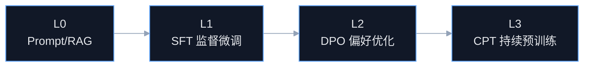

# AIoT 领域模型训练与微调落地方案

## Premise / Constraints / Boundaries / Endgame
- Premise：当前项目已经规划完成 `AI 工程化底座`、`AI 应用最小闭环`、`反馈学习链路`，并识别出三类高价值场景：`配网失败`、`高频离线`、`影子偏差`。这意味着我们已经具备做领域模型训练/微调的最小数据基础，但还没有形成训练工程。
- Constraints：当前项目数据规模、算力预算、工程成熟度都不支持直接自研通用底模；因此必须遵循 `先拿业务闭环产生高质量样本，再做小步快跑微调` 的路线。高风险写操作仍不能交给模型直接执行。
- Boundaries：本方案聚焦 `如何基于现有 AIoT 闭环数据训练和微调自己的领域模型`，覆盖训练目标、数据集构造、训练阶段、评估门禁、上线策略；不展开大规模基础预训练、端侧蒸馏、复杂 RL 平台建设。
- Endgame：形成一套 `数据可采集 -> 样本可标注 -> 模型可微调 -> 结果可评估 -> 版本可灰度 -> 反馈可再训练` 的 AIoT 领域模型演进机制，让模型从“通用会说”进化到“懂当前设备、懂当前规则、懂当前运维”。

---

## 1. 结论先行

### 1.1 你现在最不应该做的事
- 不要一上来训练自己的基础大模型。
- 不要一开始就上 `全量持续预训练 + RLHF + 多模型编排`。
- 不要在没有反馈闭环前就投入大量 GPU 预算。

### 1.2 正确路线
- 正确路线必须分 4 层：
- `L0`：Prompt / RAG / Few-shot 学习
- `L1`：监督微调 `SFT`
- `L2`：偏好优化 `DPO / ORPO / Reward Ranking`
- `L3`：持续预训练 `CPT` 或领域增量预训练

### 1.3 对你当前项目的推荐结论
- `现在立刻能做`：`RAG + Prompt 版本化 + 案例库 -> 监督微调数据集沉淀`
- `3-6 周后能做`：针对 `OFFLINE_FLAP / PROVISION_FAILURE / SHADOW_DIFF` 做 7B/8B 量级领域 SFT
- `反馈样本足够后再做`：偏好优化，把“被采纳的答案”压过“被拒绝的答案”
- `只有样本规模和预算都上来后才做`：领域持续预训练，不建议当前阶段做

---

## 2. 为什么当前项目适合先做微调而不是预训练

### 2.1 你的优势
- 你有明确问题域，不是开放世界问答。
- 你有明确输出格式，不是开放式长文本创作。
- 你有明确业务闭环，可以知道模型答得对不对。
- 你有事件、影子、规则、工单、反馈，天然适合构造训练样本。

### 2.2 你的短板
- 当前仓库没有海量通用语料。
- 当前项目还没有 TB/PB 级设备时序训练数据底座。
- 当前业务更需要“领域正确性”和“结构化输出稳定性”，而不是“百科知识广度”。

### 2.3 所以最优策略
- 用开源基础模型作为底座。
- 用当前闭环业务数据做领域微调。
- 用反馈链路持续产生更高质量样本。
- 先训练“会诊断、会给草案、会守格式”的模型，不训练“全知全能模型”。

---

## 3. 模型路线图

### 3.1 四阶段演进图



### 3.2 每一层解决什么问题

| 层级 | 目标 | 什么时候开始 |
| --- | --- | --- |
| `L0` | 先用外部底模 + 检索增强把场景跑通 | 立刻开始 |
| `L1` | 让模型学会 AIoT 领域表达、结构化输出和典型诊断逻辑 | 有 3k-20k 高质量样本后 |
| `L2` | 让模型更偏向“被运营采纳的答案” | 有成对偏好数据后 |
| `L3` | 让模型更懂 AIoT 术语、协议、物模型和运维语境 | 有百万级领域 token 和稳定预算后 |

### 3.3 当前最推荐的底模类型
- 中文/中英混合强、指令跟随好、结构化输出稳定的开源 Instruct 模型。
- 参数规模建议：
  - `7B/8B`：M0-M1 最优，训练成本和推理成本平衡最好。
  - `14B`：如果诊断复杂度明显提高，可作为下一阶段。
  - `32B+`：当前项目不建议，自建成本过高。

### 3.4 训练方法建议
- `第一阶段 SFT`：优先 `LoRA / QLoRA`
- `第二阶段偏好优化`：优先 `DPO`
- `第三阶段持续预训练`：仅在样本规模和预算充足时考虑

---

## 4. 你的训练数据从哪里来

### 4.1 当前已经规划好的训练原料

| 数据来源 | 当前项目位置 | 可用于训练什么 |
| --- | --- | --- |
| `DeviceEvent` | Redis Stream / 事件消费链 | 问题触发事实 |
| 设备主数据 | `device_info` / `product_info` | 设备背景与物模型语义 |
| 影子快照 | Redis `reported/desired/meta/version` | 状态对账类诊断 |
| 告警/工单/审计 | `rule-engine` 运维闭环 | 问题处理过程与结果 |
| `ai_diagnosis_record` | 已规划 | 模型输入输出快照 |
| `ai_feedback_record` | 已规划 | 采纳/拒绝/修正标签 |
| `ai_case_library` | 已规划 | 高质量案例样本 |

### 4.2 样本质量排序
- 一级高价值样本：
  - `人工确认 solved` 的诊断记录
  - `采纳且低修改` 的规则草案
  - `工单结案明确根因` 的案例
- 二级可用样本：
  - `partial solved` 的诊断记录
  - `人工修改后采纳` 的建议
- 三级弱样本：
  - 没有反馈的 AI 输出
  - 仅有模型推理但无实际结果验证的数据

### 4.3 三类核心训练样本
- `诊断样本`
  - 输入：设备上下文 + 事件事实
  - 输出：结构化根因诊断 + 证据 + 建议
- `规则草案样本`
  - 输入：问题描述或诊断结果
  - 输出：规则 DSL / 草案 JSON
- `偏好样本`
  - 输入：相同上下文 + 两个候选答案
  - 输出：哪个答案被人工采纳

---

## 5. 数据集构造方法

### 5.1 SFT 数据集格式
- 推荐统一成 `instruction / input / output / metadata` 结构。

```json
{
  "instruction": "请基于设备上下文输出结构化离线诊断结果",
  "input": {
    "sceneType": "OFFLINE_FLAP",
    "deviceProfile": {},
    "recentEvents": [],
    "shadowSummary": {},
    "opsSummary": {}
  },
  "output": {
    "sceneType": "OFFLINE_FLAP",
    "summary": "设备 24 小时内反复上下线",
    "rootCauseCategory": "NETWORK_INSTABILITY",
    "confidence": 0.86,
    "evidence": [
      "最近 30 分钟发生 4 次离线",
      "RSSI 持续偏低"
    ],
    "recommendedActions": [
      "检查供电和网络覆盖",
      "建议创建频发离线告警规则"
    ],
    "ruleDraftable": true,
    "riskLevel": "MEDIUM"
  },
  "metadata": {
    "source": "ai_case_library",
    "sceneType": "OFFLINE_FLAP",
    "feedback": "ACCEPTED",
    "resolutionStatus": "SOLVED",
    "promptVersion": "v1.3"
  }
}
```

### 5.2 DPO 偏好数据格式

```json
{
  "instruction": "请输出离线诊断结果",
  "input": {
    "sceneType": "OFFLINE_FLAP",
    "context": {}
  },
  "chosen": {
    "summary": "网络波动导致离线抖动",
    "recommendedActions": [
      "检查弱网环境",
      "设置离线频发阈值规则"
    ]
  },
  "rejected": {
    "summary": "设备异常",
    "recommendedActions": [
      "请联系管理员"
    ]
  },
  "metadata": {
    "sourceFeedbackId": 1024,
    "operatorDecision": "ACCEPTED_VS_REJECTED"
  }
}
```

### 5.3 如何从现有闭环自动抽样
- 从 `ai_diagnosis_record` 取输入快照和原始输出
- 关联 `ai_feedback_record` 取采纳/修改/拒绝标签
- 关联 `ai_case_library` 取最终高质量答案
- 自动生成：
  - `SFT 正样本`
  - `DPO chosen/rejected 样本`
  - `规则草案生成样本`

### 5.4 必须做的数据清洗
- 去掉缺失上下文的样本
- 去掉无法确认解决结果的弱标签样本
- 去掉跨家庭、跨项目越权数据
- 去掉包含敏感凭证、密钥、手机号、邮箱的字段
- 去掉明显由模型幻觉生成且未被人工修正的样本

---

## 6. 训练策略

### 6.1 第一阶段：RAG + Prompt 学习
- 目标：在不训练模型的前提下，先把业务场景跑通。
- 做法：
  - 建立 `AiCaseLibrary`
  - 建立 Prompt 版本治理
  - 建立 Few-shot 示例池
  - 通过采纳率筛选高质量示例
- 成果：
  - 先验证场景价值
  - 同时沉淀后续微调语料

### 6.2 第二阶段：SFT 监督微调
- 目标：让模型学会：
  - AIoT 领域术语
  - 设备诊断思路
  - 固定 JSON 输出格式
  - 规则草案生成风格
- 推荐训练方式：
  - 基座模型 + `QLoRA`
  - 只调 Adapter，不全量训
- 推荐启动门槛：
  - 高质量 `SOLVED` 样本 >= `3,000`
  - 三类场景均有覆盖
  - 至少一个场景有稳定 60%+ 采纳率作为 baseline

### 6.3 第三阶段：DPO 偏好优化
- 目标：让模型从“能答”进化为“更像运营/运维专家会采纳的答案”。
- 数据来源：
  - `accepted` vs `rejected`
  - `low edit` vs `high edit`
  - `solved` vs `unsolved`
- 推荐启动门槛：
  - 有明确 `chosen/rejected` 对 >= `1,000`
  - 标注质量稳定

### 6.4 第四阶段：持续预训练 CPT
- 目标：增强模型对 AIoT 协议、物模型、日志语义、运维语境的语言理解。
- 语料来源：
  - 物模型定义
  - FAQ / SOP / 工单结案知识
  - 协议文档
  - 脱敏后的日志模式和故障案例
- 启动条件：
  - 有百万级以上高质量领域 token
  - 已经验证 SFT+DPO 仍然不够
  - 有稳定 GPU 预算和长期维护能力

---

## 7. 训练工程流水线

### 7.1 数据流水线


### 7.2 训练流水线模块建议
- `dataset-exporter`
  - 从 MySQL / Redis / 案例库导出训练原料
- `dataset-cleaner`
  - 脱敏、过滤、标准化
- `dataset-builder`
  - 组装 SFT / DPO / Eval 数据集
- `model-trainer`
  - 运行 LoRA / QLoRA / DPO
- `model-evaluator`
  - 跑结构化输出正确率、场景准确率、采纳率预测
- `model-registry`
  - 记录模型版本、基座版本、数据集版本、指标结果

### 7.3 建议目录规划
- `training/README.md`
- `training/datasets/`
- `training/configs/`
- `training/scripts/`
- `training/evals/`
- `training/model_registry/`

---

## 8. 评估体系

### 8.1 离线评估不能只看 loss
- 你的目标不是纯语言模型 perplexity，而是业务正确性。
- 必须同时看：
  - `结构化输出正确率`
  - `场景分类准确率`
  - `根因分类准确率`
  - `规则草案语法正确率`
  - `人工采纳率提升`
  - `平均编辑距离下降`

### 8.2 推荐评估集结构

| 评估集 | 作用 | 来源 |
| --- | --- | --- |
| `golden_diagnosis_eval` | 诊断正确率评估 | 高质量 solved 案例 |
| `golden_rule_eval` | 规则草案评估 | 已上线规则和人工确认草案 |
| `golden_preference_eval` | 偏好对齐评估 | accepted/rejected 样本对 |

### 8.3 上线门禁建议
- 结构化 JSON 合法率 < `99%` 不准上线
- 离线诊断准确率不高于 baseline 不准上线
- 规则草案语法正确率 < `95%` 不准上线
- 灰度期采纳率下降超过阈值立即回退
- 幻觉率和越权输出率出现回升立即回退

---

## 9. 如何和现有系统闭环结合

### 9.1 你已经有的字段，正好能服务训练
- `prompt_version`：用于比较不同 Prompt 和模型版本
- `context_snapshot`：用于重放训练输入
- `resolution_status`：用于定义样本质量
- `source_feedback_id`：用于回溯 chosen/rejected

### 9.2 最关键的系统改造
- 在 `AiFeedbackService` 中把反馈结构化，而不是只存备注文本
- 在 `AiCaseLibrary` 中增加：
  - `sample_quality_level`
  - `label_source`
  - `dataset_split_tag`
  - `model_version_used`
- 在训练导出阶段默认做脱敏和家庭边界隔离

### 9.3 最推荐的第一个微调目标
- 不是规则草案生成
- 不是开放问答
- 而是 `OFFLINE_FLAP 结构化诊断模型`

原因：
- 样本最容易积累
- 业务收益最可量化
- 输出格式最容易标准化
- 对模型幻觉容忍度最低，最适合作为第一块硬骨头

---

## 10. 训练与推理版本治理

### 10.1 版本四元组
- 每次训练和上线都必须记录：
- `base_model_version`
- `dataset_version`
- `training_recipe_version`
- `prompt_version`

### 10.2 为什么不能只记模型版本
- 你的线上表现同时受底模、数据集、训练超参、Prompt 影响。
- 不记录四元组，后面根本无法知道性能变化来自哪里。

### 10.3 最小 Model Registry 字段建议
- `model_id`
- `base_model_name`
- `adapter_path`
- `dataset_version`
- `train_method`
- `scene_scope`
- `offline_metrics_json`
- `online_canary_metrics_json`
- `release_status`

---

## 11. 安全、合规与成本

### 11.1 数据安全
- 训练前必须脱敏：
  - `device_secret`
  - 用户手机号/邮箱
  - 内部 token
  - 家庭敏感标识
- 训练语料必须有样本归属标签，防止跨租户污染

### 11.2 成本控制
- 第一阶段统一走 `7B/8B + QLoRA`
- 先训练单场景 Adapter，再决定是否合并多场景
- 先以离线批训练为主，不做复杂在线增量学习

### 11.3 风险控制
- 模型只能生成建议和草案，不直接执行
- 训练样本中的错误知识必须靠反馈回流淘汰
- 每次微调上线必须走灰度

---

## 12. 你现在就能执行的路线

### 12.1 第一阶段：0-2 周
- 把 `ai_diagnosis_record`、`ai_feedback_record`、`ai_case_library` 真正落库
- 把反馈字段结构化
- 建立 Prompt 版本治理
- 建立 `golden eval` 样本集

### 12.2 第二阶段：2-6 周
- 收集 `OFFLINE_FLAP` 场景高质量样本
- 先做 RAG + Few-shot 增强
- 当高质量样本数达到门槛后，做第一版 `QLoRA SFT`

### 12.3 第三阶段：6-10 周
- 把 `PROVISION_FAILURE`、`SHADOW_DIFF` 并入统一 SFT
- 形成场景化 Adapter 或多任务 Adapter
- 开始积累 DPO 偏好对

### 12.4 第四阶段：10 周后
- 如果采纳率、编辑距离、准确率仍有明显瓶颈，再做 `DPO`
- 如果领域语义仍明显不足，再评估是否做 `CPT`

---

## 13. 一句话结论
- 对当前 AIoT 项目来说，“训练和微调自己的模型”不是先砸算力训练底模，而是先把 `事件、反馈、案例、规则、工单` 组织成高质量数据资产，然后用 `SFT -> DPO -> CPT` 的顺序，让模型一步步学会你自己的设备语境、规则语境和运维语境。
