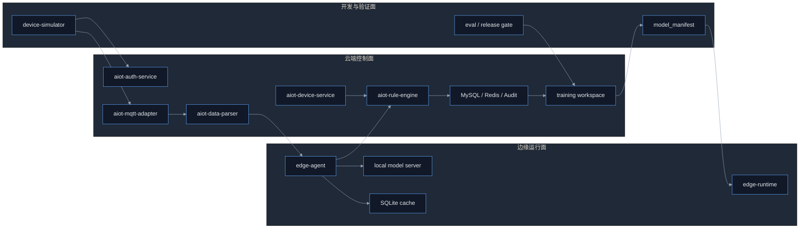

# AIoT 端侧 AI 通用模型与模拟设备落地方案

## Premise / Constraints / Boundaries / Endgame
- Premise：当前项目已具备 `Auth + Device + MQTT Adapter + Rule Engine + Training Workspace` 的主链基础，且已经形成云端 AI 最小闭环、结构化诊断、训练数据导出与持久化迁移能力，但尚未形成真正可运行的 `端侧 AI + 模拟设备 + 统一模型发布` 工程体系。
- Constraints：第一阶段不能自研基础大模型，不能引入多套模型协议，不能让端侧 AI 直接执行高风险写操作，不能破坏现有微服务解耦边界；所有上线动作必须服从现有审计、灰度、回滚和门禁机制。
- Boundaries：本方案聚焦 `边缘网关/开发机级端侧 AI`、`通用模型统一方案`、`模拟设备开发环境`、`端云协同发布机制` 四部分，不展开 MCU 级 TinyML、全自动闭环控制、复杂多模型编排、重型训练平台建设。
- Endgame：在当前仓库内形成一套 `模拟设备可复现 -> 端侧上下文可聚合 -> 本地模型可推理 -> 结果可同步云端 -> 样本可回流训练 -> 模型可灰度发布` 的端侧 AI 工程体系，并为未来独立拆分 `edge runtime` 与 `ai service` 预留边界。

---

## 1. 结论先行

### 1.1 方案核心结论
- 端侧 AI 采用 `边缘运行面 + 云端控制面 + 统一模型协议` 三层架构。
- 模型方案只收敛一套，推荐使用 `Qwen Instruct` 体系，端云共享同一 Prompt、同一 Schema、同一评估集、同一版本清单。
- 端侧推理通过 OpenAI-compatible 接口接入，直接复用当前仓库已存在的 `LlmClient + Schema Validator + Prompt Registry` 设计。
- 工程开发阶段不接真实硬件，优先建设 `模拟设备模块`，通过真实鉴权、真实 MQTT、真实事件链路跑通开发闭环。
- 现阶段最大工程缺口不是模型本身，而是 `aiot-data-parser` 服务端能力未真正落地，必须优先补齐标准化解析与知识切片入口。

### 1.2 本期只做什么
- 只做 `边缘网关/开发机` 级端侧 AI，不做 MCU 级部署。
- 只做 `低风险诊断、摘要、分类、建议`，不做高风险自动执行。
- 只做一套统一模型协议，不做多模型竞赛和复杂调度。
- 只做三类核心场景：
- `OFFLINE_FLAP`
- `PROVISION_FAILURE`
- `SHADOW_DIFF`

### 1.3 本期不做什么
- 不自研基础大模型。
- 不建设在线 RLHF 平台。
- 不让端侧模型绕过权限或审批。
- 不在 `training/` 中承载在线推理服务。

---

## 2. 当前基线与缺口

### 2.1 当前已具备的能力
- 云端 AI 编排中枢已存在：`aiot-rule-engine`
- 统一模型调用抽象已存在：`aiot-common` 内 `LlmClient`
- 结构化输出校验已存在：`AiSchemaValidator`
- Prompt 版本治理已存在：`PromptRegistry`
- 设备上下文聚合入口已存在：`aiot-device-service` 内部 AI context 接口
- 训练工作区已独立：`training/`
- AI 样本持久化与迁移门禁已存在：`ai_diagnosis_record`、`ai_feedback_record`、`ai_case_library`

### 2.2 当前关键缺口
- 没有真实可运行的端侧运行时模块。
- 没有独立的模拟设备工程模块。
- 没有模型包发布清单与端侧拉取机制。
- `aiot-data-parser` 尚未成为真正的标准化解析服务。
- 端侧与云端缺少统一的 `schemaVersion / promptVersion / modelVersion` 协议治理。

### 2.3 当前最核心矛盾
- 云端 AI 主链已有基础，但端侧运行面为空。
- 训练与评估工作区已有基础，但模型产物还没有发布到端侧的机制。
- 设备接入主链存在，但模拟开发环境仍停留在脚本和局部测试层。

---

## 3. 总体架构

### 3.1 架构原则
- `统一模型协议`：端云都走 OpenAI-compatible + JSON Schema。
- `统一输出契约`：所有 AI 输出必须是结构化 JSON，不允许自由文本直接进入业务主链。
- `运行面与训练面分离`：在线推理在 `edge runtime`，离线训练和 Eval 在 `training/`。
- `边界可剥离`：端侧模块必须独立工作区，不与现有 Java Reactor 强耦合。
- `高风险操作上收云端`：端侧只提供判断与建议，动作执行必须经云端规则或人工审批。

### 3.2 总体架构图



### 3.3 主链路
- 模拟设备通过真实 `Provision + EMQX + MQTT` 链路接入。
- `aiot-mqtt-adapter` 接收上行消息并转交 `aiot-data-parser`。
- `aiot-data-parser` 输出标准事件、属性、影子偏差和知识切片触发。
- `edge-agent` 聚合本地上下文，执行规则前置和本地模型推理。
- 推理结果通过统一 JSON Schema 校验后，回写本地缓存并同步云端 `rule-engine`。
- 云端完成审计、反馈、案例沉淀、训练数据导出和模型版本发布。

---

## 4. 通用模型统一方案

### 4.1 模型路线
- 统一模型家族选择 `Qwen Instruct`。
- 端侧运行模型建议：
- `1.5B / 3B instruct`
- `GGUF int4`
- `llama.cpp server`
- 云端运行模型建议：
- `7B / 8B instruct`
- `vLLM` 或兼容 OpenAI gateway

### 4.2 统一协议
- 推理协议统一为 `OpenAI-compatible REST API`。
- 输出协议统一为 `JSON Schema + schemaVersion`。
- Prompt 协议统一为 `promptVersion`。
- 模型版本统一为 `modelVersion`。
- 发布清单统一为 `model_manifest.json`。

### 4.3 统一约束
- 端云必须共用同一份场景定义和输出结构。
- 端云必须共用同一份评估集和门禁标准。
- 端云必须支持同一套回退策略：`模型失败 -> 规则链 -> 云端兜底`。
- 高风险动作只能由云端审批后执行，端侧禁止直接落控制链。

### 4.4 统一输出字段
- `sceneType`
- `summary`
- `rootCauseCategory`
- `confidence`
- `evidence`
- `recommendedActions`
- `ruleDraftable`
- `riskLevel`
- `actionRequired`

---

## 5. 模块落位方案

### 5.1 复用现有模块
- `aiot-common`：继续承载 `LlmClient`、`PromptRegistry`、`AiSchemaValidator`。
- `aiot-rule-engine`：继续承担云端 AI 编排中枢、知识召回、审计落库、复杂场景兜底。
- `aiot-device-service`：继续提供设备主数据、物模型、影子摘要、设备运行上下文。
- `training/`：继续承担数据导出、Eval、微调、模型打包、回归门禁。

### 5.2 必须补齐的存量模块
- `aiot-data-parser` 必须补成真实服务。
- 核心职责：
- `MQTT 上行消息标准化`
- `物模型字段映射`
- `事件分类`
- `影子偏差识别`
- `知识切片重建触发`

### 5.3 新增模块
- `edge/aiot-edge-agent`
- `edge/aiot-edge-runtime`
- `edge/device-simulator`
- `edge/contracts`
- `edge/tests`

### 5.4 模块职责
- `aiot-edge-agent`：订阅本地事件、聚合上下文、执行规则前置、调用本地模型、同步结果。
- `aiot-edge-runtime`：封装本地模型服务、模型目录、版本清单、健康检查。
- `device-simulator`：模拟设备入网、上报、抖动、影子偏差、配网失败和弱网。
- `edge/contracts`：定义端云共享 schema、manifest、prompt 模板。
- `edge/tests`：承载端侧 E2E、断网恢复、降级、性能回归验证。

---

## 6. 端云职责切分

### 6.1 端侧负责
- 毫秒级设备事件接收
- 本地特征提取
- 轻量诊断
- 离线缓冲
- 弱网继续运行
- 结果补传

### 6.2 云端负责
- 知识库构建
- 复杂推理
- 模型训练与版本管理
- 审计与回放
- 灰度发布
- 回滚与治理

### 6.3 存储策略
- 端侧本地缓存统一使用 `SQLite`。
- 云端主数据与审计继续使用 `MySQL + Redis`。
- 端侧本地至少保存：
- `事件队列`
- `shadow 快照`
- `模型版本`
- `待同步诊断结果`
- `失败重试记录`

---

## 7. 模拟设备开发方案

### 7.1 建设目标
- 提供一个可持续运行、可脚本化编排、可重复复现场景的模拟设备模块。
- 所有开发联调必须优先通过模拟设备完成，而不是依赖真实硬件。

### 7.2 模拟设备能力范围
- 上线/离线
- 属性上报
- 事件上报
- desired/reported 偏差
- 配网失败
- 弱网与抖动

### 7.3 模拟设备原则
- 必须走真实鉴权链路，不允许绕过 `ProvisionController` 与 `EmqxAuthController`。
- 必须走真实 MQTT 接入，不单独造测试消息总线。
- 每个模拟设备使用一份 `device_profile.yaml` 描述：
- `productKey`
- `thingModel`
- `telemetryTemplate`
- `failureProfile`
- `networkProfile`
- `firmwareVersion`

### 7.4 最小场景包
- `OFFLINE_FLAP`
- `PROVISION_FAILURE`
- `SHADOW_DIFF`

---

## 8. 边缘运行时设计

### 8.1 edge-agent 主流程
- 接收标准化事件。
- 查询本地缓存和设备画像。
- 执行确定性规则前置。
- 决定是否调用本地模型。
- 校验 JSON Schema。
- 输出诊断结果。
- 本地落队并异步同步云端。

### 8.2 降级策略
- 本地模型超时。
- 本地模型不可用。
- Schema 校验失败。
- 上下文缺失。
- 以上任一情况触发：
- `优先规则链`
- `必要时转云端 rule-engine 兜底`

### 8.3 断网策略
- 断网期间结果必须本地入队。
- 恢复联网后按顺序补传。
- 诊断记录必须具备幂等键，防止重复写入。

---

## 9. 数据与发布链路

### 9.1 数据回流
- 端侧诊断结果同步到云端 `ai_diagnosis_record`。
- 人工采纳与修正同步到 `ai_feedback_record`。
- 高质量结果沉淀到 `ai_case_library`。
- `training/` 继续从上述表中导出数据，构建 SFT / Eval 样本。

### 9.2 模型产物链路
- `training/` 完成微调与评估。
- 产出量化模型包与 `model_manifest.json`。
- 发布清单下发到端侧 `edge-runtime`。
- 端侧按 `product / firmware / site` 维度执行灰度。

### 9.3 发布控制字段
- `modelVersion`
- `promptVersion`
- `schemaVersion`
- `productScope`
- `firmwareScope`
- `rolloutPercent`
- `fallbackVersion`

---

## 10. 工程目录建议

### 10.1 新目录结构

```text
edge/
  agent/
  runtime/
  simulator/
  contracts/
  tests/
```

### 10.2 目录职责
- `agent/`：端侧主程序与同步链路
- `runtime/`：模型服务、模型清单、启动脚本
- `simulator/`：模拟设备与场景编排
- `contracts/`：共享 schema、manifest、prompt 契约
- `tests/`：E2E、弱网、降级、性能回归

---

## 11. 实施顺序

### 11.1 P0：冻结契约
- 定义标准事件 JSON
- 定义诊断输出 JSON Schema
- 定义 `model_manifest.json`
- 定义模拟设备画像格式

### 11.2 P1：补齐 parser
- 落地 `aiot-data-parser`
- 打通 `mqtt-adapter -> parser -> 标准事件`

### 11.3 P2：建设模拟设备
- 落地 `edge/device-simulator`
- 打通 `模拟设备 -> EMQX -> auth -> adapter -> parser`

### 11.4 P3：建设端侧代理
- 落地 `edge/aiot-edge-agent`
- 打通 `规则前置 + 本地缓存 + 结果同步`

### 11.5 P4：接入本地模型
- 接入 `llama.cpp server`
- 接入 `1.5B / 3B quant model`
- 完成 Schema 校验与降级兜底

### 11.6 P5：打通数据回流
- 同步端侧诊断结果到云端
- 打通反馈与案例沉淀

### 11.7 P6：打通训练发布
- 打通 `导出 -> Eval -> QLoRA -> 量化 -> manifest -> 端侧拉取`

### 11.8 P7：灰度发布
- 按产品、固件、站点做灰度
- 严禁一次性全量切换

---

## 12. 验收门禁

### 12.1 功能门禁
- 三类核心场景全部闭环通过。
- 模拟设备可以稳定复现目标场景。
- 端侧结果可同步云端并落审计。

### 12.2 协议门禁
- JSON Schema 通过率 `>= 99%`
- parser 标准化字段覆盖率 `>= 95%`

### 12.3 性能门禁
- 开发机端侧推理 `p95 < 1.5s`
- 目标边缘设备推理 `p95 < 3s`
- 端侧常驻内存 `<= 4GB`

### 12.4 可靠性门禁
- 断网 30 分钟补传成功率 `>= 99.9%`
- 重复写入去重正确率 `100%`
- 模型失败自动降级不阻塞设备主链

### 12.5 安全门禁
- 端侧不保存敏感明文凭证
- 模型包与 manifest 必须签名校验
- 高风险动作必须经云端审批

### 12.6 运营门禁
- 每次模型发布必须附带 Eval 报告
- 每次模型发布必须附带回滚版本
- 每次模型发布必须标注适用产品与风险等级

---

## 13. 最小可交付定义

- 一份统一模型协议：`OpenAI-compatible + JSON Schema`
- 一个新工作区：`edge/`
- 两个新增模块：`aiot-edge-agent`、`device-simulator`
- 一个补齐模块：`aiot-data-parser`
- 一条完整闭环：
- `模拟设备 -> EMQX -> parser -> edge-agent -> 本地模型 -> 云端审计/训练回流`
- 一套发布闭环：
- `training 导出 -> 微调/量化 -> manifest -> 端侧拉取 -> 灰度 -> 回滚`

---

## 14. 决策红线

- 不做 MCU 级端侧 AI。
- 不做多模型并行竞赛。
- 不把端侧模型直接接入高风险动作链。
- 不把端侧运行逻辑和云端 `rule-engine` 强耦合。
- 不把在线推理塞进 `training/`。
- 不在没有模拟设备和门禁指标前直接上真实硬件。
