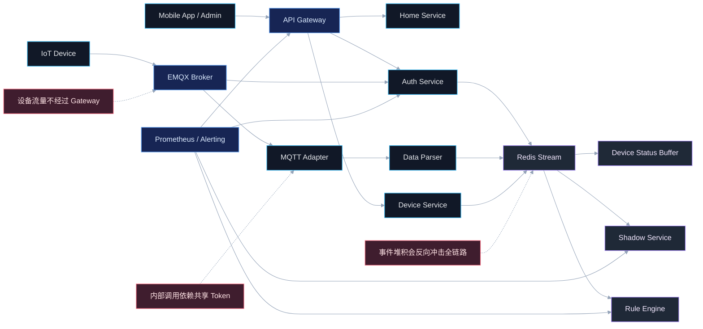
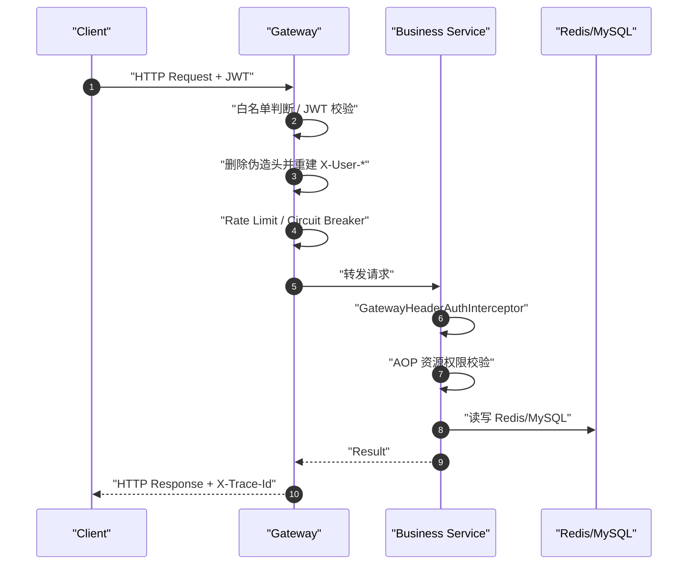
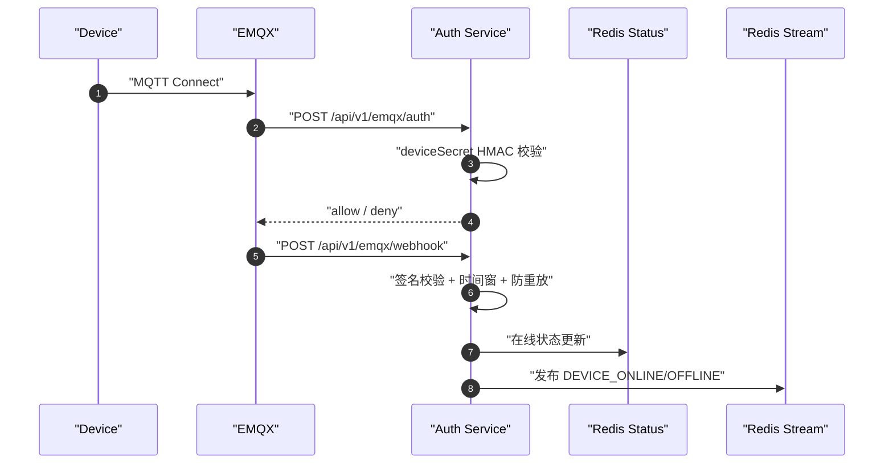
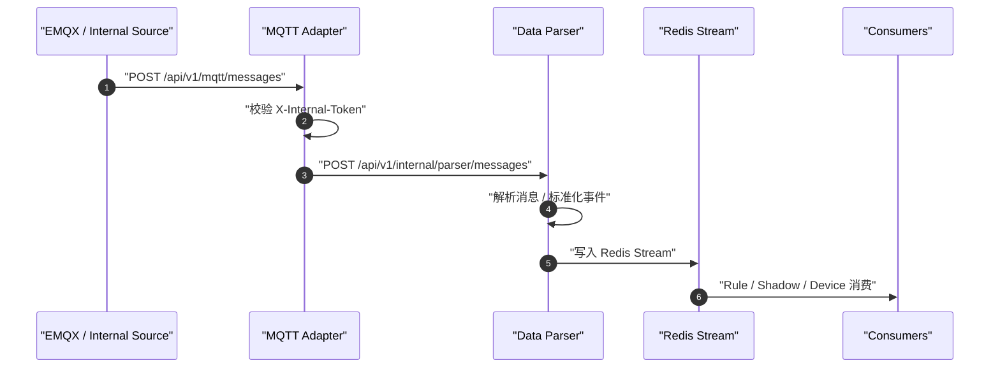
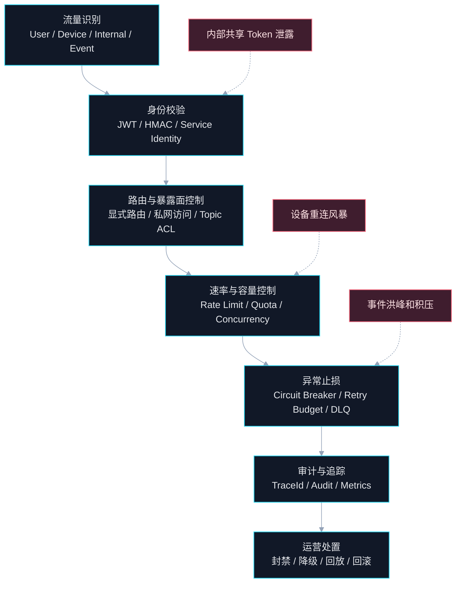

# AIOT 网关流量全景拆解、治理与风控方案

## 文档定位

- 目标：从 `Gateway` 视角，对当前 `AIOT-java` 系统中的流量进行系统性、全维度拆解，明确哪些流量真正经过网关，哪些流量绕过网关但必须纳入统一治理。
- 适用对象：架构 Owner、平台负责人、网关负责人、设备接入负责人、运维负责人。
- 输出原则：只基于仓库中的代码、配置、部署编排和已有文档事实，不臆造未实现能力。

## Premise

- 当前系统已经形成两条主流量面：
  - `用户 API 面`：`App/Admin -> aiot-gateway -> 业务微服务`
  - `设备接入面`：`Device -> EMQX -> aiot-auth-service / aiot-mqtt-adapter -> data-parser -> Redis Stream -> 下游消费者`
- `aiot-gateway` 已经承担用户流量统一入口、JWT 校验、身份头重建、限流、熔断和显式路由收口。
- 设备接入主链路并不直接走 `aiot-gateway` 数据面，而是由 `EMQX + aiot-auth-service` 承担设备认证与接入事件处理。

## Constraints

- 用户 JWT 校验必须保持在 `Gateway`，不能下沉到各业务服务重复实现。
- 设备鉴权必须保持在 `aiot-auth-service`，设备状态事件必须通过 `Redis Stream` 异步分发。
- 内部调用当前依赖 `X-Internal-Token`，属于共享密钥信任模型。
- 高并发状态变更必须经过 `Redis Buffer / Stream` 平滑处理，不能直接同步打穿 MySQL。

## Boundaries

- In Scope：
  - 用户 API 流量
  - 设备接入与设备消息流量
  - 服务间内部流量
  - 事件总线流量
  - 观测与运维流量
  - 网关侧治理与风险控制方案
- Out of Scope：
  - 云厂商 WAF/CDN 具体产品选型
  - 终端 App SDK 细节
  - 完整零信任平台与 Service Mesh 生产落地细节

## Endgame

- 形成一套清晰的流量治理模型：`谁进来`、`从哪进来`、`带什么身份`、`走哪条路由`、`消耗什么资源`、`在哪一级被拦截或放行`、`异常如何止损`、`全链路如何留痕`。
- 最终目标不是只“看见流量”，而是把流量变成可分层治理、可限额、可审计、可回滚的经营控制面。

## 一页结论

| 维度 | 当前事实 | 结论 |
| --- | --- | --- |
| 北向用户流量 | 统一经过 `aiot-gateway` | 网关已是用户 API 唯一控制点 |
| 南向设备接入流量 | 不经过 `aiot-gateway`，经 `EMQX -> auth-service` | 设备面与用户面是两套入口面，不能混治 |
| 东西向内部流量 | 依赖 `X-Internal-Token` | 已有最小信任，但仍属弱信任模型 |
| 事件流量 | 统一汇入 `Redis Stream` | 事件链路已形成系统“数据中枢” |
| 网关治理能力 | 已有路由、JWT、限流、熔断、头清洗 | 基础治理骨架已落地 |
| 核心风险缺口 | 多租户、黑名单、内部强身份、分层限流、设备面统一配额 | 当前最大问题不是没有治理，而是治理颗粒度不够细 |

## 1. 系统流量全景

### 1.1 流量分层定义

| 层级 | 流量类型 | 主入口 | 主要协议 | 当前控制点 |
| --- | --- | --- | --- | --- |
| L1 北向用户流量 | App/管理端访问业务 API | `aiot-gateway` | HTTP/HTTPS | JWT、白名单、路由、限流、熔断 |
| L2 南向设备接入流量 | 设备连接认证与上下线通知 | `EMQX -> aiot-auth-service` | MQTT + HTTP Webhook | 一机一密、HMAC、防重放 |
| L3 南向设备消息流量 | 设备业务消息入站 | `EMQX/设备侧 -> aiot-mqtt-adapter -> aiot-data-parser` | HTTP 内部接口 | `X-Internal-Token` |
| L4 东西向内部流量 | 微服务间调用 | `/api/v1/internal/**` | HTTP | `X-Internal-Token` + Header 契约 |
| L5 事件流量 | 设备事件、影子事件、规则事件 | `Redis Stream` | Stream / PubSub | ACK、Retry、DLQ、Pending Recovery |
| L6 运维观测流量 | 健康检查、指标抓取、告警 | `Actuator / Prometheus` | HTTP | 健康探针、Metrics、告警规则 |

### 1.2 总体流量架构图

## 2. 从网关视角拆解系统流量

### 2.1 网关真正承接的流量

- `用户登录/注册流量`：白名单放行，但仍经过 `aiot-gateway` 路由收口。
- `用户业务访问流量`：包括 `devices / ota / provision / users / homes / rooms` 等 API。
- `部分鉴权流量`：`/api/v1/emqx/auth` 与 `/api/v1/emqx/webhook` 已在网关配置路由和白名单，说明如果设备侧 Webhook 从统一域名进入，也可被网关承接。
- `内部转发的 north-south API 流量`：网关会在转发前清洗伪造头，并重建可信身份头。

### 2.2 不经过网关但必须纳入网关级治理口径的流量

- `设备 MQTT 连接流量`：设备直接连 `EMQX 1883/8083`，不经 `aiot-gateway`。
- `EMQX 到 auth-service 的设备认证/上下线回调流量`：控制点在 `aiot-auth-service`，不是网关 JWT 控制点。
- `MQTT Adapter -> Data Parser` 内部流量：通过 `X-Internal-Token` 约束，不经过 `aiot-gateway`。
- `Redis Stream` 事件分发流量：属于系统内部数据面，无法由网关直接限流。

### 2.3 核心判断

- 当前系统并不存在“所有流量都经过 API Gateway”的事实。
- 当前真实结构是 `双入口面 + 一条统一事件总线`：
  - 用户面由 `Gateway` 治理
  - 设备面由 `EMQX/Auth` 治理
  - 事件面由 `Redis Stream` 治理
- 因此，网关治理必须升级为“统一流量治理控制面”，而不是误判为“唯一入口数据面”。

## 3. 网关流量的全维度拆解

### 3.1 按入口维度拆解

| 入口 | 典型路径 | 主要主体 | 当前认证 | 当前稳定性控制 | 风险重点 |
| --- | --- | --- | --- | --- | --- |
| 用户开放 API | `/api/v1/users/**` `/api/v1/homes/**` `/api/v1/devices/**` | App / Admin | JWT | 限流 + 熔断 | 撞库、刷接口、越权 |
| 设备鉴权入口 | `/api/v1/emqx/auth` | EMQX | 一机一密 | auth 路由限流 + 熔断 | 爆破、伪造设备、密钥泄露 |
| 设备 Webhook 入口 | `/api/v1/emqx/webhook` | EMQX | HMAC + 时间窗 + 防重放 | auth 路由限流 + 熔断 | 重放、伪造、事件洪峰 |
| 内部接口入口 | `/api/v1/internal/**` | 微服务 | `X-Internal-Token` | 下游自保 | 内部横向渗透、共享密钥扩散 |
| 观测入口 | `/actuator/**` `/prometheus` | 运维系统 | 白名单 | 无业务限流 | 暴露面、指标枚举 |

### 3.2 按协议维度拆解

| 协议 | 载体 | 当前使用位置 | 主要控制点 | 当前缺口 |
| --- | --- | --- | --- | --- |
| HTTP/HTTPS | 用户 API、Webhook、内部接口 | Gateway、Auth、Parser | JWT、Token、路由、限流 | 缺 API 签名、租户级配额 |
| MQTT | 设备连接与业务消息 | Device -> EMQX | 一机一密、Topic 侧策略依赖 Broker | 缺统一设备黑名单和连接配额视图 |
| Redis Stream | 事件总线 | Auth/Parser/Rule/Shadow/Device | ACK、Retry、DLQ、Pending Recovery | 缺事件优先级、租户隔离、配额模型 |

### 3.3 按身份维度拆解

| 身份类型 | 当前载体 | 当前验证点 | 风险 |
| --- | --- | --- | --- |
| 用户身份 | `Authorization: Bearer` | `aiot-gateway` | 令牌泄露、撞库、越权 |
| 网关透传身份 | `X-User-Id` `X-User-Phone` | 网关清洗后下发，下游拦截器验证 | 头伪造、绕过网关直打服务 |
| 服务身份 | `X-Internal-Token` | 各服务内部接口 | 共享密钥失陷后横向风险大 |
| 设备身份 | `deviceId + HMAC(clientId, secret)` | `aiot-auth-service` | 设备密钥泄露、批量爆破 |
| Webhook 身份 | `x-emqx-signature` | `aiot-auth-service` | 重放攻击、伪造源 |

### 3.4 按资源维度拆解

| 资源类型 | 主要消耗方 | 容量冲击方式 | 当前保护 |
| --- | --- | --- | --- |
| Gateway 线程/连接 | 用户 API 洪峰 | 登录风暴、批量刷新、恶意扫描 | 路由限流、熔断 |
| Auth Service CPU/Redis | Webhook 洪峰、设备认证洪峰 | 大规模设备重连 | 限流、签名拒绝、防重放 |
| Redis | 状态缓存、Stream、幂等键 | 事件堆积、热点 Key、重试风暴 | Buffer、DLQ、Pending Recovery |
| MySQL | 设备主数据、家庭数据 | 高并发状态落库、慢查询放大 | 由 Redis Buffer 削峰 |
| Rule Engine | 事件消费与动作执行 | 规则风暴、下游动作失控 | 幂等、重试、告警 |

### 3.5 按路径拓扑拆解

#### 路径 A：用户业务 API 流量

#### 路径 B：设备接入认证与状态事件流量

#### 路径 C：设备消息入站流量

## 4. 当前网关治理能力盘点

### 4.1 已落地能力

| 能力 | 当前实现 | 结论 |
| --- | --- | --- |
| 显式路由收口 | `spring.cloud.gateway.routes` | 已避免服务自动暴露 |
| 白名单治理 | `GatewaySecurityConfig.WHITELIST` | 已区分匿名入口与受保护入口 |
| JWT 统一认证 | `JwtReactiveAuthenticationManager` | 用户身份校验已集中 |
| 请求头防伪造 | `GatewayUserHeaderGlobalFilter` | 已防止客户端伪造 `X-User-*` |
| 基础限流 | `RequestRateLimiter + Redis` | 已具备最小防刷能力 |
| 熔断隔离 | `CircuitBreaker` | 已具备最小故障隔离能力 |
| Metrics 暴露 | `Actuator + Prometheus` | 已有网关运行态可观测基础 |

### 4.2 控制点展开

| 控制层 | 控制点 | 当前动作 | 价值 |
| --- | --- | --- | --- |
| 身份层 | JWT | 非白名单一律鉴权 | 阻止匿名访问 |
| 头治理层 | Header Rebuild | 删除伪造头，重建可信头 | 阻止身份注入 |
| 路由层 | 显式 Path 路由 | 固定服务暴露面 | 控制攻击面 |
| 速率层 | Redis Rate Limiter | 按 `path + userId/ip` 限流 | 降低刷流量与雪崩 |
| 可用性层 | Circuit Breaker | 核心服务熔断 | 防止依赖拖垮入口 |
| 观测层 | Prometheus | 输出健康与请求指标 | 提供告警基础 |

## 5. 风险图谱

### 5.1 用户 API 面风险

| 风险 | 触发方式 | 当前防线 | 缺口 |
| --- | --- | --- | --- |
| 登录撞库/爆破 | 高频登录尝试 | 网关限流 | 缺账号维度限流与验证码/阶梯惩罚 |
| 越权访问 | 伪造用户头、直接打服务 | 网关清头、下游拦截器 | 缺服务间强身份与网段隔离说明 |
| 热点接口打爆 | 批量查询设备、房屋数据 | 路由限流、熔断 | 缺租户级和业务动作级配额 |
| 令牌滥用 | 长期复用 JWT | JWT 基础校验 | 缺设备绑定、风险评分、会话撤销闭环 |

### 5.2 设备接入面风险

| 风险 | 触发方式 | 当前防线 | 缺口 |
| --- | --- | --- | --- |
| 设备凭证爆破 | 枚举 `deviceId` 与签名 | 一机一密 | 缺设备黑名单、失败阈值封禁 |
| 重放攻击 | 重放 Webhook | HMAC + 时间窗 + SETNX | 缺来源 IP 白名单与签名轮换机制 |
| 重连风暴 | 大批量设备同时重连 | auth 路由限流、异步事件流 | 缺连接配额、分组节流、设备分层策略 |
| 被禁设备继续接入 | 设备状态变更未前置阻断 | 现有文档要求但链路不闭环 | 缺设备禁用直连认证拦截 |

### 5.3 内部流量面风险

| 风险 | 触发方式 | 当前防线 | 缺口 |
| --- | --- | --- | --- |
| 内部 Token 泄露 | 配置泄漏、日志泄漏 | `X-Internal-Token` 校验 | 共享密钥模型，横向访问面大 |
| 伪造内部调用 | 绕过网关直打内部接口 | Internal Token | 缺 mTLS、服务签名、最小授权 |
| 内部重试风暴 | 下游故障导致上游重试累积 | Cross-service executor + 熔断 | 缺统一超时预算与并发隔离 |

### 5.4 事件流量面风险

| 风险 | 触发方式 | 当前防线 | 缺口 |
| --- | --- | --- | --- |
| Stream 积压 | 消费跟不上生产 | Pending Recovery、告警 | 缺优先级队列与流量削峰阈值 |
| DLQ 增长 | 消费异常、解析失败 | DLQ + 告警 | 缺自动分流与回放策略模板 |
| 规则风暴 | 一次事件触发大量动作 | 幂等、审批状态 | 缺规则分级、灰度、动作预算 |
| Redis 热 Key | 状态/影子集中访问 | 缓冲与异步落库 | 缺热点拆分与容量上限治理 |

## 6. 治理方案设计

### 6.1 设计原则

- 不是把所有流量都拉到 `Gateway`，而是把所有流量都纳入统一治理口径。
- 用户面强调 `认证、授权、限流、审计`。
- 设备面强调 `接入鉴别、连接配额、防重放、黑名单`。
- 内部面强调 `强身份、超时预算、重试预算、最小暴露`。
- 事件面强调 `削峰、幂等、优先级、死信治理、可回放`。

### 6.2 目标治理模型

### 6.3 分层治理动作

| 层级 | 当前基线 | 建议增强 |
| --- | --- | --- |
| L1 身份治理 | JWT、一机一密、Webhook 签名、Internal Token | 引入服务身份签名或 mTLS，设备禁用前置拦截 |
| L2 暴露面治理 | 网关显式路由、白名单 | 私网隔离内部接口，Actuator 仅监控网段可见 |
| L3 流量治理 | 路由限流、熔断 | 增加账号级、租户级、设备级、Topic 级配额 |
| L4 稳定性治理 | Retry、DLQ、Pending Recovery | 引入 Retry Budget、并发舱壁、事件优先级 |
| L5 审计治理 | TraceId、Prometheus、局部审计 | 建立统一审计归档和风险事件台账 |
| L6 运营治理 | 告警、工单、回滚文档 | 建立自动封禁、自动降级、自动回放策略库 |

## 7. 风控方案

### 7.1 用户 API 风控

- 对 `login/register/provision` 引入更细粒度的 `账号 + IP + 设备指纹` 三维限流。
- 对高价值接口增加 `行为签名` 或 `一次性挑战`，避免仅依赖 JWT。
- 对热点查询接口引入 `读缓存 + 降级响应 + 并发上限`，防止被拖垮。
- 对越权高风险路径建立审计规则，按 `userId / traceId / resourceId` 留痕。

### 7.2 设备接入风控

- 在设备认证前增加 `deviceStatus` 检查，支持 `disabled / blocked / revoked` 直接拒绝连接。
- 按 `productKey / deviceGroup / sourceIp / clientId` 建立接入配额和封禁能力。
- 对重放与爆破失败建立滑动窗口计数器，超过阈值自动拉黑源 IP 或设备。
- 对大规模重连场景引入“分批重连窗口”和 Broker 连接数预算。

### 7.3 内部调用风控

- 将共享 `X-Internal-Token` 升级为 `服务签名 + 时间戳 + nonce`，再逐步演进到 `mTLS`。
- 所有 `/api/v1/internal/**` 只允许内网访问，禁止暴露公网入口。
- 给跨服务调用增加统一的 `timeout budget / retry budget / circuit breaker` 配置基线。
- 对高风险内部接口建立 `caller -> callee -> action` 调用审计。

### 7.4 事件总线风控

- 将 `Redis Stream` 事件按类型分层：`状态事件 / 控制事件 / 审计事件 / 高优动作事件`。
- 为每类事件定义 `最大堆积阈值、回放策略、降级策略、保留时长`。
- 对规则引擎动作加入 `执行预算`，避免单条事件触发无限外部动作。
- 建立 `DLQ -> 诊断 -> 回放` 标准流程，避免死信长期堆积。

## 8. 现阶段最该优先补的缺口

| 优先级 | 缺口 | 影响 |
| --- | --- | --- |
| P0 | 把设备面、用户面、事件面的流量治理口径统一成一张控制图 | 当前治理是分段的，管理上不可统一闭环 |
| P0 | 设备禁用/黑名单接入认证前置阻断 | 无法对高风险设备即时止损 |
| P0 | 内部共享 Token 升级为强身份机制 | 内部横向渗透风险最大 |
| P1 | 网关限流从 `path + ip/userId` 升级到账号/租户/设备分层 | 现有限流颗粒度偏粗 |
| P1 | 事件流量建立优先级和容量预算 | Redis Stream 成为潜在系统性瓶颈 |
| P1 | 审计统一归档 | 当前追责和长期分析能力不足 |
| P2 | 引入规则分级、灰度和动作预算 | 自动化运营放量后风险会快速上升 |

## 9. 推荐落地顺序

### Sprint 1：先把“入口与身份”收紧

- 统一绘制 `用户面 / 设备面 / 内部面 / 事件面` 流量台账。
- 网关补齐账号级和租户级限流策略。
- 设备认证前增加 `disabled/blocked` 检查。
- 内部接口全部收敛到私网访问策略。

### Sprint 2：把“配额与止损”做起来

- 设备接入建立 `device/product/group/ip` 四层配额。
- Stream 建立积压阈值、降级阈值和回放机制。
- 高风险接口接入封禁、熔断、降级模板。

### Sprint 3：把“审计与自动化”闭环

- 统一沉淀风险事件审计表或审计仓。
- 建立自动封禁、自动恢复、人工复核的标准流程。
- 将关键治理指标接入发布门禁和运行门禁。

## 10. 建议的核心指标

| 指标 | 说明 | 建议门限 |
| --- | --- | --- |
| Gateway 4xx/5xx 比例 | 用户 API 面异常 | 按接口分层监控 |
| Login/Auth 限流触发率 | 攻击或误伤信号 | 日环比异常即排查 |
| EMQX Auth Success Rate | 设备接入成功率 | 明显下滑即止损 |
| Webhook Replay Reject Count | 重放攻击信号 | 连续上升即封禁来源 |
| Redis Stream Lag | 事件链路健康度 | 超阈值触发降级 |
| DLQ Growth Rate | 处理失败趋势 | 持续增长必须介入 |
| Internal Unauthorized Count | 内部伪造或配置错误 | 非零即高优先级排查 |

## 11. 总结

- 当前系统的流量结构不是单一网关模型，而是 `Gateway 用户面 + EMQX/Auth 设备面 + Redis Stream 事件面` 的三段式结构。
- `aiot-gateway` 已具备用户 API 的最小治理闭环，但还没有升级成覆盖全系统流量的统一控制面。
- 真正需要优先收敛的不是“再加一层网关”，而是：
  - 把用户、设备、内部、事件四类流量统一归口治理
  - 把设备禁用、黑名单、内部强身份、分层限流、事件配额做成硬门禁
  - 把治理指标和审计记录接到运行与发布闭环

## 12. 主要证据索引

- `aiot-gateway/src/main/resources/application.yml`
- `aiot-gateway/src/main/java/com/aiot/gateway/config/GatewaySecurityConfig.java`
- `aiot-gateway/src/main/java/com/aiot/gateway/config/GatewayRateLimitConfig.java`
- `aiot-gateway/src/main/java/com/aiot/gateway/security/GatewayUserHeaderGlobalFilter.java`
- `aiot-common/src/main/java/com/aiot/common/security/GatewayHeaderAuthInterceptor.java`
- `aiot-common/src/main/java/com/aiot/common/config/TraceIdFilter.java`
- `aiot-auth-service/src/main/java/com/aiot/auth/controller/EmqxAuthController.java`
- `aiot-auth-service/src/main/java/com/aiot/auth/service/impl/AuthServiceImpl.java`
- `aiot-mqtt-adapter/src/main/java/com/aiot/mqtt/controller/MqttIngressController.java`
- `aiot-mqtt-adapter/src/main/java/com/aiot/mqtt/service/impl/MqttIngressServiceImpl.java`
- `aiot-data-parser/src/main/java/com/aiot/data/controller/InternalParserController.java`
- `docker-compose.yml`
