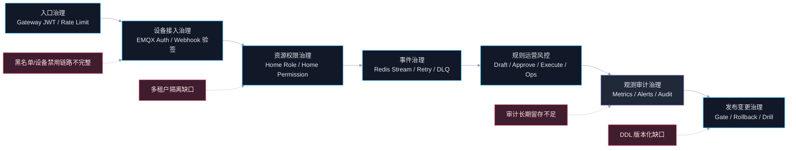
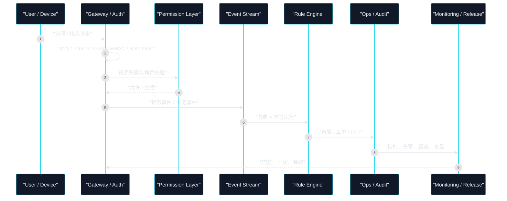

# AIOT 项目治理与风控体系

## 文档定位

- 目标：把项目当前已经落地的治理与风控能力，按“系统化、体系化、结构化”方式沉淀为统一视图。
- 适用对象：架构 Owner、研发负责人、交付负责人、运维负责人。
- 输出口径：只基于当前仓库中的代码、配置、脚本和文档事实，不臆造未实现能力。

## Premise

- `AIOT-java` 当前处于 `MVP 可交付 -> 产品化稳定运营` 过渡期，治理重点不是“做大全”，而是先把高风险链路收敛到可控。
- 当前已形成最小业务闭环：`设备接入 -> 状态事件 -> 规则触发 -> 告警/工单 -> 审计查询`。
- 当前治理体系以 `Spring Security + Gateway + Redis + Prometheus + Runbook` 为主，不是完整的企业级 GRC 平台。

## Constraints

- 项目仍以单节点/轻量微服务为主，资源有限，治理动作必须优先覆盖高风险主链路。
- 设备侧高频状态写入依赖 `Redis` 缓冲与 `Redis Stream` 事件链路，风控设计必须兼顾实时性与幂等性。
- 当前仓库未发现 `Flyway/Liquibase`，数据库变更治理仍以规范文档约束为主，自动化门禁尚未闭环。
- 多租户、黑名单、长期审计留存、服务级强身份信任仍未完整落地。

## Boundaries

- In Scope：身份与访问治理、设备接入风控、资源权限治理、流量与稳定性治理、规则运营风控、观测审计治理、发布变更治理。
- Out of Scope：法务合规条文、财务合规、完整 SOC/等保体系、K8s/Service Mesh 级别平台治理。

## Endgame

- 形成一套可执行的项目治理体系：关键入口有认证、关键动作有授权、关键事件有留痕、关键异常有告警、关键发布可回滚、关键风险有门禁。

## 一页结论

| 维度 | 当前状态 | 结论 |
| --- | --- | --- |
| 身份治理 | 已落地 | 网关 JWT、内部接口 `X-Internal-Token`、设备一机一密已形成三层认证骨架 |
| 权限治理 | 部分落地 | 家庭/设备域已有 AOP + 缓存权限校验，但多租户与全域 RBAC 未完成 |
| 接入风控 | 已落地 | EMQX Webhook 具备签名、时间窗、防重放、事件重试与 DLQ |
| 流量治理 | 已落地 | 网关已启用限流、熔断、显式路由收口，具备基础抗冲击能力 |
| 运营风控 | 已落地 | 规则审批、规则执行幂等、告警/工单/审计闭环已具雏形 |
| 审计治理 | 部分落地 | 审计记录已落 Redis，但缺少长期留存、不可篡改与统一归档 |
| 发布治理 | 部分落地 | 质量门禁、回滚 Runbook、演练模板已成文，但自动化阻断不足 |
| 平台级缺口 | 明显 | 多租户隔离、黑白名单、数据库迁移版本化、服务级强信任仍是主要短板 |

## 总体架构图

## 治理分层模型

| 层级 | 核心问题 | 当前主实现 |
| --- | --- | --- |
| L1 身份层 | 谁可以进来 | 网关 JWT、内部 Token、设备凭证、Webhook 签名 |
| L2 权限层 | 进来后能做什么 | `RequireHomeRoleAspect`、`RequireHomePermissionAspect` |
| L3 稳定层 | 高并发和异常时如何自保 | 网关限流、熔断、重试、DLQ、Pending Recovery 告警 |
| L4 运营层 | 风险事件如何处置闭环 | 规则审批、告警、工单、SLA 检查、审计 |
| L5 交付层 | 变更如何受控 | 治理门禁、SLO、回滚 Runbook、发布演练 |

## 1. 身份与访问治理

### 1.1 用户入口治理

- `aiot-gateway` 是统一入口，白名单外请求一律 `authenticated`。
- 网关侧已关闭动态发现自动暴露，改为显式路由收口，减少“服务意外暴露面”。
- JWT 校验参数已配置 `secret / issuer / audience / require-jti / clock-skew-seconds`，说明用户态令牌治理已具备基础约束。

### 1.2 服务间调用治理

- `aiot-auth-service` 的 `/api/v1/internal/**` 由 `InternalTokenAuthFilter` 保护。
- 通用模块中的 `GatewayHeaderAuthInterceptor` 对内部接口额外校验 `X-Internal-Token`，并对外部请求强制要求 `X-User-Id` 由网关透传。
- 这说明当前服务间信任模型是“共享内部令牌 + 网关透传上下文”，适合 MVP 阶段，但还不是强身份体系。

### 1.3 当前判断

| 子能力 | 状态 | 说明 |
| --- | --- | --- |
| 用户 JWT 统一校验 | 已落地 | 入口集中在网关 |
| 内部接口令牌保护 | 已落地 | `X-Internal-Token` 已形成约束 |
| 服务级身份强校验 | 缺口 | 尚未见 `mTLS`、服务签名、SPIFFE 等机制 |
| 多租户身份边界 | 缺口 | 主要存在于规划和文档层，代码面未见完整模型 |

### 1.4 风险点

- `InternalTokenAuthFilter` 仍采用直接字符串比较，和公共拦截器里的常量时间比较口径不一致。
- 当前内部信任仍是共享密钥模型，一旦内部令牌泄露，横向访问面较大。
- 多租户边界未真正落到鉴权模型，后续 SaaS 化时会成为首要风险。

## 2. 设备接入与接入风控

### 2.1 接入控制链

- 设备认证采用“一机一密”模型，`deviceSecret` 用于计算 `HMAC-SHA256(clientId, secret)`。
- EMQX Webhook 入口具备三道风控：
  - 签名校验
  - 时间窗校验
  - 防重放校验（`SETNX + TTL`）
- Webhook 校验失败默认拒绝，未配置密钥时也默认拒绝，体现“默认不放行”。

### 2.2 事件可靠性风控

- 设备上下线事件先写 Redis 状态，再入 `Redis Stream`。
- 事件发布具备有限重试，重试耗尽后进入 DLQ。
- 该链路属于“接入安全 + 事件可靠性”合并治理，而不是单纯安全校验。

### 2.3 当前判断

| 子能力 | 状态 | 说明 |
| --- | --- | --- |
| 设备一机一密 | 已落地 | 设备接入基线清晰 |
| Webhook 防伪造 | 已落地 | HMAC 校验已实现 |
| Webhook 防重放 | 已落地 | `SETNX + TTL` 已实现 |
| 异常事件兜底 | 已落地 | Retry + DLQ |
| 黑名单/拒绝名单 | 缺口 | 未见独立 `blacklist/denylist` 模块 |
| 设备禁用闭环 | 部分落地 | 文档有要求，设备本体端到端禁用链路尚不完整 |

## 3. 资源权限与数据治理

### 3.1 家庭与设备域权限

- `RequireHomeRoleAspect` 负责家庭域角色校验，角色模型为 `Owner / Admin / Member`。
- `RequireHomePermissionAspect` 负责设备域资源归属校验，可从路径、参数、DTO 中提取 `homeId`，也可反查 `deviceId`、`otaTaskId` 对应的 `homeId`。
- 这说明当前权限治理不是单点 Controller 判断，而是已经抽象成可复用的 AOP 机制。

### 3.2 数据治理规则

- 开发规范明确要求：
  - 涉及 `DELETE/UPDATE` 的接口，AOP 之外还必须做 Service 层资源归属二次校验。
  - 配网 Token/凭证签发必须先通过用户身份和目标家庭权限校验。
  - 密钥必须来自环境变量或密钥系统，禁止硬编码。
  - DDL 变更必须版本化交付。
- 当前问题是“规范已写入文档，但自动化阻断未完全落地”。

### 3.3 当前判断

| 子能力 | 状态 | 说明 |
| --- | --- | --- |
| 家庭角色治理 | 已落地 | 家庭域细粒度控制已实现 |
| 设备资源归属治理 | 已落地 | 设备/OTA 已接入资源鉴权 |
| 数据变更红线 | 已定义 | 开发规范已有 P0/P1 约束 |
| DDL 版本化 | 缺口 | 未发现迁移框架实际接入 |
| 多租户数据隔离 | 缺口 | 设计上存在，运行态未形成统一模型 |

## 4. 流量、稳定性与故障自愈治理

### 4.1 流量治理

- 网关对 `auth-service`、`home-service` 已启用 `RequestRateLimiter`。
- 限流 Key 使用 `ipKeyResolver`，适合当前公网入口的基础防刷与雪崩保护。
- 各核心路由均已挂载 `CircuitBreaker`，说明流量治理和依赖隔离是统一在网关完成的。

### 4.2 可恢复性治理

- `AuthFailureRateHigh`、`StreamConsumeFailureRateHigh`、`DlqGrowthRateHigh`、`PendingRecoveryFailureRateHigh` 四类核心告警已经落地。
- `A06_质量预算与SLO` 已把可用性、性能、可靠性、安全性、可恢复性纳入统一预算。
- 单服务回滚 Runbook 已明确触发条件、RACI、时效标准、结构化留痕要求。

### 4.3 当前判断

| 子能力 | 状态 | 说明 |
| --- | --- | --- |
| 网关限流 | 已落地 | 已覆盖核心高风险入口 |
| 熔断隔离 | 已落地 | 基于 `resilience4j` |
| 事件异常告警 | 已落地 | 已有 Prometheus 规则 |
| 回滚机制 | 已落地 | 脚本 + Runbook 已具备 |
| 自动门禁阻断 | 部分落地 | 更多依赖流程与文档，不是全自动平台门禁 |

## 5. 规则运营与业务风控

### 5.1 规则生命周期治理

- 规则引擎已支持 `draft -> approve -> execute` 生命周期。
- 规则执行只对 `APPROVED` 状态生效，避免草稿直接进入生产运行。
- 规则执行前有幂等锁，使用 `ruleId + eventId` 做执行去重。

### 5.2 运营闭环

- 规则命中后可驱动告警、工单、审计等运营动作。
- 管理接口已提供：
  - 告警查询与确认
  - 工单查询、认领、解决
  - SLA 检查
  - 审计查询
  - 运营总览
- 这意味着项目已具备“发现风险 -> 生成处置对象 -> 执行处置 -> 留痕回看”的最小闭环。

### 5.3 当前判断

| 子能力 | 状态 | 说明 |
| --- | --- | --- |
| 规则审批发布 | 已落地 | 草稿和审批状态清晰 |
| 规则执行幂等 | 已落地 | Redis 幂等键控制重复执行 |
| 告警与工单闭环 | 已落地 | 运营主链已存在 |
| 规则分级/灰度 | 缺口 | 尚未形成高低风险规则分层治理 |
| 自动化风险策略库 | 缺口 | 目前更偏轻量规则引擎，非完整风控引擎 |

## 6. 观测、审计与追责治理

### 6.1 观测基线

- 各核心服务已接入 `Actuator + Micrometer + Prometheus`。
- 健康探针 `readiness / liveness` 已启用。
- 公共模块已有 `TraceIdFilter`，链路追踪具备最小标识能力。
- 文档已形成“监控现状页 + 告警规则文件 + 演练模板”的三件套。

### 6.2 审计能力

- `AuditRecord` 已作为独立模型存在，支持操作人、目标、详情、`traceId` 等字段。
- `OpsRecordRepository` 已将告警、工单、审计统一存入 Redis。
- 回滚脚本和 Runbook 已要求结构化留痕，具备发布侧审计基础。

### 6.3 当前判断

| 子能力 | 状态 | 说明 |
| --- | --- | --- |
| 指标采集 | 已落地 | 覆盖核心服务 |
| 业务告警 | 已落地 | 4 条关键规则已定义 |
| 审计记录模型 | 已落地 | 规则运营侧已存在 |
| 审计长期归档 | 缺口 | 当前主要存 Redis，持久化与不可篡改不足 |
| 平台级审计统一查询 | 缺口 | 目前更偏 rule-engine 局部能力 |

## 7. 发布、变更与工程治理

### 7.1 发布门禁

- `A07_治理门禁清单` 已把治理要求显式转成发布门禁，包含：
  - 契约治理
  - 身份治理
  - 调用治理
  - 事件治理
  - 发布治理
  - 观测治理
- `A06_质量预算与SLO` 已给出统一预算口径。

### 7.2 变更风险治理

- 回滚 Runbook 已覆盖触发条件、前置检查、RACI、验收标准、结构化留痕。
- 发布演练模板已要求告警触发、回滚、复盘等标准化动作。
- 架构整改 backlog 已把高优先级风险项显式列为 `P1/P2`，说明项目并非无意识演进，而是有风险台账。

### 7.3 当前判断

| 子能力 | 状态 | 说明 |
| --- | --- | --- |
| 发布门禁文档 | 已落地 | 规则已经成文 |
| 回滚机制 | 已落地 | 具备脚本和 Runbook |
| 风险台账 | 已落地 | backlog 已分级 |
| 自动化阻断 | 缺口 | 未完全体现在 CI/CD 强制门禁中 |
| 数据库变更治理 | 缺口 | 缺少版本化迁移框架配套 |

## 关键控制闭环

## 现阶段主要缺口

| 优先级 | 缺口 | 影响 |
| --- | --- | --- |
| P0 | 多租户隔离尚未形成真实运行态边界 | 后续平台化交付时容易出现数据与权限串扰 |
| P0 | 数据库变更缺少版本化迁移框架 | 线上变更不可审计、不可回放、不可稳定回滚 |
| P1 | 内部服务信任仍以共享 Token 为主 | 内部横向访问风险偏高 |
| P1 | 黑名单/拒绝名单机制缺失 | 高风险设备、来源 IP、异常客户端无法快速封禁 |
| P1 | 设备禁用能力未形成接入侧闭环 | 被禁设备可能仍可继续接入或上报 |
| P1 | 审计记录主要驻留 Redis | 长期合规留痕、事后追责、趋势分析能力不足 |
| P2 | 规则分级、灰度、豁免策略未成体系 | 自动化运营放量后风控颗粒度不足 |

## 建议的治理升级顺序

### Sprint 1：补强 P0 基线

- 落地数据库迁移版本化，统一 DDL 变更入口。
- 明确多租户边界落在哪些表、接口、缓存 Key、审计字段。
- 统一内部接口信任模型，至少完成“共享 Token -> 服务签名/双向校验”的升级设计。

### Sprint 2：补强接入与审计风控

- 增加设备/来源维度的黑名单或拒绝名单能力。
- 把设备禁用状态接入认证链路和事件链路，形成真正阻断。
- 将审计记录沉淀到可长期保存的数据存储，并定义留存策略。

### Sprint 3：补强自动化治理

- 把 `A06/A07` 关键门禁接入 CI/CD 阻断。
- 把告警演练、回滚演练纳入版本发布必选项。
- 对规则引擎引入分级、灰度、审批豁免、回滚策略，避免高风险规则直达生产。

## 总结

- 当前项目的治理与风控体系已经不是“空白状态”，而是具备一套可运行的最小闭环。
- 已落地的主干能力集中在 `统一入口鉴权`、`设备接入安全`、`资源权限控制`、`事件可靠性`、`规则运营闭环`、`监控告警`、`回滚治理`。
- 真正的短板不在“有没有规则”，而在“多租户边界、数据库迁移版本化、内部强身份、黑名单、长期审计留存”五个高风险点。
- 如果后续要支撑平台化和规模化交付，治理建设优先级应高于新增功能堆叠。

## 主要证据索引

- 网关安全：`aiot-gateway/src/main/java/com/aiot/gateway/config/GatewaySecurityConfig.java`
- 网关路由与限流：`aiot-gateway/src/main/resources/application.yml`
- 设备认证与 Webhook 风控：`aiot-auth-service/src/main/java/com/aiot/auth/service/impl/AuthServiceImpl.java`
- 内部接口校验：`aiot-auth-service/src/main/java/com/aiot/auth/config/InternalTokenAuthFilter.java`
- 网关身份透传拦截：`aiot-common/src/main/java/com/aiot/common/security/GatewayHeaderAuthInterceptor.java`
- 家庭角色治理：`aiot-home-service/src/main/java/com/aiot/home/aspect/RequireHomeRoleAspect.java`
- 设备资源归属治理：`aiot-device-service/src/main/java/com/aiot/device/aspect/RequireHomePermissionAspect.java`
- 规则生命周期：`aiot-rule-engine/src/main/java/com/aiot/rule/service/RuleLifecycleService.java`
- 运营管理接口：`aiot-rule-engine/src/main/java/com/aiot/rule/controller/OpsAdminController.java`
- 审计/告警/工单存储：`aiot-rule-engine/src/main/java/com/aiot/rule/repository/OpsRecordRepository.java`
- 告警规则：`monitoring/prometheus/alerts/aiot-observability-rules.yml`
- 发布门禁：`docs/architecture-deliverables/A07_治理门禁清单.md`
- SLO：`docs/architecture-deliverables/A06_质量预算与SLO.md`
- 回滚 Runbook：`docs/runbooks/single-service-rollback.md`
- 开发安全红线：`docs/development_standards.md`
