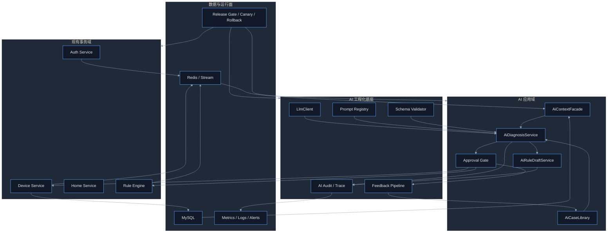
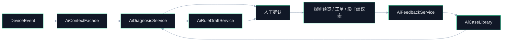

# AIoT AI 工程化与应用最小闭环落地方案

## Premise / Constraints / Boundaries / Endgame
- Premise：当前项目已经形成 `Gateway + Auth + Device + Home + Rule Engine` 的主业务链，具备 `MySQL + Redis + Redis Stream` 的数据底座，且已完成 AI-native 路线图与最小学习闭环设计，但代码侧尚未形成真正可运行的 LLM / RAG / Feedback Learning 工程体系。
- Constraints：第一阶段必须复用现有微服务边界，不建设重型训练平台，不引入复杂多模型编排，不允许 AI 绕过权限、审批、审计、数据归属和发布门禁；发布仍需服从现有 `Release Gate + Canary + Auto Rollback` 机制。
- Boundaries：本方案聚焦 `AI 工程化底座`、`AI 应用主链`、`运行治理`、`交付节奏` 四部分，只覆盖 M0 最小闭环；不展开端侧模型、TSDB 预测维护、多租户商业计费、全自动高风险执行。
- Endgame：在当前仓库中落成一套 `可开发、可测试、可发布、可观测、可评估、可迭代` 的 AI 最小闭环系统，让平台先具备“理解设备问题、生成结构化建议、沉淀反馈并持续变好”的能力。

---

## 1. 结论先行

### 1.1 本方案要解决的不是“做一个 AI 页面”
- 不是做一个单点 Copilot 界面。
- 不是把外部模型 API 硬接进 Controller。
- 不是只产出一份产品路线图。
- 本方案要解决的是：在现有 IoT 主链上，建立一条完整的 AI 工程化交付闭环。

### 1.2 最小闭环必须同时具备 5 个面
- `应用面`：能对设备问题输出结构化诊断和规则草案。
- `数据面`：能沉淀上下文、反馈、案例和评估结果。
- `工程面`：有统一模型调用、Schema 校验、Prompt 版本、测试与发布门禁。
- `运行面`：有日志、指标、审计、失败降级、灰度发布和回滚。
- `经营面`：能度量采纳率、解决率、规则草案通过率和诊断价值。

### 1.3 本期只打 1 条主链，扩 3 个场景
- 主链固定为：
- `设备事件`
- `AI 上下文聚合`
- `结构化诊断/规则草案`
- `人工审批或确定性执行`
- `反馈回写`
- `案例沉淀`
- `再学习增强`
- 三个最小场景固定为：
- `配网失败`
- `高频离线/反复上下线`
- `影子 desired/reported 偏差`

---

## 2. 当前基线与工程缺口

### 2.1 当前已具备的基础
- 设备事件总线已存在：`aiot:stream:device-event`
- 设备主数据、影子、配网、告警、工单、审计链路已存在
- 规则引擎已具备事件消费和动作执行骨架
- AI-native 路线图、M0 蓝图、最小学习闭环设计已存在
- 发布门禁、灰度和自动回滚最小机制已存在：[release_gate_and_canary_minimal_loop.md](file:///Users/aiden/Projects/AIOT-java/docs/release_gate_and_canary_minimal_loop.md)

### 2.2 当前未形成的关键工程能力
- 没有统一 `LlmClient` 运行时封装
- 没有结构化输出 Schema 校验层
- 没有 Prompt 版本治理与案例反馈治理
- 没有 AI 专用持久化对象，如 `ai_diagnosis_record`、`ai_feedback_record`、`ai_case_library`
- 没有 AI 场景验收口径对应的测试与评估流水线
- 没有把 AI 应用、工程发布、可观测、运营反馈串成一个统一方案

### 2.3 当前最核心的工程化矛盾
- 业务链是通的，但 AI 链还停留在文档和接口预留层。
- 如果直接做 UI 或单点问答，会形成“可演示但不可运营”的伪闭环。
- 因此本期必须优先补“工程化底座”，再让应用场景挂载上去。

---

## 3. 最小闭环总架构

### 3.1 总体架构图

### 3.2 一句话拆解
- `事务域` 负责提供真实设备和业务事实。
- `AI 工程化底座` 负责把模型调用变成可控软件能力。
- `AI 应用域` 负责把业务场景做成可闭环产品能力。
- `数据与运行面` 负责让整个系统可发布、可观察、可回滚、可评估。

---

## 4. AI 工程化底座设计

### 4.1 底座目标
- 统一模型调用方式，避免每个业务模块自己拼 Prompt、自己调模型。
- 统一输出契约校验，避免 AI 输出直接污染业务。
- 统一审计和可观测，避免 AI 运行成为黑盒。
- 统一反馈回流，避免“每次问答都是一次性消费”。

### 4.2 工程化 5 个核心能力

| 能力 | 职责 | 建议落点 |
| --- | --- | --- |
| `LlmClient` | 统一模型供应商调用、超时、重试、熔断、鉴权 | `aiot-common` |
| `PromptRegistry` | 管理 Prompt 模板、Few-shot、版本号、场景映射 | `aiot-common` 或 `aiot-rule-engine` |
| `AiSchemaValidator` | 校验模型输出 JSON 契约，失败则降级 | `aiot-common` |
| `AiAuditPublisher` | 记录 traceId、modelName、latency、tokenUsage、resultStatus | `aiot-common` |
| `FeedbackPipeline` | 采纳/修改/拒绝/解决结果入库并生成案例候选 | `aiot-rule-engine` |

### 4.3 关键工程策略
- `所有 AI 输出必须结构化`：禁止直接让模型输出业务可执行自然语言。
- `所有 AI 写动作必须二次门禁`：通过审批或低风险规则兜底，不能直接写设备。
- `所有 Prompt 必须版本化`：每次诊断结果要带 `prompt_version`，否则无法评估。
- `所有诊断必须带 traceId`：保证和事件、工单、规则命中能串起来。
- `所有失败都必须可降级`：模型超时、Schema 校验失败、上下文缺失时，返回确定性兜底提示，不拖垮主链路。

---

## 5. AI 应用最小闭环设计

### 5.1 应用目标
- 先完成 1 条高频可闭环链路，再扩场景。
- 先面向运营/运维后台，再考虑多角色 Copilot。
- 先做“建议系统”，再做“半自动执行”。

### 5.2 最小应用主链

### 5.3 三个场景的标准化应用包

| 场景 | 触发事实 | AI 输出 | 反馈结果 |
| --- | --- | --- | --- |
| `PROVISION_FAILURE` | 配网失败事件 | 原因分类、排查建议 | 是否重新配网成功 |
| `OFFLINE_FLAP` | 高频离线/上下线抖动 | 根因诊断、离线规则草案 | 是否降低故障定位时间 |
| `SHADOW_DIFF` | desired/reported 长时间不一致 | 偏差解释、状态对账建议 | 是否解决控制与设备不一致 |

### 5.4 为什么先不做通用 Copilot
- 通用 Copilot 需要多角色、多域知识、多轮会话管理，工程复杂度远高于 M0。
- 当前最短价值链是“事件触发型智能诊断”，不是“开放式聊天问答”。
- 先把单场景闭环做强，后续再扩会话化入口。

---

## 6. 模块落地与代码边界

### 6.1 `aiot-common`
- 新增 `LlmClient`
- 新增 `PromptRegistry`
- 新增 `AiSchemaValidator`
- 新增 `AiAuditPublisher`
- 新增统一配置：
  - `ai.llm.provider`
  - `ai.llm.base-url`
  - `ai.llm.api-key`
  - `ai.llm.timeout-ms`
  - `ai.prompt.scene-version-map`

### 6.2 `aiot-device-service`
- 新增 `AiContextFacade`
- 新增 AI 内部查询接口：
  - `GET /api/v1/internal/ai/devices/{deviceId}/context`
- 聚合数据：
  - 设备主数据
  - 产品物模型
  - 在线状态
  - 影子快照与 delta
  - 最近事件
  - 最近告警/工单
  - 最近 OTA/配网摘要

### 6.3 `aiot-rule-engine`
- 新增 `AiDiagnosisService`
- 新增 `AiRuleDraftService`
- 新增 `AiFeedbackService`
- 新增 AI 持久化对象：
  - `ai_diagnosis_record`
  - `ai_feedback_record`
  - `ai_case_library`
- 新增接口：
  - `POST /api/v1/ai/diagnosis`
  - `POST /api/v1/ai/rule-drafts`
  - `POST /api/v1/ai/feedback`
  - `GET /api/v1/ai/cases/search`

### 6.4 `aiot-auth-service`
- 保持鉴权和上下线事件职责不变
- 只需保证事件完整性：
  - `device_id`
  - `home_id`
  - `trace_id`
  - `event_type`
  - `timestamp`

### 6.5 `aiot-data-parser`
- M0 不强依赖它承接在线推理
- 仅预留为后续知识切片和复杂解析的扩展点
- 不建议本期把主闭环压在这个尚未真正落地的模块上

---

## 7. 数据模型与反馈学习

### 7.1 最小持久化对象
- 诊断记录：`ai_diagnosis_record`
- 反馈记录：`ai_feedback_record`
- 案例库：`ai_case_library`

### 7.2 再学习主链
- `诊断输出`
- `人工采纳/修正/拒绝`
- `工单结案或规则效果`
- `生成案例评分`
- `更新 Few-shot 示例`
- `下轮优先检索高评分案例`

### 7.3 M0 学习边界
- 不做在线模型训练
- 不做 RLHF 平台
- 不做独立向量数据库强依赖
- 优先用 `结构化案例库 + Prompt 示例集 + 场景检索` 形成学习增强

---

## 8. 工程交付流水线

### 8.1 开发流程必须遵守 RDV
- 先 `Spec`，后 `Test`，再 `Code`，最后 `Sign-off`
- 任何 AI 相关功能开发，都必须先有 AC 验收单和对应测试设计
- 基线规则参考：[AI_DEVELOPMENT_VERIFICATION.md](file:///Users/aiden/Projects/AIOT-java/docs/AI_DEVELOPMENT_VERIFICATION.md)

### 8.2 AI 模块开发顺序

| 顺序 | 交付项 | 目的 |
| --- | --- | --- |
| 1 | AI 输出 schema 与场景枚举 | 锁定契约 |
| 2 | `LlmClient + SchemaValidator + Audit` | 锁定工程底座 |
| 3 | `AiContextFacade` | 锁定上下文供给 |
| 4 | `AiDiagnosisService` | 跑通首个诊断主链 |
| 5 | `AiFeedbackService` | 形成反馈回流 |
| 6 | `AiRuleDraftService` | 形成建议到策略的闭环 |
| 7 | 案例归档任务与评估报表 | 形成学习和经营闭环 |

### 8.3 CI/CD 与发布门禁
- 沿用现有单服务最小发布闭环：
  - 发布前 `Release Gate`
  - 发布后 `Canary Window`
  - 异常自动 `Rollback`
- AI 服务相关新增门禁建议：
  - Prompt 配置存在性校验
  - LLM 配置合法性校验
  - Schema 用例测试通过
  - 关键降级路径测试通过
- 发布基线参考：[release_gate_and_canary_minimal_loop.md](file:///Users/aiden/Projects/AIOT-java/docs/release_gate_and_canary_minimal_loop.md)

---

## 9. 运行治理与风险控制

### 9.1 可观测四件套
- `日志`：记录 `traceId / sceneType / modelName / promptVersion / resultStatus`
- `指标`：记录 `success_rate / timeout_rate / schema_fail_rate / fallback_rate / feedback_accept_rate`
- `审计`：记录谁触发了 AI、谁采纳了建议、谁批准了规则草案
- `告警`：当 AI 超时率、Schema 失败率、降级率超阈值时报警

### 9.2 降级策略
- 模型超时：返回确定性兜底提示，不阻塞主业务接口
- Schema 失败：丢弃模型原始输出，记录审计并返回“建议不可用”
- 上下文缺失：提示上下文不足，不生成规则草案
- 反馈链故障：允许主诊断完成，但异步补偿写反馈

### 9.3 安全与权限
- 所有 AI 会话和请求必须绑定 `user_id`、`home_id`、`trace_id`
- 所有内部 AI 接口仍走 `X-Internal-Token`
- 所有可执行草案必须保留审批和审计链
- 所有案例检索必须做家庭级或项目级上下文裁剪，防止跨域泄漏

---

## 10. M0 交付节奏

### 10.1 阶段划分

| 阶段 | 周期建议 | 交付目标 |
| --- | --- | --- |
| Phase 1 | 1 周 | 锁定场景、数据契约、Prompt 契约、验收 AC |
| Phase 2 | 1-2 周 | 完成 AI 工程化底座：`LlmClient`、Schema、Audit |
| Phase 3 | 1-2 周 | 打通 `AiContextFacade + AiDiagnosisService` |
| Phase 4 | 1 周 | 打通反馈、案例归档、规则草案 |
| Phase 5 | 1 周 | 完成指标看板、灰度发布、验收和复盘 |

### 10.2 最小上线顺序
- 先上线 `OFFLINE_FLAP`
- 再复制到 `PROVISION_FAILURE`
- 最后复制到 `SHADOW_DIFF`

### 10.3 为什么先做 `OFFLINE_FLAP`
- 数据最完整：事件、状态、影子、告警、工单全都存在
- 业务痛点最明确：高频离线直接影响体验和运维成本
- 可量化最强：定位时长、采纳率、误报率都容易定义

---

## 11. 验收口径

### 11.1 工程化验收
- 已有统一 `LlmClient`
- 已有 Prompt 版本治理
- 已有 Schema 校验与降级机制
- 已有 AI 诊断、反馈、案例 3 类持久化对象
- 已有 AI 关键路径测试和发布门禁

### 11.2 应用验收
- 至少 1 个场景跑通完整闭环
- 至少 3 个场景完成标准化复制模板
- AI 输出都带结构化证据与风险等级
- 规则草案必须可预览、可审批、可审计

### 11.3 经营验收
- `AI 建议采纳率` 可统计
- `问题解决率` 可统计
- `规则草案一次通过率` 可统计
- `平均问题定位时长下降` 可统计
- `AI 输出可追溯率` = 100%

---

## 12. 不做什么
- 不做独立大而全 `ai-service` 微服务平台
- 不做多模型 Agent 编排平台
- 不做在线训练和模型微调平台
- 不做高风险自动执行闭环
- 不做全角色、全业务域通用 Copilot

---

## 13. 与现有文档的关系
- 最小学习闭环基线：[AIOT_MINIMAL_CLOSED_LOOP_AI_LEARNING_SYSTEM.md](file:///Users/aiden/Projects/AIOT-java/docs/architecture/AIOT_MINIMAL_CLOSED_LOOP_AI_LEARNING_SYSTEM.md)
- AI-native 总览：[ai-native-overview.md](file:///Users/aiden/Projects/AIOT-java/docs/wiki/ai-native-overview.md)
- M0 实施蓝图：[ai-native-m0-blueprint.md](file:///Users/aiden/Projects/AIOT-java/docs/wiki/ai-native-m0-blueprint.md)
- AI-native 产品路线图：[AIoT_AI_Native_Product_Roadmap.md](file:///Users/aiden/Projects/AIOT-java/docs/product/AIoT_AI_Native_Product_Roadmap.md)
- AI 驱动开发验证机制：[AI_DEVELOPMENT_VERIFICATION.md](file:///Users/aiden/Projects/AIOT-java/docs/AI_DEVELOPMENT_VERIFICATION.md)
- 发布门禁与回滚闭环：[release_gate_and_canary_minimal_loop.md](file:///Users/aiden/Projects/AIOT-java/docs/release_gate_and_canary_minimal_loop.md)

---

## 14. 一句话结论
- 整个 AI 工程化和应用最小闭环，不是“把模型接进系统”，而是“把模型、数据、规则、反馈、发布和经营评估组织成一套能持续交付和持续进化的业务系统”。
