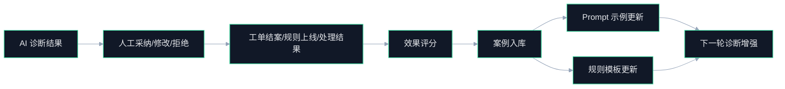

# AIoT 最小闭环全生命周期 AI 学习体系设计

## Premise / Constraints / Boundaries / Endgame
- Premise：当前仓库已经具备 `设备主数据(MySQL)`、`运行态快照(Redis)`、`动态事件流(Redis Stream)`、`规则执行与运维闭环(rule-engine)` 等基础能力，具备搭建最小 AI 闭环的必要底座。
- Constraints：M0 阶段不建设重训练平台，不引入复杂多模型编排，不允许 AI 绕过现有权限、审批、审计和资源归属校验；所有高风险写操作仍以人工审批或确定性规则为准。
- Boundaries：本设计仅覆盖设备全生命周期中的 `配网期`、`运行期`、`状态同步期` 三个高价值 AI 学习场景，不展开端侧模型、遥测预测维护、多租户商业化计费等重型能力。
- Endgame：形成一套 `问题发现 -> 上下文理解 -> AI 诊断/规则草案 -> 人工/规则执行 -> 结果反馈 -> 案例沉淀 -> 再学习增强` 的最小闭环系统，使平台具备持续学习能力，而不是一次性静态问答能力。

---

## 1. 结论先行

### 1.1 本期最小闭环定义
- 最小闭环不是“上线一个 Copilot 页面”，而是让平台围绕高频设备问题形成可重复的学习循环。
- 闭环主链路固定为：
- `设备事件进入`
- `上下文聚合`
- `AI 输出结构化诊断/规则草案`
- `人工审批或确定性执行`
- `工单/规则/影子结果回写`
- `结果反馈沉淀为案例`
- `下一次相似问题优先复用历史案例`

### 1.2 本期只做三类问题域
- `配网失败`：解决设备从“待接入”到“已认领”阶段的问题学习。
- `高频离线/反复上下线`：解决设备运行阶段最典型的运维诊断问题。
- `影子 desired/reported 偏差`：解决设备状态同步和控制意图不一致问题。

### 1.3 本期学习的本质
- 学习不等于立刻训练专属模型。
- M0 的学习本质是 `案例学习 + 反馈学习 + Prompt 学习 + 规则模板学习`。
- 只要能把人工确认过的高质量处理路径持续回灌到下一轮诊断和草案生成中，就已经形成最小 AI 学习闭环。

---

## 2. 目标与非目标

### 2.1 目标
- 建立一条贴合当前代码结构的最小 AI 主链路，不新增高复杂新平台。
- 让 AI 对设备问题输出结构化结果，而不是不可审计的自由文本。
- 让 AI 输出具备反馈入口，并能沉淀为标准案例库。
- 让案例库能反向参与下一轮诊断和规则草案生成，形成再学习。

### 2.2 非目标
- 不建设专用训练集管理平台。
- 不建设在线参数微调或 RLHF 平台。
- 不做自动闭环控制设备。
- 不做全量遥测时序预测分析。
- 不做通用对话 Agent 平台。

---

## 3. 设备全生命周期中的 AI 学习覆盖

### 3.1 生命周期覆盖范围

| 生命周期阶段 | 当前系统现状 | M0 AI 作用 | 学习产物 |
| --- | --- | --- | --- |
| 绑定/配网 | 已有 token、lock、成功/失败事件 | 对配网失败做原因归类与建议输出 | 配网失败案例 |
| 连接/上下线 | 已有鉴权、在线缓存、在线/离线事件 | 对离线原因做诊断与规则建议 | 离线诊断案例、离线规则模板 |
| 状态同步 | 已有影子 desired/reported/version/delta | 对偏差原因做解释并给出处置建议 | 影子偏差案例、状态对账规则模板 |
| 规则联动 | 已有规则定义、告警、工单、审计 | 生成规则草案、优化阈值建议 | 高采纳规则模板 |
| 运维闭环 | 已有告警、工单、SLA、审计 | 记录采纳与结果，做效果评估 | 案例评分、处理 SOP |

### 3.2 生命周期学习闭环原则
- `主数据层` 负责定义“设备是什么”，是 AI 识别问题背景的基本上下文。
- `快照层` 负责定义“设备现在怎么样”，是 AI 当前判断的状态输入。
- `事件层` 负责定义“刚发生了什么”，是 AI 触发诊断的事实入口。
- `过程层` 负责定义“系统做了什么”，是 AI 学习处理路径的样本来源。
- `观测与审计层` 负责定义“结果是否有效”，是 AI 反馈学习的门禁数据。

---

## 4. 最小闭环系统架构

### 4.1 主链路


### 4.2 模块职责分布

| 模块 | 本期职责 | 是否新增核心逻辑 |
| --- | --- | --- |
| `aiot-auth-service` | 提供连接鉴权、在线/离线事实事件 | 否，复用现有事件入口 |
| `aiot-device-service` | 提供设备主数据、物模型、影子、配网、OTA 聚合上下文 | 是，新增 AI 上下文聚合 Facade |
| `aiot-rule-engine` | 承担 AI 诊断、规则草案、反馈回写、案例沉淀 | 是，本期主承载模块 |
| `aiot-common` | 承担 LLM Client、结构化 Schema 校验、调用审计 | 是，新增公共封装 |
| `Redis / MySQL` | 承担事件、快照、反馈、案例数据 | 是，新增最小持久化对象 |

### 4.3 为什么 `rule-engine` 是 AI 中枢
- 它天然位于 `事件 -> 规则 -> 告警 -> 工单 -> 审计` 中间，是最适合承接 AI 判断和学习回流的节点。
- 如果把 AI 放在独立新服务，M0 会先陷入基础设施建设，而不是闭环价值验证。
- 因此本期建议 `逻辑先内聚，服务后拆分`。

---

## 5. 学习系统分层

### 5.1 L1：事实学习
- 学习对象：设备状态事实、事件事实、影子事实、过程事实。
- 输入来源：
  - `device_info`
  - `product_info.thing_model_json`
  - Redis 在线状态
  - Redis 影子
  - `aiot:stream:device-event`
  - 告警/工单/审计记录
- 输出结果：结构化 AI 上下文对象，不直接输出结论。

### 5.2 L2：案例学习
- 学习对象：问题现象、根因分类、建议动作、执行结果。
- 样本来源：人工确认后的诊断结果、工单结案结果、规则上线效果。
- 输出结果：标准案例库，作为下一轮检索和 Few-shot 示例输入。

### 5.3 L3：策略学习
- 学习对象：什么问题值得转为规则、什么策略误报高、什么建议采纳率高。
- 样本来源：规则草案采纳率、规则命中效果、告警误报率、工单处理耗时。
- 输出结果：高质量规则模板、推荐阈值、风险提示模板。

### 5.4 L4：提示学习
- 学习对象：什么样的上下文组合和示例最能得到稳定输出。
- 样本来源：高评分案例、低修改率输出、成功解决的典型工单。
- 输出结果：Prompt 模板版本、Few-shot 示例集、场景级输出 schema。

---

## 6. 最小数据模型

### 6.1 `ai_diagnosis_record`
- 作用：记录一次 AI 诊断的完整输入输出与运行信息。

| 字段 | 类型建议 | 说明 |
| --- | --- | --- |
| `id` | bigint | 主键 |
| `trace_id` | varchar(64) | 贯穿调用链的追踪 ID |
| `scene_type` | varchar(32) | `PROVISION_FAILURE` / `OFFLINE_FLAP` / `SHADOW_DIFF` |
| `device_id` | bigint | 设备 ID |
| `home_id` | bigint | 家庭 ID |
| `event_id` | varchar(64) | 触发诊断的事件 ID |
| `context_snapshot` | json | 诊断时的结构化上下文快照 |
| `model_name` | varchar(64) | 模型标识 |
| `prompt_version` | varchar(32) | Prompt 版本 |
| `diagnosis_result` | json | 结构化诊断结果 |
| `latency_ms` | int | 推理耗时 |
| `created_at` | datetime | 创建时间 |

### 6.2 `ai_feedback_record`
- 作用：记录 AI 输出是否被采纳、如何被修正、最终是否解决问题。

| 字段 | 类型建议 | 说明 |
| --- | --- | --- |
| `id` | bigint | 主键 |
| `diagnosis_id` | bigint | 对应诊断记录 |
| `feedback_type` | varchar(32) | `ACCEPTED` / `MODIFIED` / `REJECTED` |
| `operator_id` | bigint | 操作人 |
| `resolution_status` | varchar(32) | `SOLVED` / `PARTIAL` / `UNSOLVED` |
| `resolution_note` | varchar(1000) | 人工修正说明 |
| `duration_minutes` | int | 从建议到处理完成耗时 |
| `created_at` | datetime | 创建时间 |

### 6.3 `ai_case_library`
- 作用：沉淀可复用的标准问题处理案例。

| 字段 | 类型建议 | 说明 |
| --- | --- | --- |
| `id` | bigint | 主键 |
| `scene_type` | varchar(32) | 场景类型 |
| `symptom` | varchar(500) | 现象摘要 |
| `root_cause` | varchar(500) | 根因摘要 |
| `resolution` | text | 处置方式 |
| `rule_template` | json | 可选规则模板 |
| `effectiveness_score` | decimal(5,2) | 效果评分 |
| `source_feedback_id` | bigint | 来源反馈记录 |
| `status` | varchar(32) | `ACTIVE` / `DEPRECATED` |
| `created_at` | datetime | 创建时间 |

### 6.4 推荐增加的索引和治理约束
- `ai_diagnosis_record(scene_type, device_id, created_at)`：支持按设备和场景追查。
- `ai_feedback_record(diagnosis_id)`：支持诊断结果回查。
- `ai_case_library(scene_type, effectiveness_score)`：支持场景内优先检索高质量案例。
- 所有 AI 相关表都必须保留 `trace_id`、`created_at`、`operator_id` 或来源引用字段，确保可审计。

---

## 7. 统一 AI 输出契约

### 7.1 诊断输出 schema

```json
{
  "sceneType": "OFFLINE_FLAP",
  "summary": "设备 24 小时内发生 6 次上下线抖动",
  "rootCauseCategory": "NETWORK_INSTABILITY",
  "confidence": 0.82,
  "evidence": [
    "最近 30 分钟出现 4 次 DEVICE_OFFLINE",
    "reported.rssi 持续低于阈值"
  ],
  "recommendedActions": [
    "检查设备供电和网络覆盖",
    "创建频发离线规则草案"
  ],
  "ruleDraftable": true,
  "riskLevel": "MEDIUM"
}
```

### 7.2 规则草案输出 schema

```json
{
  "sceneType": "OFFLINE_FLAP",
  "ruleName": "设备频发离线告警",
  "triggerEventType": "DEVICE_OFFLINE",
  "windowMinutes": 30,
  "threshold": 3,
  "suggestedAction": "ALARM_CREATE",
  "reason": "近 30 分钟内离线次数超过 3 次且设备类型为网关类",
  "riskLevel": "LOW"
}
```

### 7.3 输出契约要求
- AI 输出必须为结构化 JSON，不允许把执行意图埋在自然语言里。
- AI 输出必须携带 `sceneType`、`confidence`、`riskLevel`。
- AI 输出必须能追溯到至少一个事件、一个设备和一份上下文快照。

---

## 8. 关键服务与接口设计

### 8.1 `aiot-device-service`

#### `AiContextFacade`
- 职责：把散落在多个表和 Redis Key 中的数据聚合成 AI 可直接消费的上下文。
- 推荐接口：
- `GET /api/v1/internal/ai/devices/{deviceId}/context?sceneType=OFFLINE_FLAP`

#### 返回对象建议
- 设备基础信息
- 产品物模型摘要
- 最近在线状态变化
- 最近影子快照与差异
- 最近配网结果
- 最近告警/工单摘要
- 最近 OTA 信息

### 8.2 `aiot-rule-engine`

#### `AiDiagnosisService`
- 输入：`sceneType + deviceId + eventId + context`
- 输出：结构化诊断结果

#### `AiRuleDraftService`
- 输入：诊断结果或自然语言需求
- 输出：规则草案 JSON

#### `AiFeedbackService`
- 输入：人工采纳/修正/拒绝结果
- 输出：反馈记录和案例沉淀任务

#### 推荐接口
- `POST /api/v1/ai/diagnosis`
- `POST /api/v1/ai/rule-drafts`
- `POST /api/v1/ai/feedback`
- `GET /api/v1/ai/cases/search`

### 8.3 `aiot-common`

#### `LlmClient`
- 职责：统一外部模型调用，屏蔽供应商差异。

#### `AiSchemaValidator`
- 职责：校验模型输出是否满足约定 JSON schema。

#### `AiAuditPublisher`
- 职责：记录模型调用审计和异常。

---

## 9. 再学习与反馈回流机制

### 9.1 反馈闭环



### 9.2 每轮学习最少沉淀 5 个信号
- `是否采纳`
- `是否修改`
- `是否解决`
- `处理耗时`
- `是否转为规则并上线`

### 9.3 每日/每周离线学习任务
- 每日任务：
  - 归档高质量反馈记录为案例候选
  - 统计 AI 输出采纳率和拒绝率
  - 标记低质量 Prompt 版本
- 每周任务：
  - 更新高评分 Few-shot 示例集
  - 汇总高采纳规则草案模板
  - 输出误报/漏报复盘清单

---

## 10. M0 分阶段实施路线

### 10.1 第 1 阶段：定义契约
- 输出：
  - 3 类场景枚举
  - 诊断输出 schema
  - 规则草案 schema
  - 反馈数据模型
- 验收：
  - AI 输出结构化契约确定
  - 反馈字段可以支撑后续评估

### 10.2 第 2 阶段：打通主链路
- 输出：
  - `AiContextFacade`
  - `AiDiagnosisService`
  - 最小审批/反馈接口
- 验收：
  - 3 类问题能完成一次端到端闭环

### 10.3 第 3 阶段：接入案例学习
- 输出：
  - `ai_case_library`
  - 案例检索接口
  - 每日案例归档任务
- 验收：
  - 新诊断请求可引用历史案例

### 10.4 第 4 阶段：建立评估机制
- 输出：
  - 采纳率报表
  - 解决率报表
  - 规则草案通过率报表
- 验收：
  - 可以量化判断 AI 是否真正变好

---

## 11. M0 验收口径

### 11.1 闭环验收
- 至少 3 类高频问题场景可以跑通 `事件 -> 诊断 -> 审批/执行 -> 反馈 -> 案例沉淀 -> 再诊断增强`。
- 所有 AI 输出均可追溯到具体 `deviceId/eventId/traceId/contextSnapshot`。
- 所有高风险动作都不能绕过审批和审计。

### 11.2 学习验收
- `AI 建议采纳率` 可统计。
- `规则草案一次通过率` 可统计。
- `问题解决率` 可统计。
- `高质量案例数` 可统计。
- `Prompt 版本效果差异` 可统计。

### 11.3 建议业务指标
- `配网失败原因分类准确率` >= 70%
- `高频离线诊断命中率` >= 60%
- `规则草案采纳率` >= 30%
- `平均问题定位时长` 下降 30%+
- `AI 输出可追溯率` = 100%

---

## 12. 风险与控制

| 风险 | 表现 | 控制措施 |
| --- | --- | --- |
| 输出不稳定 | 同类问题输出差异大 | 固定场景、固定 schema、固定 Few-shot |
| 误导执行 | AI 建议被误认为确定性动作 | 所有输出默认标记为 `建议`，高风险动作走审批 |
| 反馈质量差 | 人工不填反馈，学习失真 | 反馈字段最小化，并与工单结案动作绑定 |
| 数据上下文不足 | 诊断无依据或证据不足 | 先限定 3 类上下文最完整的场景 |
| 过早拆服务 | 架构复杂度高于业务价值 | 本期先内聚到 `rule-engine`，后续按负载再拆 |

---

## 13. 与现有文档的关系
- 本文档是对 `AI-native M0` 蓝图的收敛和补足，重点补充“如何学习”和“如何闭环评估”。
- 生命周期数据基线参考：[DEVICE_FULL_LIFECYCLE_DATA_SYSTEM.md](file:///Users/aiden/Projects/AIOT-java/docs/architecture/DEVICE_FULL_LIFECYCLE_DATA_SYSTEM.md)
- 产品路线参考：[AIoT_AI_Native_Product_Roadmap.md](file:///Users/aiden/Projects/AIOT-java/docs/product/AIoT_AI_Native_Product_Roadmap.md)
- M0 实施蓝图参考：[ai-native-m0-blueprint.md](file:///Users/aiden/Projects/AIOT-java/docs/wiki/ai-native-m0-blueprint.md)

---

## 14. 一句话结论
- 本项目的最小闭环 AI 体系，不应该从“训练一个更强模型”开始，而应该从“把设备问题处理的事实、反馈和结果组织成可持续学习的系统”开始。
