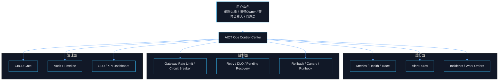

# AIOT 运维控制中枢产品化架构

## Premise / Constraints / Boundaries / Endgame

- Premise：当前 `AIOT-java` 已具备观测、告警、回滚、发布门禁、故障注入等运维技术资产，但这些能力仍分散在 `Prometheus`、`Gateway`、`CI/CD`、脚本、Runbook 和服务代码中，尚未形成统一产品面。
- Constraints：本文只基于仓库内已落地的能力和文档事实进行产品化抽象；M0 优先复用现有 `Gateway / Rule Engine / Prometheus / CI-CD / Runbook` 资产，不臆造重型 AIOps 平台。
- Boundaries：In Scope 包括运行治理、故障治理、发布治理、审计治理、经营看板；Out of Scope 包括预测性维护、复杂根因 AI、自助 BI、跨云资源编排。
- Endgame：把当前系统从“人盯图、手工判断、散点回滚”的运维方式，升级为“对象化、流程化、门禁化、可经营”的 `AIOT Ops Control Center`。

***

## 1. 一页结论

### 1.1 产品定义

- 该产品不是“监控后台”，而是一个 `稳定性控制中枢 + 变更治理中枢 + 运维协同中枢`。
- 核心目标不是展示指标，而是把 `异常 -> 任务 -> 动作 -> 结果 -> 经验` 压成统一闭环。
- 最小价值链：

```text
监测 -> 告警 -> 事故 -> 工单 -> Runbook -> 恢复 -> 审计 -> 复盘
```

### 1.2 目标用户

- 值班运维：需要快速发现异常、接单、执行回滚和标准处置。
- 服务 Owner：需要聚焦本服务事故、发布质量、根因和整改项。
- 交付负责人：需要看发布风险、门禁结果、回滚成功率和版本质量。
- 平台管理员：需要管理告警策略、权限、审计和 Runbook 模板。
- 管理层：需要稳定性经营看板，而不是底层技术细节。

### 1.3 当前系统判断

- 当前系统已经具备四类运维资产：
  - 观测资产：`Actuator + Micrometer + Prometheus + Health Probe + TraceId`
  - 判断资产：4 条核心告警规则、发布前后健康检查
  - 控制资产：限流、熔断、重试、DLQ、回滚、故障注入
  - 治理资产：CI/CD 门禁、Runbook、回滚流程、演练模板
- 当前缺口不是“没有能力”，而是“缺少统一产品对象、统一工作台、统一状态机、统一审计仓”。

***

## 2. 产品定位与边界

### 2.1 产品定位

- 产品名称建议：`AIOT Ops Control Center`
- 产品定位：面向 AIoT 平台稳定性、故障、变更、审计和经营分析的一体化运维产品。
- 竞争力不在“图表更多”，而在三件事：
  - 异常能不能被及时发现。
  - 风险能不能被标准化止损。
  - 经验能不能沉淀为组织能力。

### 2.2 产品边界

| 范畴 | 包含内容 | 不包含内容 |
| --- | --- | --- |
| 运行治理 | 服务健康、错误率、延迟、事件异常、DLQ、Pending Recovery | 自助 BI、全链路商业分析 |
| 故障治理 | 告警、事故、工单、SLA、Runbook | 高级 AI 根因自动推理 |
| 变更治理 | 发布记录、门禁、Canary、自动回滚 | 跨云多集群编排 |
| 审计治理 | 操作审计、发布审计、回滚审计、事故时间线 | 法务级合规平台 |
| 经营分析 | SLO、MTTA、MTTR、误报率、变更成功率 | 财务经营全景系统 |

### 2.3 一页架构图



***

## 3. 六层能力地图

### 3.1 L1 感知层

- 目标：统一采集系统当前状态。
- 核心能力：
  - 服务健康检查
  - HTTP 请求指标
  - 事件消费指标
  - TraceId 追踪
  - 发布健康检查
- 当前基础：
  - 各服务 `Actuator + Micrometer + Prometheus`
  - `readiness / liveness`
  - `TraceIdFilter`

### 3.2 L2 判断层

- 目标：把原始指标转成异常信号。
- 核心能力：
  - 告警规则
  - 阈值判定
  - 聚合
  - 去重
  - 恢复判定
- 当前基础：
  - `AuthFailureRateHigh`
  - `StreamConsumeFailureRateHigh`
  - `DlqGrowthRateHigh`
  - `PendingRecoveryFailureRateHigh`

### 3.3 L3 处置层

- 目标：把异常转成待执行任务。
- 核心能力：
  - 告警确认
  - 事故升级
  - 自动建单
  - 责任人分配
  - SLA 计时

### 3.4 L4 控制层

- 目标：对系统实施止损与恢复动作。
- 核心能力：
  - 限流
  - 熔断
  - 重试
  - DLQ
  - 回滚
  - 故障注入
- 当前基础：
  - Gateway 限流与熔断
  - Stream 重试、ACK、DLQ、Pending Recovery
  - 单服务回滚与 Canary 自动回滚

### 3.5 L5 审计层

- 目标：把关键动作变成可追溯事实。
- 核心能力：
  - 操作审计
  - 发布审计
  - 回滚审计
  - 事故时间线
- 当前判断：
  - 已有局部留痕与结构化审计文件输出，但缺少统一审计仓。

### 3.6 L6 经营层

- 目标：让管理层直接看到稳定性经营结果。
- 核心能力：
  - SLO
  - MTTA
  - MTTR
  - 误报率
  - 变更成功率
  - 一次解决率

***

## 4. 产品对象模型

### 4.1 核心实体

| 实体 | 定义 | 关键字段 |
| --- | --- | --- |
| `OpsAlert` | 系统识别出的异常信号 | `alertId`、`severity`、`sourceType`、`metricName`、`status`、`firstSeenAt`、`lastSeenAt` |
| `OpsIncident` | 需要跨角色协作处置的稳定性事件 | `incidentId`、`level`、`impactScope`、`owner`、`status`、`rootCauseType` |
| `OpsWorkOrder` | 具体处置任务载体 | `workOrderId`、`incidentId`、`assignee`、`slaDueAt`、`actionType`、`resolutionCode` |
| `OpsRelease` | 一次发布和变更实体 | `releaseId`、`service`、`version`、`operator`、`gateStatus`、`canaryStatus`、`rollbackStatus` |
| `OpsRunbookExecution` | 一次标准处置动作执行记录 | `executionId`、`runbookId`、`triggerSource`、`status`、`startedAt`、`finishedAt` |
| `OpsAuditEvent` | 所有关键动作的审计日志 | `auditId`、`operatorId`、`action`、`targetType`、`targetId`、`traceId`、`result` |
| `OpsSloPolicy` | 稳定性经营目标 | `sloId`、`service`、`metric`、`target`、`window`、`budget` |

### 4.2 关系模型

- 一个 `OpsAlert` 可触发一个或多个 `OpsIncident`。
- 一个 `OpsIncident` 可拆解为多个 `OpsWorkOrder`。
- 一个 `OpsWorkOrder` 可执行一个或多个 `OpsRunbookExecution`。
- 一个 `OpsRelease` 可关联多个告警、事故和健康检查结果。
- 所有关键动作都必须沉淀为 `OpsAuditEvent`。
- `OpsSloPolicy` 是经营视角的上位约束，反向约束告警阈值、门禁和发布策略。

### 4.3 统一主键与关联键建议

- `traceId`：贯穿请求链路。
- `incidentId`：贯穿事故全生命周期。
- `releaseId`：贯穿一次发布全生命周期。
- `operatorId`：贯穿关键操作审计。

***

## 5. 四条主流程

### 5.1 运行异常流程

```text
指标超阈值
-> 生成告警
-> 分级/去重/抑制
-> 值班确认
-> 自动或人工建单
-> 执行标准处置
-> 恢复验证
-> 关闭并复盘
```

### 5.2 事故升级流程

```text
多个同源告警聚合
-> 判断影响范围
-> 升级为事故
-> 指派Owner
-> 建立时间线
-> 执行Runbook
-> 根因分类
-> 输出整改项
```

### 5.3 发布变更流程

```text
发布申请
-> 质量门禁校验
-> Canary 观察
-> 放量 or 自动回滚
-> 结构化留痕
-> 纳入发布质量分析
```

### 5.4 演练流程

```text
选择演练目标
-> 执行故障注入
-> 验证告警触发
-> 验证建单与回滚
-> 形成复盘与整改项
```

***

## 6. 状态机设计

### 6.1 告警状态机

```text
new -> grouped -> acknowledged -> assigned -> resolved -> closed
```

### 6.2 事故状态机

```text
suspected -> confirmed -> mitigating -> recovering -> stabilized -> reviewed
```

### 6.3 工单状态机

```text
created -> assigned -> in_progress -> waiting -> resolved -> verified -> closed
```

### 6.4 发布状态机

```text
created -> gated -> deploying -> canary -> success | rollback | failed
```

### 6.5 Runbook 状态机

```text
ready -> triggered -> running -> verifying -> success | failed
```

***

## 7. 页面信息架构

### 7.1 顶层菜单

- `总览`
- `告警`
- `事故`
- `工单`
- `发布`
- `Runbook`
- `审计`
- `经营分析`

### 7.2 页面职责

| 页面 | 目标 | 核心动作 |
| --- | --- | --- |
| `总览` | 快速判断今天系统是否失控 | 进入事故、进入发布、发起回滚 |
| `告警中心` | 管理异常信号 | 确认、抑制、合并、升级事故、建单 |
| `事故中心` | 管理跨角色故障事件 | 指派 Owner、执行 Runbook、关联变更、关闭复盘 |
| `工单中心` | 管理处置任务与 SLA | 接单、转派、填写结果、验证关闭 |
| `发布中心` | 管理版本与变更质量 | 查看门禁、查看 Canary、触发回滚 |
| `Runbook 中心` | 管理标准处置模板与执行记录 | 触发执行、复制模板、绑定事故 |
| `审计中心` | 管理关键动作追溯 | 检索证据、导出审计 |
| `经营分析` | 面向负责人做经营复盘 | 服务筛选、周期复盘、趋势分析 |

### 7.3 首页卡片建议

- 当前 `P0/P1` 事故数
- 核心服务可用性
- `DLQ` 增长状态
- 最近 `24h` 发布成功率
- 今日超时工单数
- 本周 `MTTR`

***

## 8. 指标体系

### 8.1 运行指标

- 服务可用性
- 错误率
- `P95` 延迟
- 事件消费失败率
- `DLQ` 增长率
- Pending Recovery 失败率

### 8.2 处置指标

- 告警确认时长
- 建单转化率
- `SLA` 达成率
- 一次解决率

### 8.3 事故指标

- `P0/P1` 数量
- `MTTA`
- `MTTR`
- 事故复发率

### 8.4 变更指标

- 发布成功率
- Canary 失败率
- 自动回滚成功率
- 变更导致事故占比

### 8.5 治理指标

- 关键动作审计覆盖率
- 演练完成率
- Runbook 命中率
- 门禁阻断次数

***

## 9. 角色与权限模型

### 9.1 平台管理员

- 管理告警规则、权限策略、Runbook 模板和审计配置。

### 9.2 值班运维

- 查看全部告警。
- 升级事故。
- 派发工单。
- 执行回滚与 Runbook。

### 9.3 服务 Owner

- 只处理自己服务相关事故与工单。
- 维护本服务 Runbook。
- 补充根因与整改项。

### 9.4 交付负责人

- 查看发布质量。
- 审核门禁结果。
- 发起或批准回滚。

### 9.5 管理层

- 查看稳定性经营看板和重大事故趋势。
- 不进入具体执行面。

***

## 10. M0-M2 路线

### 10.1 M0：最小可运行运维产品

- 必做模块：
  - `总览`
  - `告警中心`
  - `工单/SLA`
  - `发布回滚中心`
  - `审计基础`
- 必做对象：
  - `告警`
  - `工单`
  - `发布`
  - `回滚记录`
  - `审计事件`
- 必做能力：
  - 告警接入
  - 告警建单
  - 发布记录可追踪
  - 回滚可追踪
  - 关键动作有审计
- 不做内容：
  - 复杂知识库
  - 多租户细颗粒策略编排
  - AI 根因诊断
  - 自助分析平台

### 10.2 M1：补齐事故与经营视角

- 新增模块：
  - `事故中心`
  - `经营看板`
  - `策略配置中心`
- 新增能力：
  - 告警聚合
  - 事故升级
  - 事故时间线
  - 发布质量分析
  - `SLO` 与误差预算看板

### 10.3 M2：半自动治理与策略化

- 新增模块：
  - `自动化处置中心`
  - `策略灰度中心`
- 新增能力：
  - 低风险自动执行
  - 策略编排
  - 自动恢复建议
  - 变更风险评分

***

## 11. 当前资产与产品能力映射

| 资产类别 | 当前事实 | 可承接的产品能力 |
| --- | --- | --- |
| 观测资产 | 已有 `Actuator + Micrometer + Prometheus + Health Probe + TraceId` | 运行总览、服务健康、指标统一接入 |
| 告警资产 | 已有 4 条核心告警规则 | 告警中心、事件触发、异常判断 |
| 事件恢复资产 | 已有 Retry、DLQ、Pending Recovery | 异常恢复闭环、风险止损 |
| 控制资产 | Gateway 限流、熔断 | 入口稳定性控制 |
| 变更资产 | `CI/CD` 门禁、Canary、自动回滚 | 发布中心、变更治理 |
| 处置资产 | 回滚脚本、故障注入脚本、Runbook | Runbook 中心、演练中心 |
| 路线资产 | 已有后台路线图与版本计划 | 产品分阶段落地 |

### 11.1 主要证据入口

- `docs/wiki/monitoring-and-alerting-status.md`
- `monitoring/prometheus/prometheus.yml`
- `monitoring/prometheus/alerts/aiot-observability-rules.yml`
- `.github/workflows/ci-cd.yml`
- `.github/workflows/rollback.yml`
- `docs/runbooks/single-service-rollback.md`
- `scripts/inject_fault.sh`
- `docs/product/AIoT_Admin_Backoffice_Roadmap.md`
- `docs/product/AIoT_Admin_Backoffice_Version_Iteration_Plan.md`

***

## 12. 当前最关键的产品化断点

### 12.1 缺少统一运维对象模型

- 现在能“看系统”，但还不能系统性“管系统”。

### 12.2 缺少统一工作台

- 告警、发布、回滚、审计、复盘仍分散在脚本、文档和配置中。

### 12.3 缺少统一状态机

- 处置流程不够强约束，无法标准量化。

### 12.4 缺少统一审计仓

- 关键动作可部分追溯，但无法形成完整产品级长期审计能力。

### 12.5 缺少经营层宽表

- 管理层难以直接看到稳定性经营的结果面。

***

## 13. 最终判断

- `AIOT-java` 当前已经具备做运维产品化的基础，不是从零开始，而是“把已有技术资产升维成统一产品面”。
- 这个产品的本质不是增加更多监控页面，而是建设一个 `稳定性与变更控制平台`。
- 其最小可售能力不是“看到指标”，而是：
  - 把异常变成任务。
  - 把任务变成结果。
  - 把结果变成组织能力。
- 下一步若进入执行阶段，最优先冻结的不是更多概念，而是：
  - `M0 对象模型`
  - `M0 页面结构`
  - `M0 状态机`
  - `M0 字段与接口清单`

