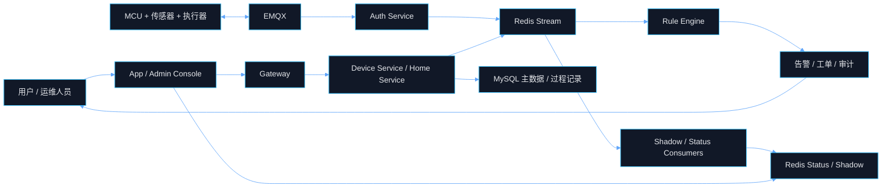
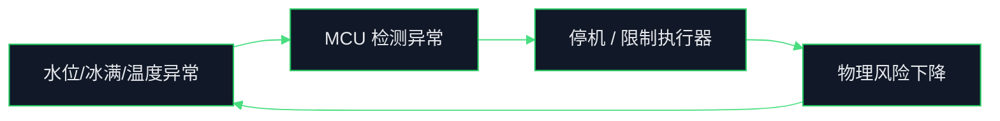

# AIoT 产品系统思维与控制论分析

## Premise / Constraints / Boundaries / Endgame

- Premise：当前产品不是单点“智能制冰机功能集合”，而是一个由 `设备硬件`、`连接链路`、`云端控制面`、`用户操作面`、`运维闭环` 共同构成的 AIoT 控制系统。代码侧已经落地 `Gateway/Auth/Device/Home` 主链路，并通过 `Redis Stream` 连接设备状态、影子、规则和运维动作。
- Constraints：`MySQL` 负责强一致设备主数据，`Redis` 负责状态快照与高频中间态，`Redis Stream` 负责跨服务事件扇出；高频遥测历史库尚未落地，告警/工单/审计更多停留在 Redis 过程态；设备链路存在网络抖动、配网失败、事件堆积、状态回写延迟等天然时滞。
- Boundaries：本文聚焦“智能制冰机 + AIoT 平台”这一完整产品系统，重点分析目标函数、因果关系、反馈回路、控制点、失稳风险和演进抓手，不展开供应链、销售渠道、财务报表等经营模块。
- Endgame：把该产品从“能接入、能控制、能告警”的功能系统，升级为“能稳定闭环、能自我校正、能持续学习”的控制系统，为后续 OTA 优化、预测维护、运营智能和全球复制交付奠定结构化判断框架。

***

## 1. 先给结论

### 1.1 这是什么系统

- 这是一个典型的 **双控制器、双时钟、双闭环** 产品：
  - **本地快速控制器**：`MCU + 传感器 + 执行器`，负责毫秒到秒级安全控制。
  - **云端慢速控制器**：`App + Gateway + Auth + Device Service + Rule Engine`，负责秒级到分钟级状态同步、联动、运营和策略优化。
- 产品的真实竞争力不在“远程开关机”本身，而在于是否能够持续维持以下四个结果：
  - 设备始终可被识别、可被连接、可被控制。
  - 异常能被尽快发现、隔离、通知和处理。
  - 控制意图与设备实际执行状态之间的偏差可被观测并收敛。
  - 线上运行数据最终能反哺固件、规则和运营策略迭代。

### 1.2 当前系统的本质判断

- 当前系统已经形成了 **控制面骨架**：
  - 配网入口已存在。
  - 连接鉴权已存在。
  - 状态快照与影子已存在。
  - 事件驱动联动已存在。
  - OTA 与运维闭环雏形已存在。
- 当前系统还缺少 **数据面闭环**：
  - 高频遥测历史没有沉淀到 TSDB。
  - 告警/工单/审计缺少长期经营分析底座。
  - 下行命令到设备执行回执的完整产品化闭环还不够强。
- 因此现阶段最准确的定位是：
  - **控制逻辑已成型，学习逻辑未成型；实时闭环已具备，长期优化闭环仍薄弱。**

***

## 2. 系统边界与目标函数

### 2.1 系统目标函数

从系统思维看，这个产品不是追求单个模块最优，而是追求整体目标函数最优：

```text
用户可用性 × 设备安全性 × 状态可信度 × 闭环响应速度 × 运维效率
```

如果拆成产品语言，可以归纳为五个硬目标：

- `G1`：用户能低成本完成配网与绑定。
- `G2`：设备在弱网和异常工况下仍安全运行。
- `G3`：用户看到的状态尽量接近设备真实状态。
- `G4`：异常从发生到处理要足够快，且可追溯。
- `G5`：运行数据能沉淀为规则优化、固件升级和产品迭代资产。

### 2.2 系统边界



### 2.3 边界外但会反向影响系统的扰动

- 弱网与家庭路由器质量。
- BLE / Wi-Fi 模组稳定性。
- 传感器漂移、误报码、硬件老化。
- 用户错误操作，如断电、断网、长期不清洁。
- 固件质量与版本碎片化。

这些不在云端代码边界内，但会直接改变系统的输入噪声和控制难度。

***

## 3. 状态变量、控制变量、观测变量

### 3.1 核心状态变量

- **设备身份状态**：是否已注册、是否已绑定、属于哪个家庭/房间。
- **连接状态**：在线、离线、最近心跳、鉴权是否通过。
- **物理运行状态**：制冰中、待机、缺水、冰满、清洗中、故障。
- **控制一致性状态**：`desired` 与 `reported` 是否一致，`delta` 是否持续堆积。
- **运维闭环状态**：告警是否生成、工单是否处理、问题是否恢复。
- **软件演进状态**：当前固件版本、OTA 任务成功率、失败原因分布。

### 3.2 控制变量

- 本地控制变量：
  - 压缩机开关。
  - 水泵/风机/电机动作。
  - 本地保护停机。
- 云端控制变量：
  - 影子 `desired`。
  - App 下发控制指令。
  - 规则引擎动作。
  - OTA 升级任务。

### 3.3 观测变量

- 设备侧传感器观测：
  - 水位。
  - 冰满状态。
  - 温度。
  - 故障报码。
- 云端侧观测：
  - webhook 连接事件。
  - Redis 在线 Key。
  - 影子 `reported`。
  - 规则触发次数。
  - 状态刷库成功率、失败率、丢弃率。

### 3.4 关键判断

- 只有 **观测到的状态** 才能进入控制回路。
- 当前平台对“在线状态、影子状态、事件状态”的观测较强。
- 当前平台对“连续遥测历史、故障前征兆、真实物理行为曲线”的观测偏弱。
- 这意味着系统更擅长处理“离散事件”，不擅长处理“连续变化趋势”。

***

## 4. 因果链与逻辑链

### 4.1 主价值链

```text
配网成功率提升
-> 有效设备存量提升
-> 可控设备基数提升
-> 可观测事件量提升
-> 规则与运维闭环更完整
-> 用户体验与故障恢复效率提升
-> 留存与复购潜力提升
```

### 4.2 主风险链

```text
弱网 / 传感器误报 / 事件链路抖动
-> 平台看到的状态偏离设备真实状态
-> 错误告警或漏告警
-> 用户对远程控制失去信任
-> 使用频次下降
-> 数据质量下降
-> 后续优化能力进一步变差
```

### 4.3 关键逻辑链拆解

#### 链 1：从连接到可信状态

```text
设备能通过鉴权
-> 平台建立在线事实
-> 设备状态进入 Redis 快照
-> 事件进入 Stream
-> 设备服务刷库、规则引擎消费
-> App/后台可见
-> 用户开始信任“这个设备现在真的在线”
```

如果这一链条任何一环失真，就会出现“设备在线但 App 显示离线”或“设备已断线但平台仍认为在线”的典型信任问题。

#### 链 2：从控制意图到物理执行

```text
用户下发控制指令
-> 云端写入 desired / 指令通道
-> 设备执行动作
-> 设备回报 reported
-> 平台比较 desired 与 reported
-> 用户看到执行结果
```

这一链本质上是“**期望值 -> 执行值 -> 偏差收敛**”的标准控制链。`DeviceShadowServiceImpl` 已经具备 `desired/reported/version/delta` 模型，但完整的“命令送达与回执闭环”仍需要进一步增强。

#### 链 3：从异常到运维恢复

```text
设备缺水 / 冰满 / 故障
-> 本地保护 or 上报事件
-> 事件进入 Stream
-> Rule Engine 匹配规则
-> 生成告警 / 工单 / 审计
-> 人或系统采取动作
-> 状态恢复
-> 告警关闭
```

这个链条决定系统是否只是“看见问题”，还是能“把问题处理掉”。

#### 链 4：从运行数据到产品迭代

```text
设备运行事件积累
-> 故障模式被识别
-> 规则阈值 / 固件逻辑 / 运维 SOP 被调整
-> OTA 发版
-> 新版本覆盖线上设备
-> 故障率下降 / 体验改善
```

这是产品长期护城河的来源。但当前因为缺少高频遥测时序层，这个链条还不能高质量闭合。

***

## 5. 反馈回路分析

### 5.1 平衡回路 B1：本地安全保护回路



- 作用：抑制物理风险，优先级最高。
- 特征：快、硬、局部闭环，不依赖云。
- 产品含义：哪怕云全挂，本地安全控制仍必须成立。

### 5.2 平衡回路 B2：状态纠偏回路

```text
desired 与 reported 存在偏差
-> 平台计算 delta
-> 设备继续执行 or 用户重新下发
-> reported 更新
-> 偏差收敛
```

- 作用：让“用户想要的状态”和“设备真实状态”靠近。
- 当前支撑：影子版本控制、`delta` 计算、事件发布。
- 风险：如果下行命令或回执链薄弱，偏差会长期存在，用户会认为“远程控制不可靠”。

### 5.3 平衡回路 B3：异常恢复回路

```text
异常事件增加
-> 告警/工单增加
-> 人工处理增强
-> 故障被清除
-> 异常事件减少
```

- 作用：把异常压回正常区间。
- 当前支撑：`RuleLifecycleService` + 运维对象。
- 风险：如果告警只能产生、不能沉淀为可分析历史，系统会“忙但不学习”。

### 5.4 增强回路 R1：可观测性增强回路

```text
设备事件量增加
-> 系统看得更清楚
-> 规则与策略更准
-> 异常恢复更快
-> 用户活跃度更高
-> 产生更多高质量数据
```

- 作用：数据越多，系统越聪明。
- 前提：必须有可靠的数据归档和分析能力。
- 当前约束：高频遥测历史未成体系，因此增强回路强度不足。

### 5.5 增强回路 R2：版本演进回路

```text
故障模式被识别
-> 固件/规则被修正
-> OTA 发版
-> 线上问题减少
-> 可用性提升
-> 更多用户持续使用
-> 更多反馈用于下一轮修正
```

- 作用：把故障处理从“救火”升级为“系统免疫力提升”。
- 当前短板：缺少针对失败类型的长期聚类、归因和版本对比数据。

***

## 6. 控制论视角下的系统结构

### 6.1 控制对象、控制器、传感器、执行器

| 角色                     | 当前对象                  | 系统作用                   |
| :--------------------- | :-------------------- | :--------------------- |
| 控制对象 Plant             | 制冰机物理过程               | 真正被调节的对象，包含制冰、停机、清洗、保护 |
| 传感器 Sensor             | 水位、冰满、温度、故障报码、连接事件    | 让系统知道当前发生了什么           |
| 本地控制器 Local Controller | MCU 固件逻辑              | 做实时安全控制与本地状态机切换        |
| 云端控制器 Cloud Controller | App、影子、规则引擎、OTA       | 做慢速决策、策略优化、远程控制        |
| 执行器 Actuator           | 压缩机、水泵、电机、风机、清洁动作     | 把控制指令转成物理动作            |
| 观测器 Observer           | Redis 状态、影子、事件流、告警、工单 | 把分散状态重构成可观测事实          |

### 6.2 当前最重要的三个控制回路

| 回路   | 闭环路径                          | 时间尺度  | 成败标准      |
| :--- | :---------------------------- | :---- | :-------- |
| 安全回路 | 传感器 -> MCU -> 执行器 -> 物理状态     | 毫秒到秒  | 不出现危险运行   |
| 体验回路 | App -> 云端 -> 设备 -> 上报 -> App  | 秒级    | 指令可达、状态可信 |
| 运维回路 | 事件 -> 规则 -> 告警/工单 -> 处理 -> 恢复 | 分钟到小时 | 故障可闭环、可复盘 |

### 6.3 当前系统的控制质量判断

- **稳定性**：本地安全回路理论上最稳，云端回路受网络与数据时滞影响更大。
- **可观测性**：离散事件可观测性较强，连续遥测可观测性较弱。
- **可控性**：在线状态、影子状态、规则动作具备基本可控性；真实物理过程仍高度依赖本地固件质量。
- **适应性**：通过规则与 OTA 具备一定适应能力，但缺少长期数据学习底座。

***

## 7. 时滞、噪声与失稳点

### 7.1 系统中的关键时滞

- 配网时滞：用户操作、BLE 发现、Wi-Fi 连接、云端 claim 存在天然延迟。
- 连接时滞：EMQX webhook 到 Redis 在线键再到 MySQL 刷库存在秒级延迟。
- 状态时滞：`desired` 写入后，设备执行和 `reported` 回传存在不确定延迟。
- 运维时滞：告警触发后，到人工处理和恢复有分钟级甚至小时级延迟。
- 版本时滞：故障识别到 OTA 修复是以天或周计的慢循环。

### 7.2 系统中的主要噪声

- 网络抖动导致上下线抖动。
- webhook 重放攻击或异常请求。
- 传感器误报、临界值抖动。
- Redis / Stream 瞬时压力导致事件消费滞后。
- 用户误操作造成的“伪异常”。

### 7.3 失稳点识别

- **失稳点 1：状态双写不一致**
  - Redis 在线态与 MySQL 落库态存在延迟。
  - 如果消费滞后或刷库失败，运营视图会分叉。
- **失稳点 2：影子长期偏差**
  - `desired` 已更新，但设备未执行或未回执。
  - 用户会认为系统“接受了命令但没生效”。
- **失稳点 3：事件消费堆积**
  - Stream lag 增长时，告警和状态同步会整体滞后。
  - 控制回路会从闭环退化成“看到了历史”。
- **失稳点 4：无历史遥测，无法提前纠偏**
  - 只能在离散故障发生后反应，不能对趋势异常进行提前干预。

***

## 8. 结合现有实现的关键控制点

### 8.1 接入门控点

- `AuthServiceImpl` 负责：
  - 一机一密鉴权。
  - webhook 时间窗校验。
  - 防重放。
  - 在线状态 Key 更新。
  - 上下线事件写入 `aiot:stream:device-event`。
- 这相当于系统的 **输入闸门**。闸门失守，后续所有状态都不可信。

### 8.2 状态缓冲点

- `DeviceStatusBufferService` 负责：
  - 把高频状态变化先缓存在内存。
  - 按批次刷入 MySQL。
  - 记录成功、失败、丢弃和时延指标。
- 这相当于系统的 **低通滤波器**：
  - 避免高频状态抖动直接打穿数据库。
  - 但也引入了“最终一致而非瞬时一致”的控制特征。

### 8.3 影子协调点

- `DeviceShadowServiceImpl` 负责：
  - `desired/reported/meta/version` 写入。
  - 乐观锁版本控制。
  - `delta` 计算。
  - 影子事件发布。
- 这相当于系统的 **状态估计器 + 指令缓冲器**：
  - 它不直接执行物理动作。
  - 它负责保存期望、比对现实、暴露偏差。

### 8.4 规则决策点

- `RuleLifecycleService` 负责：
  - 按事件类型筛选规则。
  - 通过 Redis 幂等键防重执行。
  - 把事件转为告警、Webhook 或工单动作。
- 这相当于系统的 **慢速决策器**：
  - 用于运营与联动，不适合承载毫秒级安全控制。

***

## 9. 产品层面的核心矛盾

### 9.1 快速上线 vs 长期可学

- 当前方案优先完成了“接入、控制、告警、OTA”最小闭环。
- 代价是“高频历史数据、长期行为分析、预测性维护”还未建立底层。
- 结果：系统能跑，但暂时还不够会学。

### 9.2 实时体验 vs 一致性成本

- Redis 快照和状态缓冲提高了实时性与吞吐。
- 但 Redis、内存缓冲、MySQL 之间天然存在时间差。
- 结果：系统高性能的前提是接受“短时间口径不一致”。

### 9.3 云端能力 vs 本地自治

- 云端可以做远程控制、规则联动、OTA 和可观测。
- 但制冰机这种物理设备的核心安全不能依赖云。
- 结果：必须坚持“安全闭环本地化，体验闭环云端化”的设计原则。

### 9.4 告警很多 vs 真正闭环

- 规则引擎容易让系统“会报警”。
- 但没有长期记录、归因和处理标准化，报警只会制造运维噪声。
- 结果：需要从“事件响应系统”升级为“问题消减系统”。

***

## 10. 杠杆点与演进优先级

### 10.1 P0：补齐遥测时序层

- 原因：没有高频历史，系统就无法判断故障趋势、性能劣化和版本回归。
- 直接收益：
  - 让规则从离散触发走向趋势触发。
  - 让 OTA 评估从主观判断变成数据判断。
  - 为预测维护建立必要数据底座。

### 10.2 P0：打通下行命令闭环

- 目标链路：
  - `用户命令 -> desired / 下发 -> 设备执行 -> reported -> 偏差消失`
- 直接收益：
  - 这是用户体验可信度的核心。
  - 比继续增加新功能更影响留存。

### 10.3 P0：把运维过程态历史化

- 当前告警/工单/审计更多是 Redis 过程态。
- 应升级为可查询、可聚类、可分析、可对账的历史资产。
- 直接收益：
  - 让规则优化和售后决策有事实基础。

### 10.4 P1：细化生命周期状态机

- 建议把设备状态扩展为：
  - `REGISTERED`
  - `PROVISIONING`
  - `BOUND`
  - `ONLINE`
  - `OFFLINE`
  - `FAULT`
  - `OTA_UPGRADING`
  - `DISABLED`
  - `DELETED`
- 直接收益：
  - 不同团队对设备所处阶段能用统一语言协作。

### 10.5 P1：把规则引擎从“告警器”升级为“策略器”

- 当前规则引擎更偏事件转告警。
- 下一步应逐渐支持：
  - 趋势判定。
  - 跨状态组合条件。
  - 自动恢复动作建议。
  - 面向设备影子的策略下发。

***

## 11. 用一句话概括每条主链

### 11.1 用户价值链

- 用户购买的不是“远程按钮”，而是“即使不在设备旁边，也能相信设备正在被正确控制和保护”。

### 11.2 技术实现链

- 当前产品通过 `鉴权 -> 在线状态 -> 影子 -> 事件流 -> 规则 -> OTA` 建起了最小可运行控制链。

### 11.3 风险扩散链

- 任何观测失真都会先破坏状态可信度，再破坏控制可信度，最后破坏用户信任。

### 11.4 护城河形成链

- 只有把运行数据沉淀成版本优化、规则优化和运维优化能力，产品才会从“能卖”升级为“越跑越强”。

***

## 12. 最终判断

- 从系统思维看，这个产品已经不是单纯的智能硬件，而是一个 **物理设备系统 + 数字控制系统 + 运维学习系统** 的复合体。
- 从控制论看，当前最强的是 **本地安全回路** 和 **云端事件回路**，最弱的是 **长期学习回路**。
- 从因果关系看，真正决定产品上限的不是再加几个新功能，而是三个核心变量：
  - `状态是否可信`
  - `异常是否闭环`
  - `数据是否能反哺版本演进`
- 从演进逻辑看，下一阶段最该投的不是更多“表层功能”，而是四个结构性工程：
  - `遥测时序层`
  - `命令闭环`
  - `运维历史化`
  - `细状态机`

如果这四个点补上，这个产品才会从“有云能力的智能设备”真正进入“可持续优化的 AIoT 产品系统”阶段。
