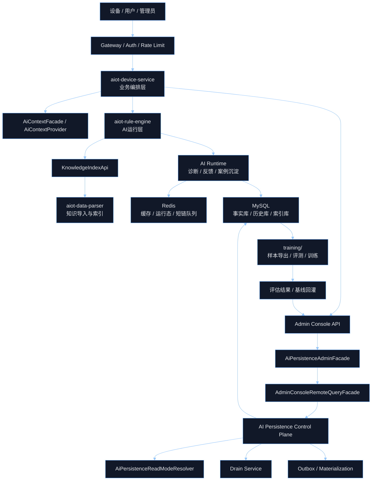
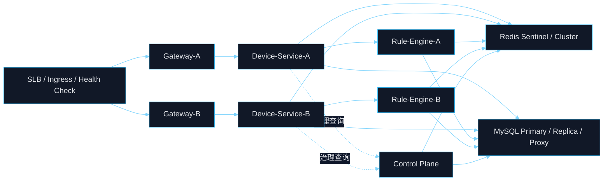
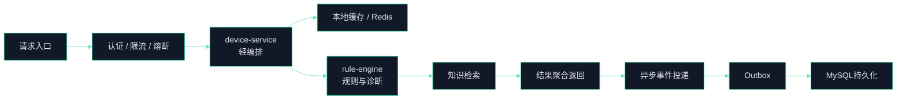
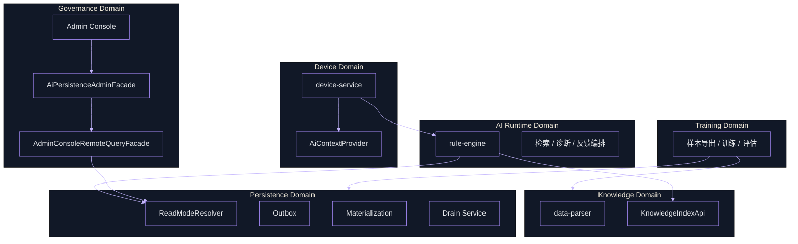
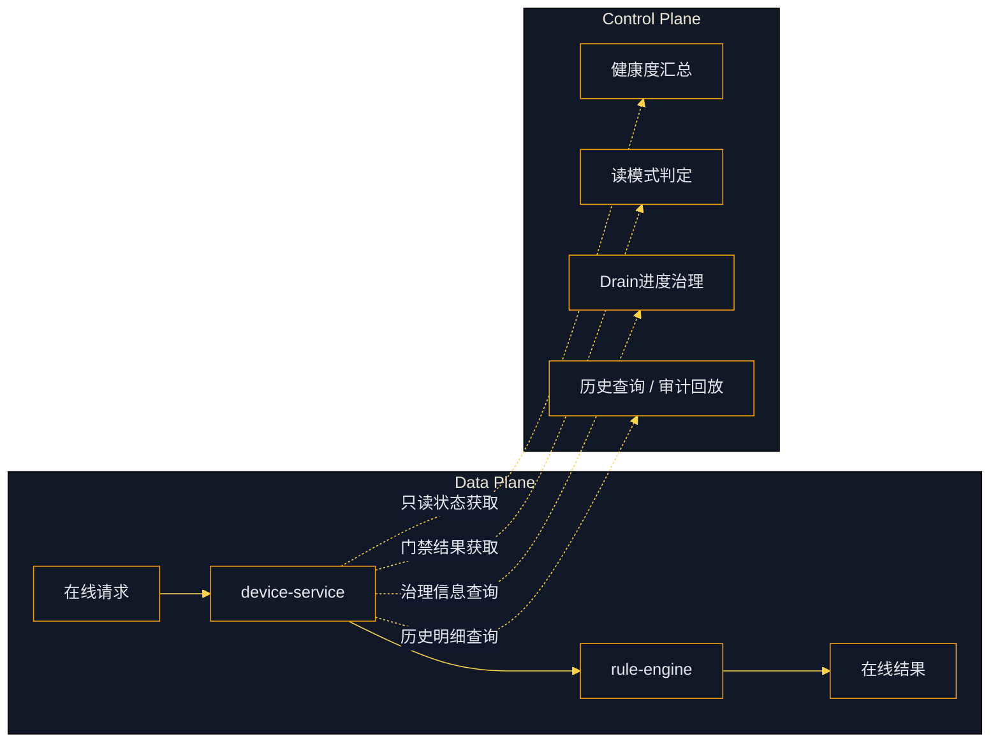

# AIOT 三高架构图谱体系

## Premise / Constraints / Boundaries / Endgame

- Premise：当前 `AIOT-java` 已形成 `Gateway`、`device-service`、`rule-engine`、`data-parser`、`training`、`Redis`、`MySQL`、`Admin Console` 的基础模块，并已落地 AI 持久化控制面、Drain、Outbox、历史审计、训练回灌等关键能力。
- Constraints：文档只基于仓库内已存在模块、命名和工程约束进行抽象，不臆造未落地的中间件平台；架构设计必须兼容当前单仓多模块形态，并为后续拆分微服务保留硬边界。
- Boundaries：In Scope 包括高可用、高并发、高扩展三套架构图体系、控制面与数据面分层、SLO 与门禁指标、演进路线；Out of Scope 包括具体业务页面原型、细粒度 API 字段设计、云厂商资源编排细节。
- Endgame：形成一套可用于架构评审、研发协同、容量规划、上线门禁和服务拆分的统一图谱，支撑系统从单仓多模块平滑演进为 `Device Domain`、`AI Runtime`、`AI Persistence`、`AI Governance`、`Training Platform` 的稳定体系。

## 1. 一页结论

- 架构总原则：`主链路做轻`、`控制面做强`、`事实库做稳`、`扩展边界做硬`。
- 高可用原则：任何单点故障都不能让 `在线设备诊断与控制主链路` 整体不可用。
- 高并发原则：任何非实时动作不得阻塞 `同步请求返回路径`，重任务全部异步化、批处理化、幂等化。
- 高扩展原则：新增能力优先挂接到 `Facade / Provider / Api Contract`，禁止跨域依赖具体实现。
- 终局结构：`业务面`、`控制面`、`数据面`、`训练面` 四面解耦，支持未来独立拆仓或独立部署。

## 2. 目标态分层

| 分层 | 目标 | 当前项目对应模块 | 核心责任 |
| --- | --- | --- | --- |
| 接入层 | 抗流量、抗攻击、统一鉴权 | `aiot-gateway` | JWT 校验、限流、熔断、路由、头部防伪 |
| 业务编排层 | 保持主链路短、薄、快 | `aiot-device-service` | 设备业务、上下文拼装、Admin 聚合 |
| AI 运行层 | 规则决策与诊断编排 | `aiot-rule-engine` | 检索、诊断、反馈、在线持久化编排 |
| 知识层 | 管理知识索引与导入 | `aiot-data-parser` | 物模型与 Wiki/Runbook 双源入库 |
| 持久化控制层 | 管切换、Drain、审计、历史 | `AiPersistence*` 相关实现 | 读模式门禁、补偿、回放、治理查询 |
| 数据层 | 低时延加速 + 强事实留存 | `Redis`、`MySQL` | 缓存/队列/运行态、事实库/历史库/索引库 |
| 训练与评估层 | 闭环沉淀与模型反馈 | `training/` | 样本导出、训练、评测、结果回灌 |

## 3. 总览图



## 4. 高可用体系

### 4.1 设计原则

- 服务无状态化：`Gateway`、`device-service`、`rule-engine` 以多实例部署承载故障摘流。
- 数据分层容灾：`Redis` 仅做加速与暂存，`MySQL` 作为最终事实源。
- 控制面隔离：治理故障不得直接拖垮主业务链路。
- 读切换门禁：`MySQL-first` 必须建立在一致性、积压、Live Flow 全通过前提下。
- 审计留痕：Drain、回放、切换、补偿必须生成标准化证据。

### 4.2 高可用部署图



### 4.3 高可用控制点

| 控制点 | 目标 | 当前项目锚点 |
| --- | --- | --- |
| 入口摘流 | 失效实例快速摘除 | `Gateway`、健康检查、`docker-compose` 健康探针思路 |
| 服务冗余 | 单实例故障不影响总体服务 | `device-service`、`rule-engine` 多实例化 |
| 缓存容灾 | 缓存故障不影响主事实一致性 | `Redis` 只承载运行时态与加速 |
| 存储容灾 | 历史与关键事实可追溯 | `MySQL` + 历史索引 + 审计记录 |
| 控制面隔离 | 治理功能失效不拖垮主链路 | `AiPersistenceAdminFacade`、`AdminConsoleRemoteQueryFacade` |
| 切换门禁 | 避免带病切到 `MySQL-first` | `AiPersistenceReadModeResolver` |

### 4.4 高可用故障策略

- `Gateway` 故障：通过多实例 + 健康检查摘流。
- `device-service` 故障：无状态横向扩容，流量切到其他实例。
- `rule-engine` 故障：请求快速失败或降级，不阻塞设备基础操作。
- `Redis` 故障：热点读降级到数据库或只读快照，禁止 Redis 成为唯一事实源。
- `MySQL` 故障：读写分离、主从切换、限流保护，控制面冻结危险切换动作。
- `Control Plane` 故障：Admin 治理能力受限，但在线主链路继续运行。

## 5. 高并发体系

### 5.1 设计原则

- 主链路只保留 `鉴权 -> 上下文 -> 规则执行 -> 响应` 的最短路径。
- 所有重操作后移到 `Outbox`、`Materialization`、异步任务。
- 热读优先走本地缓存或 `Redis`，强事实写入 `MySQL`。
- 高冲突资源依赖幂等键、唯一约束、批处理与回放机制兜底。
- 限流、熔断、线程池隔离、慢调用超时作为并发保护的第一道防线。

### 5.2 高并发主链路图



### 5.3 并发控制矩阵

| 层 | 核心手段 | 设计要求 |
| --- | --- | --- |
| 接入层 | 限流、黑白名单、JWT 校验 | 非法流量不过网关 |
| 应用层 | 无状态实例、线程池隔离、快速失败 | 业务线程与 I/O 线程隔离 |
| 缓存层 | 热点缓存、TTL 分层、Key 空间隔离 | 缓存只做性能加速 |
| 持久化层 | 批量写、顺序写、Outbox 回放 | 避免同步链路重写放大 |
| 冲突控制 | 幂等键、唯一索引、补偿回放 | 确保并发下结果可收敛 |
| 后台任务层 | Drain、Materialization、Replay | 与主链路彻底解耦 |

### 5.4 高并发热点治理

- 设备上下文热点：通过 `AiContextProvider` 和缓存层承接，避免重复拼装。
- 知识检索热点：通过 `KnowledgeIndexApi` 聚合检索接口，避免业务层多点直连。
- Admin 查询热点：通过治理查询 Facade 汇总，避免前台直接打散到底层实现。
- 历史审计热点：通过历史索引文件与专项查询接口承接，不挤占在线写路径。
- 训练样本导出：严格走离线流程，不进入在线事务主链路。

## 6. 高扩展体系

### 6.1 拆分原则

- 稳定边界优先于技术分层，先按领域拆，再按部署拆。
- 契约优先于实现，所有跨域依赖收敛到 `Facade / Provider / Api`。
- 控制面、业务面、训练面各自独立演进，避免双向依赖。
- 文档、指标、门禁与服务边界同步演进，禁止代码先拆、治理滞后。

### 6.2 高扩展域划分图



### 6.3 扩展边界锚点

| 扩展边界 | 当前契约 | 扩展价值 |
| --- | --- | --- |
| 设备域 -> AI 运行域 | `AiContextProvider` | 设备上下文拼装独立可替换 |
| AI 运行域 -> 知识域 | `KnowledgeIndexApi` | 检索实现可独立演进 |
| 业务域 -> 治理域 | `AiPersistenceAdminFacade` | Admin 聚合不绑定底层实现 |
| Admin -> 远程查询域 | `AdminConsoleRemoteQueryFacade` | 查询链路可抽成独立控制服务 |
| 运行域 -> 持久化域 | `AiPersistenceReadModeResolver` | 读策略、门禁与主流程解耦 |

### 6.4 推荐拆分顺序

1. `AI Persistence / Governance` 先独立，最强治理价值，且已具备 Facade 和 Query 契约基础。
2. `AI Runtime` 后独立，承接诊断编排、检索与在线 AI 运行。
3. `Knowledge Domain` 再独立，承接文档入库、索引构建、知识服务。
4. `Training Platform` 最后独立，形成离线训练与评测平台。

## 7. 数据面与控制面分离

### 7.1 分离原则

- 数据面只负责在线请求吞吐、时延、成功率。
- 控制面只负责切换判定、Drain、补偿、审计、历史回放。
- 数据面不内嵌复杂治理流程，只消费治理结果。
- 控制面必须提供只读治理视图与专项查询契约，避免大 DTO 泛化。

### 7.2 分离图



## 8. 数据流体系

### 8.1 在线数据流

```text
设备请求
-> Gateway 鉴权 / 限流
-> device-service 业务编排
-> rule-engine 诊断与规则执行
-> Redis 命中热数据
-> MySQL 写入事实记录
-> 异步 Outbox / Materialization / 历史索引
```

### 8.2 离线闭环流

```text
MySQL 事实库 / 历史库
-> training 样本导出
-> 训练 / 评估
-> 评估报告 / 基线结果
-> Admin Console 治理视图
-> 反向指导切流门禁与运行参数
```

### 8.3 数据角色定义

| 数据类型 | 主存储 | 用途 | 约束 |
| --- | --- | --- | --- |
| 运行时热点数据 | `Redis` | 低时延读、短期队列、会话态 | 不作为唯一事实源 |
| 在线事实数据 | `MySQL` | 诊断、反馈、案例、状态 | 强一致、可审计 |
| 历史索引数据 | JSON 索引 + 查询接口 | 审计回放、治理检索 | 必须结构化留档 |
| 训练样本数据 | `training/` 导出产物 | SFT / Eval / 评测 | 与在线链路解耦 |

## 9. 容量、SLO 与门禁

### 9.1 容量指标

| 类别 | 核心指标 | 目标用途 |
| --- | --- | --- |
| 吞吐 | `QPS`、`TPS` | 判断横向扩容时机 |
| 时延 | `P95`、`P99` | 判断主链路是否变重 |
| 应用资源 | 线程池队列长度、拒绝数、CPU、GC | 判断实例是否过载 |
| 缓存 | 命中率、穿透率、热点 Key 分布 | 判断 Redis 是否有效卸载 |
| 数据库 | 慢查询数、连接池占用、主从延迟 | 判断 MySQL 是否成为瓶颈 |

### 9.2 高可用指标

| 类别 | 核心指标 | Go / No-Go 关注点 |
| --- | --- | --- |
| 实例可用性 | 存活率、重启频次、摘流时长 | 是否存在雪崩式摘流 |
| 缓存稳定性 | Redis 故障降级成功率 | 缓存挂掉后主链路能否继续 |
| 存储稳定性 | MySQL 主从延迟、失败率 | 是否允许切换读模式 |
| 控制稳定性 | Drain 任务成功率、补偿积压 | 是否允许继续扩容和切流 |

### 9.3 AI 持久化门禁

| 门禁项 | 通过条件 | 依赖能力 |
| --- | --- | --- |
| 一致性门禁 | 双写一致率达标 | `AiPersistenceReadModeResolver` |
| 积压门禁 | `Outbox` 与 `Drain` 无异常积压 | Replay / Drain 状态服务 |
| 活体门禁 | `Live Business Flow` 全通过 | 主链路验证脚本与在线状态 |
| 审计门禁 | 历史索引完整可回放 | `ai_business_live_flow_index.json` |
| 参数门禁 | `history/detail` 参数校验严格执行 | `reportType` 白名单与 `occurredAt > 0` |

## 10. 演进路线

### 10.1 L0 当前基线

- 单仓多模块，已具备 AI 持久化控制面能力。
- Redis + MySQL 双栈共存，正在向 `MySQL-first` 收敛。
- Admin 侧已具备治理摘要、历史查询、状态聚合基础。

### 10.2 L1 治理收敛

- 完成 `ReadModeResolver` 门禁闭环。
- 完成 Drain、Replay、历史审计证据化。
- 统一 Admin 查询契约与只读视图模型。

### 10.3 L2 服务拆分

- `AI Persistence / Governance` 独立部署。
- `AI Runtime` 独立扩缩容。
- `Knowledge Domain` 独立提供索引服务。

### 10.4 L3 平台化

- `Training Platform` 独立化。
- 主链路、治理链路、离线训练链路三套资源池分治。
- 形成服务级 SLO、演练、回滚、容量治理闭环。

## 11. 架构评审检查清单

- 是否保证任一单点故障不会让在线主链路全量不可用。
- 是否保证所有非实时任务均已异步化并可幂等回放。
- 是否保证 Redis 不承载不可恢复的唯一事实。
- 是否保证控制面与业务面之间通过 Facade / Query 契约交互。
- 是否保证切流动作依赖证据门禁，而不是人工经验。
- 是否保证历史、Drain、补偿、治理结果可审计可回放。
- 是否保证训练样本导出不侵入在线事务路径。

## 12. 项目锚点映射

| 能力域 | 关键模块 / 类 | 说明 |
| --- | --- | --- |
| 接入治理 | `aiot-gateway` | 统一鉴权、限流、流量控制 |
| 业务编排 | `aiot-device-service` | 设备业务与 Admin 聚合入口 |
| 上下文边界 | `AiContextFacade`、`AiContextProvider` | 设备域到 AI 域的稳定桥 |
| AI 编排 | `aiot-rule-engine` | 在线诊断、反馈、规则引擎 |
| 知识边界 | `KnowledgeIndexApi` | 知识索引服务契约 |
| 持久化治理 | `AiPersistenceReadModeResolver` | 切读门禁与读模式决策 |
| 控制面执行 | `AiControlPlaneDrainService` | Drain 与迁移治理核心 |
| Admin 聚合 | `AiPersistenceAdminFacade`、`AdminConsoleRemoteQueryFacade` | 治理查询与状态聚合出口 |
| 审计闭环 | `ai_business_live_flow_index.json` 相关机制 | 历史索引、回放、证据留档 |
| 离线闭环 | `training/` | 训练、评估、结果回灌 |

## 13. 标准输出物建议

- `L0 业务总览图`：给管理层与跨部门，回答系统由哪些域构成。
- `L1 高可用部署图`：给运维与架构，回答挂一台是否会整体失效。
- `L2 高并发链路图`：给后端与性能团队，回答高峰流量下哪里先到瓶颈。
- `L3 数据流与控制流图`：给 AI、数据与治理团队，回答事实、缓存、训练、审计如何闭环。
- `L4 演进拆分图`：给 CTO 与架构委员会，回答未来如何独立部署和拆仓。

## 14. 收敛表达

- 高可用的本质：`把故障限制在局部，而不是让故障沿链路传播`。
- 高并发的本质：`把重操作移出同步链路，把冲突变成幂等和回放问题`。
- 高扩展的本质：`先做稳定边界，再做物理拆分`。
- 本项目三高架构的核心抓手：`Facade 化`、`控制面独立化`、`事实库收敛到 MySQL`、`训练闭环与在线闭环分治`。
