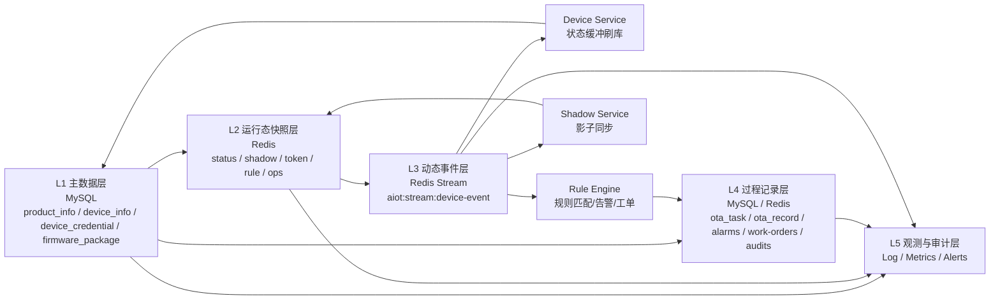

# 硬件设备全生命周期数据体系梳理

## Premise / Constraints / Boundaries / Endgame
- Premise：当前仓库围绕硬件设备生命周期，已经形成以 `MySQL + Redis + Redis Stream` 为核心的数据体系；设备主数据、配网、鉴权、在线状态、影子、规则事件、OTA、运维闭环均有落地实现。
- Constraints：当前“强一致主数据”主要落在 MySQL；“高频状态与过程态”主要落在 Redis；“跨服务扇出事件”统一经由 Redis Stream `aiot:stream:device-event`；TSDB / 对象存储更多停留在设计文档，未见完整运行时实现。
- Boundaries：本文聚焦“设备全生命周期”的数据体系，不展开用户中心、支付、营销等非设备核心域；但保留家庭/房间/权限对设备归属的必要上下文。
- Endgame：把项目中的设备数据按“生命周期阶段 + 静态/动态 + 存储介质 + 数据流转 + 责任服务”进行统一建模，形成可用于架构评审、数据治理和后续演进的基线文档。

---

## 1. 结论先行

### 1.1 当前项目的数据体系主干
- **静态主数据层**：产品、设备、设备凭证、固件包，存储在 MySQL。
- **运行态快照层**：在线状态、配网 token、影子、规则定义、运营闭环记录，主要存储在 Redis。
- **动态事件层**：设备上线/离线、配网成功/失败、影子更新等统一抽象为 `DeviceEvent`，通过 Redis Stream 扇出给多个服务消费。
- **过程记录层**：OTA 任务与升级记录落 MySQL；告警、工单、审计当前落 Redis Hash。
- **一致性补偿层**：Pending Recovery、DLQ、家庭删除补偿任务，负责跨服务故障恢复与最终一致。
- **规划扩展层**：遥测时序库、对象存储、冷/热分层在文档中已有设计，但代码侧尚未形成完整闭环。

### 1.2 本项目最关键的数据结构划分
- **设备是谁**：产品定义、设备资产、设备凭证、归属关系。
- **设备现在怎么样**：在线/离线、影子 reported/desired、固件版本、最近心跳。
- **设备刚刚发生了什么**：连接、断连、配网成功/拒绝、影子变更、后续可扩展遥测/事件。
- **系统围绕设备做了什么**：规则匹配、告警生成、工单流转、OTA 批次升级、清理补偿。
- **系统如何证明自己是可靠的**：日志、traceId、DLQ、pending recovery、状态缓冲刷库指标。

---

## 2. 生命周期视角总览

### 2.1 生命周期阶段分层

| 生命周期阶段 | 业务动作 | 核心静态数据 | 核心动态数据 | 主要存储 | 责任服务 |
| :--- | :--- | :--- | :--- | :--- | :--- |
| 产品定义 | 定义产品与物模型 | `product_info`、`thing_model_json` | 无或极少 | MySQL | `device-service` |
| 资产注册 | 创建设备资产、生成凭证 | `device_info`、`device_credential` | 初始状态 `INACTIVE` | MySQL | `device-service` |
| 绑定/配网 | 发 token、claim、认领家庭 | `home_id`、`room_id`、`gateway_id` | token、配网锁、配网结果事件 | Redis + Stream + MySQL | `device-service` |
| 连接鉴权 | 设备向 EMQX 建连 | `device_secret`、设备标识 | 防重放记录、鉴权结果 | Redis | `auth-service` |
| 上下线运行 | 设备上线/下线、心跳更新 | `device_info.status`、`last_heartbeat_time` | Redis 在线键、上线/下线事件 | Redis + Stream + MySQL | `auth-service` + `device-service` |
| 状态同步 | 影子写入与状态对账 | 固定字段元数据较少 | `reported`、`desired`、`delta`、`version` | Redis + Stream | `device-service` / `shadow-service` |
| 规则联动 | 基于设备事件触发动作 | 规则定义 | 告警、工单、审计、设备状态视图 | Redis + Stream | `rule-engine` |
| OTA 升级 | 固件发布、批量升级 | 固件包、任务定义 | 升级记录、成功/失败统计 | MySQL | `device-service` |
| 退网/解绑/删除 | 解绑家庭、删除资产、补偿清理 | 设备逻辑删除标记 | 删除事件、补偿任务 | MySQL + Redis + Stream | `device-service` + `home-service` |

### 2.2 生命周期状态机

当前设备状态枚举相对收敛，主状态只有三种：`未激活 -> 在线 -> 离线`，并允许 `离线 -> 在线` 循环。

```mermaid
%%{init: {'theme': 'base', 'themeVariables': { 'background': '#0b1020', 'primaryColor': '#121a33', 'primaryTextColor': '#e6e9f2', 'lineColor': '#5b6cff', 'fontFamily': 'ui-monospace, SFMono-Regular, Menlo, Monaco, Consolas, "Liberation Mono", "Courier New", monospace'}}}%%
stateDiagram-v2
    [*] --> "未激活(INACTIVE)"
    "未激活(INACTIVE)" --> "在线(ONLINE)": "首次成功连接/激活"
    "在线(ONLINE)" --> "离线(OFFLINE)": "断连/超时"
    "离线(OFFLINE)" --> "在线(ONLINE)": "重连"
```

### 2.3 生命周期与数据形态的对应关系

| 数据形态 | 本质 | 生命周期中的作用 | 当前落地点 |
| :--- | :--- | :--- | :--- |
| 主数据 | 描述设备身份和归属 | 决定设备能否被识别、绑定、授权、升级 | MySQL |
| 快照数据 | 描述设备当前可见状态 | 支撑控制台、联动、快速查询 | Redis |
| 事件数据 | 描述“刚发生的事情” | 驱动跨服务响应和解耦 | Redis Stream |
| 过程记录 | 描述一个任务如何推进 | 支撑追责、复盘、统计 | MySQL / Redis |
| 观测数据 | 描述系统运行质量 | 支撑运维与故障定位 | Log / Metrics / Alert |

---

## 3. 数据体系分层模型

## 3.1 L1：静态主数据层

这层回答的是“设备是什么、属于谁、凭什么接入、能升级什么版本”。

### 产品主数据
- 表：`product_info`
- 核心字段：`product_key`、`name`、`node_type`、`thing_model_json`
- 作用：
  - 定义设备的产品归属与节点类型。
  - 承载当前版本的物模型定义。
  - 作为配网、鉴权、设备创建、OTA 的上游约束。

### 设备资产主数据
- 表：`device_info`
- 核心字段：`device_name`、`product_key`、`status`、`home_id`、`room_id`、`gateway_id`、`firmware_version`、`last_heartbeat_time`
- 作用：
  - 充当设备资产主表。
  - 承担设备归属、拓扑关系、状态落库和版本信息。
  - 通过唯一索引约束 `(product_key, device_name, is_deleted)`，保证同产品下设备命名唯一。

### 设备凭证主数据
- 表：`device_credential`
- 核心字段：`device_id`、`auth_type`、`device_secret`
- 作用：
  - 承载一机一密鉴权基础。
  - 是 EMQX 鉴权回调的核心上游数据。

### OTA 静态数据
- 表：`firmware_package`
- 核心字段：`package_id`、`product_key`、`version`、`download_url`、`checksum`
- 作用：
  - 定义“什么产品可升级到什么版本、从哪里下载”。
  - 是 OTA 任务创建和升级记录生成的静态输入。

### 静态主数据的本质特征
- 更新频率低于运行态数据。
- 具有明确的唯一性和归属约束。
- 更重一致性，因此主要落 MySQL。
- 是所有动态过程的“参照系”。

## 3.2 L2：运行态快照层

这层回答的是“设备此刻处于什么状态、平台现在怎么看它”。

### 在线状态缓存
- Key：`aiot:device:status:{deviceId}`
- 类型：`String`
- 值：`online`
- TTL：当前实现中为 `120s`
- 特点：
  - 由 `auth-service` 在 webhook 中直接更新。
  - 作为设备实时在线视图。
  - 与 MySQL 中的 `device_info.status` 构成“缓存态 + 落库态”双层结构。

### 设备影子
- Key：
  - `aiot:device:shadow:reported:{deviceId}`
  - `aiot:device:shadow:desired:{deviceId}`
  - `aiot:device:shadow:meta:{deviceId}`
  - `aiot:device:shadow:version:{deviceId}`
- 类型：`Hash + Counter`
- 核心内容：
  - `reported`：设备实际已上报状态
  - `desired`：平台期望设备达到的状态
  - `delta`：当前差异集
  - `version`：乐观锁版本号
- 特点：
  - 运行态、可频繁更新。
  - 用 Lua 做并发冲突控制。
  - 写入后会继续发布影子事件，进入动态事件层。

### 配网临时态
- Key：
  - `aiot:device:provision:{token}`
  - `aiot:device:provision-lock:{productKey}:{deviceName}`
- 类型：`String`
- 作用：
  - `token` 控制配网请求的一次性兑换。
  - `lock` 防止同一设备并发认领。

### 规则与运营态快照
- Key：
  - `aiot:rule:definitions`
  - `aiot:rule:exec:idempotency:{ruleId}:{eventId}`
  - `aiot:ops:alarms`
  - `aiot:ops:work-orders`
  - `aiot:ops:audits`
  - `aiot:ops:device-status`
- 作用：
  - 快速支撑规则定义查询、执行幂等、控制台运营统计。

### 运行态快照层的本质特征
- 读写频繁，强调低延迟。
- 接近“当前事实”而不是“历史全量”。
- 很多数据具备 TTL、覆盖写、版本演进等特征。
- 适合承接控制台实时查询与联动判定。

## 3.3 L3：动态事件层

这层回答的是“设备和系统刚刚发生了什么，以及谁需要对此做出反应”。

### 统一事件模型
- 事件对象：`DeviceEvent`
- 当前事件类型：
  - `DEVICE_ONLINE`
  - `DEVICE_OFFLINE`
  - `DEVICE_PROVISION_SUCCEEDED`
  - `DEVICE_PROVISION_REJECTED`
  - `DEVICE_PROVISION_FAILED`
  - `SHADOW_DESIRED_UPDATED`
  - `SHADOW_REPORTED_UPDATED`

### 统一事件总线
- 主 Stream：`aiot:stream:device-event`
- DLQ Stream：`aiot:stream:device-event:dlq`
- 事件字段通常包括：
  - `eventId`
  - `eventType`
  - `deviceId`
  - `payload`

### 事件生产者
- `auth-service`
  - 生产上线/下线事件。
- `device-service`
  - 生产配网成功/拒绝/失败事件。
  - 生产影子 desired/reported 更新事件。
- 文档设计态中的 `data-parser`
  - 目标是把遥测和状态上报标准化后写入同一事件总线。

### 事件消费者
- `device-service`
  - 消费在线/离线事件，写入状态缓冲区，再批量落 MySQL。
- `rule-engine`
  - 消费设备事件，触发规则匹配，生成告警、工单、审计。
- `shadow-service`
  - 消费事件做影子同步或相关动作。

### 事件层的价值
- 解耦写入方和消费方。
- 让“状态变更”转化成“多服务可订阅事实”。
- 支撑水平扩展、ACK、失败重试、DLQ 和 pending recovery。

## 3.4 L4：过程记录层

这层回答的是“围绕设备跑过哪些业务流程，这些流程执行到了哪里”。

### OTA 过程记录
- 表：`ota_upgrade_task`
- 粒度：一次升级任务/批次
- 核心字段：
  - `task_id`
  - `home_id`
  - `product_key`
  - `package_id`
  - `target_version`
  - `total_count` / `success_count` / `failed_count`

- 表：`ota_upgrade_record`
- 粒度：单设备升级执行记录
- 核心字段：
  - `record_id`
  - `task_id`
  - `device_id`
  - `from_version`
  - `to_version`
  - `status`
  - `active_flag`
  - `error_message`
  - `report_time`

### 运维闭环记录
- Redis Hash：
  - `aiot:ops:alarms`
  - `aiot:ops:work-orders`
  - `aiot:ops:audits`
- 本质：
  - 当前项目已实现“事件触发 -> 生成运营对象 -> 管理台读取统计”的闭环。
  - 但这部分目前更偏运行缓存/过程态，尚未沉淀为强一致历史库。

### 补偿任务记录
- 表：`home_delete_compensation_task`
- 作用：
  - 当家庭删除时，异步修复设备解绑与跨服务残留状态。

### 过程记录层的本质特征
- 相比快照数据，更强调“过程可追踪”。
- 相比事件数据，更强调“结果沉淀与复盘”。
- 是做 SLA、复盘、运营分析、审计追责的关键基础。

## 3.5 L5：观测与审计层

这层回答的是“数据链路是否健康、故障出现在哪里、系统是否可证明地可靠”。

### 日志
- 日志框架：`logback-spring.xml`
- 关键能力：携带 `traceId`
- 作用：
  - 串起设备请求、内部调用、事件写流、消费处理链路。

### 指标
- 典型指标：
  - `aiot.device.status.flush.success.total`
  - `aiot.device.status.flush.failed.total`
  - `aiot.device.status.flush.dropped.total`
  - `aiot.device.status.flush.duration`
- 作用：
  - 衡量状态缓冲刷库是否稳定。

### 告警与可观测链路
- 监控组件：Prometheus / Loki / Promtail
- 作用：
  - 对日志、指标、告警规则形成统一观测面。

---

## 4. 静态数据体系梳理

## 4.1 设备域静态主数据总表

| 数据对象 | 存储位置 | 核心字段 | 用途 | 生命周期阶段 |
| :--- | :--- | :--- | :--- | :--- |
| 产品 | `product_info` | `product_key`、`node_type`、`thing_model_json` | 定义产品与物模型 | 产品定义 |
| 设备 | `device_info` | `device_name`、`product_key`、`home_id`、`room_id`、`gateway_id` | 形成设备资产与归属 | 注册/绑定/运行/退网 |
| 凭证 | `device_credential` | `device_id`、`device_secret`、`auth_type` | 鉴权接入 | 鉴权 |
| 固件包 | `firmware_package` | `package_id`、`version`、`download_url` | OTA 输入 | OTA |
| OTA 任务定义 | `ota_upgrade_task` | `task_id`、`target_version` | 升级批次定义 | OTA |

## 4.2 静态数据的治理重点
- **唯一性**：产品唯一、设备唯一、凭证唯一、固件版本唯一。
- **归属关系**：设备归属家庭/房间/网关，是权限与联动范围的基础。
- **版本关系**：固件版本与产品强关联，决定设备升级目标是否合法。
- **物模型关系**：`thing_model_json` 是未来遥测解析、影子校验、命令生成的上游契约。

---

## 5. 动态过程数据体系梳理

## 5.1 配网过程

### 输入
- 产品主数据
- 设备标识
- 家庭归属

### 中间态
- 配网 token
- 配网锁
- 配网审计 ID

### 输出
- 设备资产落库
- 凭证可返回设备端
- 配网结果事件入 Stream

### 数据意义
- 把“待接入设备”转成“平台已认领设备”。
- 是静态主数据和动态运行态之间的入口闸门。

## 5.2 连接与在线过程

### 输入
- `device_secret`
- `clientId/username/password/signature`

### 中间态
- webhook 防重放记录
- Redis 在线状态

### 输出
- `DEVICE_ONLINE` / `DEVICE_OFFLINE`
- `device_info.status` 最终刷库

### 数据意义
- 平台第一次获得“设备在不在线”的实时事实。
- 是规则引擎和实时运营视图的高频触发源。

## 5.3 影子过程

### 输入
- 用户/App 下发期望状态
- 设备回报实际状态

### 中间态
- `desired`
- `reported`
- `version`
- `delta`

### 输出
- 影子事件
- 面向设备控制的一致性中间层

### 数据意义
- 解决设备离线情况下的控制意图保留问题。
- 把控制面和设备执行面解耦。

## 5.4 规则联动过程

### 输入
- 设备事件流

### 中间态
- 规则定义
- 幂等键
- 条件匹配结果

### 输出
- 告警
- 工单
- 审计记录
- 后续可扩展为下行命令或影子 desired 写入

### 数据意义
- 把设备事件转化为平台业务动作。
- 是“设备数据 -> 业务闭环”的核心放大器。

## 5.5 OTA 过程

### 输入
- 固件包
- 升级任务
- 目标设备集合

### 中间态
- 升级记录
- 单活约束 `active_flag`

### 输出
- 成功/失败统计
- 固件版本演进结果

### 数据意义
- 把“设备版本”从静态字段变成可运营、可统计的过程数据。

## 5.6 退网与删除过程

### 输入
- 解绑请求
- 删除请求

### 中间态
- 逻辑删除标记
- 补偿任务
- 后续清理事件

### 输出
- 设备归属解除
- 跨服务缓存/引用清理

### 数据意义
- 决定系统能否避免“幽灵设备”“脏影子”“脏规则引用”。

---

## 6. 设备全生命周期数据流总图



---

## 7. 当前实现中的“现状”与“规划态”边界

## 7.1 已落地能力
- 设备主数据模型已落地。
- 配网 token / 锁 / claim 流程已落地。
- EMQX 鉴权与 webhook 上下线处理已落地。
- Redis 在线状态缓存与 MySQL 状态刷库已落地。
- 影子 `desired/reported/version/delta` 已落地。
- 事件总线、ACK、DLQ、pending recovery 已落地。
- OTA 包、任务、记录表已落地。
- 规则引擎消费事件并生成告警/工单/审计已落地。

## 7.2 仍偏规划态能力
- 设备海量遥测进入 TSDB 的完整落地链路。
- 遥测 schema/version 治理。
- 对象存储承载固件包或物模型历史快照。
- 下行命令通道的完整产品化闭环。
- 运维闭环从 Redis 过程态沉淀到长期历史库。

## 7.3 这意味着什么
- 当前项目已经具备“设备资产管理 + 连接状态管理 + 事件驱动联动 + OTA 管理”的核心骨架。
- 但还没有彻底完成“高频遥测数据平台”和“长期经营分析数据平台”的建设。
- 因此，当前的数据体系更像是“控制面 + 运行面已成型，数据面与分析面仍在补齐”。

---

## 8. 关键问题与数据治理建议

## 8.1 当前体系的优点
- **分层清晰**：主数据、快照、事件、过程记录已经自然分层。
- **实时性好**：高频状态使用 Redis 承接，不直接打 MySQL。
- **解耦较好**：Redis Stream 让多个服务独立消费。
- **可靠性初步具备**：ACK、DLQ、pending recovery 已形成最小闭环。

## 8.2 当前体系的主要短板
- **遥测数据层缺位**：高频时序数据仍未形成生产级归档和查询底座。
- **过程记录长期化不足**：告警/工单/审计目前落 Redis，更适合过程态而不是长期经营分析。
- **设备状态维度偏粗**：主状态只有未激活/在线/离线，缺少更细颗粒度的生命周期状态。
- **影子单一权威源仍需收敛**：`device-service` 与 `shadow-service` 的职责边界仍要持续明确。
- **删除清理仍偏补偿式**：跨服务清理依赖补偿与事件，治理清单需要继续制度化。

## 8.3 建议的下一步数据建设优先级

### P0：先补“设备数据底账”
- 目标：
  - 为每类设备数据明确唯一主表、主 Key、主事件、主责任服务。
  - 对所有 Redis Key、Stream、Hash 建立统一字典。
- 收益：
  - 降低后续联动、统计、审计时的数据口径冲突。

### P0：补“遥测时序层”
- 目标：
  - 让设备属性/事件/遥测进入 TSDB。
  - 与 `thing_model_json` 建立解析契约。
- 收益：
  - 真正补齐“设备运行历史”维度，而不是只看当前快照。

### P0：补“过程记录长期化”
- 目标：
  - 告警、工单、审计从 Redis 过程态扩展到可保留、可检索、可统计的历史存储。
- 收益：
  - 支撑管理驾驶舱、SLA 复盘和经营分析。

### P1：补“生命周期细状态机”
- 目标：
  - 在 `INACTIVE / ONLINE / OFFLINE` 之上增加更细状态，如 `REGISTERED / PROVISIONING / BOUND / OTA_UPGRADING / DISABLED / DELETED`。
- 收益：
  - 让运营、风控、售后、固件运维使用统一状态语言。

### P1：补“下行闭环”
- 目标：
  - 把规则结果、影子 desired、设备执行结果打通。
- 收益：
  - 形成真正完整的“感知 -> 决策 -> 执行 -> 回执”闭环。

---

## 9. 附：当前仓库中的关键数据对象清单

## 9.1 MySQL 表
- `product_info`
- `device_info`
- `device_credential`
- `firmware_package`
- `ota_upgrade_task`
- `ota_upgrade_record`
- `home_delete_compensation_task`

## 9.2 Redis Key / Hash / Stream
- `aiot:device:status:{deviceId}`
- `aiot:device:shadow:reported:{deviceId}`
- `aiot:device:shadow:desired:{deviceId}`
- `aiot:device:shadow:meta:{deviceId}`
- `aiot:device:shadow:version:{deviceId}`
- `aiot:device:provision:{token}`
- `aiot:device:provision-lock:{productKey}:{deviceName}`
- `aiot:stream:device-event`
- `aiot:stream:device-event:dlq`
- `aiot:rule:definitions`
- `aiot:rule:exec:idempotency:{ruleId}:{eventId}`
- `aiot:ops:alarms`
- `aiot:ops:work-orders`
- `aiot:ops:audits`
- `aiot:ops:device-status`

## 9.3 核心代码依据
- 设备域表结构：`aiot-db-migrator/src/main/resources/db/migration/aiot_cloud`
- 生命周期状态机：`aiot-device-service/src/main/java/com/aiot/device/model/DeviceStatus.java`
- 在线状态与事件发布：`aiot-auth-service/src/main/java/com/aiot/auth/service/impl/AuthServiceImpl.java`
- 状态缓冲刷库：`aiot-device-service/src/main/java/com/aiot/device/service/DeviceStatusBufferService.java`
- Redis Key 规范：`aiot-common/src/main/java/com/aiot/common/config/RedisUtils.java`
- 影子模型：`aiot-device-service/src/main/java/com/aiot/device/service/impl/DeviceShadowServiceImpl.java`
- 配网模型：`aiot-device-service/src/main/java/com/aiot/device/service/impl/ProvisionServiceImpl.java`
- 运维闭环记录：`aiot-rule-engine/src/main/java/com/aiot/rule/repository/OpsRecordRepository.java`
- 生命周期时序文档：`docs/architecture/DEVICE_LIFECYCLE_AND_DEVICE_LINKAGE_SEQUENCES.md`
- 存储架构文档：`docs/database_architecture.md`

---

## 10. 最终归纳
- 从**静态角度**看，这个项目已经具备完整的设备身份、归属、凭证、固件四类核心底账。
- 从**动态角度**看，这个项目已经具备配网、鉴权、上下线、影子、规则、OTA、补偿恢复的关键过程数据链路。
- 从**架构角度**看，当前最成熟的是“控制面 + 事件面 + 快照面”，相对欠缺的是“时序面 + 历史分析面”。
- 从**治理角度**看，下一步最值得投入的不是继续堆功能，而是补齐数据字典、遥测存储、过程历史化和细状态机。

