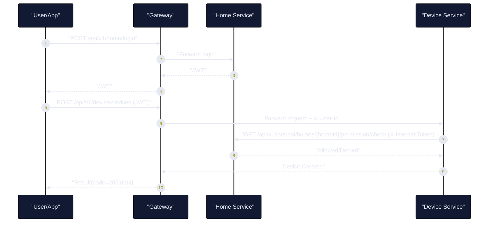
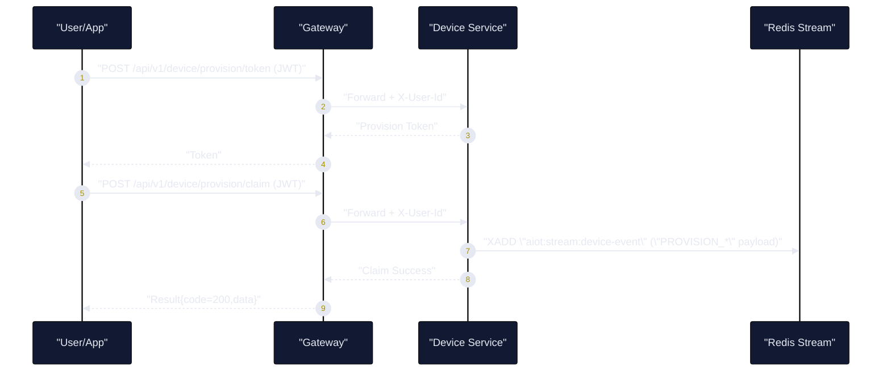
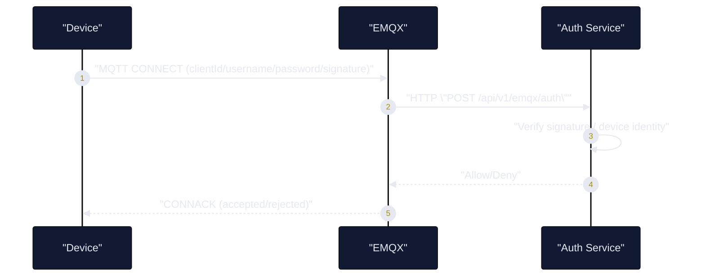
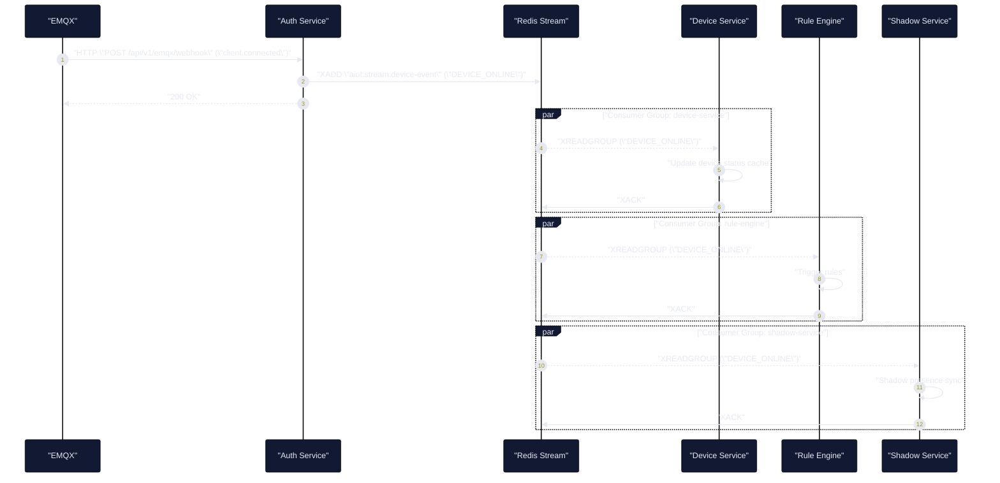
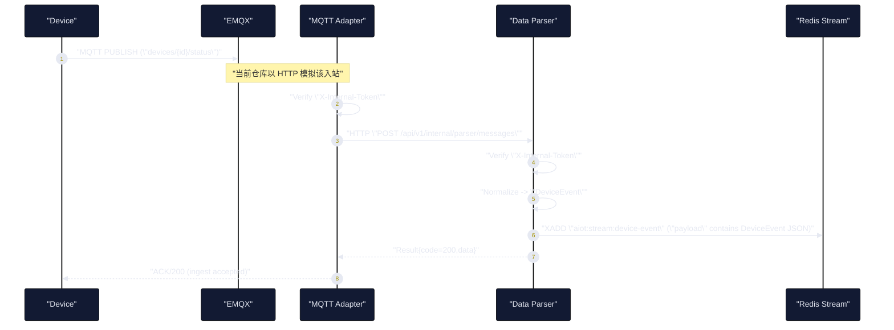
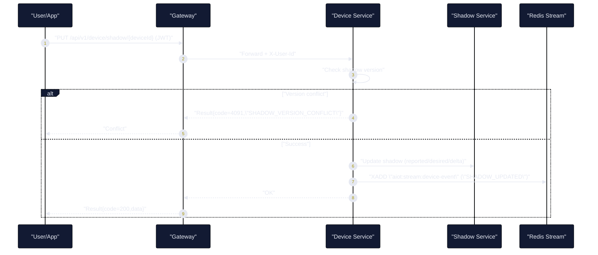
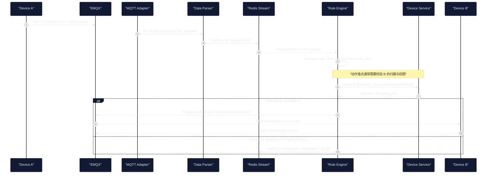
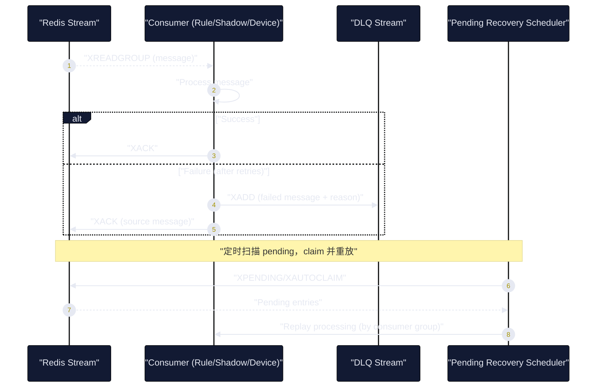
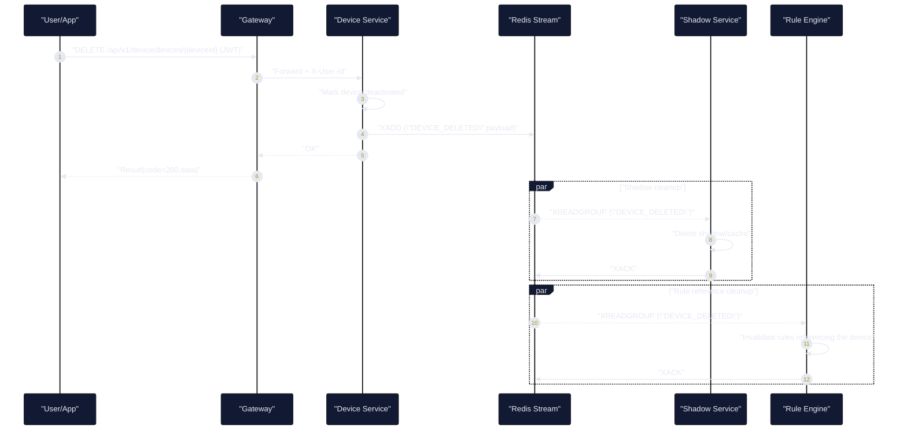

# 设备全生命周期与设备联动关键时序图

## Premise / Constraints / Boundaries / Endgame
- Premise：当前仓库的设备生命周期链路以 `EMQX(MQTT)` 作为连接/消息入口，云侧以 `auth-service` 做鉴权与 webhook 入站，业务侧通过 `Redis Stream(aiot:stream:device-event)` 承接事件扇出，分别由 `device-service / shadow-service / rule-engine` 消费。
- Constraints：关键链路事件总线统一使用 `Redis Stream + Consumer Group + ACK + DLQ/pending-recovery`，避免丢消息与“单点订阅者”阻塞。
- Boundaries：设备之间“直接通信”不做端到端直连，采用“设备 -> 云 -> 设备”的仲裁模式；跨设备联动由规则/影子/动作下发链路实现。
- Endgame：以时序图明确每个阶段“谁跟谁通信、通过什么介质、失败如何处理、如何保证可靠性/安全性/可观测”。

## 参与组件说明
- "Device"：真实设备（或模拟设备）
- "EMQX"：MQTT broker
- "Gateway"：HTTP 入口（用户/后台管理面）
- "Home Service"：用户/家庭/权限（含 internal 权限校验）
- "Device Service"：设备资产、配网、部分状态缓存、影子写入口
- "Auth Service"：EMQX 鉴权与 webhook 入站（上线/下线等）
- "MQTT Adapter"：入站适配（当前以 HTTP 模拟 MQTT 消息入站），转发 parser
- "Data Parser"：解析标准化（payload/topic -> DeviceEvent），写入 Stream
- "Redis Stream"：事件总线 `aiot:stream:device-event`
- "Rule Engine"：规则消费与联动编排
- "Shadow Service"：影子/事件消费（可与 device-service 影子实现并存）

---

## 1. 设备注册与绑定（管理面）
**说明**
- 这是“管理面（control plane）”链路：用户/后台通过 HTTP API 建立设备资产与归属关系，不要求设备在线。
- 关键点在权限：`device-service` 通过 `home-service` internal 接口校验家庭角色/权限，避免越权绑定。
- 典型输出：设备记录创建成功；后续配网、连接鉴权、影子与规则都以该资产信息为基准。

**迭代建议**
- P0：补齐“设备唯一性/幂等”约束（同一设备重复注册、重复绑定、重复解绑的幂等语义与错误码）。
- P0：补齐“审计留痕”字段（谁在何时把设备绑定到哪个 home/room，便于合规与排障）。
- P1：补齐“多租户/多家庭迁移”场景（设备转移、共享、临时授权的状态机与边界）。

---

## 2. 配网（Provision）与事件发布（事件面）
**说明**
- 配网开始把系统从“管理面”切换到“事件面（event plane）”：配网成功/失败会以事件形式进入总线，驱动多订阅者（缓存、影子、规则、告警等）。
- 事件发布到 `Redis Stream` 的好处：下游各自独立消费、互不阻塞，且可以水平扩展。
- 失败处理：配网事件发布失败应进入 DLQ 或做可观测告警（具体以实现为准）。

**迭代建议**
- P0：明确配网 token 的生命周期策略（过期、一次性兑换、重放防护、吊销机制）。
- P0：配网事件增加“业务幂等键”（如 claimId/provisionId），下游消费可去重。
- P1：补齐“灰度配网/批量配网”场景（并发风暴下的限流与隔离策略）。

---

## 3. 设备连接鉴权（MQTT Connect/AuthN）
**说明**
- 该链路发生在设备连接 broker（EMQX）时，是“设备入网门禁”。
- EMQX 通过 HTTP 回调 `auth-service` 来决策 allow/deny，从而把海量连接压力隔离在 broker 层，业务服务主要消费事件流。
- 安全要点：鉴权应基于设备身份（clientId/username）+ 签名/密钥，且需要防重放（由实现策略保证）。

**迭代建议**
- P0：补齐“鉴权失败可观测”指标（失败率、原因分布、设备维度 TopN），并与告警联动。
- P0：明确 TLS/密钥轮换策略（设备侧密钥如何更新，云侧如何灰度验证新旧密钥）。
- P1：补齐“ACL 授权”口径（topic 级 publish/subscribe 权限模型，避免越权订阅/下发）。

---

## 4. 上下线事件（Presence: Online/Offline）入流与多订阅方扇出
**说明**
- presence（上线/下线）是“多设备联动”的核心触发器：规则引擎可据此启动联动、告警；设备服务可更新在线缓存；影子服务可做同步/清理。
- 该模型依赖 Stream 的“多 Consumer Group 扇出”：同一条事件流可被多个服务独立消费并 ACK，避免单订阅者瓶颈。
- 失败处理：消费失败通过重试后进入 DLQ，并 ACK 源消息；pending 由定时任务回收重放（见第 8 节）。

**迭代建议**
- P0：明确“在线状态最终一致口径”（以 EMQX 为准 or 以最后事件为准），并定义状态过期/心跳策略。
- P0：上线/下线事件补齐“会话信息字段”（clientId/sessionId/ip/userAgent 等）用于排障与风控。
- P1：补齐“批量上线/掉线风暴”隔离策略（分区 consumer、限流、降级只更新缓存不触发重规则）。

---

## 5. 遥测/状态上报（Telemetry Ingestion）: Adapter -> Parser -> Stream
**说明**
- 这是“遥测/状态上报的标准化入流链路”：把各种 payload/topic 归一为统一的 `DeviceEvent`，并写入同一条 Stream。
- `MQTT Adapter` 的职责是入站治理与转发（含 `X-Internal-Token` 校验、跨服务调用治理），`Data Parser` 的职责是标准化与落流（保持 `eventId/eventType/deviceId/payload` 字段契约稳定）。
- 可观测要点：在写入 `payload` 时携带 `traceId`，便于日志检索与后续分布式追踪关联。

**迭代建议**
- P0：将 “HTTP 模拟入站” 逐步替换为真实 EMQX webhook / MQTT 消息管道（避免生产链路与文档口径不一致）。
- P0：完善 `Data Parser` 的解析能力（不仅 online/offline）：物模型 telemetry、事件 event、属性 property 的类型体系与校验规则。
- P0：写流失败的可观测与补偿：失败计数、失败原因、必要时写入 DLQ 并返回可追踪的 errorId。
- P1：引入“Schema/版本”治理（payload schemaVersion、解析规则灰度、向后兼容策略）。
- P1：补齐“反压/限流”策略（单设备刷屏、恶意 payload、超大报文的拒绝与隔离）。

---

## 6. 影子更新与版本冲突（Shadow Write/Conflict）
**说明**
- 影子是“设备数字孪生状态层”，支持设备离线时也能维护 desired/reported，并通过 delta 实现最终一致。
- 版本冲突是必要保护：避免并发写导致“后写覆盖先写”的隐性丢更新。
- 多设备联动通常通过影子建模：规则引擎消费事件后更新某设备 desired，触发下发（见第 7 节）。

**迭代建议**
- P0：明确影子权威源（device-service vs shadow-service）与单写入口，避免双写导致数据漂移。
- P0：补齐影子“回执/确认”语义（desired 下发后 reported 回报如何闭环，超时如何处理）。
- P1：补齐“影子压缩/快照”策略（高频上报下的存储与历史策略，delta 合并与版本清理）。

---

## 7. 设备联动（Device A -> Rule -> Device B）: 云侧仲裁与下行动作
> 说明：下行 publish 的具体实现点在仓库内仍需逐步补齐（例如通过 EMQX API 或 MQTT 下行），但“仲裁与时序”应按此设计落地。

**说明**
- “设备联动”本质是：`Device A 的事件` 触发 `Rule Engine` 计算，然后对 `Device B` 产生动作（command/desired）。
- 仲裁点在云侧：规则引擎必须先确认 `B` 的归属与权限（跨家庭/越权动作必须拒绝），并拿到 B 的路由信息（topic/online 状态等）。
- 下行动作建议具备回执：设备执行后回报状态，再次形成事件闭环（A/B 以及影子最终一致）。

**迭代建议**
- P0：实现“下行通道”并产品化（优先：EMQX API publish 或服务端 MQTT client publish），并落地幂等与重试策略。
- P0：定义命令协议：commandId、ttl、ackTopic、resultCode，以及设备端执行回执格式。
- P0：补齐“权限与隔离”：跨 home/device group 的联动必须拒绝；高风险动作需二次确认或白名单。
- P1：补齐“联动可观测”：每次联动的 traceId、命令耗时、成功率、失败原因分布与告警。

---

## 8. 事件消费失败：重试 / DLQ / Pending Recovery（可靠性闭环）
**说明**
- 该闭环解决两类问题：瞬时错误（重试可恢复）与永久错误（入 DLQ，避免 blocking 住消费组）。
- 关键约束：失败消息必须有可追溯信息（reason、原始 payload、消费组/consumer），便于回放与定位。
- pending recovery 只处理“已投递但未 ACK”的消息，避免消息永远卡在 pending 队列导致积压。

**迭代建议**
- P0：统一 DLQ 事件结构（失败原因、异常堆栈摘要、原始 messageId、重试次数、最后 consumer）。
- P0：补齐 DLQ 处理流程（告警 -> 人工/自动回放 -> 结果留痕），避免 DLQ 变成黑洞。
- P1：补齐“热点分区/多 Stream 分片”策略（按 deviceId 哈希分片，降低单 Stream 热点风险）。

---

## 9. 生命周期结束：解绑/删除（Deprovision / Delete）与一致性清理
**说明**
- 删除属于“跨服务一致性清理”场景：资产删除后，影子、规则引用、缓存必须同步清理，否则会产生幽灵设备与误触发联动。
- 采用事件驱动清理的好处：清理逻辑各自归属到对应服务（shadow 清理、规则引用清理），并且可按需扩展订阅方。
- 安全要点：删除/解绑必须强校验归属与权限，且内部清理接口需幂等可审计。

**迭代建议**
- P0：定义“软删除/硬删除”策略（保留期、可恢复窗口、审计留存），避免误删不可恢复。
- P0：补齐“级联清理清单”与验收脚本（影子、规则、缓存、告警订阅、历史数据）。
- P1：补齐“设备重入网”策略（删除后重新配网/重新绑定的身份与历史隔离）。

