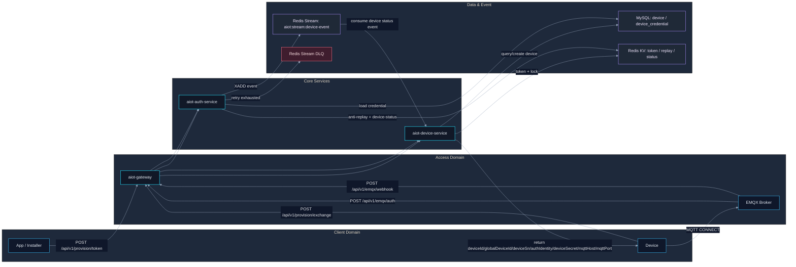
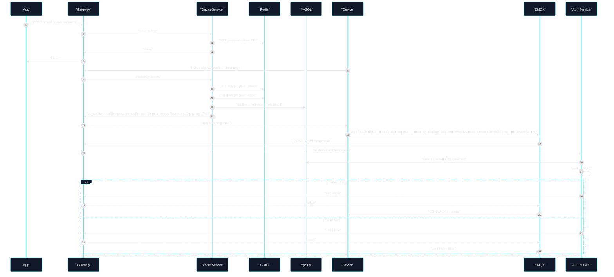
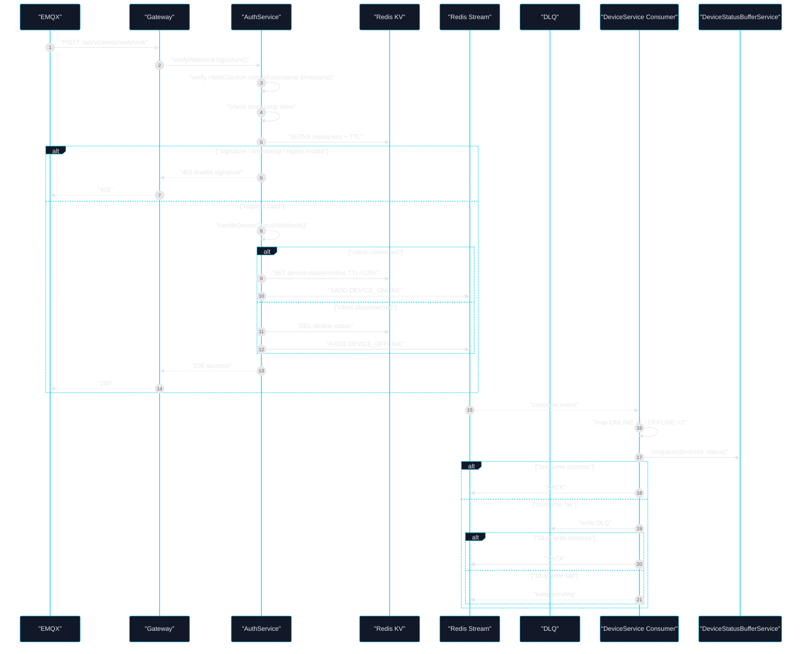
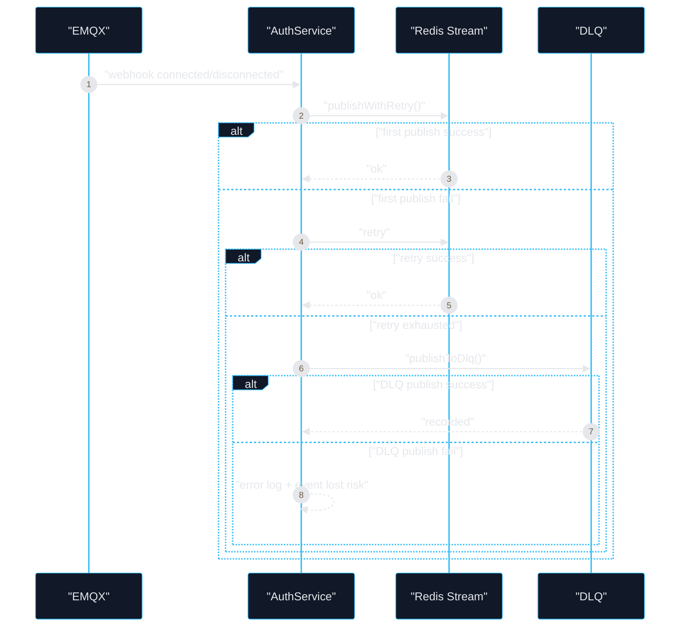

# EMQX 架构图与核心链路时序图

## Premise
- 当前仓库中，`EMQX` 主要承担两类职责：`MQTT 设备接入鉴权`、`设备上下线事件入口`。
- 设备业务真相源不在 `EMQX`，而在业务服务与数据层：`device-service`、`auth-service`、`MySQL`、`Redis Stream`。
- 当前实现以 `HTTP Auth/Webhook` 方式与 `EMQX` 对接，接口为 `/api/v1/emqx/auth` 与 `/api/v1/emqx/webhook`。

## Constraints
- `/api/v1/emqx/auth` 必须返回 `200 allow` 或 `401 deny`，保持与 `EMQX HTTP Auth` 契约兼容。
- `/api/v1/emqx/webhook` 必须同时通过 `签名校验`、`时间窗校验`、`防重放校验`。
- 状态事件必须经过 `Redis Stream` 进入下游消费链路，并具备 `重试` 与 `DLQ` 兜底。

## Boundaries
- In Scope：设备配网换凭证、设备连接 `EMQX` 鉴权、上下线事件同步、状态流消费、失败兜底。
- Out of Scope：`EMQX Dashboard` 手工运维流程、用户体系登录/JWT 签发、完整设备遥测消息处理链路。

## Endgame
- 形成“`设备可接入`、`事件可追踪`、`状态可落地`、`异常可兜底`、`验收可量化`”的 `EMQX` 工程闭环。

## 1) 组件架构图

## 2) 核心链路一：配网到 MQTT 接入

## 3) 核心链路二：上下线事件同步

## 4) 核心链路三：事件发布失败与降级

## 5) 实现映射
- `EMQX` 容器编排：`docker-compose.yml`
- `Gateway` 路由 `/api/v1/emqx/**` 与 `/api/v1/provision/**`：`aiot-gateway/src/main/resources/application.yml`
- `EMQX Auth/Webhook` 控制器：`aiot-auth-service/src/main/java/com/aiot/auth/controller/EmqxAuthController.java`
- `鉴权 + 验签 + 防重放 + Stream 发布`：`aiot-auth-service/src/main/java/com/aiot/auth/service/impl/AuthServiceImpl.java`
- `配网换凭证并返回 MQTT 接入点`：`aiot-device-service/src/main/java/com/aiot/device/service/impl/ProvisionServiceImpl.java`
- `设备状态事件消费`：`aiot-device-service/src/main/java/com/aiot/device/listener/DeviceStatusStreamSubscriber.java`

## 6) 验收卡点
- `配网闭环`：`/api/v1/provision/exchange` 返回 `deviceId/globalDeviceId/deviceSn/authIdentity/deviceSecret/mqttHost/mqttPort`
- `鉴权闭环`：`/api/v1/emqx/auth` 成功为 `200 allow`，失败为 `401 deny`
- `安全闭环`：Webhook 同时通过 `签名`、`时间窗`、`防重放`
- `状态闭环`：`connected/disconnected` 进入 `Redis Stream` 并被 `device-service` 消费
- `兜底闭环`：发布失败进入 `DLQ`，消费失败优先写 `DLQ`，否则保留 `pending`
- `性能闭环`：`2xx >= 99.9%`、`5xx <= 0.1%`、`pending` 不持续上升、`DLQ` 增量可解释

## 7) 快速阅读顺序
1. 看 `EmqxAuthController`，确认 `EMQX` 外部契约。
2. 看 `AuthServiceImpl`，确认鉴权、验签、防重放、事件发布主流程。
3. 看 `ProvisionServiceImpl`，确认设备如何拿到 `MQTT` 接入信息。
4. 看 `DeviceStatusStreamSubscriber`，确认状态事件如何在设备域落地。
