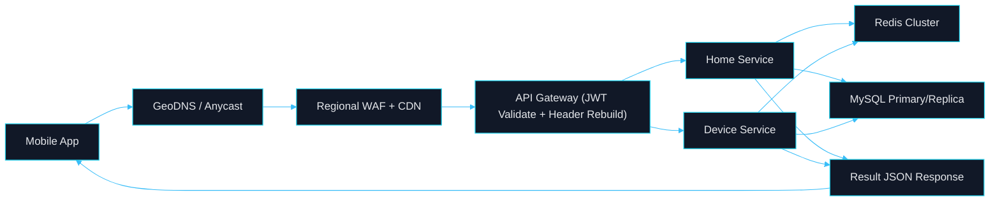
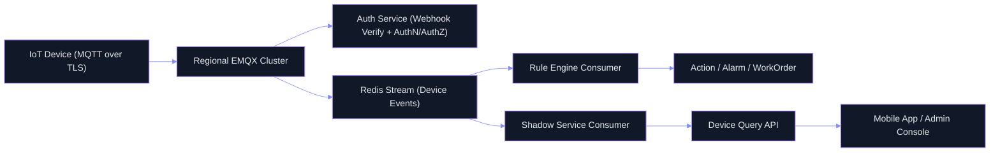
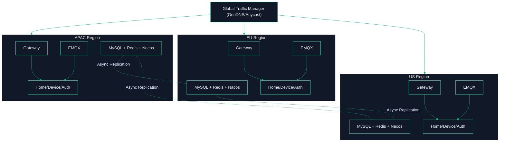
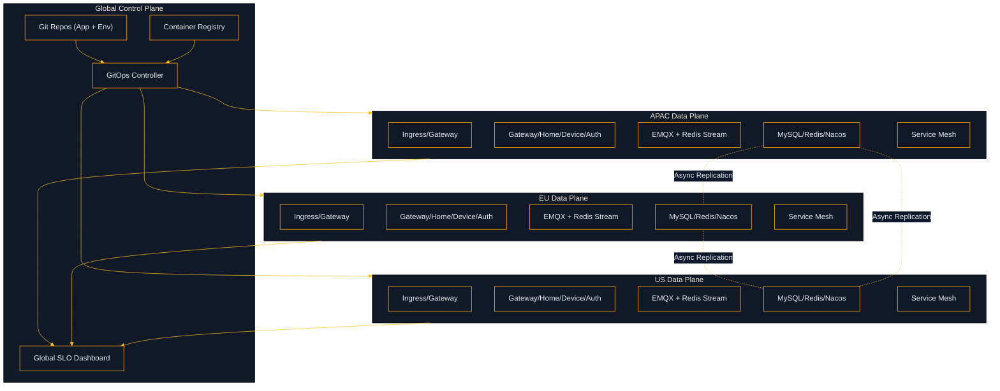

# AIOT 全球用户全链路设计与部署方案（云原生改造项目版）

## 1. Premise / Constraints / Boundaries / Endgame

### Premise
- 当前项目已具备 `Gateway/Auth/Device/Home` 微服务形态，设备侧通过 `EMQX + webhook` 接入，服务侧统一 `Result<T>` 返回。
- 目标从“单区域可用”升级为“全球用户可用”，覆盖 `手机端` 与 `设备端` 两条主链路。
- 改造目标不是“重新造系统”，而是把现有 Spring Boot 架构升级为可复制、可治理、可弹性的云原生平台能力。

### Constraints
- 必须保持现有认证职责边界：用户 JWT 在网关校验，设备鉴权由 `aiot-auth-service` 处理。
- 内部调用必须保持 `X-Internal-Token`，关键设备事件必须使用 `Redis Stream + Consumer Group + ACK`。
- 需要兼容现有 Spring Boot 多模块工程，优先增量演进，避免一次性重构。
- 迁移期间必须保证业务连续性：核心 API 与设备链路不可中断，允许灰度切流与双轨运行。

### Boundaries
- 本文范围：全球接入、链路设计、部署拓扑、数据策略、SLO、运维与落地节奏。
- 本文不覆盖：具体云厂商产品选型细节、费用报价、具体 Terraform 清单。

### Endgame
- 在美洲、欧洲、亚太三个大区实现同构部署与就近接入，单区故障不影响全局核心业务。
- 核心 SLO 达成：`API 可用性 >= 99.95%`，`设备消息到达成功率 >= 99.99%`。
- 形成“平台化交付能力”：基础设施即代码、GitOps 发布、自动化回滚、SLO 驱动治理成为常态。

---

## 2. 业务全链路（手机端 + 设备端）

### 2.1 手机端请求链路（App -> API）

#### 关键处理说明
- `Gateway` 负责 JWT 校验、白名单、身份头清洗与重建，拒绝客户端伪造 `X-User-Id`。
- 业务服务通过 `GatewayHeaderAuthInterceptor` 绑定用户上下文，AOP 做资源级权限校验。
- 返回阶段由 `GlobalResponseHandler` 统一包装为 `Result`，异常由 `GlobalExceptionHandler` 归一。

### 2.2 设备端消息链路（Device -> MQTT -> Event）

#### 关键处理说明
- 设备接入必须启用 `TLS`，建议分阶段升级为设备证书双向认证。
- 事件总线统一 `Redis Stream`，必须确保 `ACK`、`pending recovery`、`DLQ`、指标可观测。
- 规则引擎、影子服务消费解耦，避免单点服务拖垮设备链路。

---

## 3. 全球部署拓扑（多区域 Active-Active）

### 区域部署原则
- 每个区域独立部署完整运行面（网关、核心微服务、MQTT 接入、配置与缓存）。
- 跨区只做必要数据复制与灾备，不做高频跨区同步调用。
- 流量路由优先“就近 + 健康 + 容量”，并支持按国家合规策略强制落区。

### 云原生运行面（每区域）
- `Kubernetes`：承载微服务、EMQX、平台组件，统一弹性与发布控制。
- `Service Mesh`：治理 mTLS、超时、重试、熔断、金丝雀流量分配。
- `Ingress + Gateway API`：统一北南向入口、证书与路由策略。
- `Config/Secret`：配置中心外部化，敏感信息统一托管（KMS/Vault/云密钥服务）。
- `Observability Stack`：`Prometheus + Loki + Tempo + Grafana` 与告警联动。
- `GitOps Controller`：基于环境仓库驱动声明式部署与漂移修复。

---

## 4. 数据与一致性策略

### 数据分层
- `账户/家庭/权限`：强一致优先，主写模型 + 跨区异步复制。
- `设备遥测/事件`：区域内写入优先，全局做异步汇聚与离线分析。
- `设备影子`：区域主副本 + 版本号冲突检测（防并发覆盖）。

### 一致性策略
- 同区接口调用：同步强一致（事务边界在单服务内）。
- 跨区查询：最终一致，使用缓存与版本戳降低冲突影响。
- 灾备切换：保证 `RTO <= 15min`，`RPO <= 5min`（核心元数据）。

---

## 5. 安全、合规与治理门禁

### 安全基线
- 入口层：`WAF + DDoS + RateLimit + Bot 防护`。
- API 层：JWT 短期令牌、刷新令牌、关键接口签名与重放防护。
- 设备层：MQTT TLS、设备身份绑定、Topic ACL、异常连接封禁。
- 内部层：只允许私网访问，禁止业务服务直接暴露公网端口。

### 合规基线
- 数据分区存储与跨区传输审计，满足区域数据驻留要求。
- 日志与审计字段脱敏，敏感数据最小化采集与保存周期治理。

### 发布门禁
- 必须通过：压测基线、回滚演练、告警联动演练、故障注入演练。
- 未达成门禁项时禁止进入生产大区扩展。

---

## 6. 可观测与 SLO

### 核心 SLI
- `API Availability`
- `API p95/p99 Latency`
- `MQTT Connect/Auth Success Rate`
- `Redis Stream Lag / Pending / DLQ Growth`
- `Cross-Region Replication Delay`

### 建议 SLO
- API 可用性：`>= 99.95%`
- 设备上行到事件落库成功率：`>= 99.99%`
- 关键控制指令同区端到端延迟：`p95 < 800ms`

---

## 7. 分阶段落地计划（建议）

### Phase 1（2-4 周）
- 单区域 K8s 化（替代 Compose 生产部署），补齐网关策略与可观测。
- 固化 `Gateway -> Interceptor -> AOP -> Result/Exception` 的回归测试。

### Phase 2（4-6 周）
- 建设第二区域同构环境，接入 GeoDNS 与跨区镜像仓库。
- 打通灰度发布、自动回滚、健康探针与容量压测。

### Phase 3（4-8 周）
- 启用跨区数据复制与容灾切流演练。
- 上线全局 SLO 仪表盘与跨区告警值班机制。

### Phase 4（持续）
- 成本优化（冷热分层、弹性扩缩、分级存储）。
- 合规自动化审计与安全基线持续加固。

---

## 8. 云原生改造项目设计（Workstreams）

### WS1 平台与环境层
- 建立 `dev/staging/prod` 三环境与 `apac/eu/us` 区域矩阵。
- 统一集群基线：命名空间规范、网络策略、资源配额、Pod 安全策略、镜像准入。
- 输出产物：`cluster baseline`、`network policy`、`security baseline`。

### WS2 发布与交付层
- 建立“应用仓 + 环境仓”双仓 GitOps 模式，发布通过 PR 合并触发。
- 流水线强制执行：单测、契约测试、镜像扫描、SLO 变更检查。
- 输出产物：`CI/CD 模板`、`GitOps 应用清单`、`自动回滚策略`。

### WS3 流量与安全层
- 外部入口采用 `GeoDNS + WAF + Ingress`，服务间通信启用 `mTLS`。
- 把网关认证、限流、重放防护与设备 ACL 策略模板化为策略库。
- 输出产物：`流量治理策略包`、`安全策略包`。

### WS4 数据与中间件层
- MySQL 建立区域主写与跨区异步复制机制，Redis 建立集群与分片策略。
- EMQX 采用多 AZ 集群，主题与会话配额纳入容量治理。
- Redis Stream 保持 ACK/DLQ/pending recovery，并补齐滞后深度告警。
- 输出产物：`数据复制方案`、`中间件容量模型`、`数据保护策略`。

### WS5 可观测与运维层
- 构建统一 SLI/SLO 看板并绑定告警分级、值班与应急 runbook。
- 常态化混沌与演练：单实例故障、区域故障、跨区切流、回滚恢复。
- 输出产物：`SLO 看板`、`告警规则`、`演练记录`。

---

## 9. 云原生目标架构（控制面与数据面）

### 控制面原则
- 控制面统一治理，数据面区域自治。
- 所有变更走 Git 审批与审计，禁止“手工改线上”。

### 数据面原则
- 就近接入、同区闭环、跨区异步、故障可切流。
- 设备链路和移动链路共享治理能力，但隔离资源与扩缩策略。

---

## 10. 改造里程碑与验收门禁（项目化）

### M1（平台底座可用）
- 完成单区域 K8s 与 GitOps 发布闭环。
- 验收门禁：可重复部署、回滚成功率、基线告警可用。

### M2（双区域生产可用）
- 完成双区域同构与 GeoDNS 策略上线。
- 验收门禁：单区故障演练通过、跨区切流时长达标、核心 SLO 不退化。

### M3（全球三大区可运营）
- 完成三大区运行与 SLO 驱动运营。
- 验收门禁：季度容灾演练、合规审计通过、成本与性能处于预算区间。

---

## 11. 与当前代码基线的映射

- 网关鉴权与头防伪：`aiot-gateway/JwtAuthGlobalFilter`
- 下游身份校验：`aiot-common/GatewayHeaderAuthInterceptor`
- 统一返回与异常：`aiot-common/GlobalResponseHandler` + `GlobalExceptionHandler`
- 设备事件总线可靠性：`aiot-device-service` 与 `aiot-rule-engine` 的 Stream 消费与 pending recovery 机制

以上映射用于保证“目标架构”与“现有实现”持续对齐，避免文档与代码脱节。

---

## 12. 风险清单与应对策略

- 配置漂移风险：通过 GitOps 漂移检测与策略准入控制收敛。
- 跨区链路抖动风险：关键写路径保持同区闭环，跨区只做异步复制。
- 发布回归风险：强制契约测试、回滚演练、灰度分批放量。
- 成本失控风险：按区域设置资源预算与弹性阈值，月度 FinOps 复盘。
- 组织协同风险：以工作流（WS1-WS5）明确责任边界与验收人。
