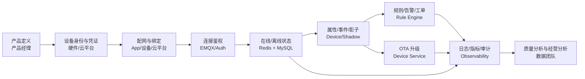

# 硬件设备接入全生命周期数据体系规范

## Premise / Constraints / Boundaries / Endgame
- Premise：AIoT 平台的接入效率，本质上取决于“设备数据定义是否统一、生命周期阶段是否清晰、跨团队交付物是否标准化、验收门禁是否可执行”。如果这些要素不统一，硬件每接一种新设备都等于重做一遍平台集成。
- Constraints：当前项目已经落地 `MySQL + Redis + Redis Stream` 的设备数据骨架，但遥测时序、对象存储、长期分析层仍不完整，因此本文必须同时区分“当前已实现规范”和“目标标准规范”。
- Boundaries：本文聚焦“硬件设备接入”本身，不展开 App 交互、商城、支付等外围域；但会覆盖产品定义、固件、家庭归属、规则、OTA、运维等与设备接入直接相关的环节。
- Endgame：形成一套可复用的设备接入标准，使硬件产品、嵌入式、云平台、测试、数据团队围绕同一套数据语言协同交付，实现“新设备接入更快、接入质量更稳、后续运营更可控”。

---
## 概览文档核心结构

- 接入成熟度分级： L0-L4 ，明确最小接入、标准接入、深度接入、平台化接入
- 生命周期标准：产品建模、生产注册、配网绑定、连接鉴权、在线运行、能力表达、平台控制、运营闭环、OTA、退网销户
- 数据体系分层：主数据层、配置数据层、快照数据层、事件数据层、过程记录层、观测审计层、分析经营层
- 标准数据字典：设备字段、事件字段、影子字段、OTA 字段最小必填集
- 协同机制：硬件产品、嵌入式、云平台、测试、数据团队各自交付物
- 验收门禁：产品门禁、研发门禁、数据门禁、运维门禁、商业门禁

## 1. 文档目标

### 1.1 这份规范解决什么问题
- 把“设备接入”从一次性项目行为，变成可复制的平台能力。
- 把“数据怎么定义、怎么流转、怎么验收”固化成标准，减少跨团队反复对齐成本。
- 为硬件产品团队提供接入范围模板，为技术团队提供实现边界和验收口径。
- 为后续扩展多品类设备、多协议设备、多区域交付提供统一底座。

### 1.2 这份规范服务哪些团队
- 硬件产品经理：定义设备能力、物模型、接入等级、商业闭环。
- 嵌入式团队：实现设备身份、协议、状态上报、命令执行、升级回执。
- 云平台团队：实现接入、鉴权、影子、事件流、规则、OTA、数据落库。
- 测试团队：按生命周期门禁验证接入完整性。
- 数据与运维团队：定义口径、指标、日志、告警、追责链路。

### 1.3 “深度接入”的定义
- 不是“设备能连上平台”就算完成。
- 深度接入的最低要求是：`能识别`、`能绑定`、`能在线`、`能上报`、`能控制`、`能升级`、`能审计`、`能追责`。
- 如果只有连接能力，没有影子、过程记录、OTA、可观测，实际只是“浅接入”。

---

## 2. 设备接入成熟度分级

| 等级 | 名称 | 必备能力 | 适用场景 | 结果 |
| :--- | :--- | :--- | :--- | :--- |
| L0 | 不可运营设备 | 仅硬件定义，无平台识别 | 概念样机 | 不能量产接入 |
| L1 | 最小接入 | 设备注册、凭证、鉴权、在线/离线 | 研发联调 | 能接入，不能经营 |
| L2 | 标准接入 | 配网、状态上报、影子、基础控制 | MVP 商用 | 能接入，能使用 |
| L3 | 深度接入 | 规则联动、OTA、告警、工单、审计 | 标准量产 | 能接入，能运营 |
| L4 | 平台化接入 | 时序分析、版本治理、质量画像、区域化策略 | 大规模出货 | 能接入，能复用，能经营 |

### 2.1 各等级的判定原则
- L1 看“设备能否安全入网”。
- L2 看“设备能力是否可被平台表达和控制”。
- L3 看“设备是否进入平台运营闭环”。
- L4 看“设备是否进入平台数据经营闭环”。

### 2.2 当前项目的成熟度定位
- 当前代码基础已覆盖 `L1-L3` 的核心骨架。
- `L4` 相关的时序分析、长期历史库、接入画像和质量分层仍待补齐。

---

## 3. 生命周期分阶段标准

## 3.1 全生命周期阶段定义

| 阶段 | 阶段目标 | 关键动作 | 必须产出 |
| :--- | :--- | :--- | :--- |
| 0. 产品建模 | 定义设备是什么 | 产品定义、物模型、协议选择 | 产品主数据、物模型文档 |
| 1. 生产注册 | 定义设备身份 | 设备编号、凭证生成、产测标识 | 设备资产、凭证 |
| 2. 配网绑定 | 定义设备属于谁 | token、claim、家庭绑定、空间归属 | 绑定关系、配网记录 |
| 3. 连接鉴权 | 定义设备能否入网 | HMAC/密钥校验、防重放、ACL | 鉴权结果、接入日志 |
| 4. 在线运行 | 定义设备是否存活 | 在线、离线、心跳、会话维护 | 在线状态、状态变更事件 |
| 5. 能力表达 | 定义设备现在什么状态 | 属性上报、事件上报、影子同步 | 快照数据、影子数据 |
| 6. 平台控制 | 定义平台能否驱动设备 | 命令下发、期望态写入、执行回执 | 命令记录、回执记录 |
| 7. 运营闭环 | 定义平台如何经营设备 | 规则、告警、工单、审计 | 过程记录、运营指标 |
| 8. 版本演进 | 定义设备如何升级 | OTA 包、批次升级、失败回滚 | OTA 任务、OTA 记录 |
| 9. 退网销户 | 定义设备如何退出平台 | 解绑、删除、补偿清理、历史保留 | 退网记录、清理记录 |

## 3.2 生命周期阶段状态图

```mermaid
%%{init: {'theme': 'base', 'themeVariables': { 'background': '#0b1020', 'primaryColor': '#121a33', 'primaryTextColor': '#e6e9f2', 'lineColor': '#5b6cff', 'fontFamily': 'ui-monospace, SFMono-Regular, Menlo, Monaco, Consolas, "Liberation Mono", "Courier New", monospace'}}}%%
stateDiagram-v2
    [*] --> "产品定义"
    "产品定义" --> "设备注册"
    "设备注册" --> "配网绑定"
    "配网绑定" --> "连接鉴权"
    "连接鉴权" --> "在线运行"
    "在线运行" --> "状态同步"
    "状态同步" --> "规则联动"
    "状态同步" --> "OTA升级"
    "规则联动" --> "在线运行"
    "OTA升级" --> "在线运行"
    "在线运行" --> "退网删除"
    "退网删除" --> [*]
```

### 3.3 生命周期阶段的核心管理逻辑
- 上游阶段不清晰，下游阶段一定失控。
- 产品建模不清晰，影子和遥测一定难做。
- 设备身份不清晰，鉴权和风控一定失控。
- 在线态没有统一口径，规则、控制、运营都会漂移。
- 过程记录不完整，售后、升级、质量分析都不可追责。

---

## 4. 数据体系标准分层

## 4.1 数据分层总表

| 数据层 | 数据定义 | 核心问题 | 存储建议 | 时效性 |
| :--- | :--- | :--- | :--- | :--- |
| L1 主数据层 | 描述设备是谁 | 身份、归属、能力、版本 | MySQL | 长周期 |
| L2 配置数据层 | 描述设备应该如何被平台使用 | 物模型、协议、规则、升级策略 | MySQL / Config | 中长周期 |
| L3 快照数据层 | 描述设备当前状态 | 在线、影子、空间、会话 | Redis | 高实时 |
| L4 事件数据层 | 描述刚发生了什么 | 上下线、属性变更、事件触发、回执 | Stream / MQ | 高实时 |
| L5 过程记录层 | 描述过程怎么推进 | 配网、控制、升级、告警、工单 | MySQL / Redis | 中长期 |
| L6 观测审计层 | 描述系统运行是否健康 | 日志、Trace、指标、告警 | Log / Metrics | 高实时 |
| L7 分析经营层 | 描述设备长期表现如何 | 活跃、故障率、稳定性、版本渗透 | TSDB / DWH | 长周期 |

## 4.2 L1 主数据层规范

### 数据对象
- 产品
- 设备
- 设备凭证
- 固件包
- 家庭/房间/网关归属

### 标准要求
- 必须有唯一主键。
- 必须有业务唯一键。
- 必须明确归属关系。
- 必须定义生命周期状态。
- 必须明确谁是唯一写入方。

### 当前项目映射
- `product_info`
- `device_info`
- `device_credential`
- `firmware_package`

## 4.3 L2 配置数据层规范

### 数据对象
- 物模型定义
- 协议配置
- 规则定义
- OTA 策略
- 鉴权策略

### 标准要求
- 配置必须版本化。
- 配置变更必须可审计。
- 配置必须可灰度。
- 配置必须与设备类型或产品绑定，而不是与单设备硬编码绑定。

### 当前项目映射
- `thing_model_json`
- `aiot:rule:definitions`
- OTA 任务与包定义

## 4.4 L3 快照数据层规范

### 数据对象
- 在线状态
- 影子 `reported/desired/delta`
- 配网 token
- 幂等锁
- 运营实时视图

### 标准要求
- 必须有 TTL 或覆盖策略。
- 必须定义权威来源。
- 必须允许高频更新。
- 必须和主数据层保持可回写关系或可重建关系。

### 当前项目映射
- `aiot:device:status:{deviceId}`
- `aiot:device:shadow:reported:{deviceId}`
- `aiot:device:shadow:desired:{deviceId}`
- `aiot:device:provision:{token}`
- `aiot:ops:device-status`

## 4.5 L4 事件数据层规范

### 数据对象
- 上下线事件
- 配网结果事件
- 影子变更事件
- 未来应扩展：属性上报、故障事件、命令回执、OTA 回执

### 标准要求
- 每个事件必须有 `eventId`。
- 每个事件必须有 `eventType`、`deviceId`、`timestamp`、`source`。
- 事件 payload 必须版本化。
- 事件必须有幂等处理策略。
- 事件必须支持失败进入 DLQ。

### 当前项目映射
- 主 Stream：`aiot:stream:device-event`
- DLQ：`aiot:stream:device-event:dlq`

## 4.6 L5 过程记录层规范

### 数据对象
- 配网记录
- 控制记录
- OTA 任务
- OTA 记录
- 告警
- 工单
- 审计

### 标准要求
- 必须可追溯发起人、对象、时间、结果。
- 必须可按设备、产品、家庭、版本查询。
- 必须支持失败原因保留。
- 必须能反推责任链路。

### 当前项目映射
- `ota_upgrade_task`
- `ota_upgrade_record`
- `aiot:ops:alarms`
- `aiot:ops:work-orders`
- `aiot:ops:audits`

## 4.7 L6 观测审计层规范

### 数据对象
- 接入日志
- 鉴权日志
- 上报日志
- 事件投递日志
- 消费失败日志
- 刷库指标
- 告警规则

### 标准要求
- 必须全链路携带 `traceId`。
- 必须定义成功率、延迟、失败率、积压量等核心指标。
- 必须支持按设备、产品、事件类型检索。
- 必须支持故障回溯。

## 4.8 L7 分析经营层规范

### 数据对象
- 设备活跃率
- 配网成功率
- 上线成功率
- 固件渗透率
- 升级失败率
- 设备故障率
- 规则触发率

### 标准要求
- 必须与经营目标挂钩，而不是仅做技术统计。
- 必须沉淀为时间维度、产品维度、区域维度、版本维度分析。
- 必须支撑产品决策和质量止损。

### 当前状态
- 该层在当前仓库中仍偏规划态，是后续提升“深度接入效率”的关键。

---

## 5. 设备接入标准数据字典

## 5.1 设备接入最小字段集

| 类别 | 字段 | 是否必填 | 说明 |
| :--- | :--- | :--- | :--- |
| 身份 | `deviceId` | 是 | 平台设备唯一标识 |
| 身份 | `productKey` | 是 | 产品唯一标识 |
| 身份 | `deviceName` | 是 | 产品下设备唯一名称 |
| 凭证 | `deviceSecret` / 证书标识 | 是 | 入网凭证 |
| 归属 | `homeId` | 配网后必填 | 家庭归属 |
| 空间 | `roomId` | 否 | 房间归属 |
| 拓扑 | `gatewayId` | 网关型必填 | 父网关关系 |
| 版本 | `firmwareVersion` | 是 | 当前固件版本 |
| 状态 | `status` | 是 | 生命周期主状态 |
| 时间 | `createTime` | 是 | 设备创建时间 |
| 时间 | `lastHeartbeatTime` | 在线设备强烈建议 | 最近活跃时间 |

## 5.2 事件最小字段集

| 字段 | 是否必填 | 说明 |
| :--- | :--- | :--- |
| `eventId` | 是 | 全局唯一事件 ID |
| `eventType` | 是 | 事件类型 |
| `deviceId` | 是 | 关联设备 |
| `timestamp` | 是 | 事件发生时间 |
| `source` | 是 | 事件来源 |
| `traceId` | 强烈建议 | 全链路追踪 |
| `schemaVersion` | 建议 | 事件契约版本 |
| `payload` | 是 | 业务载荷 |

## 5.3 影子最小字段集

| 字段 | 是否必填 | 说明 |
| :--- | :--- | :--- |
| `reported` | 是 | 设备实际状态 |
| `desired` | 是 | 平台期望状态 |
| `delta` | 是 | 差异集 |
| `version` | 是 | 并发控制版本 |
| `updatedAt` | 是 | 最后更新时间 |

## 5.4 OTA 最小字段集

| 字段 | 是否必填 | 说明 |
| :--- | :--- | :--- |
| `packageId` | 是 | 固件包 ID |
| `targetVersion` | 是 | 目标版本 |
| `checksum` | 是 | 包校验值 |
| `taskId` | 是 | 升级批次 ID |
| `deviceId` | 是 | 单设备记录必须有 |
| `status` | 是 | 待升级/成功/失败 |
| `errorMessage` | 失败时必填 | 升级失败原因 |

---

## 6. 接入协同机制

## 6.1 硬件产品团队交付物
- 产品定义文档
- 物模型文档
- 设备分类与接入等级
- 设备生命周期状态说明
- 关键商业场景与规则清单
- OTA 策略说明

## 6.2 嵌入式团队交付物
- 设备身份方案
- 鉴权实现说明
- Topic / 协议说明
- 属性、事件、命令、回执字段说明
- 错误码说明
- OTA 升级与回滚逻辑说明

## 6.3 云平台团队交付物
- 产品/设备主数据模型
- 鉴权与 ACL 策略
- 影子模型
- 事件模型
- 规则模型
- OTA 模型
- 日志、指标、告警设计

## 6.4 测试团队交付物
- 生命周期测试用例
- 异常路径测试用例
- 并发与幂等测试用例
- 升级失败与恢复测试用例
- 可观测性验证用例

## 6.5 数据团队交付物
- 指标口径字典
- 设备活跃与稳定性口径
- 版本渗透与升级成功率口径
- 数据归档与保留策略

---

## 7. 接入验收门禁

## 7.1 产品门禁
- 是否明确产品类型、物模型、协议、固件策略。
- 是否完成接入等级分级。
- 是否定义关键状态与关键事件。

## 7.2 研发门禁
- 是否具备唯一身份和凭证。
- 是否具备鉴权、防重放、幂等。
- 是否具备在线/离线和心跳机制。
- 是否具备影子或等价状态模型。
- 是否具备控制回执和升级回执。

## 7.3 数据门禁
- 是否有统一主数据。
- 是否有统一事件结构。
- 是否有统一快照模型。
- 是否可按设备追踪全链路。
- 是否保留关键过程记录。

## 7.4 运维门禁
- 是否可定位单设备接入问题。
- 是否可识别事件积压和消费失败。
- 是否可识别升级失败和批次风险。
- 是否有设备质量与版本质量告警。

## 7.5 商业门禁
- 是否能统计激活率、活跃率、在线率。
- 是否能统计配网成功率和升级成功率。
- 是否能识别高故障版本和高故障机型。
- 是否能支撑售后、质控、版本止损。

---

## 8. 标准接入流程图



---

## 9. 与当前项目实现的映射

## 9.1 已实现映射

| 标准模块 | 当前实现 |
| :--- | :--- |
| 产品主数据 | `product_info` |
| 设备主数据 | `device_info` |
| 设备凭证 | `device_credential` |
| 配网 token / 锁 | `aiot:device:provision:*` |
| 在线状态 | `aiot:device:status:{deviceId}` |
| 影子模型 | `aiot:device:shadow:*` |
| 统一事件流 | `aiot:stream:device-event` |
| 规则闭环 | `aiot:ops:*` |
| OTA | `firmware_package`、`ota_upgrade_task`、`ota_upgrade_record` |
| 补偿 | `home_delete_compensation_task` |

## 9.2 待补齐映射
- 属性/遥测时序库。
- 命令下发与命令回执标准。
- 设备质量画像和版本质量画像。
- 运维闭环的长期历史化。
- 产品级接入模板和自动验收脚本。

---

## 10. 如何提升“深度接入效率”

## 10.1 先定标准，再做接入
- 每新增一种设备，不应先写代码，而应先填完接入模板。
- 模板最少要覆盖：产品定义、物模型、协议、鉴权、事件、影子、OTA、指标、告警。

## 10.2 用分级机制筛选投入
- 低价值设备只做 `L1-L2`。
- 核心经营设备必须做到 `L3-L4`。
- 用接入等级控制投入强度，避免所有设备都按最高标准建设。

## 10.3 用统一数据字典减少联调成本
- 同一含义只能有一套字段名、一套状态名、一套事件口径。
- 设备侧和云侧必须共享同一份契约，而不是各自维护文档。

## 10.4 用过程记录支撑质量止损
- 配网失败、掉线率高、升级失败、命令无回执，必须都能被记录和追溯。
- 没有过程记录，就无法做质量止损，也无法形成经营闭环。

## 10.5 用验收门禁阻止“伪接入”
- 能连上不等于能商用。
- 没有影子、OTA、告警、审计的设备，不应被认定为深度接入完成。

---

## 11. 建议的后续落地动作

### P0：建立设备接入模板
- 为每个新品类设备建立一份标准模板。
- 让产品、硬件、云平台、测试共享同一模板协作。

### P0：建立统一事件与字段规范
- 统一 `eventType` 命名。
- 统一状态字段、错误码、回执结构。
- 明确哪些字段是强制项。

### P0：建立接入验收清单
- 把本文第 7 章固化为实际检查表。
- 让每个设备上线前必须过门禁。

### P1：补齐遥测与分析层
- 让接入从“可运行”走向“可经营”。
- 把高频状态、故障率、版本质量真正量化。

### P1：补齐平台化自动化能力
- 自动生成接入模板。
- 自动校验物模型与事件契约。
- 自动生成接入验收报告。

---

## 12. 最终结论
- 硬件设备接入不是协议问题，而是数据体系问题。
- 数据体系不清，接入效率一定低，后续运营一定重。
- 真正高效率的设备接入，依赖的是“分层标准 + 生命周期标准 + 团队交付标准 + 验收门禁标准”四件套。
- 当前项目已经具备较好的设备接入骨架，下一步的关键不是继续零散补功能，而是把现有能力标准化、模板化、门禁化。
- 当这套规范落地后，新增设备接入将从“项目交付”升级为“平台复制”，这才是深度接入效率的真正来源。

