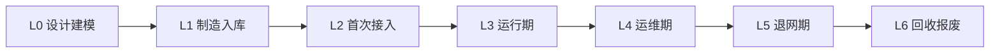

# 智能升降桌设备接入系统全域数据全生命周期管理方案

## 顶层定义

- `Premise`：智能升降桌属于“强设备状态 + 高频控制 + 中低频告警 + 长周期服务”的 IoT 设备；接入系统必须同时支撑设备接入、实时控制、数字孪生、运维治理、OTA、售后与数据合规。
- `Constraints`：控制链路要求低延迟；状态链路允许最终一致；设备侧资源有限；网络存在抖动与断连；用户隐私与办公行为数据需分级处理；产测、激活、售后、报废跨主体协同。
- `Boundaries`：范围覆盖设备接入系统全域数据，不展开 ERP/财务/供应链深层系统；仅定义与接入、运行、治理、服务直接相关的数据生命周期。
- `Endgame`：形成“可追溯、可切层、可治理、可删除、可审计”的全域数据资产体系，支撑智能升降桌从出厂到报废的全生命周期闭环。

## 全生命周期

- `L0 设计建模`：产品型号、物模型、协议模型、告警模型、固件矩阵、产测规则
- `L1 制造入库`：设备身份、SN、控制板编号、模组编号、证书/密钥、产测记录、校准参数
- `L2 首次接入`：设备认证、会话建立、接入日志、激活凭证、绑定关系
- `L3 运行期`：遥测、影子、命令、事件、告警、使用行为、健康评分
- `L4 运维期`：OTA、参数变更、工单、远程诊断、维修、更换部件
- `L5 退网期`：解绑、冻结、停服、证书吊销、配置封存
- `L6 回收报废`：资产注销、数据归档、隐私删除、审计保留

## 全域数据域

- `主数据域`：产品、设备、部件、固件、租户、空间、用户
- `身份域`：设备证书、密钥、clientId、authIdentity、token、内部信任关系
- `连接域`：在线状态、会话、IP、协议、Broker 连接、重连、心跳
- `控制域`：升降命令、预设位、儿童锁、提醒配置、防撞阈值、照明/USB 扩展能力
- `遥测域`：当前高度、目标高度、移动方向、电机电流、电源状态、温度、负载估计、按键来源
- `孪生域`：`desired/reported/delta/version`
- `事件域`：上下线、控制完成、控制失败、校准完成、防撞触发、卡顿、过流、过热、倾斜异常
- `告警域`：高风险告警、持续告警、恢复事件、告警抑制状态
- `AI/规则域`：场景识别、诊断结果、反馈、案例、规则草案、门禁报告
- `运维域`：OTA 包、灰度任务、升级结果、工单、维修记录、换件记录
- `审计合规域`：操作日志、授权日志、隐私授权、数据导出、删除审计、保留策略

## 智能升降桌专属数据对象

- `设备身份`：`deviceId`、`sn`、`productKey`、`controllerBoardId`、`motorPairId`、`bluetoothMac/wifiMac`
- `结构能力`：双电机/单电机、最大行程、最小高度、最大高度、升降速度、承重等级、防撞等级
- `校准参数`：零点高度、最大行程校准值、左右电机同步偏差、出厂校准时间
- `使用状态`：当前高度、站立时长、久坐时长、日升降次数、今日站坐切换次数
- `健康状态`：电机过流次数、防撞触发次数、异常停机次数、控制成功率、平均升降耗时
- `服务状态`：保修状态、最近维修时间、换件次数、固件版本分布、批次风险标签

## 生命周期管理矩阵

| 数据域 | 关键数据 | 生产阶段 | 主存 | 热度层 | 保留策略 | 归档/删除策略 | 主责 |
|---|---|---|---|---|---|---|---|
| 产品主数据 | 型号、物模型、能力矩阵 | L0-L6 | MySQL | 温 | 长期 | 仅版本冻结，不物理删 | 产品/设备平台 |
| 设备身份 | SN、证书、密钥、模组号 | L1-L5 | MySQL + 密钥库 | 温 | 设备生命周期+审计期 | 退网后吊销，密钥销毁 | 接入平台 |
| 产测校准 | 校准值、测试结果 | L1-L6 | MySQL/对象存储 | 温冷 | 长期 | 冷归档，不删除核心批次证据 | 制造/质量 |
| 接入会话 | 登录、心跳、断连、IP | L2-L5 | Redis + 明细库 | 热 | 7-30天热存 | 聚合后冷存，原始明细过期 | 接入平台 |
| 遥测时序 | 高度、电流、移动状态 | L3-L5 | TSDB/时序表 | 热温冷 | 秒级明细 7-30 天，分钟聚合 180-365 天 | 明细过期，保留聚合 | 数据平台 |
| 设备影子 | desired/reported/delta | L2-L5 | Redis + 快照表 | 热 | 当前态长期，历史版本短期 | 仅保留关键版本 | 设备平台 |
| 控制命令 | 升降、预设、锁定、提醒 | L3-L5 | 事务库 | 温 | 180-365 天 | 超期冷归档 | 控制服务 |
| 事件告警 | 防撞、过流、卡顿、离线 | L3-L5 | 事件库 | 热温 | 高等级 2-3 年，普通 180-365 天 | 严重告警长期留痕 | 运维平台 |
| AI诊断 | 场景、根因、建议 | L3-L5 | MySQL/对象存储 | 温 | 1-3 年 | 结构化保留，原上下文脱敏 | AI平台 |
| 用户行为 | 站坐习惯、提醒响应 | L3-L5 | 明细库/画像库 | 温冷 | 默认最短化 | 超期匿名化 | 数据平台/合规 |
| OTA数据 | 包、灰度、升级结果 | L4-L5 | MySQL + 对象存储 | 温 | 1-3 年 | 历史包封存 | 设备运维 |
| 维修售后 | 工单、换件、结论 | L4-L6 | MySQL | 温冷 | 保修期+审计期 | 冷归档 | 售后系统 |
| 审计合规 | 操作日志、删除日志 | L2-L6 | 审计库 | 温冷 | 2-5 年 | 只归档不改写 | 安全合规 |

## 分层存储方案

- `边缘层`：设备本地缓存最近配置、预设位、防撞阈值、最后一次校准参数；断网可自治
- `热数据层`：Redis 承接在线状态、影子当前态、命令回执、会话态、短周期控制日志
- `事务层`：MySQL 承接设备主数据、绑定关系、OTA、工单、诊断、反馈、案例
- `时序层`：TSDB 或 MySQL 时序化表承接高度、电流、温度、状态切换等连续信号
- `对象归档层`：对象存储承接固件包、诊断原始快照、长文本维修报告、门禁报告
- `分析层`：DWD/DWS/ADS 承接主题建模、指标供给、AI 训练导出、管理看板

## 采集与入库规则

- `一次事实一次入仓`：所有接入事件必须先写标准事件总线，再分发到状态、孪生、分析链路
- `命令与回执成对建模`：每条升降命令必须有 `commandId`，并关联 `accepted/started/completed/failed/timeout`
- `高频遥测分级采样`：桌高变化和电流变化走秒级；静止期走分钟级；异常期自动升采样
- `关键异常全量保留`：防撞、过流、卡顿、倾斜、校准丢失一律全量留痕
- `状态与事件解耦`：在线状态和当前高度属于状态；升降完成、防撞触发属于事件；不可混用

## 主键与关联键

- 一级统一键：
  - `tenantId`
  - `deviceId`
  - `globalDeviceId`
  - `sn`
  - `traceId`
  - `eventId`
  - `commandId`
  - `sessionId`
  - `alarmId`
  - `otaTaskId`
  - `workOrderId`
- 二级业务键：
  - `spaceId`
  - `userId`
  - `deskId`
  - `firmwareVersion`
  - `productKey`
  - `sceneType`
  - `occurredAt`
- 约束：
  - 所有事件必须具备 `deviceId + occurredAt + traceId/eventId`
  - 所有控制链数据必须具备 `commandId`
  - 所有 AI 闭环数据必须能回溯到 `eventId` 或 `commandId`

## 数据标准

- `设备状态标准`：`online/offline/fault/upgrading/frozen/retired`
- `运动状态标准`：`idle/up/down/paused/blocked/calibrating`
- `命令状态标准`：`accepted/dispatched/executing/completed/failed/timeout/cancelled`
- `告警等级标准`：`P1/P2/P3/P4`
- `数据质量标准`：
  - 高度单位统一 `mm`
  - 电流单位统一 `mA`
  - 时间统一 `UTC+0` 存储，展示层做时区转换
  - 固件版本统一语义化版本
  - 设备能力统一物模型字典

## 数据分级与保留

- `S1 核心控制数据`：命令、回执、告警、OTA 状态；强审计，优先保留
- `S2 运行健康数据`：高度、电流、温度、在线状态；按热温冷分层保留
- `S3 行为画像数据`：站立时长、提醒响应、使用习惯；默认最小化采集，可匿名化
- `S4 敏感身份数据`：密钥、证书、手机号、办公位置；单独加密与脱敏
- `删除原则`：
  - 用户可识别行为数据优先匿名化
  - 密钥类数据退网即销毁
  - 审计类数据只归档不篡改
  - 安全事件与重大质量事件不做普通过期删除

## 质量治理

- `完整性`：接入成功率、事件丢失率、回执缺失率、影子漂移率
- `一致性`：设备当前高度与影子 reported 一致；命令完成态与最终高度一致；OTA 状态与固件版本一致
- `准确性`：高度跳变校验、电流异常窗口校验、防撞误触发率校验
- `及时性`：在线状态延迟、命令回执延迟、告警生成延迟、升级结果回传延迟
- `唯一性`：`eventId/commandId/alarmId/otaTaskId` 去重
- `可追溯性`：任一售后结论可回溯至设备批次、固件版本、异常事件、用户反馈

## 安全与合规

- `身份安全`：设备证书/密钥托管在密钥系统；接入认证与业务鉴权分离
- `链路安全`：设备到接入层 TLS；内部接口使用内部令牌或服务身份
- `字段保护`：`sn`、`mac`、手机号、地理位置、用户行为标签按字段加密或脱敏
- `最小权限`：运维、售后、数据分析、AI 训练使用不同数据视图
- `合规策略`：办公习惯、站坐行为、提醒响应属于潜在敏感行为数据，默认不开启跨租户分析
- `删除审计`：用户解绑、设备退网、租户注销必须生成删除工单与审计日志

## 智能升降桌专用规则

- `校准优先级`：校准参数属于关键生产与安全数据，不允许由普通 App 直接覆盖
- `防撞事件`：视为安全事件，必须全量留痕，并关联动作来源、人机交互来源、当时高度、电流、速度
- `双电机同步`：左右电机偏差、同步失败、重复校准次数单独建模
- `久坐提醒`：属于用户行为数据，和设备健康数据分库存放，默认按匿名聚合供运营使用
- `桌位绑定`：家庭场景记录 `homeId/roomId`；办公场景记录 `tenantId/siteId/floorId/spaceId`
- `儿童锁/安全锁`：作为高风险配置变更，进入审计域

## 主题域指标

- `接入域`
  - 设备激活率
  - 首次接入成功率
  - 7日活跃桌占比
  - 平均重连次数
- `控制域`
  - 命令成功率
  - 平均升降完成时长
  - 命令超时率
  - 预设位使用占比
- `健康域`
  - 防撞触发率
  - 电机过流率
  - 校准失效率
  - 异常停机率
- `体验域`
  - 日均站坐切换次数
  - 久坐提醒响应率
  - 平均站立时长
- `运维域`
  - OTA 成功率
  - 售后返修率
  - 批次故障聚集度
  - 固件版本碎片化指数
- `AI治理域`
  - 诊断命中率
  - fallback 占比
  - 一次解决率
  - 案例沉淀率

## 控制面方案

- `设备接入控制面`：设备注册、证书签发、冻结/解冻、黑名单、协议配置
- `设备运行控制面`：影子管理、命令编排、异常阈值、提醒策略、预设位策略
- `设备治理控制面`：数据质量监控、影子漂移监控、命令超时补偿、时序落库质量门禁
- `AI 控制面`：诊断场景管理、案例沉淀、反馈闭环、模型门禁、训练导出
- `合规控制面`：租户隔离、数据导出、删除审批、脱敏策略、保留周期配置

## 全生命周期动作清单

- `设计建模`
  - 建物模型、事件字典、告警字典、命令字典、字段字典
- `制造入库`
  - 烧录身份、写入校准、记录产测、绑定批次
- `首次接入`
  - 认证、建档、激活、绑定用户/空间、初始化影子
- `运行期`
  - 采集遥测、执行命令、沉淀状态、识别异常、生成诊断
- `运维期`
  - 升级、回滚、派单、维修、换件、复测
- `退网期`
  - 解绑、冻结、吊销凭证、封存主档
- `报废期`
  - 删除隐私、归档审计、注销资产、保留质量证据

## 实施优先级

- `P0`
  - 统一主键体系
  - 统一命令/回执模型
  - 统一高度/电流/时间标准
  - 建接入事件总线
- `P1`
  - 建影子模型
  - 建时序落库
  - 建异常事件与告警模型
  - 建 OTA 与售后闭环
- `P2`
  - 建 AI 诊断与反馈闭环
  - 建行为画像匿名化体系
  - 建租户级数据治理与删除控制面
- `P3`
  - 建跨批次质量预测
  - 建配件级寿命预测
  - 建空间级健康分析

## 终局形态

- `主数据` 只保留一份主真源
- `状态数据` 由影子和时序协同承接
- `控制数据` 以命令/回执对为核心真源
- `异常数据` 以事件和告警双模承接
- `AI 数据` 从事实层直接构造，不绕业务接口临时拼装
- `合规数据` 独立审计、独立权限、独立删除闭环
- `全域数据` 实现“可接入、可追溯、可分层、可治理、可归档、可删除”
