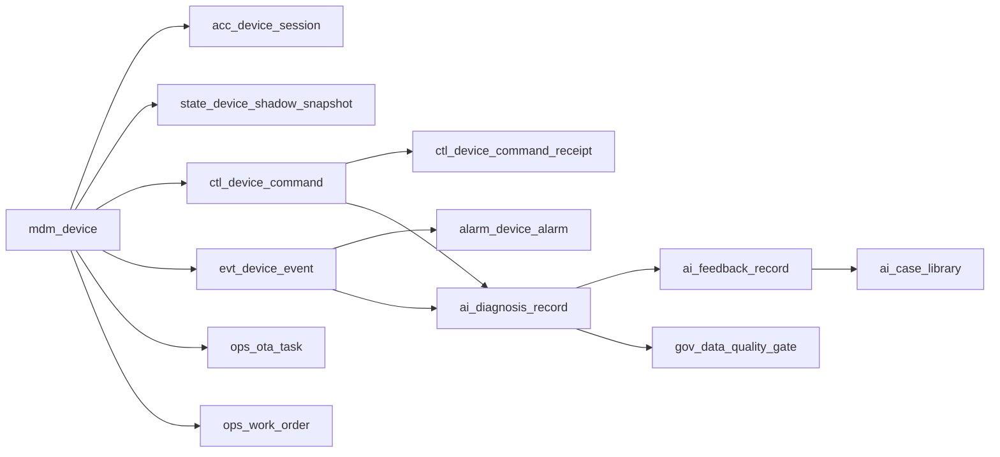

# 智能升降桌设备接入系统全域数据表模型蓝图

## 1. 文档目的

- 将《智能升降桌设备接入系统全域数据全生命周期管理方案（梳理版）》进一步收敛为可执行的数据表模型清单。
- 目标不是直接输出物理建表 SQL，而是先明确逻辑表分层、主键、核心字段、生命周期归属、保留策略和责任边界。
- 适用于后续：
  - 事务库建模
  - 时序库建模
  - 分析层 DWD/DWS/ADS 建模
  - 审计与删除控制面建模

## 2. 建模原则

| 原则 | 定义 |
|---|---|
| 单一真源 | 主数据只保留一份主写真源，其他均为投影或快照 |
| 状态事件分离 | 当前态走状态表，变化过程走事件表，控制过程走命令/回执表 |
| 高频低频分层 | 高频信号走时序库，低频业务对象走事务库 |
| 全链路可追溯 | `eventId`、`traceId`、`commandId`、`alarmId`、`otaTaskId` 必须可串联 |
| 合规优先 | 身份、行为、位置、审计分域建模，支持脱敏、删除、归档 |
| 先逻辑后物理 | 先定义逻辑表和边界，再决定 MySQL、TSDB、Redis、对象存储承载方式 |

## 3. 分层模型

| 分层 | 目标 | 典型表前缀 |
|---|---|---|
| 主数据层 | 管理设备、产品、空间、用户、部件等主对象 | `mdm_` |
| 接入与状态层 | 管理接入身份、会话、影子、在线态 | `acc_` `state_` |
| 控制与事件层 | 管理命令、回执、事件、告警 | `ctl_` `evt_` `alarm_` |
| 运维与服务层 | 管理 OTA、工单、维修、换件、保修 | `ops_` `svc_` |
| AI 与治理层 | 管理诊断、反馈、案例、质量门禁、删除审计 | `ai_` `gov_` `audit_` |
| 分析层 | 面向指标、快照、训练导出 | `dwd_` `dws_` `ads_` |

## 4. 主数据层

### 4.1 `mdm_product_model`

| 字段 | 含义 |
|---|---|
| `id` | 主键 |
| `productKey` | 产品型号主键 |
| `productName` | 型号名称 |
| `deskType` | 单电机/双电机/旗舰型 |
| `minHeightMm` | 最低高度 |
| `maxHeightMm` | 最高高度 |
| `maxLoadKg` | 最大承重 |
| `moveSpeedMmPerSec` | 升降速度 |
| `antiCollisionLevel` | 防撞等级 |
| `thingModelVersion` | 物模型版本 |
| `firmwareBaselineVersion` | 基线固件版本 |
| `status` | 有效/冻结/退役 |
| `createdAt` | 创建时间 |
| `updatedAt` | 更新时间 |

### 4.2 `mdm_product_capability`

| 字段 | 含义 |
|---|---|
| `id` | 主键 |
| `productKey` | 产品型号 |
| `capabilityCode` | 能力编码 |
| `capabilityName` | 能力名称 |
| `capabilityType` | 属性/命令/事件/告警 |
| `valueType` | 数据类型 |
| `unit` | 单位 |
| `defaultValue` | 默认值 |
| `constraintsJson` | 约束定义 |
| `version` | 版本号 |

### 4.3 `mdm_device`

| 字段 | 含义 |
|---|---|
| `id` | 主键 |
| `deviceId` | 设备逻辑 ID |
| `globalDeviceId` | 全局设备 ID |
| `sn` | 设备序列号 |
| `productKey` | 所属产品型号 |
| `controllerBoardId` | 控制板编号 |
| `motorPairId` | 电机对编号 |
| `hardwareVersion` | 硬件版本 |
| `firmwareVersion` | 当前固件版本 |
| `deviceStatus` | online/offline/fault/upgrading/frozen/retired |
| `bindingStatus` | 未绑定/已绑定/退网 |
| `tenantId` | 租户 ID |
| `spaceId` | 空间 ID |
| `userId` | 当前绑定用户 |
| `activatedAt` | 激活时间 |
| `retiredAt` | 退网/报废时间 |
| `createdAt` | 创建时间 |
| `updatedAt` | 更新时间 |

### 4.4 `mdm_device_component`

| 字段 | 含义 |
|---|---|
| `id` | 主键 |
| `deviceId` | 设备 ID |
| `componentType` | 控制板/左电机/右电机/电源板/蓝牙模组 |
| `componentSn` | 部件序列号 |
| `vendorCode` | 供应商编码 |
| `batchNo` | 批次号 |
| `installAt` | 安装时间 |
| `replaceAt` | 更换时间 |
| `status` | 在用/替换/失效 |

### 4.5 `mdm_space`

| 字段 | 含义 |
|---|---|
| `id` | 主键 |
| `tenantId` | 租户 ID |
| `siteId` | 园区/站点 |
| `buildingId` | 楼栋 |
| `floorId` | 楼层 |
| `spaceId` | 空间唯一标识 |
| `spaceName` | 工位/房间名称 |
| `spaceType` | home/office/meeting/focus |
| `ownerUserId` | 负责人/使用人 |
| `status` | 启用/停用 |

## 5. 制造与校准层

### 5.1 `mdm_device_identity_issuance`

| 字段 | 含义 |
|---|---|
| `id` | 主键 |
| `deviceId` | 设备 ID |
| `sn` | 序列号 |
| `authIdentity` | 设备认证身份 |
| `clientId` | MQTT/接入 clientId |
| `certId` | 证书 ID |
| `secretRef` | 密钥引用 |
| `issuedAt` | 签发时间 |
| `revokedAt` | 吊销时间 |
| `status` | active/revoked/expired |

### 5.2 `mdm_device_factory_test`

| 字段 | 含义 |
|---|---|
| `id` | 主键 |
| `deviceId` | 设备 ID |
| `batchNo` | 生产批次 |
| `testStationId` | 工站编号 |
| `testSuiteVersion` | 产测规则版本 |
| `testResult` | pass/fail |
| `failureCode` | 失败码 |
| `reportPath` | 产测报告路径 |
| `testedAt` | 测试时间 |

### 5.3 `mdm_device_calibration`

| 字段 | 含义 |
|---|---|
| `id` | 主键 |
| `deviceId` | 设备 ID |
| `zeroHeightMm` | 零点高度 |
| `maxStrokeMm` | 最大行程 |
| `leftRightOffsetMm` | 左右电机偏差 |
| `calibrationSource` | 出厂/售后/远程 |
| `calibrationVersion` | 校准版本 |
| `calibratedAt` | 校准时间 |
| `isCurrent` | 是否当前生效 |

## 6. 接入与状态层

### 6.1 `acc_device_session`

| 字段 | 含义 |
|---|---|
| `id` | 主键 |
| `sessionId` | 会话 ID |
| `deviceId` | 设备 ID |
| `clientId` | 接入 clientId |
| `protocol` | MQTT/WiFi/BLE-Bridge |
| `brokerNode` | Broker 节点 |
| `remoteIp` | 接入 IP |
| `connectedAt` | 连接时间 |
| `disconnectedAt` | 断连时间 |
| `disconnectReason` | 断连原因 |
| `reconnectCount` | 重连次数 |

### 6.2 `state_device_online_snapshot`

| 字段 | 含义 |
|---|---|
| `deviceId` | 主键 |
| `onlineStatus` | online/offline |
| `lastHeartbeatAt` | 最近心跳时间 |
| `lastSeenIp` | 最近接入 IP |
| `currentSessionId` | 当前会话 ID |
| `updatedAt` | 更新时间 |

### 6.3 `state_device_shadow_snapshot`

| 字段 | 含义 |
|---|---|
| `deviceId` | 主键 |
| `reportedJson` | 实际状态 |
| `desiredJson` | 期望状态 |
| `deltaJson` | 差异 |
| `shadowVersion` | 影子版本 |
| `updatedAt` | 更新时间 |

### 6.4 `state_device_runtime_snapshot`

| 字段 | 含义 |
|---|---|
| `deviceId` | 主键 |
| `currentHeightMm` | 当前高度 |
| `targetHeightMm` | 目标高度 |
| `motionState` | idle/up/down/paused/blocked/calibrating |
| `motorCurrentMa` | 当前电流 |
| `temperatureC` | 温度 |
| `powerStatus` | 供电状态 |
| `loadEstimateKg` | 负载估计 |
| `updatedAt` | 更新时间 |

## 7. 控制与事件层

### 7.1 `ctl_device_command`

| 字段 | 含义 |
|---|---|
| `id` | 主键 |
| `commandId` | 命令 ID |
| `traceId` | 链路追踪 ID |
| `deviceId` | 设备 ID |
| `commandType` | 升高/降低/到指定高度/预设位/锁定/解锁/提醒配置 |
| `commandSource` | App/PhysicalButton/Voice/AutoSchedule/Admin |
| `requestedBy` | 发起人 |
| `requestPayloadJson` | 命令参数 |
| `acceptedAt` | 受理时间 |
| `status` | accepted/dispatched/executing/completed/failed/timeout/cancelled |
| `finishedAt` | 完成时间 |

### 7.2 `ctl_device_command_receipt`

| 字段 | 含义 |
|---|---|
| `id` | 主键 |
| `commandId` | 命令 ID |
| `deviceId` | 设备 ID |
| `receiptType` | accepted/started/progress/completed/failed/timeout |
| `receiptPayloadJson` | 回执内容 |
| `resultCode` | 结果码 |
| `occurredAt` | 发生时间 |

### 7.3 `evt_device_event`

| 字段 | 含义 |
|---|---|
| `id` | 主键 |
| `eventId` | 事件 ID |
| `traceId` | 链路追踪 ID |
| `deviceId` | 设备 ID |
| `eventType` | 上下线/控制完成/控制失败/防撞/卡顿/过流/倾斜/校准完成 |
| `source` | device/system/rule-engine |
| `severity` | info/warn/error/critical |
| `payloadJson` | 事件负载 |
| `occurredAt` | 发生时间 |
| `ingestedAt` | 入库时间 |

### 7.4 `alarm_device_alarm`

| 字段 | 含义 |
|---|---|
| `id` | 主键 |
| `alarmId` | 告警 ID |
| `deviceId` | 设备 ID |
| `eventId` | 来源事件 ID |
| `alarmCode` | 告警编码 |
| `alarmLevel` | P1/P2/P3/P4 |
| `alarmStatus` | open/ack/closed/suppressed |
| `rootCauseHint` | 初步原因 |
| `openedAt` | 打开时间 |
| `ackAt` | 确认时间 |
| `closedAt` | 关闭时间 |

## 8. 时序层

### 8.1 `ts_height_signal`

| 字段 | 含义 |
|---|---|
| `ts` | 时间戳 |
| `deviceId` | 设备 ID |
| `heightMm` | 当前高度 |
| `targetHeightMm` | 目标高度 |
| `motionState` | 运动状态 |
| `samplingLevel` | second/minute/anomaly |

### 8.2 `ts_motor_current_signal`

| 字段 | 含义 |
|---|---|
| `ts` | 时间戳 |
| `deviceId` | 设备 ID |
| `leftMotorCurrentMa` | 左电机电流 |
| `rightMotorCurrentMa` | 右电机电流 |
| `currentVariance` | 电流波动 |
| `samplingLevel` | 采样等级 |

### 8.3 `ts_environment_signal`

| 字段 | 含义 |
|---|---|
| `ts` | 时间戳 |
| `deviceId` | 设备 ID |
| `temperatureC` | 温度 |
| `inputVoltageMv` | 输入电压 |
| `powerState` | 电源状态 |
| `faultFlag` | 故障标记 |

## 9. 运维与服务层

### 9.1 `ops_ota_package`

| 字段 | 含义 |
|---|---|
| `id` | 主键 |
| `packageId` | 包 ID |
| `productKey` | 产品型号 |
| `firmwareVersion` | 固件版本 |
| `packagePath` | 包路径 |
| `checksum` | 校验值 |
| `releaseNote` | 发布说明 |
| `status` | draft/published/deprecated |
| `createdAt` | 创建时间 |

### 9.2 `ops_ota_task`

| 字段 | 含义 |
|---|---|
| `id` | 主键 |
| `otaTaskId` | 升级任务 ID |
| `packageId` | 升级包 ID |
| `deviceId` | 设备 ID |
| `rolloutStrategy` | 立即/灰度/定时 |
| `status` | pending/running/success/failed/rollback |
| `scheduledAt` | 调度时间 |
| `startedAt` | 开始时间 |
| `finishedAt` | 结束时间 |

### 9.3 `ops_work_order`

| 字段 | 含义 |
|---|---|
| `id` | 主键 |
| `workOrderId` | 工单 ID |
| `deviceId` | 设备 ID |
| `sourceType` | 用户报修/自动告警/AI 建议 |
| `title` | 标题 |
| `priority` | 优先级 |
| `status` | open/assigned/in_progress/resolved/closed |
| `assignedTo` | 指派对象 |
| `openedAt` | 开单时间 |
| `resolvedAt` | 解决时间 |

### 9.4 `ops_repair_record`

| 字段 | 含义 |
|---|---|
| `id` | 主键 |
| `workOrderId` | 工单 ID |
| `deviceId` | 设备 ID |
| `repairType` | 远程/上门/返厂 |
| `rootCause` | 根因 |
| `actionTaken` | 处理动作 |
| `replacedPartsJson` | 换件清单 |
| `resultStatus` | success/partial/failed |
| `repairedAt` | 维修时间 |

## 10. AI 与治理层

### 10.1 `ai_diagnosis_record`

| 字段 | 含义 |
|---|---|
| `id` | 主键 |
| `diagnosisId` | 诊断 ID |
| `traceId` | 追踪 ID |
| `deviceId` | 设备 ID |
| `sceneType` | 场景类型 |
| `sourceEventId` | 来源事件 |
| `sourceCommandId` | 来源命令 |
| `contextSnapshotJson` | 上下文快照 |
| `diagnosisResultJson` | 诊断结果 |
| `modelName` | 模型名 |
| `promptVersion` | Prompt 版本 |
| `createdAt` | 创建时间 |

### 10.2 `ai_feedback_record`

| 字段 | 含义 |
|---|---|
| `id` | 主键 |
| `feedbackId` | 反馈 ID |
| `diagnosisId` | 诊断 ID |
| `feedbackType` | positive/negative/manual_fix |
| `resolutionStatus` | solved/unsolved/ignored |
| `operatorId` | 处理人 |
| `resolutionNote` | 说明 |
| `createdAt` | 创建时间 |

### 10.3 `ai_case_library`

| 字段 | 含义 |
|---|---|
| `id` | 主键 |
| `caseId` | 案例 ID |
| `sceneType` | 场景类型 |
| `symptom` | 表现 |
| `rootCause` | 根因 |
| `resolution` | 解决方案 |
| `effectivenessScore` | 有效性评分 |
| `sourceFeedbackId` | 来源反馈 |
| `createdAt` | 创建时间 |

### 10.4 `gov_data_quality_gate`

| 字段 | 含义 |
|---|---|
| `id` | 主键 |
| `gateType` | 完整性/一致性/准确性/及时性 |
| `sceneType` | 场景 |
| `gatePassed` | 是否通过 |
| `reportPath` | 报告路径 |
| `detailJson` | 明细 |
| `executedAt` | 执行时间 |

### 10.5 `audit_delete_request`

| 字段 | 含义 |
|---|---|
| `id` | 主键 |
| `requestId` | 删除申请 ID |
| `tenantId` | 租户 ID |
| `deviceId` | 设备 ID |
| `userId` | 用户 ID |
| `deleteScope` | 行为数据/绑定关系/身份数据 |
| `reason` | 申请原因 |
| `status` | pending/approved/executed/rejected |
| `approvedBy` | 审批人 |
| `executedAt` | 执行时间 |

## 11. 分析层

### 11.1 DWD 明细层

- `dwd_device_event_detail`
- `dwd_device_command_detail`
- `dwd_device_alarm_detail`
- `dwd_device_ota_detail`
- `dwd_ai_diagnosis_detail`
- `dwd_ai_feedback_detail`
- `dwd_repair_detail`

### 11.2 DWS 汇总层

- `dws_device_health_day`
- `dws_device_usage_day`
- `dws_command_success_day`
- `dws_alarm_risk_day`
- `dws_ota_success_day`
- `dws_ai_effectiveness_day`

### 11.3 ADS 产品层

- `ads_admin_dashboard_snapshot`
- `ads_quality_batch_risk_snapshot`
- `ads_device_lifecycle_profile`
- `ads_workspace_health_snapshot`
- `ads_ai_governance_snapshot`

## 12. 表间主链路

## 13. 优先落地顺序

| 优先级 | 首批表 |
|---|---|
| `P0` | `mdm_device`、`mdm_product_model`、`acc_device_session`、`state_device_shadow_snapshot`、`ctl_device_command`、`ctl_device_command_receipt`、`evt_device_event` |
| `P1` | `alarm_device_alarm`、`ts_height_signal`、`ts_motor_current_signal`、`ops_ota_task`、`ops_work_order` |
| `P2` | `ai_diagnosis_record`、`ai_feedback_record`、`ai_case_library`、`gov_data_quality_gate` |
| `P3` | `audit_delete_request`、`ads_admin_dashboard_snapshot`、`ads_ai_governance_snapshot` |

## 14. 物理落库建议

| 表类 | 推荐介质 |
|---|---|
| 主数据表 | MySQL |
| 会话和在线快照 | Redis + MySQL 周期落盘 |
| 影子当前态 | Redis |
| 影子关键版本 | MySQL/对象存储 |
| 命令、回执、事件、告警 | MySQL |
| 高频时序信号 | TSDB |
| 固件包、诊断原始快照、维修附件 | 对象存储 |
| DWD/DWS/ADS | 分析库/离线仓 |
| 删除审计与安全审计 | 审计库 |

## 15. 结论

- 该表模型将“智能升降桌设备接入系统”拆成主数据、接入状态、控制事件、运维服务、AI 治理、分析消费六层。
- 核心真源由三类表承接：
  - `mdm_device` 为设备主真源
  - `ctl_device_command + ctl_device_command_receipt` 为控制真源
  - `evt_device_event + alarm_device_alarm` 为异常真源
- 后续如果进入实施阶段，应优先补充两份文档：
  - 物理建表 DDL 版
  - 服务到表的读写职责矩阵版
