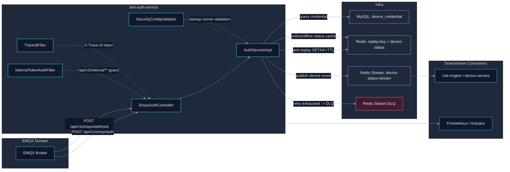

# AIOT Auth Service 全生命周期架构图

## Premise
- `aiot-auth-service` 负责设备侧认证与事件入口，不负责用户登录/JWT 签发。
- 用户 JWT 登录签发在 `aiot-home-service`，JWT 校验在 `aiot-gateway`。
- 服务对外协议需与 EMQX 兼容：`/api/v1/emqx/auth` 与 `/api/v1/emqx/webhook`。

## Constraints
- Webhook 必须具备签名校验、时间窗校验与重放防护。
- 设备状态事件必须具备失败重试与 DLQ 兜底能力。
- 内部接口路径 `/api/v1/internal/**` 必须携带 `X-Internal-Token`。

## Boundaries
- In Scope：EMQX 设备鉴权、Webhook 验签、状态缓存、事件流发布、失败降级。
- Out of Scope：用户体系注册登录、JWT refresh/logout 机制。

## Endgame
- 形成“设备接入可鉴权、状态事件可追踪、异常可降级、链路可观测”的认证服务闭环。

## 1) 组件架构图（全生命周期视角）


## 2) 调用时序图（请求运行期）

```mermaid
%%{init: {
  "theme": "base",
  "themeVariables": {
    "background": "#0b1020",
    "primaryColor": "#111827",
    "primaryTextColor": "#e5e7eb",
    "primaryBorderColor": "#22d3ee",
    "lineColor": "#94a3b8",
    "fontFamily": "JetBrains Mono, Menlo, monospace"
  }
}}%%
sequenceDiagram
  autonumber
  participant B as "EMQX Broker"
  participant C as "EmqxAuthController"
  participant S as "AuthServiceImpl"
  participant M as "MySQL(device_credential)"
  participant R as "Redis(replay/status)"
  participant X as "Redis Stream"
  participant Q as "DLQ"
  participant N as "Downstream Consumer"

  rect rgb(17,24,39)
  Note over B,C: "Phase-1 Device Connect Auth"
  B->>C: "POST /api/v1/emqx/auth (clientid,username,password)"
  C->>S: "authenticateDevice()"
  S->>M: "select by clientId"
  M-->>S: "credential record / null"
  S->>S: "HMAC-SHA256 verify"
  alt "verify pass"
    S-->>C: "allow"
    C-->>B: "200 allow"
  else "verify fail"
    S-->>C: "deny"
    C-->>B: "401 deny"
  end
  end

  rect rgb(30,41,59)
  Note over B,C: "Phase-2 Device Status Webhook"
  B->>C: "POST /api/v1/emqx/webhook (+signature,+timestamp)"
  C->>S: "verifyWebhookSignature()"
  S->>S: "time skew check"
  S->>S: "signature check"
  S->>R: "SETNX replay-key with TTL"
  alt "signature/replay invalid"
    S-->>C: "invalid signature"
    C-->>B: "401 invalid signature"
  else "valid request"
    C->>S: "handleDeviceStatusWebhook()"
    S->>R: "set device online/offline"
    loop "max retry publish"
      S->>X: "XADD device event"
      alt "publish success"
        X-->>S: "ok"
      else "publish fail"
        S->>S: "backoff retry"
      end
    end
    alt "all retries failed"
      S->>Q: "XADD DLQ event"
    end
    X-->>N: "consume device event"
    C-->>B: "200 success"
  end
  end
```


## 3) 生命周期状态图（服务内部状态机）
```mermaid
%%{init: {
  "theme": "base",
  "themeVariables": {
    "background": "#0b1020",
    "primaryColor": "#111827",
    "primaryTextColor": "#e5e7eb",
    "primaryBorderColor": "#38bdf8",
    "lineColor": "#94a3b8",
    "fontFamily": "JetBrains Mono, Menlo, monospace"
  }
}}%%
stateDiagram-v2
  [*] --> "Booting"
  "Booting" --> "ConfigLoaded": "load yml/env"
  "ConfigLoaded" --> "SecurityValidated": "validate internal token & webhook secret"
  "SecurityValidated" --> "Ready": "register nacos + expose actuator"

  "Ready" --> "AuthProcessing": "receive /emqx/auth"
  "AuthProcessing" --> "AuthAllowed": "credential + HMAC pass"
  "AuthProcessing" --> "AuthDenied": "credential missing / HMAC fail"
  "AuthAllowed" --> "Ready"
  "AuthDenied" --> "Ready"

  "Ready" --> "WebhookProcessing": "receive /emqx/webhook"
  "WebhookProcessing" --> "WebhookRejected": "signature/timestamp/replay invalid"
  "WebhookProcessing" --> "StatusUpdated": "cache online/offline"
  "StatusUpdated" --> "EventPublishing": "publish to stream"
  "EventPublishing" --> "Published": "xadd success"
  "EventPublishing" --> "Retrying": "temporary failure"
  "Retrying" --> "EventPublishing": "within retry budget"
  "Retrying" --> "DeadLettered": "retry exhausted"
  "Published" --> "Ready"
  "DeadLettered" --> "Ready"
  "WebhookRejected" --> "Ready"
```

## 4) 快速阅读顺序（10 分钟）
1. 看控制器：`EmqxAuthController`（明确外部契约）。
2. 看服务主流程：`AuthServiceImpl`（鉴权、验签、防重放、事件发布）。
3. 看配置：`application.yml`（密钥、时钟偏差、stream/dlq/retry）。
4. 看公共约束：`GlobalExceptionHandler` 与 `GlobalResponseHandler`（EMQX 协议兼容路径）。
