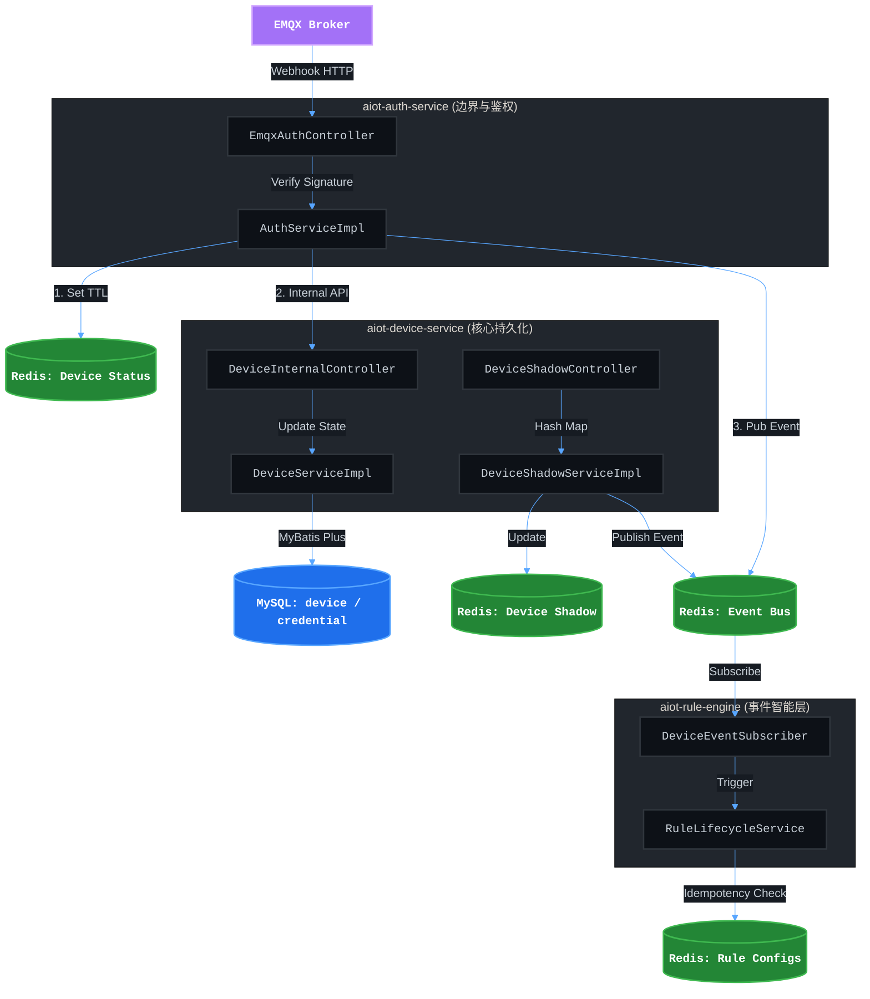

# AIoT 数据流落库链路全局架构剖析

作为兼具技术深度与业务P&L责任的操盘手，我们对 AIoT 数据流的把控不仅是为了系统稳定性，更是为了保障设备交付体验和商业数据的准确性。以下是基于第一性原理，对当前 AIoT 项目数据流落库链路的全局架构剖析。

### **一、 架构顶层定义**

*   **前提 (Premise)**：系统采用微服务架构（单节点 Compose 落地），核心业务包括设备状态监控、影子数据同步与规则联动。数据读写存在明显的冷热分离特征。
*   **约束 (Constraints)**：Webhook 链路必须具备签名验证与防重放能力；跨服务内部调用（`/api/v1/internal/**`）必须携带 `X-Internal-Token` 鉴权；WebClient 必须配置超时与重试。
*   **边界 (Boundaries)**：`aiot-auth-service` 负责边界接入与签名校验；`aiot-device-service` 负责 MySQL 持久化与设备影子管理；`aiot-rule-engine` 负责事件消费与规则执行，各司其职。
*   **终局 (Endgame)**：构建一套高吞吐、低延迟、强一致性的 AI-native 基础设施，以设备影子和事件总线为核心基座，支撑未来 LLM/Agent 场景的平滑接入，最终赋能业务营收（P&L）。

### **二、 全局数据流向可视化**

### **三、 核心数据落库链路剖析**

#### **1. 设备状态流转链路（热数据 Redis + 稳数据 MySQL）**
这是设备上下线通知的核心处理动脉，兼顾了高并发读写与最终数据一致性。
- **入口接收**：EMQX 触发 HTTP 回调至 [EmqxAuthController.java](file:///Users/aiden/Projects/AIOT-java/aiot-auth-service/src/main/java/com/aiot/auth/controller/EmqxAuthController.java) 的 `webhook` 接口。
- **校验与分发**：[AuthServiceImpl.java](file:///Users/aiden/Projects/AIOT-java/aiot-auth-service/src/main/java/com/aiot/auth/service/impl/AuthServiceImpl.java) 验证 HmacSHA256 签名。随后执行三步落库/分发逻辑：
  1.  **热数据落库**：将设备状态存入 Redis `aiot:device:status:{deviceId}`，附带 TTL，支撑前端高频拉取。
  2.  **事件削峰**：将状态事件写入 Redis Stream `aiot:stream:device-event`，由下游消费者组异步消费并 ACK，避免同步阻塞。
  3.  **稳数据落库**：`aiot-device-service` 订阅设备状态事件后进入内存缓冲，按批次异步刷新到 MySQL `device_info.status`。

#### **2. 设备影子流转链路（纯 Redis 极致性能）**
设备影子用于存储 `Reported`（实际上报）和 `Desired`（预期指令），因读写极度频繁，采用纯 Redis 持久化。
- **业务处理**：[DeviceShadowServiceImpl.java](file:///Users/aiden/Projects/AIOT-java/aiot-device-service/src/main/java/com/aiot/device/service/impl/DeviceShadowServiceImpl.java) 承接 API 或 MQTT 转发的影子更新请求。
- **落库机制**：
  - 利用 Redis Hash 结构更新 `aiot:device:shadow:reported:{deviceId}`。
  - 使用 Redis String `aiot:device:shadow:version:{deviceId}` 实现原子自增，作为乐观锁防止并发覆盖冲突。
- **下游联动**：落库成功后计算 Delta，向 Redis 发布 `SHADOW_REPORTED_UPDATED` 事件。

#### **3. 规则引擎执行链路（Redis Stream 事件驱动 + Redis 幂等）**
目前规则引擎配置并未强依赖 MySQL，而是基于 Redis 运转，为未来的 AI-native 规则生成做好了骨架准备。
- **事件消费**：位于 `aiot-rule-engine` 的 [DeviceEventSubscriber.java](file:///Users/aiden/Projects/AIOT-java/aiot-rule-engine/src/main/java/com/aiot/rule/listener/DeviceEventSubscriber.java) 监听 Redis 频道（通过 MDC 注入 traceId 保证日志可追踪）。
- **逻辑落库**：
  - [RuleLifecycleService.java](file:///Users/aiden/Projects/AIOT-java/aiot-rule-engine/src/main/java/com/aiot/rule/service/RuleLifecycleService.java) 负责读取存放在 Redis `aiot:rule:definitions` 中的规则。
  - **防重落库**：利用 Redis 写入 `aiot:rule:exec:idempotency:{ruleId}:{eventId}` 来保证动作执行的幂等性。

#### **4. 业务元数据流转链路（强关系 MySQL）**
针对产品定义、家庭结构、用户授权等低频变更的静态元数据，系统遵循标准的 CRUD 模式：
- **处理路径**：API 入口 -> Service 校验 -> Mapper 映射。
- **持久化映射**：涉及 `product`、`user`、`home` 等 MySQL 核心表。为了加速鉴权拦截，会在 `aiot-home-service` 中将权限映射缓存至 Redis 以缓解 DB 压力。

### **四、 架构操盘建议**

结合当前的架构形态与商业化诉求，我们在未来的迭代中需要注意以下防线：
- **内部契约严格化**：确保所有涉及落库的内部跨服务 API 严格遵循 `Result<T>` 统一格式，避免数据反序列化异常导致脏数据。
- **数据对账机制**：由于设备状态被同时分散在 Redis 和 MySQL，极易产生脑裂。建议增加一个基于定时任务（或 AI Agent 巡检）的对账补偿链路，定期对齐 DB 与 Redis 状态。
