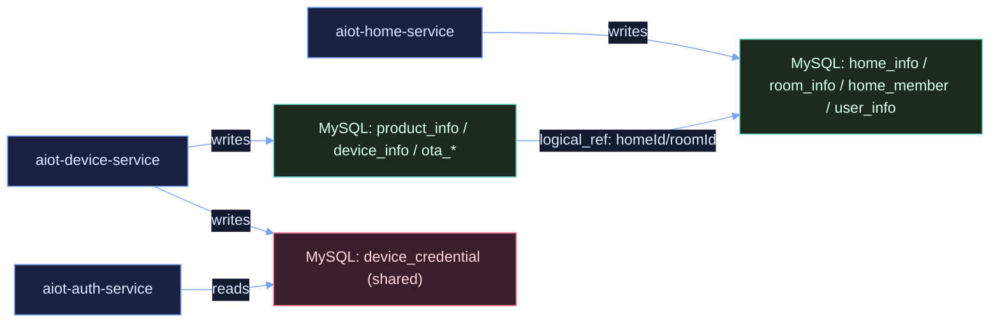

# AIOT 数据库实体与关系图谱

## Premise
- 当前仓库采用微服务拆分，但数据库并非完全按服务独占。
- 关系型数据以 MySQL 为主，事件与缓存数据以 Redis 为主。
- 本文聚焦 `aiot-home-service`、`aiot-device-service`、`aiot-auth-service` 的实体与关系。

## Constraints
- 代码层使用 MyBatis-Plus 实体映射（`@TableName`），不使用 JPA。
- SQL 主要使用索引与唯一约束，未显式声明外键，关系以应用层约束为主。
- 存在跨服务逻辑引用（如设备域持有 `homeId/roomId`）。

## Boundaries
- 本文覆盖 MySQL 实体、字段关系、业务聚合关系。
- 本文补充 Redis 侧核心模型作为“非关系型实体参考”。
- 不覆盖 API 细节、鉴权流程细节、部署细节。

## Endgame
- 给出可复用、可评审的数据库实体与关系基线文档。
- 为后续“拆库/边界治理/数据一致性治理”提供统一视图。

## 1. MySQL 实体清单

### 1.1 Home 域（`aiot-home-service`）
- `user_info` -> `User`
- `home_info` -> `Home`
- `room_info` -> `Room`
- `home_member` -> `HomeMember`

核心职责：
- 用户与家庭组织关系管理。
- 家庭下房间组织管理。
- 家庭成员角色模型（Owner/Admin/Member）管理。

### 1.2 Device 域（`aiot-device-service`）
- `product_info` -> `Product`
- `device_info` -> `Device`
- `device_credential` -> `DeviceCredential`
- `firmware_package` -> `FirmwarePackage`
- `ota_upgrade_task` -> `OtaUpgradeTask`
- `ota_upgrade_record` -> `OtaUpgradeRecord`

核心职责：
- 产品与设备主数据管理。
- 设备凭证管理（一机一密）。
- OTA 固件、任务、记录管理。

### 1.3 Auth 域（`aiot-auth-service`）
- `device_credential` -> `DeviceCredential`

核心职责：
- 设备鉴权时读取凭证。
- 与 Device 域共享同名同表实体（跨服务共享表）。

## 2. MySQL 关系模型（ER）

关系摘要：
- `Home (1) -> (N) Room`
- `Home (N) <-> (N) User` 通过 `HomeMember`
- `Product (1) -> (N) Device`
- `Device (1) -> (1) DeviceCredential`
- `Device (1) -> (N) Device`（网关 -> 子设备，自关联）
- `Product (1) -> (N) FirmwarePackage`
- `OtaUpgradeTask (1) -> (N) OtaUpgradeRecord`
- `Device (1) -> (N) OtaUpgradeRecord`

```mermaid
%%{init: {'theme': 'base', 'themeVariables': {'background': '#0b1020', 'primaryColor': '#141a2f', 'secondaryColor': '#141a2f', 'tertiaryColor': '#141a2f', 'primaryTextColor': '#dbe7ff', 'secondaryTextColor': '#dbe7ff', 'tertiaryTextColor': '#dbe7ff', 'lineColor': '#7aa2f7', 'fontFamily': 'JetBrains Mono, Menlo, monospace'}}}%%
classDiagram
direction LR

class User {
  +String id
  +String phone
  +String nickname
}
class Home {
  +String id
  +String name
}
class Room {
  +String id
  +String homeId
  +String name
}
class HomeMember {
  +String id
  +String homeId
  +String userId
  +Integer role
}
class Product {
  +String id
  +String productKey
  +Integer nodeType
}
class Device {
  +String id
  +String productKey
  +String homeId
  +String roomId
  +String gatewayId
}
class DeviceCredential {
  +String id
  +String deviceId
  +String deviceSecret
}
class FirmwarePackage {
  +String id
  +String packageId
  +String productKey
  +String version
}
class OtaUpgradeTask {
  +String id
  +String taskId
  +String homeId
  +String productKey
  +String packageId
}
class OtaUpgradeRecord {
  +String id
  +String recordId
  +String taskId
  +String deviceId
  +String toVersion
}

Home "1" --> "N" Room : "contains"
Home "1" --> "N" HomeMember : "has"
User "1" --> "N" HomeMember : "joins"

Product "1" --> "N" Device : "defines"
Device "1" --> "1" DeviceCredential : "owns"
Device "1" --> "N" Device : "gateway_of"

Product "1" --> "N" FirmwarePackage : "releases"
OtaUpgradeTask "1" --> "N" OtaUpgradeRecord : "contains"
Device "1" --> "N" OtaUpgradeRecord : "upgraded_by"

classDef core fill:#1a2140,stroke:#7aa2f7,stroke-width:1.2px,color:#dbe7ff;
classDef link fill:#1c2a1f,stroke:#73daca,stroke-width:1.2px,color:#d6ffe9;
class User,Home,Room,Product,Device,DeviceCredential,FirmwarePackage,OtaUpgradeTask,OtaUpgradeRecord core;
class HomeMember link;
```

## 3. 跨服务逻辑关系（非外键）

关键逻辑引用：
- `Device.homeId` 逻辑引用 Home 域 `home_info.id`
- `Device.roomId` 逻辑引用 Home 域 `room_info.id`
- `OtaUpgradeTask.homeId` 逻辑引用 Home 域 `home_info.id`
- `auth-service` 与 `device-service` 共享 `device_credential`



## 4. 设计提示（当前实现现状）
- 数据库层无外键约束，关系一致性依赖应用层校验与补偿流程。
- `device_credential` 共享是当前跨服务耦合点，后续可评估收敛主责服务。
- 若推进拆库治理，建议先冻结共享表写入口，再做渐进迁移。

