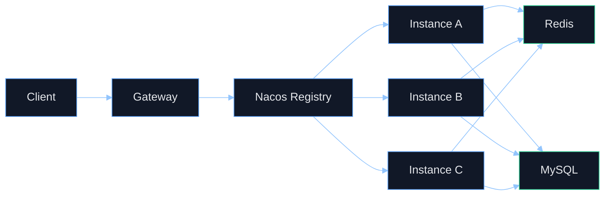
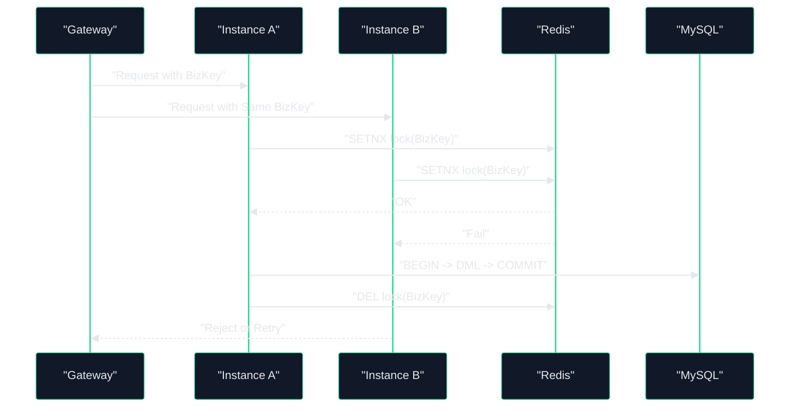

# 单微服务多实例：请求与数据库控制链路梳理 V2（可执行交付版）

## 1. Premise / Constraints / Boundaries / Endgame
- Premise：单微服务扩容到多实例后，请求由 Gateway 分发，实例共享 MySQL/Redis，需保证吞吐提升与一致性不退化。
- Constraints：现有技术栈为 Spring Cloud Gateway + Nacos + MyBatis-Plus + Redis Stream；当前跨服务调用部分仍为 base-url 直连。
- Boundaries：聚焦控制链路、数据链路、发布回滚与验收门禁，不展开单个业务接口字段设计。
- Endgame：形成“可上线、可回滚、可观测、可验收”的多实例治理基线。

## 2. 目标态总览
- 控制面：`Gateway -> Nacos -> Service Instances`，网关统一鉴权、限流、熔断和头部防伪。
- 数据面：实例内本地事务 + 跨实例幂等锁 + 数据库唯一约束 + Stream 最终一致。
- 交付面：灰度发布、健康门禁、自动回滚、SLO 指标验收闭环。

## 3. 请求控制链路（Control Plane）
### 3.1 正常请求路径
1. 客户端请求进入 Gateway，先经过 JWT 解析与白名单校验。
2. Gateway 清洗伪造内部头，注入可信 `X-User-Id` / `X-User-Phone`。
3. 路由通过 `lb://service-name` 选择实例，转发至目标服务节点。
4. 服务实例执行 `GatewayHeaderAuthInterceptor`：普通接口验证用户头，internal 接口验证内部令牌。
5. 请求进入 Controller -> Service -> Repository 业务链路。

### 3.2 控制点与门禁
- 入口门禁：Token 无效直接 401，不下沉到业务服务。
- 防伪门禁：外部注入的身份头在网关被移除，避免越权伪造。
- 弹性门禁：网关限流 + 熔断，防止流量激增导致级联故障。
- 内部门禁：`/api/v1/internal/**` 必须携带 `X-Internal-Token`。

## 4. 数据处理链路（Data Plane）
### 4.1 实例内事务
1. Service 层开启本地事务（`@Transactional`）。
2. 业务写入 MySQL，成功提交，失败回滚。
3. 若涉及跨服务状态变更，通过补偿接口和重试策略达成最终一致。

### 4.2 跨实例并发控制
- Redis 幂等键：一次性 token 使用 `getAndDelete`，防重复提交。
- Redis 抢占锁：高冲突资源（如设备配网）使用 `setIfAbsent` 确保单实例处理。
- MySQL 唯一约束：`uk_*` 索引作为最终一致性兜底。
- 事件 ACK 机制：消费成功 ACK，失败重试，超阈值入 DLQ。

## 5. 灰度发布与回滚控制链路
### 5.1 灰度发布（建议标准）
1. 新实例注册到 Nacos，但先只接收小流量（按网关路由或实例权重控制）。
2. 观察 10-15 分钟核心指标：错误率、P95、熔断次数、DLQ 增速。
3. 达标后扩大流量比例，直到全量替换。

### 5.2 自动回滚触发条件（建议）
- 5 分钟错误率 > 2%。
- P95 延迟较基线升高 > 50%。
- DLQ 增速连续 3 个窗口上升。
- 熔断开启次数超过阈值。

### 5.3 回滚动作顺序
1. 停止向新实例导流。
2. 流量切回上一稳定实例集。
3. 保留新实例用于日志和指标排障，不立即销毁。
4. 复盘根因并更新参数基线后再重发版。

## 6. 参数基线建议（起步值）
- `cross-service.timeout-ms`：2000ms（按下游 SLA 调整）。
- `cross-service.max-retries`：1-2 次（避免放大雪崩）。
- `cross-service.retry-backoff-ms`：200-500ms（指数或固定退避）。
- `circuit-breaker-failure-threshold`：3-5（短链路低阈值更安全）。
- `events.consume-retry.max-attempts`：3（失败后入 DLQ）。
- `events.pending-reclaim.fixed-delay-ms`：30000（30s 回收周期）。

## 7. 验收门禁（Go/No-Go）
- Go 条件：
  - 请求成功率满足 SLO，关键接口 P95 达标。
  - 幂等冲突率可解释且可控（无异常陡升）。
  - Stream pending 不持续累积，DLQ 在阈值内。
  - 回滚演练在预发环境完成并留档。
- No-Go 条件：
  - 存在 base-url 直连单点且无法容灾。
  - 鉴权链路存在绕过路径。
  - 关键写路径缺少幂等或唯一约束防线。

## 8. 与 V1 差异
- 增加灰度发布、回滚和门禁标准，直接支撑上线流程。
- 增加参数基线建议，可用于初始环境配置。
- 增加控制面和数据面 Mermaid 图，便于架构评审与跨团队沟通。

## 9. 参考代码入口
- `aiot-gateway/src/main/resources/application.yml`
- `aiot-gateway/src/main/java/com/aiot/gateway/security/JwtAuthGlobalFilter.java`
- `aiot-common/src/main/java/com/aiot/common/security/GatewayHeaderAuthInterceptor.java`
- `aiot-common/src/main/java/com/aiot/common/http/CrossServiceHttpExecutor.java`
- `aiot-device-service/src/main/java/com/aiot/device/service/impl/ProvisionServiceImpl.java`
- `aiot-rule-engine/src/main/java/com/aiot/rule/listener/DeviceEventSubscriber.java`
