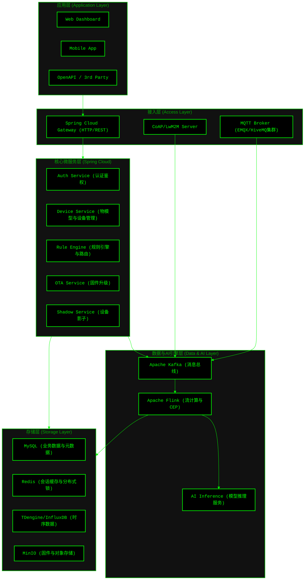
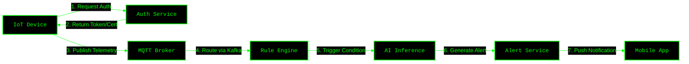
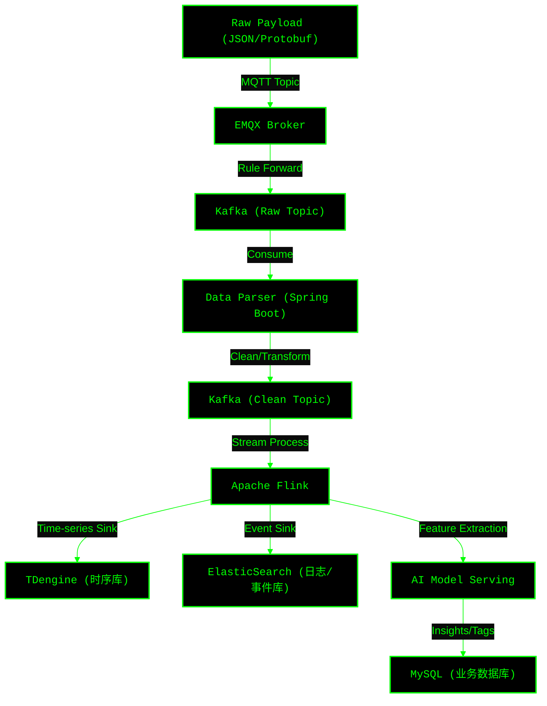
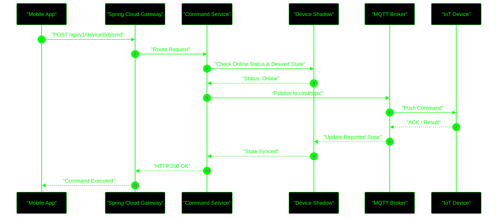

# AIoT 后端架构设计文档

## 1. 架构设计核心定义

在进入具体模块划分前，我们需要明确本次 AIoT 后端架构的四大基石：

*   **前提 (Premise)**：构建一个高可用、可扩展的 AIoT 云端平台，能够支撑海量设备的并发连接、海量时序数据的实时接入，并提供基于 AI 的设备分析预警与反向实时控制能力。
*   **约束 (Constraints)**：
    *   **技术栈**：严格基于 Java Spring Boot 构建微服务，使用 Spring Cloud Alibaba (Nacos, Sentinel等) 作为服务治理底座。
    *   **并发要求**：接入层必须能支撑百万级设备的 MQTT/CoAP 并发保活；控制指令下发延迟须在百毫秒级。
    *   **安全合规**：设备接入须进行 TLS 加密及一机一密双向认证，业务 API 采用 RBAC 权限控制。
*   **边界 (Boundaries)**：
    *   **属于后端范围**：设备网关集群对接、物模型 (Thing Model) 管理、规则引擎、数据处理流、AI 推理调度、应用层 OpenAPI 暴露。
    *   **不属于后端范围**：边缘端设备固件 (Firmware) 开发、App/Web 端前端 UI 渲染（但后端需提供完善的契约 API）。
*   **终局 (Endgame)**：形成一套云原生、多租户的 AIoT 基础设施，不仅能实现基础的“物联”（连接与数据采集），更能实现真正的“智联”（通过流计算和 AI 模型实现设备的自主决策与预测性维护）。

---

## 2. 产品与系统架构图 (Component Architecture)

基于 Spring Cloud 的微服务体系，我们将架构划分为应用层、接入层、核心服务层、数据与 AI 层以及存储层。

---

## 3. 核心业务流程图 (Business Flow)

此图展示了设备从接入、数据上报，到经过规则引擎触发 AI 分析，最终推送预警到业务端的核心链路。

---

## 4. 数据流向与处理架构图 (Data Flow)

AIoT 系统的核心在于数据的流转。这里我们采用典型的 Lambda/Kappa 变种架构，利用 Flink 进行实时流计算清洗与分发。

---

## 5. 核心交互时序图 (Core Interaction Sequence)

以“App 端下发控制指令给设备，并同步设备影子状态”这一高频场景为例：

