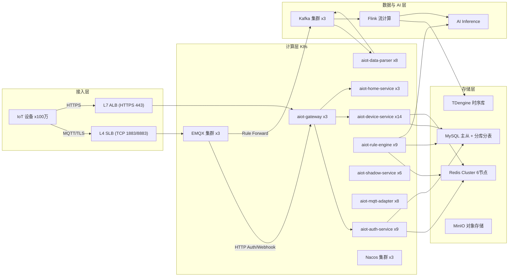

# AIOT-java 100 万设备容量规划与架构方案

> 范围：在线设备 100 万级。事实基线来源：`docker-compose.yml`、`compose/*`、各服务 `application.yml`、`docs/deployment_and_performance.md`、`docs/architecture_design.md`、`docs/database_architecture.md`、`docs/wiki/device-status-performance-baseline-v1.1.0.md`。

---

## 1. 前提与约束

- **设备规模**：100 万在线设备。
- **上报频率**：状态上报 1 条/分钟；遥测数据另计（目标态接入 Kafka/Flink 后单独规划）。
- **Payload**：单条 1KB（JSON/Protobuf）。
- **可用性目标**：状态链 `2xx >= 99.9%`、`5xx <= 0.1%`。
- **控制指令延迟**：百毫秒级下发。
- **当前阶段**：核心链路（EMQX → auth → Redis Stream → device/rule 消费 → MySQL）已落地；遥测/流计算/AI 推理属目标态。

---

## 2. 负载模型

```
状态上报 QPS = 在线设备数 N ÷ 上报间隔 T(秒) = 1,000,000 / 60 = 16,667 QPS
事件放大系数 = 1 入站 + 1 验签 + 1 XADD + 2 消费读(device/rule) + 1 MySQL 批量更新
```

| 指标 | 数值 |
|---|---:|
| EMQX 长连接 | 1,000,000 |
| 状态上报 QPS | 16,667 |
| 事件链路流量 | ~17 MB/s |
| 用户 API QPS（估，设备:用户≈100:1） | ~5,000 |
| 遥测写入速率（目标态，1条/分钟） | 16,667 rows/s |

---

## 3. 目标架构



---

## 4. 单实例目标容量

| 服务 | 单实例容量 | 关键依据 |
|---|---:|---|
| aiot-gateway | 10,000 req/s | WebFlux，无状态 |
| aiot-auth-service | 3,000 状态/s | 验签 + 重放 + XADD，Redis I/O 瓶颈 |
| aiot-device-service | 2,000 状态/s | `CASE WHEN` 单 SQL 批量刷盘 |
| aiot-rule-engine | 2,000 事件/s | AI 异步采样，禁逐事件 LLM |
| aiot-shadow-service | 3,000 事件/s | 影子读多写少 |
| aiot-mqtt-adapter | 5,000 msg/s | 目标态，纯转发 |
| aiot-data-parser | 5,000 msg/s | 目标态，解析+清洗 |

---

## 5. 计算层实例与资源规格

实例数 = `ceil(QPS / 单实例容量) × 1.5` 冗余。

| 服务 | 实例数 | 单实例 CPU | 单实例内存 | JVM | Hikari | Redis 池 |
|---|---:|---:|---:|---:|---:|---:|
| aiot-gateway | 3 | 1C | 1G | -Xmx512m | — | — |
| aiot-auth-service | 9 | 2C | 1G | -Xmx512m | 30 | 64 |
| aiot-device-service | 14 | 2C | 1G | -Xmx512m | 30 | 64 |
| aiot-home-service | 3 | 1C | 1G | -Xmx512m | 30 | 64 |
| aiot-rule-engine | 9 | 2C | 1G | -Xmx512m | — | 64 |
| aiot-shadow-service | 6 | 1C | 1G | -Xmx512m | — | 64 |
| aiot-mqtt-adapter | 8 | 1C | 1G | -Xmx512m | — | 64 |
| aiot-data-parser | 8 | 1C | 1G | -Xmx512m | — | 64 |

**总计算资源（业务服务）**：约 60 实例，累计 ~80C / ~60G。

---

## 6. 中间件规格

| 中间件 | 规格 | 说明 |
|---|---|---|
| EMQX | 3 节点，16C32G | 单节点 50 万连接，3 节点覆盖 100 万 + HA |
| Kafka | 3 节点（KRaft） | 吞吐 ~17 MB/s，余量充足 |
| Flink | 独立计算集群 | 流清洗、CEP、特征提取 |
| Nacos | 3 节点集群 | 服务注册/配置中心 |
| Redis | Cluster 6 节点 2C4G | 影子 + 幂等 key + Stream |
| MySQL | 主从 + ProxySQL | 分库分表 hash(device_id)%32 |

---

## 7. 存储容量估算

| 数据 | 容量 | 保留策略 |
|---|---:|---|
| MySQL 业务表 | ~100 GB | 长期（冷备归档） |
| Redis 内存 | ~5 GB | 影子最新切片 + 幂等 key + Stream 积压 |
| TDengine 遥测（目标态） | 热 7d + 温 3月 + 冷降采样 | 冷数据小时/天级聚合 |
| Loki 日志 | ~3 TB / 30d | 按租户分级保留 |
| Prometheus 指标 | ~1 TB / 15d | 分片 + 远端存储 |
| MinIO（OTA 固件） | 按固件版本数 | 长期 |

---

## 8. 关键链路瓶颈与应对

| 链路环节 | 瓶颈 | 应对方案 |
|---|---|---|
| auth 入口 | `setIfAbsent` 重放保护热键 | 分片 key + Redis Cluster 分散热点 |
| device 消费 | 单实例 flush 500/s | batch 提到 2000 + `CASE WHEN` 单 SQL |
| device 刷盘 | 按状态多 SQL | 改 `CASE WHEN` 批量更新 |
| MySQL | device_info 单表 16,667 row/s | hash(device_id)%32 分库分表 |
| Redis | 单点 500 万幂等 key | Cluster 6 节点 + `volatile-lru` |
| rule-engine | 逐事件 LLM 调用 | 采样 + 异步队列，LLM 独立推理服务 |
| EMQX 接入 | 连接风暴（断网重连） | `max_conn_rate=5000/s` + 设备指数退避 |

---

## 9. 扩缩容策略（K8s HPA）

| 服务 | HPA 指标 | 目标值 | 扩缩范围 |
|---|---|---:|---:|
| aiot-auth-service | CPU / 入站 QPS | 70% / 2500 QPS | 6~15 |
| aiot-device-service | 消费 Lag / CPU | Lag>0 / 70% | 8~24 |
| aiot-rule-engine | 消费 Lag / AI 队列深度 | Lag>0 | 6~15 |
| aiot-mqtt-adapter | Kafka Lag | Lag>0 | 5~16 |
| aiot-data-parser | Kafka Lag | Lag>0 | 5~16 |

---

## 10. 演进路径（当前 → 100 万）

| 阶段 | 设备规模 | 关键动作 |
|---|---:|---|
| 现状 | ≤3 万 | 单实例 + 中间件单点 |
| 第一步 | 10 万 | 双实例化 + MySQL 主从 + Redis `volatile-lru` |
| 第二步 | 30 万 | 多实例 + Nacos 集群 + EMQX 2 节点 |
| 第三步 | 50 万 | MySQL 分片评估 + Redis Cluster |
| 第四步 | 80 万 | 全量 K8s HPA + EMQX 3 节点 |
| 终局 | 100 万 | MySQL 分库分表落地 + Kafka/Flink/TDengine 上线 |

---

## 11. 需改配置清单

| 配置项 | 当前值 | 目标值 | 位置 |
|---|---:|---:|---|
| Hikari `maximum-pool-size` | 8 | 30 | device/auth/home application.yml |
| lettuce `max-active` | 16 | 64 | 各服务 application.yml |
| device flush `max-batch-size` | 500 | 2000 | device application.yml |
| 刷盘 SQL | 按状态多 SQL | `CASE WHEN` 单 SQL | DeviceStatusBufferService |
| JVM `-Xmx` | 256m | 512m | compose `JAVA_OPTS_*` |
| Redis `maxmemory-policy` | 未设 | volatile-lru | compose redis |
| EMQX `max_conn_rate` | 默认 | 5000/s | EMQX 配置 |
| 重放保护 key | 单 key | 分片 key | AuthServiceImpl |

---

## 12. 风险清单（硬约束）

| 风险 | 结论 |
|---|---|
| device_info 单表更新 16,667 row/s | 逼近单机 MySQL 上限，必须分库分表 |
| Redis 单点 500 万幂等 key | 必须 Cluster |
| rule-engine 逐事件 LLM | 不可行，必须采样 + 异步推理 |
| 状态链单实例 2000/s 上限 | 100 万需 14 实例，依赖 K8s HPA |
| 遥测未接 TSDB | 100 万前必须完成 Kafka + Flink + TDengine 落地 |
