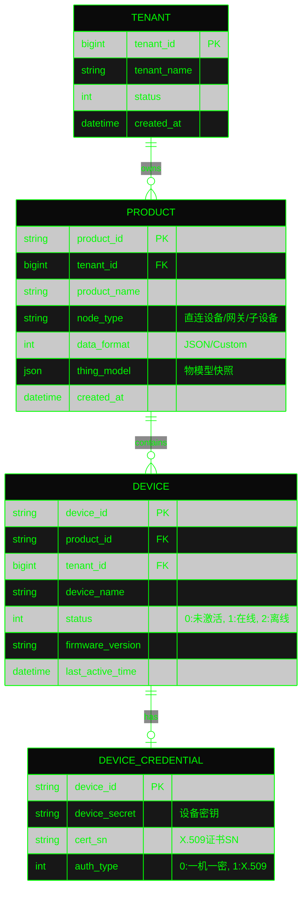

# AIoT 后端数据库与存储架构设计

## 1. 存储选型与整体架构 (Storage Architecture)

AIoT 系统的数据具有“元数据关系强、设备状态变化快、遥测数据海量高频”的特点。因此，我们采用**混合多模存储架构 (Polyglot Persistence)**：

*   **MySQL (关系型数据库)**：负责存储强一致性的业务元数据，如租户、产品定义、设备注册信息、规则配置等。
*   **Redis (内存数据库)**：负责高频读写的设备实时状态（在线/离线）、设备影子（Shadow）缓存、鉴权 Token 以及分布式锁。
*   **TDengine / InfluxDB (时序数据库)**：负责存储设备上报的海量高频遥测数据（属性、事件），支持高效的时间窗口聚合查询。
*   **MongoDB / MinIO (文档/对象存储)**：负责存储非结构化数据，如复杂的全量物模型历史快照、OTA 固件包等。

---

## 2. 核心关系型数据模型 (MySQL ER Diagram)

此处定义核心设备域的 E-R 关系图，主要涵盖租户、产品、设备及其凭证的关联。

### 核心表设计说明：
*   **分库分表策略**：考虑到海量设备接入，`DEVICE` 表初期通过 `tenant_id` 建立索引，后期数据量达到千万级时，基于 `device_id` 进行 Hash 分表（ShardingSphere）。
*   **物模型存储**：`PRODUCT` 表中的 `thing_model` 字段使用 JSON 类型存储当前的 TSL 定义，方便快速读取。

---

## 3. 时序数据模型 (TSDB - TDengine 方案)

针对设备上报的高频遥测数据，传统 MySQL 无法支撑，我们选用 TDengine 作为时序存储底座，利用其“一个设备一张表，一类设备一个超级表”的特性。

### 3.1 超级表设计 (Super Table)
以“智能温控器”产品为例，创建一个超级表 `st_thermostat_telemetry`：

| 字段名 (Column) | 类型 (Type) | 长度/说明 (Description) | 类别 |
| :--- | :--- | :--- | :--- |
| `ts` | TIMESTAMP | 时间戳 (主键) | 数据列 |
| `temperature` | FLOAT | 当前温度 | 数据列 |
| `humidity` | FLOAT | 当前湿度 | 数据列 |
| `power_switch` | TINYINT | 电源状态 | 数据列 |
| `product_id` | VARCHAR | 64, 产品ID | **标签列 (Tag)** |
| `device_id` | VARCHAR | 64, 设备ID | **标签列 (Tag)** |

### 3.2 子表自动建表策略
当网关/Kafka 消费到数据写入 TSDB 时，自动为每个 `device_id` 创建子表，如 `t_dev_1001`，继承超级表的 Schema，这极大提升了单设备的查询和聚合效率。

---

## 4. 缓存与状态管理模型 (Redis)

Redis 在 AIoT 架构中承担着极高并发的路由与状态维系任务。

### 4.1 设备在线状态缓存 (Device Status)
由于设备上下线极其频繁，不能直接压垮 MySQL。
*   **Key**: `aiot:device:status:{device_id}`
*   **Type**: `String`
*   **Value**: `"online"` 或 `"offline"`
*   **TTL**: 根据 MQTT 保活心跳 (KeepAlive) 时间设定（如 1.5 * KeepAlive），过期自动触发离线事件。

### 4.2 设备影子状态 (Device Shadow)
用于解决设备离线时，云端指令无法下发的问题。
*   **Key**: `aiot:device:shadow:{device_id}`
*   **Type**: `Hash`
*   **Fields**:
    *   `reported`: 设备最后一次上报的全量属性状态 (JSON String)。
    *   `desired`: 业务端期望设备达到的目标状态 (JSON String)。
    *   `version`: 影子版本号（用于乐观锁防并发冲突）。

### 4.3 鉴权 Token 缓存 (Auth Token)
*   **Key**: `aiot:auth:token:{device_id}`
*   **Type**: `String`
*   **Value**: 动态生成的 JWT 或 Session 凭证。
