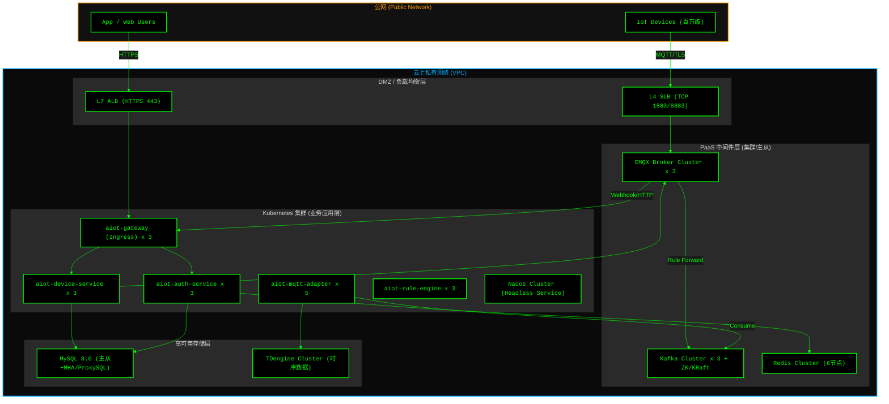

# AIoT 后端生产级部署架构、性能预判与数据设计

> 作为架构师，当我们在本地验证了 MVP 的最小闭环后，必须以“终局思维”来规划生产环境的部署拓扑、容量预判和数据底座。本文档旨在为运维团队 (DevOps) 和 DBA 提供生产落地指南。

---

## 1. 生产级部署架构与拓扑 (Deployment Architecture)

在生产环境中，AIoT 平台必须具备**高可用 (HA)**、**弹性扩缩容**以及**内外网隔离**的能力。我们采用基于 Kubernetes 的云原生容器化部署方案。

### 1.1 物理网络拓扑图

### 1.2 部署策略关键点
*   **接入层隔离**：设备通过 TCP/TLS 直连 L4 SLB，将流量负载到 EMQX 集群；App 端通过 HTTPS 连 L7 ALB，负载到 Gateway。
*   **无状态应用弹性伸缩 (HPA)**：`aiot-mqtt-adapter` 和 `aiot-rule-engine` 作为计算密集型节点，在 K8s 中配置基于 CPU/Kafka Lag 的 HPA (水平自动伸缩)。
*   **有状态节点固定**：MySQL、Redis、Kafka、TDengine 建议部署在裸金属物理机或高规格云盘云主机上，以保障 I/O 性能。

---

## 2. 系统性能预判与容量规划 (Capacity Planning)

假设我们的业务目标是：**100万设备同时在线，每台设备平均每分钟上报 1 条数据 (Payload 1KB)。**

### 2.1 并发与吞吐量预判 (Throughput)
*   **MQTT 长连接 (Connections)**：100万 TCP 连接。EMQX 单节点（16C32G）可支撑 50-100万 连接，部署 3 节点集群可轻松应对，并具备高可用冗余。
*   **上行数据并发 (TPS)**：
    *   1,000,000 次 / 60秒 ≈ **16,666 QPS** (每秒接收 1.6万条消息)。
    *   **Kafka 容量**：16,666 * 1KB ≈ **16 MB/s**。这对 3 节点 Kafka 集群毫无压力（通常可达数百 MB/s）。
*   **数据入库并发 (Write QPS)**：
    *   时序库 (TDengine) 每秒需持续写入 1.6 万行。TDengine 单核即可达到万级写入，集群化部署性能存在极大余量。

### 2.2 潜在系统瓶颈与应对策略 (Bottlenecks & Mitigation)
1.  **设备集中上线风暴 (Thundering Herd)**：
    *   *现象*：断网恢复后，百万设备瞬间并发重连，触发海量 Auth 校验和 Webhook。
    *   *策略*：在 EMQX 开启连接速率限制（如 `max_conn_rate = 5000/s`）；设备端固件引入指数退避 (Exponential Backoff) 重连机制。
2.  **Redis 内存溢出**：
    *   *现象*：设备影子数据不断膨胀导致 Redis OOM。
    *   *策略*：只在 Redis 缓存 `reported` 状态的**最新切片**，历史快照通过异步任务定期归档到 MongoDB 或只存时序库；配置 `maxmemory-policy volatile-lru`。

---

## 3. 数据层深度设计策略 (Data Design)

针对海量设备与数据，数据库架构不能停留在单机时代，必须在上线前设计好分层与生命周期管理。

### 3.1 关系型数据 (MySQL) 分库分表策略
*   **设备表 (`device_info`)**：
    *   100万设备在 MySQL 单表中仍可接受，但如果增长到千万级，查询和更新性能将急剧下降。
    *   **分片键 (Sharding Key)**：采用 `tenant_id` (B端 SAAS) 或 `device_id` 的 Hash 值 (C端消费品)。
    *   **实施方案**：引入 Apache ShardingSphere-JDBC，按 `hash(device_id) % 32` 分为 32 张物理表。
*   **设备凭证表 (`device_credential`)**：
    *   该表伴随设备注册产生，读多写少。建议开启 MySQL 主从读写分离，Auth 服务在校验签名时强制走只读从库。

### 3.2 遥测数据冷热分离与时序压缩 (TDengine)
*   **存储特征**：遥测数据“写多读少、近期热远期冷、没有更新和删除操作”。
*   **数据保留策略 (Data Retention)**：
    *   **热数据 (0-7天)**：保存在 TDengine 的内存及高性能 SSD 中，供实时监控大屏和规则引擎查询。
    *   **温数据 (7天-3个月)**：TDengine 自动将数据落盘压缩（压缩率可达 1/10 甚至更高），保存在普通 HDD 磁盘。
    *   **冷数据 (3个月以上)**：通过 TDengine 的降采样 (Downsampling) 功能，将分钟级数据聚合成“小时级”或“天级”的最大/小/平均值进行归档保存，释放磁盘空间。

### 3.3 数据一致性设计 (Data Consistency)
*   **控制指令下发**：
    *   采用**最终一致性 (Eventual Consistency)**。设备执行指令后，必须将执行结果作为 `Event` 上报，Adapter 监听到 ACK 后，再去修改 Redis 影子和 MySQL 业务表的状态，而不是在下发 HTTP 接口里同步阻塞等待（防止超时雪崩）。
