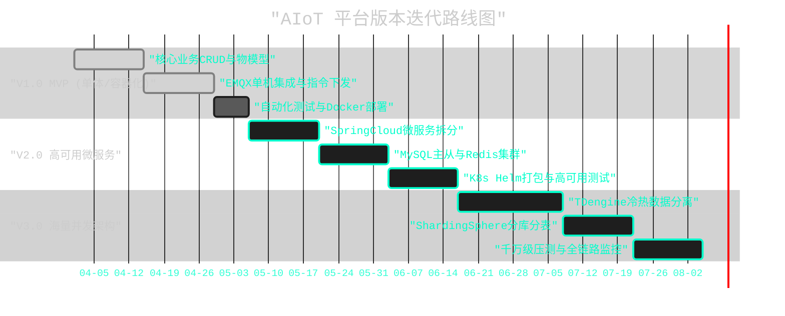

# AIoT 后端架构版本迭代与实施演进规划

为了将前期的领域驱动设计、数据库架构以及高性能部署方案真正落地，本方案将整个 AIoT 平台的演进划分为三个核心大版本（V1.0 MVP, V2.0 高可用, V3.0 海量规模）。
作为架构师与技术负责人，我们将通过明确的里程碑、测试标准和 CI/CD 自动化流水线，推动核心工程团队高标准交付。

---

## 一、 全局演进路线图 (Roadmap)

---

## 二、 里程碑拆解与团队实施标准

### 🎯 阶段一：V1.0 MVP 与基础闭环 (预计 1-1.5 个月)
**架构定位**：验证商业逻辑，打通端到端通信闭环，基于 Docker Compose 实现快速私有化部署。
**核心工程目标**：
1. **实施 (Implementation)**：
   - 落地 `aiot-device-service` 和 `aiot-auth-service`。
   - 完成 MyBatis-Plus 基础表结构设计（设备、产品、物模型）。
   - 实现 HMAC_SHA256 鉴权与 EMQX Webhook 上下线联动。
2. **测试 (Testing)**：
   - **单元测试**：Service 层业务逻辑覆盖率达到 70%。
   - **E2E 验证**：利用 Bash 脚本模拟设备 MQTT 接入、心跳、HTTP 下发指令闭环。
3. **上线 (Release)**：
   - 产出标准的 `docker-compose.yml`。
   - 实现一键拉起 MySQL, Redis, EMQX (单节点), Nacos 和业务微服务。

### 🎯 阶段二：V2.0 高可用与微服务演进 (预计 1.5-2 个月)
**架构定位**：支撑十万级在线设备，消除单点故障，全面拥抱 Kubernetes。
**核心工程目标**：
1. **实施 (Implementation)**：
   - 拆分 `aiot-data-service` (负责海量遥测数据接收) 与 `aiot-rule-engine` (规则引擎)。
   - EMQX 升级为 3 节点集群，使用 Haproxy/Nginx 代理。
   - MySQL 升级为 主从复制 (Master-Slave)，Redis 升级为 Sentinel 哨兵模式。
2. **测试 (Testing)**：
   - **混沌测试 (Chaos Engineering)**：随机 Kill 掉一个 EMQX 节点或微服务节点，验证客户端重连与服务无缝切换。
   - **压测 (Load Testing)**：使用 JMeter-MQTT 插件进行 10 万连接并发压测，确保网关无 OOM，消息延迟 < 100ms。
3. **上线 (Release)**：
   - 编写 K8s Helm Charts。
   - 引入 Prometheus + Grafana 进行基础资源与 JVM 监控。
   - 引入 SkyWalking 实现微服务间 HTTP/RPC 及数据库调用的全链路追踪 (TraceId 落地)。

### 🎯 阶段三：V3.0 千万级海量并发架构 (预计 2 个月)
**架构定位**：支撑千万级设备在线，日均百亿条遥测数据的存储与毫秒级检索。
**核心工程目标**：
1. **实施 (Implementation)**：
   - **设备库水平拆分**：引入 Apache ShardingSphere，对 `iot_device` 表根据 `product_id` 或 `tenant_id` 进行分库分表。
   - **时序数据归档**：引入 TDengine，将原本存在 MySQL/Redis 的设备遥测流水数据双写或全量迁移至 TDengine。
   - **消息削峰**：在 EMQX 规则引擎与后端服务之间插入 Kafka，避免流量洪峰压垮数据库。
2. **测试 (Testing)**：
   - **极限压测**：100万~1000万模拟设备长连接压测。
   - **数据一致性校验**：通过旁路脚本定时对账，确保从 Kafka 到 TDengine 的消息 0 丢失。
3. **上线 (Release)**：
   - 多可用区 (Multi-AZ) 容灾部署部署。
   - 实现基于 K8s HPA 的微服务 CPU/Memory 自动扩缩容。

---

## 三、 工程团队交付与上线标准流程 (CI/CD)

为了防止“架构很美好，代码很糟糕”，架构师必须联合 DevOps 团队强制推行以下研发流程：

```mermaid
%%{init: {'theme': 'base', 'themeVariables': { 'fontFamily': 'monospace', 'primaryColor': '#1e1e1e', 'primaryTextColor': '#00ffcc', 'primaryBorderColor': '#00ffcc', 'lineColor': '#00ffcc', 'secondaryColor': '#2d2d2d', 'tertiaryColor': '#333333'}}}%%
flowchart LR
    A["开发阶段 (Dev)"] --> B["代码审查 (Code Review)"]
    B --> C["CI 流水线 (GitLab CI)"]
    C --> D["测试环境 (SIT)"]
    D --> E["预发环境 (UAT)"]
    E --> F["生产环境 (PROD)"]

    classDef stage fill:#1e1e1e,stroke:#00ffcc,stroke-width:2px,color:#00ffcc;
    class A,B,C,D,E,F stage;
```

### 1. 规范卡点 (VibeCoding 强校验)
* 任何人提交代码前，必须通过 `.cursorrules` 的静态代码扫描。
* 严禁在 Controller 层写业务逻辑，发现违规直接 Reject MR (Merge Request)。
* API 接口必须与 Swagger/OpenAPI 契约保持严格一致。

### 2. CI/CD 流水线 (Pipeline) 核心步骤
1. **Lint & Test**: Maven `mvn clean test`，强制要求覆盖率达标，否则构建失败。
2. **SonarQube**: 扫描代码异味和安全漏洞（例如未加密的数据库密码）。
3. **Build Image**: 使用 Docker 结合 Jib 或 Dockerfile 构建业务镜像，打上 Git Commit Hash 的 Tag。
4. **Deploy to Test**: 自动触发 K8s 部署更新，并运行前文编写的 `test_mvp.sh` 端到端脚本。
5. **Manual Approval**: 预发环境测试通过后，测试主管手动点击 Approve，流水线推送镜像到生产集群。

### 3. 上线回滚机制 (Rollback)
* 每次生产发布必须采用 **蓝绿部署 (Blue-Green Deployment)** 或 **滚动更新 (Rolling Update)**，确保业务 0 中断。
* 数据库 DDL 必须通过 Flyway 或 Liquibase 进行版本控制，严禁直接在生产库执行 SQL。
* 若出现 P0 级故障，确保 3 分钟内通过 K8s ReplicaSet 切换回退到上一版本镜像。
