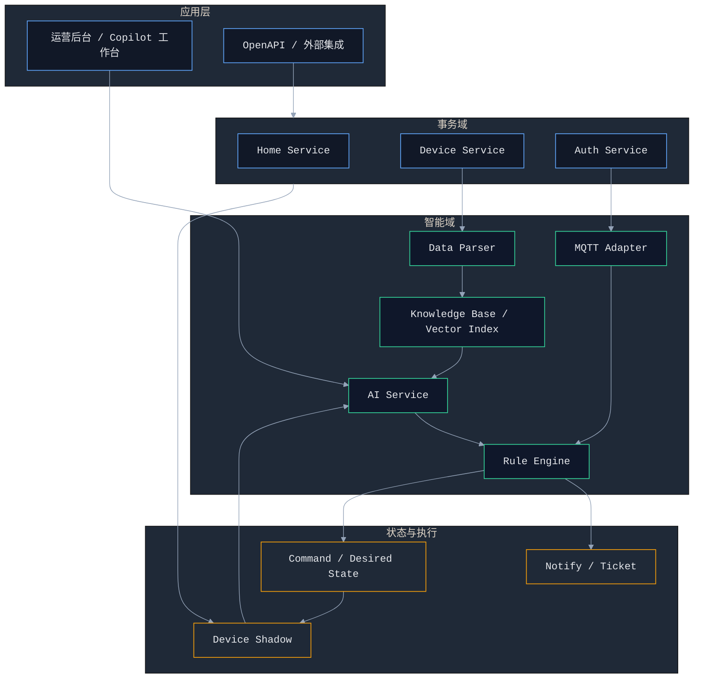
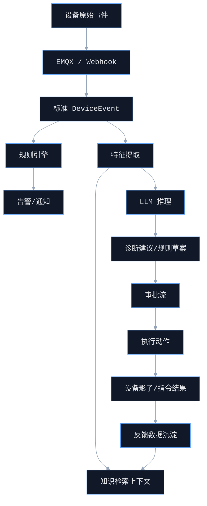
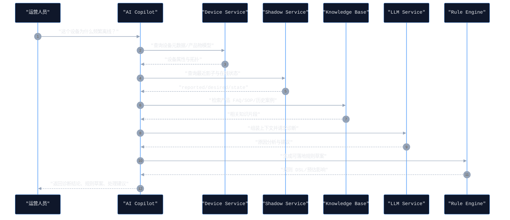

# AIoT AI-native 产品路线图

## 1. Premise（前提）
- 当前项目已经具备 `设备管理`、`家庭空间`、`设备鉴权`、`设备影子` 等事务能力，但智能能力仍停留在架构预留阶段。
- 本次建设目标不是增加一个“AI 聊天入口”，而是把平台从“可连接设备”升级为“可理解设备、可生成策略、可辅助执行”的 AI-native 平台。
- 产品成功标准不再只是接口可用，而是要形成 `数据进入平台`、`平台理解状态`、`平台生成建议`、`规则或人工执行`、`结果持续反馈` 的完整闭环。

## 2. Constraints（约束）
- 技术栈保持在现有的 `Java 17 + Spring Boot + Spring Cloud Alibaba + MySQL + Redis + EMQX` 范围内，新增能力优先复用现有微服务体系。
- AI 不直接绕过现有权限体系，所有面向设备、家庭、用户的写操作必须继续经过家庭权限和资源归属校验。
- 第一阶段优先建设 `规则引擎 + 设备知识 + 智能诊断`，不追求一次性完成通用智能体平台。
- 第一阶段不引入高复杂多模型编排，不依赖大规模训练平台，优先采用外部推理服务或轻量模型接入。
- 所有 AI 输出默认视为 `建议` 或 `规则草案`，高风险执行动作必须保留显式审批或确定性规则兜底。

## 3. Boundaries（边界）
- 包含：设备知识库、RAG 检索、设备诊断 Copilot、规则草案生成、事件智能分析、告警处置建议、审批式执行闭环。
- 不包含：端侧模型部署、边缘侧自治 Agent、多模态视觉检测、复杂财务结算、多租户商业化计费。
- 属于本期的核心改造模块：`aiot-rule-engine`、`aiot-mqtt-adapter`、`aiot-data-parser`、`aiot-device-service`。
- 属于支撑上下文但不大改边界的模块：`aiot-home-service`、`aiot-auth-service`、`aiot-common`。

## 4. Endgame（终局）
- 建设一个 `事件驱动 + 知识增强 + 规则执行 + AI 协同` 的 AIoT 平台。
- 平台既能承载传统 IoT 的接入与控制，也能提供面向运营、客服、实施、运维的智能辅助能力。
- 最终形成三层闭环：
- `业务闭环`：设备异常可发现、可解释、可处理、可复盘。
- `策略闭环`：规则可生成、可发布、可追踪、可迭代。
- `知识闭环`：经验可沉淀、可检索、可复用、可持续提升。

## 5. 产品愿景与价值主张
- 面向运营：支持用自然语言定位家庭、设备、告警和状态问题，降低排障门槛。
- 面向客服：支持对设备异常给出标准化诊断说明和 SOP 建议，提升一次解决率。
- 面向实施与运维：支持把人工经验转成规则模板和自动化处理流程。
- 面向平台：沉淀设备语义和问题知识库，为后续预测性维护和智能推荐打底。

## 6. 最小闭环主链路
`设备上报/上下线` -> `事件标准化` -> `规则识别或 AI 诊断` -> `生成告警/建议/规则草案` -> `人工审批或确定性执行` -> `影子/通知/工单回写` -> `结果沉淀知识库`

## 7. 产品架构图（Component Architecture）

## 8. 数据流向图（Data Flow）

## 9. 核心交互时序图（设备诊断 Copilot）

## 10. 产品能力分层

### 10.1 P0：智能底座期（必须）
- 统一事件模型：设备上下线、影子变化、指令结果、遥测异常统一抽象为 `DeviceEvent`。
- 规则引擎最小化产品化：支持阈值规则、离线规则、频发规则、规则命中日志。
- 设备知识基建：基于 `thingModelJson` 构建知识切片和检索索引。
- 诊断 Copilot MVP：面向运营人员提供只读问答、状态解释、排查建议。
- 审批式执行入口：AI 生成规则草案，但不能直接高风险写设备。

### 10.2 P1：可用增强期
- 引入告警处置建议、标准 SOP 推荐、家庭/房间维度上下文理解。
- 支持从自然语言生成规则模板，并进行规则预览和风险提示。
- 支持知识反馈闭环，把人工处置结论沉淀成案例知识。
- 接入通知与工单系统，实现 `诊断 -> 建议 -> 派单`。

### 10.3 P2：半自动闭环期
- 支持低风险策略自动执行，例如通知、工单建单、影子期望态预填充。
- 增加设备群组、家庭场景的聚合分析与推荐。
- 建立规则版本治理、灰度发布、效果评估。
- 支持智能推荐，例如常见离线场景规则推荐、设备巡检建议。

### 10.4 P3：AI-native 运营期
- 形成事件、知识、规则、执行、反馈的闭环学习系统。
- 支持多角色 Copilot 工作台，覆盖运营、客服、实施、研发支持。
- 支持跨家庭、跨产品的故障模式归因和经验迁移。
- 演进为“规则 + AI + 人工协同”的平台级智能治理能力。

## 11. 版本路线图（按季度/里程碑）

### M0（6-8 周）：打基础，形成最小智能闭环
- 里程碑 1：建立统一 `DeviceEvent` 事件模型和标准事件入口。
- 里程碑 2：补齐 `aiot-rule-engine` 的规则定义、规则执行、命中记录。
- 里程碑 3：补齐 `thingModelJson` 到知识切片的解析链路。
- 里程碑 4：上线设备诊断 Copilot，只读输出诊断与规则草案。
- 验收口径：能回答典型设备问题，能生成规则草案，能追踪事件与诊断来源。

### M1（6 周）：增强可用性，打通处置协同
- 新增告警联动、通知联动、工单联动。
- 新增知识反馈和人工修正入口。
- 新增规则预览、影响评估、审批流。
- 验收口径：AI 输出能进入真实业务流程，人工修正可被沉淀和复用。

### M2（8 周）：进入半自动运营
- 新增低风险动作自动执行。
- 新增规则灰度与效果分析。
- 新增群组设备和家庭场景分析。
- 验收口径：核心场景下人工干预率显著下降，策略质量可量化评估。

### M3（持续迭代）：形成平台级 AI-native 能力
- 新增多角色 Copilot 工作台。
- 新增跨域分析和经验迁移。
- 新增策略推荐、设备巡检建议、问题模式聚类。
- 验收口径：平台具备可持续迭代的知识闭环和策略闭环。

## 12. 模块拆分建议

### 12.1 `aiot-rule-engine`
- 目标：成为 `规则中心 + 诊断编排入口 + 审批执行入口`。
- 新增子模块建议：
- `rule-domain`：规则定义、条件、动作、版本。
- `rule-runtime`：规则执行、命中日志、规则模拟。
- `copilot-application`：诊断问答、规则草案生成、审批流编排。
- `llm-client`：接外部模型服务。

### 12.2 `aiot-mqtt-adapter`
- 目标：统一接收来自 EMQX 的消息、Webhook 和后续 MQTT 事件流。
- 负责把原始上行消息转成标准事件，不承载复杂业务判断。

### 12.3 `aiot-data-parser`
- 目标：负责物模型解析、知识切片、Embedding 入库、上下文标准化。
- 负责把 `产品物模型 + FAQ + 告警处理 SOP` 转成可检索知识。

### 12.4 `aiot-device-service`
- 目标：继续承载设备主数据，但增加设备数字体聚合查询。
- 新增 `DeviceDigitalProfile` 聚合接口，统一返回产品定义、影子、在线状态、最近事件摘要。

### 12.5 `aiot-home-service`
- 目标：继续承载家庭与用户权限模型。
- 为 Copilot 输出提供家庭级上下文裁剪，防止跨家庭越权检索和操作。

## 13. 关键数据对象与表结构草案

### 13.1 事件中心
- `ai_device_event`
- 字段建议：`id`、`event_id`、`device_id`、`product_id`、`home_id`、`event_type`、`event_source`、`event_time`、`payload_json`、`status`、`trace_id`
- 作用：统一承载设备在线、离线、影子变化、异常事件、控制结果。

### 13.2 规则中心
- `ai_rule_definition`
- 字段建议：`id`、`rule_code`、`name`、`scope_type`、`scope_id`、`trigger_type`、`condition_json`、`action_json`、`status`、`version`
- `ai_rule_execution_log`
- 字段建议：`id`、`rule_id`、`event_id`、`hit_result`、`execution_result`、`cost_ms`、`created_at`

### 13.3 诊断与会话中心
- `ai_copilot_session`
- 字段建议：`id`、`session_code`、`user_id`、`home_id`、`context_type`、`context_id`、`status`、`created_at`
- `ai_copilot_message`
- 字段建议：`id`、`session_id`、`role_type`、`content_text`、`metadata_json`、`created_at`

### 13.4 知识中心
- `ai_knowledge_document`
- 字段建议：`id`、`doc_type`、`source_type`、`source_id`、`title`、`content_text`、`status`
- `ai_knowledge_chunk`
- 字段建议：`id`、`document_id`、`chunk_index`、`chunk_text`、`embedding_ref`、`metadata_json`

### 13.5 审批与执行中心
- `ai_action_approval`
- 字段建议：`id`、`proposal_type`、`proposal_id`、`risk_level`、`approver_id`、`approval_status`、`approved_at`
- `ai_action_execution`
- 字段建议：`id`、`approval_id`、`target_type`、`target_id`、`action_type`、`request_json`、`result_json`、`execution_status`

## 14. API 草案（第一阶段）

### 14.1 Copilot 与诊断
- `POST /api/v1/ai/copilot/sessions`
- 说明：创建会话，指定上下文类型，例如设备、家庭、告警。
- `POST /api/v1/ai/copilot/sessions/{sessionId}/messages`
- 说明：发送问题，返回诊断结论、引用知识、建议动作、规则草案。
- `GET /api/v1/ai/copilot/sessions/{sessionId}`
- 说明：查询会话详情与上下文。

### 14.2 规则草案与审批
- `POST /api/v1/ai/rule-drafts`
- 说明：基于自然语言或诊断结果生成规则草案。
- `POST /api/v1/ai/rule-drafts/{draftId}/preview`
- 说明：预估影响设备数、命中条件、潜在风险。
- `POST /api/v1/ai/rule-drafts/{draftId}/submit`
- 说明：提交审批。
- `POST /api/v1/ai/approvals/{approvalId}/approve`
- 说明：审批通过后发布规则。

### 14.3 设备数字体
- `GET /api/v1/devices/{deviceId}/digital-profile`
- 说明：聚合产品、设备、影子、在线状态、最近事件，用于 Copilot 上下文。
- `GET /api/v1/devices/{deviceId}/events`
- 说明：查询最近设备事件序列。

### 14.4 知识管理
- `POST /api/v1/ai/knowledge/documents`
- 说明：导入 FAQ、SOP、产品说明等知识。
- `POST /api/v1/ai/knowledge/rebuild`
- 说明：触发切片与索引重建。
- `GET /api/v1/ai/knowledge/search`
- 说明：调试检索效果，支持关键词与上下文过滤。

## 15. 第一阶段 MVP 实施清单

### 15.1 产品侧
- 明确 `设备诊断 Copilot` 为第一优先级，不并行扩张过多 AI 场景。
- 固化 10-20 个高频问题模板，例如设备离线、上报异常、影子不同步、配网失败。
- 为每个高频问题准备标准答案结构：`现象`、`可能原因`、`排查步骤`、`可转规则`。

### 15.2 架构侧
- 定义 `DeviceEvent` 统一结构与事件来源规范。
- 在 `aiot-rule-engine` 中补齐规则存储、执行、草案发布能力。
- 在 `aiot-data-parser` 中增加知识切片与索引构建任务。
- 在 `aiot-device-service` 中增加数字体聚合查询接口。

### 15.3 数据侧
- 清洗 `thingModelJson`，统一字段命名、事件类型、属性说明。
- 整理历史 FAQ、设备说明、告警处理手册，形成首批知识源。
- 建立诊断结果与人工反馈的结构化沉淀格式。

### 15.4 质量侧
- 每个 AI 输出都带来源引用和上下文摘要。
- 每条规则草案都带影响范围和风险等级。
- 所有审批与执行动作都保留审计日志。
- 高风险动作默认关闭自动执行。

## 16. 核心指标（VP 看板）
- 使用率：Copilot 周活跃用户数、单用户平均提问次数、规则草案生成次数。
- 效率：平均排障时长、一次解决率、人工定位时间下降比例。
- 质量：答案采纳率、知识命中率、规则草案通过率、误报率。
- 安全：越权拦截次数、高风险动作审批覆盖率、审计日志完整率。

## 17. 风险与缓释
- 知识质量不足：先聚焦高频设备品类和标准 SOP，避免大而散。
- AI 幻觉风险：要求引用知识来源，并用规则和审批兜底。
- 规则误触发：先支持预览和灰度，再逐步开放自动执行。
- 上下文越权：所有会话强制绑定 `user_id/home_id/context_id`。
- 架构过度设计：第一阶段只做单点闭环，不同时追求预测维护和通用 Agent 平台。

## 18. 推荐实施顺序
1. 建 `DeviceEvent` 和规则执行最小链路。
2. 建设备知识库和数字体聚合查询。
3. 上线设备诊断 Copilot。
4. 上线规则草案、审批和发布。
5. 打通通知/工单和执行回写。

## 19. 一句话版本路线
- `M0`：让平台先“看懂设备”。
- `M1`：让平台开始“辅助决策”。
- `M2`：让平台逐步“半自动执行”。
- `M3`：让平台具备真正的 `AI-native` 运营能力。
