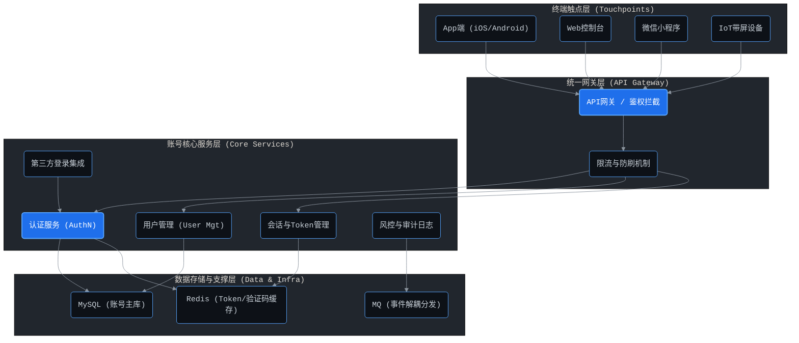
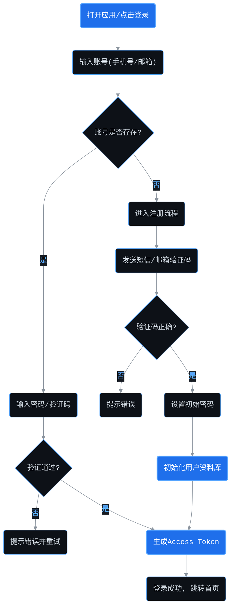
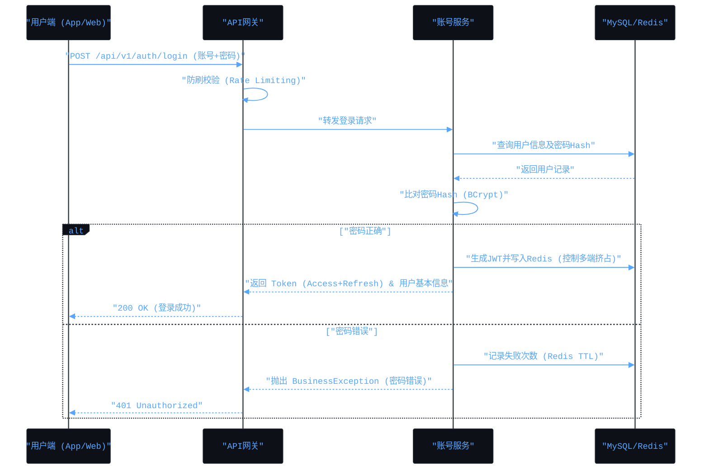

# AIoT平台用户账号系统产品规划文档

## 1. 前提 (Premise)
- 随着AIoT平台接入设备量级和C端/B端用户规模的增长，现有分散在各个业务线的用户认证逻辑难以维护，存在安全隐患。
- 业务发展需要支持多终端（App、Web端、微信小程序、IoT智能硬件端）的统一登录与无缝身份互通。
- 必须构建一个高可用、可扩展的基础账号中心，为后续各类增值服务和设备管理打下统一身份基石。

## 2. 约束 (Constraints)
- **合规与隐私保护**：必须严格遵循数据安全法、个人信息保护法（PIPL）以及GDPR合规要求，对手机号、密码、邮箱等敏感信息进行脱敏与不可逆加密存储。
- **高并发与低延迟**：作为核心基础服务，认证接口需支持高并发访问（预期QPS 5000+），P99延迟需控制在50ms以内。
- **多租户隔离**：在B端场景下，不同企业客户的账号体系需实现逻辑甚至物理隔离，避免数据越权。

## 3. 边界 (Boundaries)
- **包含**：用户身份生命周期管理（注册、登录、注销、密码找回）、基础个人信息维护、多端会话（Session/Token）管理、第三方授权登录接入（微信、Apple、Google等）。
- **不包含**：细粒度业务权限控制（RBAC等权限判定属于权限中心或业务中台）、IoT设备遥测数据处理、订单与支付流水逻辑。

## 4. 终局 (Endgame)
- 打造一套支持千万级用户的去中心化身份（DID）或联邦单点登录（SSO）系统，实现一次登录，全生态通行。
- 支持基于无感验证、生物识别（Face ID/指纹）、风险自适应认证（Risk-Based Authentication）的智能账号风控大脑。

## 5. 产品架构图



## 6. 业务流程图



## 7. 数据流向图

```mermaid
%%{init: {'theme': 'base', 'themeVariables': { 'primaryColor': '#0d1117', 'primaryTextColor': '#58a6ff', 'primaryBorderColor': '#30363d', 'lineColor': '#8b949e', 'secondaryColor': '#161b22', 'tertiaryColor': '#21262d', 'fontFamily': 'monospace'}}}%%
graph LR
classDef default fill:#0d1117,stroke:#58a6ff,stroke-width:1px,color:#c9d1d9,font-family:monospace;
classDef highlight fill:#1f6feb,stroke:#58a6ff,stroke-width:2px,color:#ffffff,font-family:monospace;
classDef storage fill:#21262d,stroke:#8b949e,stroke-width:1px,color:#c9d1d9,stroke-dasharray: 5 5;

User("用户终端") -->|1. 提交凭证(加密)| API("网关鉴权层"):::highlight
API -->|2. 透传请求| Auth("认证微服务")
Auth -->|3. 校验凭证/密码Hash| DB("主库 (MySQL)"):::storage
Auth -->|4. 存储/读取Token缓存| Redis("缓存 (Redis)"):::storage
Auth -->|5. 异步下发注册/登录事件| Kafka("消息队列 (Kafka)"):::storage
Kafka -->|6. 消费事件| Other("下游业务(积分、营销、审计)")
```

## 8. 核心交互时序图



## 9. 详细功能模块规划

### 9.1 注册与登录模块
- **多方式登录**：支持手机号+验证码、邮箱+密码、第三方授权（如微信、Apple ID）等。
- **设备指纹识别**：辅助验证环境安全，针对陌生设备登录触发二次验证（MFA）。
- **账号注销机制**：合规要求的账号软注销及30天冷静期机制。

### 9.2 会话与安全模块
- **JWT双Token机制**：短效 Access Token (如2小时) 与长效 Refresh Token (如30天)，保证体验与安全性。
- **并发登录控制**：支持配置“允许同一账号多端登录”或“单点挤占下线”。
- **风控拦截**：同IP异常登录检测、暴力破解防范锁定机制。

### 9.3 用户信息管理模块
- **基础资料**：头像、昵称、性别、绑定手机/邮箱。
- **扩展资料**：实名认证状态、企业认证关联等。

---
**附录：后端开发契约**
- **接口返回标准**：所有API需遵循 `GlobalResponseHandler` 包装，业务错误通过抛出 `BusinessException(ResultCode)` 处理。
- **缓存规范**：Token与验证码缓存的 Redis Key 必须采用 `aiot:auth:token:{userId}` 等标准前缀，并严格设置 TTL。
- **数据规范**：账号核心数据表必须使用软删除 (`is_deleted`) 字段，严禁物理删除外键关联，以保障日志及审计追踪。
