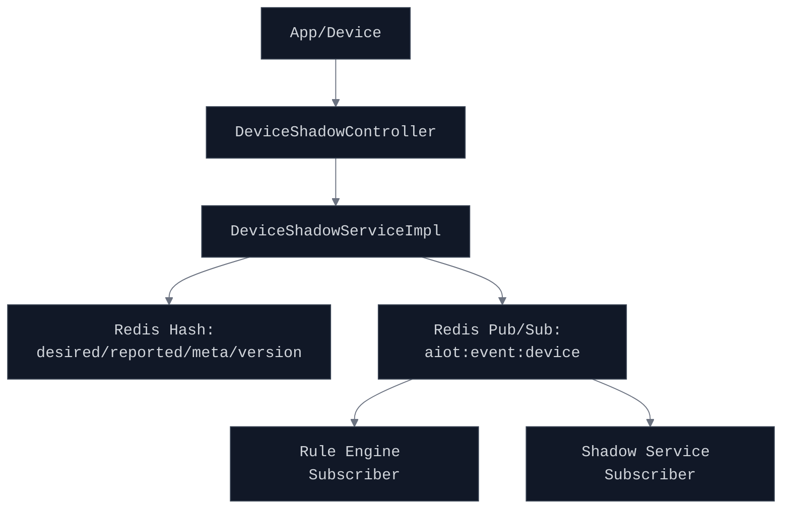
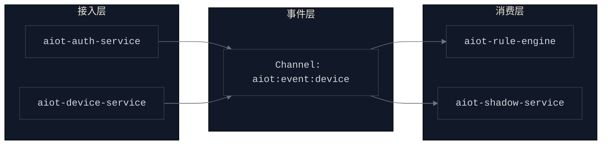
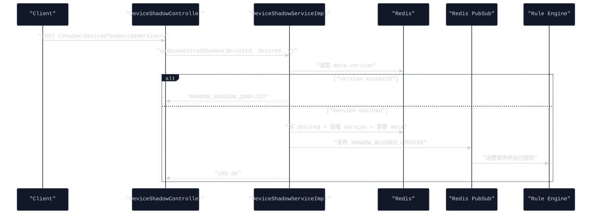

# 设备影子与异步事件化优化设计

## Premise
- 当前系统已具备设备管理、EMQX webhook 接入、规则引擎订阅能力。
- 设备影子数据已存于 Redis，具备 `reported/desired/meta/version` 基础形态。
- 项目当前目标是先完成最小可用闭环，再逐步演进到更强一致与可观测能力。

## Constraints
- 保持现有 API 路径兼容：`/api/v1/devices/{deviceId}/shadow`。
- 不引入新基础设施，优先复用现有 Redis Pub/Sub。
- 影子写入主路径不能因事件发布失败而整体失败。
- 规则引擎侧需要兼容现有 `DEVICE_ONLINE/OFFLINE` 规则。

## Boundaries
- 本次包含：影子版本控制、delta 计算、统一设备事件通道、影子事件发布与订阅。
- 本次不包含：MQTT 下行闭环重构、事件持久化总线（Kafka）、跨地域多活。
- 本次不改动：设备产品模型管理、家庭域授权主逻辑。

## Endgame
- 形成统一设备事件总线（设备状态 + 影子变化）并支撑规则触发。
- 影子 API 支持乐观锁并发控制，避免并发写覆盖。
- 通过 `delta` 明确设备待对齐状态，为指令下发与数字孪生打基础。

## 业务流程图

## 产品架构图

## 核心时序图

## 关键契约
- 影子读取响应新增 `delta` 字段，表示 `desired - reported` 的差异。
- 影子写入新增可选参数 `expectedVersion`，用于乐观锁控制。
- 统一设备事件通道默认值改为 `aiot:event:device`。
- 设备事件模型新增 `traceId/version/payload` 字段，支持扩展与追踪。
