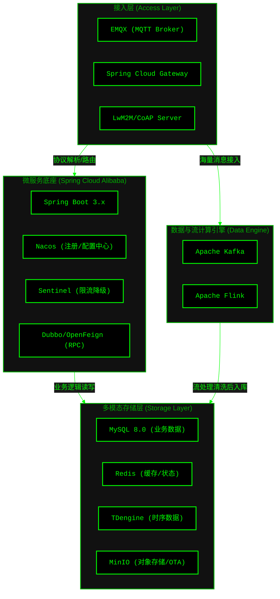

# AIoT 云端平台技术选型报告 (Technology Selection)

## 1. 架构选型核心定义

*   **前提 (Premise)**：构建一个高可用、可扩展的 AIoT 云端平台，能够支撑海量设备的并发连接、海量时序数据的实时接入，并提供基于 AI 的设备分析预警与反向实时控制能力。
*   **约束 (Constraints)**：
    *   **技术栈**：严格基于 Java Spring Boot 构建微服务，使用 Spring Cloud Alibaba (Nacos, Sentinel等) 作为服务治理底座。
    *   **并发要求**：接入层必须能支撑百万级设备的 MQTT/CoAP 并发保活；控制指令下发延迟须在百毫秒级。
    *   **安全合规**：设备接入须进行 TLS 加密及一机一密双向认证，业务 API 采用 RBAC 权限控制。
*   **边界 (Boundaries)**：
    *   **属于后端范围**：设备网关集群对接、物模型 (Thing Model) 管理、规则引擎、数据处理流、AI 推理调度、应用层 OpenAPI 暴露。
    *   **不属于后端范围**：边缘端设备固件 (Firmware) 开发、App/Web 端前端 UI 渲染（但后端需提供完善的契约 API）。
*   **终局 (Endgame)**：形成一套云原生、多租户的 AIoT 基础设施，不仅能实现基础的“物联”（连接与数据采集），更能实现真正的“智联”（通过流计算和 AI 模型实现设备的自主决策与预测性维护）。

## 2. 核心技术栈全景图

## 3. 详细选型方案与依据

### 3.1 开发语言与微服务底座
*   **开发语言**: **Java 17+**
    *   **理由**: 具备强大的生态系统，Spring Boot 3.x 对虚拟线程 (Virtual Threads) 的支持极大提升了高并发 I/O 密集型场景（如物联网 API 服务）的性能。
*   **微服务框架**: **Spring Cloud Alibaba**
    *   **组件**: **Nacos** (服务注册与配置)、**Sentinel** (流量控制与熔断降级)、**OpenFeign** (服务间调用)。
    *   **理由**: 相比传统 Spring Cloud Netflix 系列，Alibaba 生态在国内更活跃，Nacos 集成了注册中心和配置中心，运维成本更低；Sentinel 提供了强大的动态限流能力，对于防止海量设备突发重连导致的雪崩至关重要。

### 3.2 设备接入层 (IoT Gateway)
*   **MQTT Broker**: **EMQX**
    *   **理由**: 基于 Erlang/OTP 开发，天生支持高并发、高可用和集群扩展。单集群可支持千万级并发连接。提供强大的规则引擎和 Webhook 功能，能轻松将设备消息桥接到 Kafka。优于 Mosquitto (集群能力弱) 和 RabbitMQ (MQTT 插件性能存在瓶颈)。
*   **API 网关**: **Spring Cloud Gateway**
    *   **理由**: 基于 Spring WebFlux 构建，采用非阻塞 I/O，适合承接来自 App/Web 端的大并发 RESTful API 请求，且能与 Nacos 无缝集成实现动态路由。

### 3.3 数据流总线与流计算
*   **消息队列**: **Apache Kafka**
    *   **理由**: AIoT 场景下，设备上报的遥测数据 (Telemetry) 吞吐量极大。Kafka 的高吞吐、低延迟和持久化特性使其成为设备数据缓冲、削峰填谷的最佳选择。
*   **流计算引擎**: **Apache Flink**
    *   **理由**: 提供精确的 Exactly-Once 语义，强大的窗口 (Window) 和复杂事件处理 (CEP) 能力。非常适合实时清洗物联网脏数据、计算实时聚合指标、以及触发实时告警规则。优于 Spark Streaming（在低延迟 CEP 场景下 Flink 更具优势）。

### 3.4 多模态存储层
*   **关系型数据库**: **MySQL 8.0**
    *   **用途**: 存储物模型定义、设备元数据、租户信息、RBAC 权限等高一致性要求的数据。
*   **时序数据库 (TSDB)**: **TDengine**
    *   **用途**: 存储设备上报的海量遥测数据（如温度、湿度、电压等）。
    *   **理由**: 采用“一个设备一张表”的创新架构，写入速度极快，且提供极高的压缩率，极大降低存储成本。内置流式计算与聚合查询能力，性能与成本表现优于 InfluxDB 和 TimescaleDB。
*   **缓存与内存数据库**: **Redis**
    *   **用途**: 存储设备在线状态、设备影子缓存、高频访问的鉴权 Token，以及实现分布式锁。
*   **对象存储**: **MinIO**
    *   **用途**: 存储 OTA 固件包、设备上传的图片/视频等非结构化数据。
    *   **理由**: 兼容 Amazon S3 API，轻量级，易于私有化部署。

## 4. 总结
本技术选型方案严格遵循了**高内聚、低耦合**的微服务架构原则。接入层依靠 EMQX 扛住海量连接；微服务层依靠 Spring Cloud Alibaba 保证业务的高可用；数据链路依靠 Kafka + Flink 实现高吞吐流处理；存储层采用多模态策略（MySQL+TDengine+Redis+MinIO）以最优成本满足不同类型数据的存取需求。