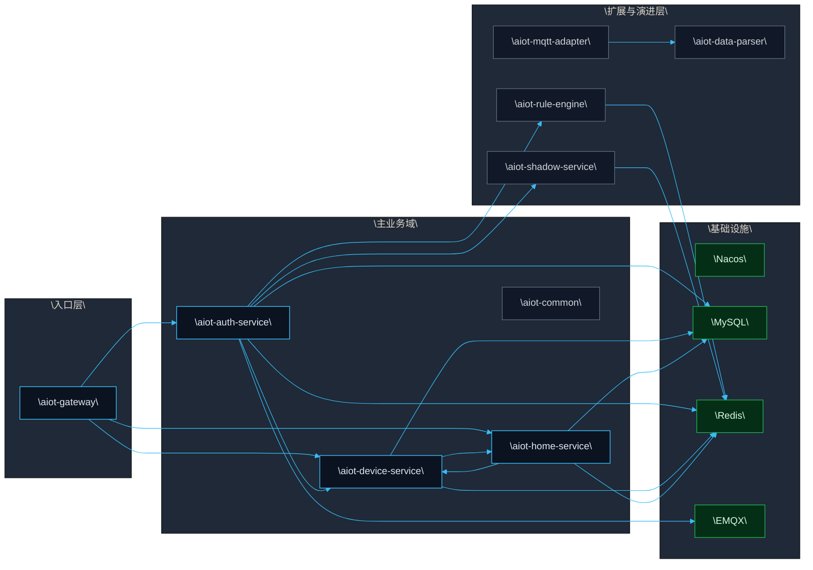
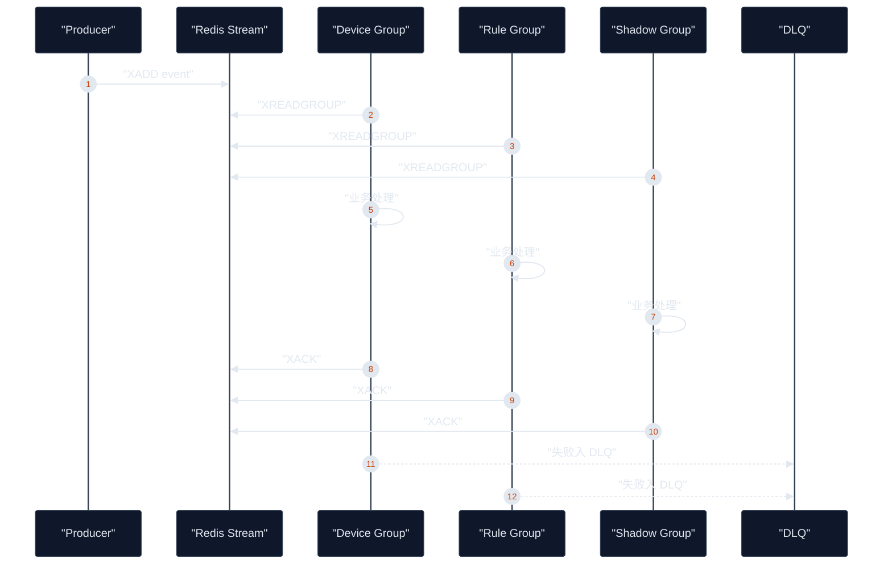

# AIOT-java 架构学习手册

## 1. 手册定位

- 目标：把 `AIOT-java` 的架构理解从“零散知识点”升级为“可系统学习的完整手册”。
- 适用对象：希望从会读接口、会写 CRUD，提升到能理解系统边界、主链路、一致性、可靠性和演进方向的开发者。
- 阅读方式：先看全景，再看模型，再按主链路读代码，最后回到具体类和接口。

## 2. 先给结论

`AIOT-java` 不是若干独立 CRUD 服务的拼接，而是一个以 `设备接入 -> 事件流 -> 设备域/家庭域/规则域协同` 为核心的 AIoT 微服务平台。

当前主运行面：

- `aiot-gateway`
- `aiot-auth-service`
- `aiot-device-service`
- `aiot-home-service`

当前基础设施：

- `Nacos`
- `MySQL`
- `Redis`
- `EMQX`

当前扩展面：

- `aiot-rule-engine`
- `aiot-shadow-service`
- `aiot-mqtt-adapter`
- `aiot-data-parser`

一句话理解它：

- `gateway` 管入口
- `auth-service` 管接入与认证
- `device-service` 管设备主数据与影子
- `home-service` 管家庭与权限
- `rule-engine` 和 `shadow-service` 管事件消费后的扩展处理

## 3. 架构前提

### 3.1 Premise

- 当前系统已经形成“设备接入 + 家庭场景 + 设备管理 + 基础事件链路”的可运行底座。
- 项目目标不是一次性堆满全部能力，而是先保证主链路可交付、可观测、可回滚，再持续扩展。

### 3.2 Constraints

- 当前部署形态以 `Docker Compose` 单节点为主。
- 模块成熟度不一致，部分模块仍处于骨架态或演进态。
- 一致性并不完全依赖数据库外键和分布式事务，而是大量依赖应用层校验、补偿、幂等和事件驱动。

### 3.3 Boundaries

- 本手册聚焦后端微服务、设备接入、事件流、补偿机制、影子模型、发布治理。
- 不把规划态能力当成已落地事实。
- 不展开前端页面和交互细节。

### 3.4 Endgame

- 形成一个可持续演进、可观测、可回滚、可复制交付的 AIoT 平台底座。
- 新增场景尽量通过扩展模型和链路治理完成，而不是推翻重做。

## 4. 全景地图

### 4.1 模块分层图

### 4.2 模块职责清单

| 模块 | 主要职责 | 当前状态 | 你要重点关注什么 |
|---|---|---|---|
| `aiot-gateway` | 统一入口、JWT 鉴权、路由转发、入口防护 | 已落地 | 入口治理与请求控制面 |
| `aiot-auth-service` | EMQX 鉴权、Webhook 验签、防重放、上下线事件接入 | 已落地 | 设备接入域与事件生产 |
| `aiot-device-service` | 产品、设备、配网、影子、OTA、内部补偿接口 | 已落地 | 设备主数据、影子模型、配网与补偿 |
| `aiot-home-service` | 用户、家庭、房间、成员、角色、补偿发起 | 已落地 | 家庭域主数据和跨域一致性 |
| `aiot-rule-engine` | 事件消费、规则执行、告警与工单闭环 | 轻量落地 | 事件可靠消费和运营闭环 |
| `aiot-shadow-service` | 影子事件消费与影子域独立化演进位 | 部分落地 | 影子域未来拆分方向 |
| `aiot-mqtt-adapter` | MQTT 入站适配 | 骨架 | 协议适配位置 |
| `aiot-data-parser` | 数据解析与标准化 | 骨架 | 解析域演进位 |
| `aiot-common` | Result、异常、Trace、内部鉴权、跨服务调用治理 | 已落地 | 公共契约与治理组件 |

### 4.3 关键源码入口

- 项目入口说明：[`README.md`](../../README.md)
- 当前架构基线：[`current-architecture.md`](current-architecture.md)
- 数据与业务总览：[`../architecture/AIOT_DATA_AND_BUSINESS_MODELING_FULL_VIEW.md`](../architecture/AIOT_DATA_AND_BUSINESS_MODELING_FULL_VIEW.md)
- 多实例控制链路：[`../architecture/microservice-multi-instance-control-and-data-chains-v2.md`](../architecture/microservice-multi-instance-control-and-data-chains-v2.md)
- 根模块清单：[`../../pom.xml`](../../pom.xml)
- 部署编排：[`../../docker-compose.yml`](../../docker-compose.yml)

## 5. 用架构师视角看这个项目

### 5.1 不要只看分层，要看边界

- `Controller -> Service -> Mapper` 只是单个服务内部的技术分层。
- 真正重要的是限界上下文，也就是：
  - 接入与认证域
  - 设备域
  - 家庭域
  - 规则运营域
  - 影子域

### 5.2 不要只看接口，要看主链路

- 谁是入口
- 谁拥有主数据
- 谁生产事件
- 谁消费事件
- 谁承担补偿
- 谁负责最终一致性

### 5.3 不要只看同步调用，要看异步投影

- 这个项目的核心“味道”不在同步 HTTP，而在 `Redis Stream` 驱动的异步处理。
- 设备上下线、影子变化、规则执行这些能力都不是孤立接口，而是事件链路的一部分。

### 5.4 不要把规划态当现状

- 代码与文档明确区分 `current / in-progress / planned`。
- 学习时必须始终区分：
  - 已经落地的能力
  - 正在演进的能力
  - 未来规划的能力

## 6. 限界上下文手册

| 上下文 | 核心能力 | 主对象 | 入口接口 | 出口能力 |
|---|---|---|---|---|
| 接入与认证域 | 设备鉴权、Webhook 验签、防重放 | `DeviceCredential`、接入事件 | `/api/v1/emqx/auth`、`/api/v1/emqx/webhook` | 发布 `device-event` |
| 设备域 | 产品、设备、配网、影子、OTA | `Product`、`Device`、`Credential`、`Shadow` | `/api/v1/devices/**`、`/api/v1/products/**` | 调家庭权限、发影子事件 |
| 家庭域 | 用户、家庭、房间、成员、角色 | `User`、`Home`、`Room`、`HomeMember` | `/api/v1/homes/**`、`/api/v1/rooms/**` | 发起设备解绑补偿 |
| 规则运营域 | 规则、告警、工单、审计 | `Rule`、`Alarm`、`WorkOrder` | 规则与运营接口 | 事件处理与闭环输出 |
| 影子域 | 状态投影与影子消费 | `ShadowEvent` | 当前主要靠订阅 | 影子态演进与独立化 |

## 7. 五条必须掌握的主链路

### 7.1 链路一：设备接入鉴权

**业务目标**

- 让设备通过 `EMQX` 合法接入平台。

**流程**

1. 设备连接 `EMQX`
2. `EMQX` 调用 `auth-service` 的 `/api/v1/emqx/auth`
3. 服务校验设备身份
4. 鉴权通过后允许连接

**源码入口**

- [`EmqxAuthController.java`](../../aiot-auth-service/src/main/java/com/aiot/auth/controller/EmqxAuthController.java)
- [`AuthServiceImpl.java`](../../aiot-auth-service/src/main/java/com/aiot/auth/service/impl/AuthServiceImpl.java)

**架构重点**

- 这里不是普通业务登录，而是 IoT 设备接入控制。
- `auth-service` 不只是鉴权工具服务，它本质上是接入域入口。

**源码跳读顺序**

1. [`EmqxAuthController.java`](../../aiot-auth-service/src/main/java/com/aiot/auth/controller/EmqxAuthController.java)
   看外部入口 `/auth` 和 `/webhook` 暴露了什么协议。
2. [`AuthServiceImpl.java`](../../aiot-auth-service/src/main/java/com/aiot/auth/service/impl/AuthServiceImpl.java)
   重点看 `authenticateDevice()`，理解设备凭证校验和签名算法。
3. [`DeviceCredentialRepository.java`](../../aiot-auth-service/src/main/java/com/aiot/auth/repository/DeviceCredentialRepository.java)
   看认证域如何读取设备凭证。

**阅读时重点追问**

- 为什么设备凭证读在认证域，而写在设备域？
- 为什么设备身份校验不直接走 JWT，而是走 `clientId + deviceSecret`？

### 7.2 链路二：设备上下线状态同步

**业务目标**

- 把设备在 `EMQX` 中的连接状态，可靠地同步到业务域。

**流程**

1. `EMQX` 回调 `/api/v1/emqx/webhook`
2. `auth-service` 完成验签、防重放
3. 写 Redis 在线状态
4. 发布 `device-event`
5. `device-service` 消费并刷设备状态
6. `rule-engine`、`shadow-service` 跟进处理

**源码入口**

- [`EmqxAuthController.java`](../../aiot-auth-service/src/main/java/com/aiot/auth/controller/EmqxAuthController.java)
- [`AuthServiceImpl.java`](../../aiot-auth-service/src/main/java/com/aiot/auth/service/impl/AuthServiceImpl.java)
- [`RedisDeviceEventStreamConfig.java`](../../aiot-device-service/src/main/java/com/aiot/device/config/RedisDeviceEventStreamConfig.java)
- [`DeviceStatusStreamSubscriber.java`](../../aiot-device-service/src/main/java/com/aiot/device/listener/DeviceStatusStreamSubscriber.java)
- [`DeviceStatusBufferService.java`](../../aiot-device-service/src/main/java/com/aiot/device/service/DeviceStatusBufferService.java)

**架构重点**

- 这是 `接入域 -> 事件总线 -> 设备域/规则域/影子域` 的标准异步投影链路。
- 它体现了“接入事实”和“业务投影”分离。

**源码跳读顺序**

1. [`EmqxAuthController.java`](../../aiot-auth-service/src/main/java/com/aiot/auth/controller/EmqxAuthController.java)
   先看 webhook 如何进入系统。
2. [`AuthServiceImpl.java`](../../aiot-auth-service/src/main/java/com/aiot/auth/service/impl/AuthServiceImpl.java)
   重点看 `verifyWebhookSignature()`、`handleDeviceStatusWebhook()`、`publishDeviceEvent()`。
3. [`DeviceEvent.java`](../../aiot-common/src/main/java/com/aiot/common/event/DeviceEvent.java)
   看统一事件契约长什么样。
4. [`DeviceEventType.java`](../../aiot-common/src/main/java/com/aiot/common/event/DeviceEventType.java)
   看有哪些领域事件。
5. [`RedisDeviceEventStreamConfig.java`](../../aiot-device-service/src/main/java/com/aiot/device/config/RedisDeviceEventStreamConfig.java)
   看设备域怎样挂上消费者组。
6. [`DeviceStatusStreamSubscriber.java`](../../aiot-device-service/src/main/java/com/aiot/device/listener/DeviceStatusStreamSubscriber.java)
   看设备域怎样消费上下线事件。
7. [`DeviceStatusBufferService.java`](../../aiot-device-service/src/main/java/com/aiot/device/service/DeviceStatusBufferService.java)
   看为什么要缓冲、批量刷库，而不是每条事件直接打数据库。
8. [`DeviceMapper.java`](../../aiot-device-service/src/main/java/com/aiot/device/mapper/DeviceMapper.java)
   看最终状态落库方式。

**阅读时重点追问**

- 为什么先写 Redis/事件流，再异步更新 MySQL？
- 为什么设备状态同步属于投影链路，而不是主写链路？

### 7.3 链路三：设备配网

**业务目标**

- 让设备通过一次性令牌完成认领和凭证下发。

**流程**

1. App 侧创建配网 token
2. 设备携带 token 发起兑换
3. 服务通过 Redis 幂等键和分布式锁控制并发
4. 生成凭证并完成设备认领
5. 发布配网成功或失败事件

**源码入口**

- [`ProvisionController.java`](../../aiot-device-service/src/main/java/com/aiot/device/controller/ProvisionController.java)
- [`ProvisionServiceImpl.java`](../../aiot-device-service/src/main/java/com/aiot/device/service/impl/ProvisionServiceImpl.java)

**架构重点**

- 这是学习并发控制、幂等设计、一次性令牌设计的最佳入口。
- 真正要看的是“为什么不会重复认领”，不是“接口参数有哪些”。

**源码跳读顺序**

1. [`ProvisionController.java`](../../aiot-device-service/src/main/java/com/aiot/device/controller/ProvisionController.java)
   看两个核心入口：创建 token、兑换 token。
2. [`ProvisionServiceImpl.java`](../../aiot-device-service/src/main/java/com/aiot/device/service/impl/ProvisionServiceImpl.java)
   重点看 `generateProvisionToken()`、`provisionDevice()`、`resolveOrCreateProvisioning()`。
3. [`HomePermissionService.java`](../../aiot-device-service/src/main/java/com/aiot/device/security/HomePermissionService.java)
   看为什么发放配网 token 前要校验家庭权限。
4. [`DeviceServiceImpl.java`](../../aiot-device-service/src/main/java/com/aiot/device/service/impl/DeviceServiceImpl.java)
   看创建新设备和认领未绑定设备的具体逻辑。
5. [`DeviceRepository.java`](../../aiot-device-service/src/main/java/com/aiot/device/repository/DeviceRepository.java)
   看设备唯一性最终落在哪一层。
6. [`DeviceCredentialRepository.java`](../../aiot-device-service/src/main/java/com/aiot/device/repository/DeviceCredentialRepository.java)
   看凭证如何被保存与读取。

**阅读时重点追问**

- 为什么 `getAndDelete(token)` 是一次性令牌的核心？
- 为什么除了 Redis 锁，还要靠数据库唯一约束兜底？
- 为什么并发场景下要接受“重试后读取现有结果”这种设计？

### 7.4 链路四：家庭删除补偿

**业务目标**

- 删除家庭后，设备不应继续悬挂在已删除的家庭下。

**流程**

1. 家庭域删除家庭主数据
2. 创建补偿任务
3. 发布事务后事件
4. 调设备域内部解绑接口
5. 失败后由定时任务重试

**源码入口**

- [`HomeController.java`](../../aiot-home-service/src/main/java/com/aiot/home/controller/HomeController.java)
- [`HomeServiceImpl.java`](../../aiot-home-service/src/main/java/com/aiot/home/service/impl/HomeServiceImpl.java)
- [`HomeDeleteCompensationTaskServiceImpl.java`](../../aiot-home-service/src/main/java/com/aiot/home/service/impl/HomeDeleteCompensationTaskServiceImpl.java)
- [`HomeDeleteCompensationListener.java`](../../aiot-home-service/src/main/java/com/aiot/home/listener/HomeDeleteCompensationListener.java)
- [`HomeDeleteCompensationRetryJob.java`](../../aiot-home-service/src/main/java/com/aiot/home/job/HomeDeleteCompensationRetryJob.java)
- [`InternalDeviceCompensationController.java`](../../aiot-device-service/src/main/java/com/aiot/device/controller/InternalDeviceCompensationController.java)
- [`DeviceServiceImpl.java`](../../aiot-device-service/src/main/java/com/aiot/device/service/impl/DeviceServiceImpl.java)

**架构重点**

- 这里没有使用分布式事务。
- 使用的是“主流程成功 + 补偿任务 + 事务后触发 + 定时重试”的最终一致性方案。
- 这是整个项目最值得学习的跨域一致性案例之一。

**源码跳读顺序**

1. [`HomeController.java`](../../aiot-home-service/src/main/java/com/aiot/home/controller/HomeController.java)
   先看删除家庭的外部入口。
2. [`HomeServiceImpl.java`](../../aiot-home-service/src/main/java/com/aiot/home/service/impl/HomeServiceImpl.java)
   重点看 `deleteHome()` 如何先删主数据，再创建补偿任务并发布事件。
3. [`HomeDeleteCompensationTaskServiceImpl.java`](../../aiot-home-service/src/main/java/com/aiot/home/service/impl/HomeDeleteCompensationTaskServiceImpl.java)
   看补偿任务如何创建、抢占、执行、重试、标记成功失败。
4. [`HomeDeleteCompensationListener.java`](../../aiot-home-service/src/main/java/com/aiot/home/listener/HomeDeleteCompensationListener.java)
   看为什么使用事务提交后事件。
5. [`HomeDeleteCompensationRetryJob.java`](../../aiot-home-service/src/main/java/com/aiot/home/job/HomeDeleteCompensationRetryJob.java)
   看失败后的恢复机制。
6. [`HomeDeviceCompensationService.java`](../../aiot-home-service/src/main/java/com/aiot/home/service/HomeDeviceCompensationService.java)
   看家庭域如何通过内部调用触发设备域解绑。
7. [`InternalDeviceCompensationController.java`](../../aiot-device-service/src/main/java/com/aiot/device/controller/InternalDeviceCompensationController.java)
   看设备域内部接口边界。
8. [`DeviceServiceImpl.java`](../../aiot-device-service/src/main/java/com/aiot/device/service/impl/DeviceServiceImpl.java)
   看最终解绑写逻辑落在哪里。

**阅读时重点追问**

- 为什么要先删主数据，再补设备解绑，而不是反过来？
- 为什么家庭删除是任务化补偿，而房间删除更接近同步补偿？
- 为什么补偿要设计成“可重试、可观测、可审计”？

### 7.5 链路五：设备影子

**业务目标**

- 管理设备期望态和上报态，实现状态同步而不是直接命令耦合。

**流程**

1. 外部请求修改 `desired` 或 `reported`
2. 服务通过 Lua 和 Redis 做原子更新
3. 发布 `SHADOW_DESIRED_UPDATED` 或 `SHADOW_REPORTED_UPDATED`
4. 其他模块消费影子事件

**源码入口**

- [`DeviceShadowController.java`](../../aiot-device-service/src/main/java/com/aiot/device/controller/DeviceShadowController.java)
- [`DeviceShadowServiceImpl.java`](../../aiot-device-service/src/main/java/com/aiot/device/service/impl/DeviceShadowServiceImpl.java)

**架构重点**

- 当前所谓“指令下发”在很大程度上是影子状态维护，而不是独立命令总线。
- 学这个模块时要关注：
  - 为什么用影子
  - 为什么需要版本或原子更新
  - 为什么影子更接近状态同步模型

**源码跳读顺序**

1. [`DeviceShadowController.java`](../../aiot-device-service/src/main/java/com/aiot/device/controller/DeviceShadowController.java)
   看影子的查询、期望态更新、上报态更新三个入口。
2. [`DeviceShadowServiceImpl.java`](../../aiot-device-service/src/main/java/com/aiot/device/service/impl/DeviceShadowServiceImpl.java)
   重点看 `validateShadowPayload()`、`applyShadowUpdateLua()`、`computeDesiredDelta()`、`publishShadowEvent()`。
3. [`DeviceEvent.java`](../../aiot-common/src/main/java/com/aiot/common/event/DeviceEvent.java)
   看影子变更为何仍然落在统一事件模型上。
4. [`DeviceEventType.java`](../../aiot-common/src/main/java/com/aiot/common/event/DeviceEventType.java)
   看影子事件如何与上下线事件共享契约体系。

**阅读时重点追问**

- 为什么影子更新要用 Lua 而不是普通多次 Redis 命令？
- 为什么影子写成功后发布事件，但发布失败不阻断主写路径？
- 为什么 `delta` 是理解影子同步语义的关键？

## 8. 事件模型手册

### 8.1 当前核心事件

| 事件类型 | 生产方 | 消费方 | 作用 |
|---|---|---|---|
| `DEVICE_ONLINE` | `auth-service` | `device-service`、`rule-engine`、`shadow-service` | 同步上线事实 |
| `DEVICE_OFFLINE` | `auth-service` | `device-service`、`rule-engine`、`shadow-service` | 同步离线事实 |
| `SHADOW_DESIRED_UPDATED` | `device-service` | 相关消费者 | 同步期望态变化 |
| `SHADOW_REPORTED_UPDATED` | `device-service` | 相关消费者 | 同步上报态变化 |

### 8.2 事件可靠性模型

### 8.3 你要学到的重点

- 事件只是载体，真正重要的是领域事实和投影流程。
- `Redis Stream` 在当前阶段承担的是轻量消息总线角色。
- 可靠性不是“有消费就行”，而是要看 `ACK + pending reclaim + DLQ + 监控` 是否形成闭环。

## 9. 源码跳读总路线

如果你想最短路径把整个项目读明白，建议按下面顺序跳读：

1. [`../../README.md`](../../README.md)
   建立项目定位和技术基座认知。
2. [`current-architecture.md`](current-architecture.md)
   建立当前运行面与事实边界。
3. [`../architecture/AIOT_DATA_AND_BUSINESS_MODELING_FULL_VIEW.md`](../architecture/AIOT_DATA_AND_BUSINESS_MODELING_FULL_VIEW.md)
   建立限界上下文、主数据归属、事件模型认知。
4. 设备接入鉴权链路
   从 `EmqxAuthController -> AuthServiceImpl` 开始。
5. 设备上下线状态同步链路
   从 `AuthServiceImpl -> RedisDeviceEventStreamConfig -> DeviceStatusStreamSubscriber -> DeviceStatusBufferService` 读。
6. 设备配网链路
   从 `ProvisionController -> ProvisionServiceImpl -> DeviceServiceImpl` 读。
7. 家庭删除补偿链路
   从 `HomeController -> HomeServiceImpl -> HomeDeleteCompensationTaskServiceImpl -> InternalDeviceCompensationController -> DeviceServiceImpl` 读。
8. 设备影子链路
   从 `DeviceShadowController -> DeviceShadowServiceImpl` 读。
9. [`../architecture/microservice-multi-instance-control-and-data-chains-v2.md`](../architecture/microservice-multi-instance-control-and-data-chains-v2.md)
   最后补控制面、数据面、多实例和发布治理。

## 10. 数据一致性手册

### 9.1 这个项目如何保证一致性

- 单服务内：本地事务。
- 高冲突写路径：Redis 锁或一次性 token。
- 数据库层：唯一索引兜底。
- 跨服务：补偿任务和最终一致性。
- 异步链路：事件消费确认、重试、DLQ。

### 9.2 典型一致性问题

- `device_credential` 被设备域写、认证域读，存在跨服务共享口径风险。
- 设备状态可能存在多写路径，若没有版本字段，可能出现覆盖问题。
- 数据库未显式建外键时，完整性更多依赖应用层约束和补偿。

### 9.3 你应该形成的判断习惯

看到一个写操作时，不要只问“SQL 怎么写”。

而要继续问：

- 这是谁的主数据
- 会不会并发写
- 如果失败怎么补
- 跨服务是否会悬挂
- 是否需要异步投影

## 11. 控制面与治理手册

### 10.1 请求控制面

- 请求从 `Gateway -> Nacos -> Service Instance` 路由。
- 网关负责：
  - JWT 解析
  - 白名单放行
  - 头部清洗
  - 防伪造
- 服务侧负责：
  - 普通接口用户头校验
  - `/api/v1/internal/**` 的 `X-Internal-Token` 校验

**源码入口**

- [`GatewaySecurityConfig.java`](../../aiot-gateway/src/main/java/com/aiot/gateway/config/GatewaySecurityConfig.java)
- [`GatewayUserHeaderGlobalFilter.java`](../../aiot-gateway/src/main/java/com/aiot/gateway/security/GatewayUserHeaderGlobalFilter.java)
- [`GatewayHeaderAuthInterceptor.java`](../../aiot-common/src/main/java/com/aiot/common/security/GatewayHeaderAuthInterceptor.java)
- [`CrossServiceHttpExecutor.java`](../../aiot-common/src/main/java/com/aiot/common/http/CrossServiceHttpExecutor.java)

### 10.2 发布与回滚治理

- 项目已具备增量构建、单服务发布、单服务回滚、健康验证等能力。
- 学习这部分时要理解：
  - 为什么多实例下回滚比发布更重要
  - 为什么门禁、健康检查、监控基线必须前置

**文档入口**

- [`../../scripts/deploy_single_service.sh`](../../scripts/deploy_single_service.sh)
- [`../../scripts/rollback_single_service.sh`](../../scripts/rollback_single_service.sh)
- [`../../scripts/verify_release_health.sh`](../../scripts/verify_release_health.sh)
- [`../runbooks/single-service-rollback.md`](../runbooks/single-service-rollback.md)

### 10.3 可观测性

- 已接入 Actuator、Micrometer、Prometheus。
- 事件链路治理强调错误率、积压、DLQ 增速、pending 堆积。
- 一个成熟系统不只是“能跑”，还必须“能看见自己为什么出问题”。

## 12. 如何正确阅读一个类

当你打开一个类，比如：

- `DeviceShadowServiceImpl`
- `InternalDeviceCompensationController`
- `ProvisionServiceImpl`

不要只停留在“方法在做什么”。

请强制自己回答下面五个问题：

1. 这个类属于哪个限界上下文？
2. 它是主流程、投影流程、治理流程还是补偿流程？
3. 它操作的是主数据、缓存、影子态还是事件流？
4. 它的上游是谁，下游是谁？
5. 它失败后由谁兜底？

如果五个问题回答不出来，说明你看到的还是“代码片段”，不是“架构切片”。

## 13. 常见误区

- 误区一：把整个项目理解成多个表驱动的 CRUD 服务。
- 误区二：只看 Controller 和 Service，不看事件流、重试、补偿和消费者。
- 误区三：把影子更新误解成普通字段更新，而忽略其状态同步语义。
- 误区四：把规划态能力当成已落地能力。
- 误区五：用单体事务思维理解跨服务一致性问题。
- 误区六：看到一个内部接口，就把它当普通管理接口，而忽略它可能属于治理链路。
- 误区七：看到“能跑通”就认为链路已经完整，而没有继续核对重试、补偿、DLQ 和审计闭环。

## 14. 推荐学习路径

### 第一步：先建立全景

阅读：

- [`../../README.md`](../../README.md)
- [`current-architecture.md`](current-architecture.md)
- [`core-middlewares.md`](core-middlewares.md)

你应该先回答：

- 项目有哪些模块
- 哪些是主运行面
- 哪些是扩展面
- 基础设施是什么

### 第二步：再建立模型

阅读：

- [`../architecture/AIOT_DATA_AND_BUSINESS_MODELING_FULL_VIEW.md`](../architecture/AIOT_DATA_AND_BUSINESS_MODELING_FULL_VIEW.md)

你应该回答：

- 限界上下文有哪些
- 主数据归属在哪里
- 事件模型是什么
- 风险点在哪里

### 第三步：按主链路读代码

优先读：

- 接入鉴权链路
- 上下线状态链路
- 配网链路
- 家庭删除补偿链路
- 设备影子链路

建议配合上一章“源码跳读总路线”逐个类跳读，而不是自己盲搜全仓。

你应该回答：

- 事件从哪里产生
- 谁消费这些事件
- 幂等与重试如何落地
- 哪些地方依赖最终一致性

### 第四步：补治理能力

阅读：

- [`../architecture/microservice-multi-instance-control-and-data-chains-v2.md`](../architecture/microservice-multi-instance-control-and-data-chains-v2.md)
- 发布、回滚、监控相关文档

你应该回答：

- 请求是如何被治理的
- 多实例如何保证数据不乱
- 失败后如何回滚
- 如何证明系统当前是健康的

### 第五步：回看局部实现

最后再回看：

- [`DeviceShadowServiceImpl.java`](../../aiot-device-service/src/main/java/com/aiot/device/service/impl/DeviceShadowServiceImpl.java)
- [`InternalDeviceCompensationController.java`](../../aiot-device-service/src/main/java/com/aiot/device/controller/InternalDeviceCompensationController.java)
- [`ProvisionServiceImpl.java`](../../aiot-device-service/src/main/java/com/aiot/device/service/impl/ProvisionServiceImpl.java)

这时你看到的就不再是单个类，而是完整架构中的一个切面。

## 15. 学完后的自测清单

如果你已经真正理解这个项目，至少应该能自己回答：

- 为什么 `auth-service` 不只是一个鉴权服务，而是接入域入口？
- 为什么 `device-service` 既是主数据域，又承担影子和部分投影职责？
- 为什么家庭删除采用补偿，而不是分布式事务？
- 为什么影子比普通字段更新更接近“状态同步模型”？
- 为什么当前阶段使用 `Redis Stream` 而不是把一切都做成同步 HTTP？
- 为什么要区分主运行面、扩展面和规划态能力？
- 为什么补偿链路、事件链路、幂等链路都应该被当作业务主链路的一部分？
- 为什么“源码跳读顺序”本身就是架构阅读方法的一部分？

## 16. 术语表

| 术语 | 含义 |
|---|---|
| 主运行面 | 当前真正支撑业务闭环、已经稳定存在的服务集合 |
| 扩展面 | 已纳入架构，但能力仍在演进中的模块 |
| 限界上下文 | 按业务能力划分的职责边界，而不是按表或包划分 |
| 影子 | 设备期望态与上报态的状态同步模型 |
| 补偿 | 在跨服务无法强一致时，通过后置动作修复最终状态 |
| 投影 | 把一个领域事实异步同步到另一个读模型或业务域 |
| pending reclaim | 对未确认消费消息的回收处理 |
| DLQ | Dead Letter Queue，失败消息的隔离容器 |

## 17. 手册结论

学习 `AIOT-java` 的正确方式，不是按“接口列表”记忆，也不是按“表结构”死记，而是按下面这条路径理解：

`边界 -> 主链路 -> 数据与事件模型 -> 一致性与可靠性 -> 治理与演进`

当你用这条路径重新看 `DeviceShadowServiceImpl`、`ProvisionServiceImpl`、`InternalDeviceCompensationController` 时，看到的将不再是代码片段，而是一个可演进 AIoT 平台的架构切面。
